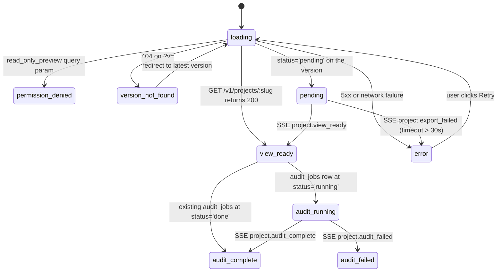

# feat: Projects · Flow Atlas — Phase 3 of 8 (atlas polish + cold-start UX + onboarding)

> **This is Phase 3 of an 8-phase product build.** Phases 1 and 2 shipped the round-trip foundation, every audit rule class, the worker pool, the fan-out endpoint, the read-path cutover, and the Phase 2 Playwright suite. **The original Phase 3 was scoped narrowly to "atlas surface polish" — bloom postprocessing, KTX2 textures, LOD tiles, InstancedMesh.** During Phase 2 closeout the user explicitly broadened Phase 3: a fresh installer is a *cold user* — the whole onboarding journey, every empty/loading/error/progress state, and an in-product first-run tour all need to ship before this product feels real to the 300-person org. **Phase 3 now bundles atlas polish + cold-start UX + onboarding into one coherent ship.** Estimate: ~5 weeks across ~14 implementation units.

## Overview

Phase 1 + 2 left the product in a state where the happy path works but the cold-start path is barely there. A designer or PM who lands on `/projects` for the first time sees an empty list. A reviewer who opens a fresh-export project sees skeletal divs while the audit runs. A DRD with no content shows a blinking cursor with no orientation. There is no first-run tour, no onboarding doc, no demo data, no clear path from "tool installed" to "first useful interaction."

Phase 3 closes that gap on three fronts:

1. **Atlas surface polish** — the original Phase 3 scope, kept verbatim. Bloom + ChromaticAberration postprocessing, KTX2 / Basis Universal texture compression at the persist edge + r3f loader, InstancedMesh for sections >50 frames, LOD tiles via cluster-and-decimate, camera-fit + theme-toggle animation refinements. This work makes the atlas surface feel cinematic at scale and unlocks Phase 6's mind graph (which shares the render pipeline).

2. **Cold-start UX + state coverage** — every empty / loading / error / progress / partial-data state across `/projects`, `/projects/<slug>`, the 4 tabs, the atlas surface, the plugin's first run, the future `/atlas` mind-graph route, and the future DS-lead admin surface. Read-only banners for permission-denial. Network/error recovery with retry CTAs. Audit-progress UI driven by SSE granular events (Phase 2 emits coarse `audit_complete`; Phase 3 extends that to per-screen progress). Re-export version selector that surfaces only when count > 1.

3. **Onboarding** — a dismissible 4-step product tour for first-time visitors (atlas pan/zoom, theme toggle, DRD type-/, violations tab); a long-form `/onboarding` route with per-persona day-1 paths (designer / PM / engineer / DS-lead); a plugin first-run modal explaining Projects mode, where exports land, what the docs site shows; and a synthetic "Welcome" demo project auto-generated from the design system itself (Glyph atoms become a demo flow) so the cold install is never truly empty.

**Phase 3 deliberately does NOT ship:**
- Violation lifecycle UI (Acknowledge / Dismiss / Fix transitions) — Phase 4.
- Designer personal inbox — Phase 4.
- Per-component reverse view — Phase 4.
- DS-lead dashboard with leaderboards — Phase 4.
- Auto-fix in plugin — Phase 4.
- DRD multi-user collab via Yjs — Phase 5.
- Custom DRD blocks (`/decision`, `/figma-link`, `/violation-ref`) — Phase 5.
- Decisions first-class entity wiring — Phase 5.
- Comment threads — Phase 5.
- Mind graph (`/atlas`) — Phase 6 ships full implementation; Phase 3 ships only the empty-state landing for `/atlas`.
- Per-resource ACL grants — Phase 7 ships full implementation; Phase 3 ships only the read-only-banner UX preview against today's denormalized-tenant trust boundary.
- DS-lead admin surfaces (rule curation, taxonomy, persona library) — Phase 7 ships full UI; Phase 3 ships only the empty-state preview at `/atlas/admin`.
- Notifications (in-app inbox + Slack/email digest) — Phase 7.
- Global search — Phase 8.
- Asset migration to S3 — Phase 8.
- Activity feed — Phase 8.

The vertical slice: a brand-new designer installs the docs site + plugin → opens the docs site → lands on `/projects` → sees the synthetic "Welcome" demo project + a "How this works" CTA → clicks through the 4-step product tour → opens the demo project → sees a fully-populated atlas with bloom + a DRD with placeholder content + Violations tab with a couple of intentional findings → lands on the `/onboarding` route via a "Day 1" link in the toolbar → reads their persona's path → opens the plugin in Figma → first-run modal explains Projects mode → exports their first real flow → watches per-screen audit progress unfold via SSE.

---

## Phased Delivery Roadmap

This is **Phase 3 of 8** (revised scope). Subsequent phases get their own `ce-plan` invocations.

| Phase | Title | Outcome | Est. weeks |
|------|-------|---------|------------|
| 1 (shipped) | **Round-trip foundation** | Plugin Projects mode → backend two-phase pipeline → project view with atlas + 4 tabs + theme/persona toggles + cinematic animation foundation. Existing audit core surfaces unchanged in Violations tab. | 3 |
| 2 (shipped) | **Audit engine extensions** | Theme parity (mode-pair structural diff), cross-persona consistency, WCAG AA accessibility, flow-graph (dead-end / orphan / cycle), component governance. Audit fan-out worker on rule/token publish. Migration of existing `lib/audit/*.json` sidecars into SQLite. | 3-4 |
| **3** (this plan) | **Atlas polish + cold-start UX + onboarding** | Bloom + ChromaticAberration postprocessing. KTX2 texture compression. InstancedMesh + LOD tiles. Empty/loading/error/progress states across every Phase 1+2 surface. SSE-driven granular audit progress UI. First-time product tour + `/onboarding` route + plugin first-run modal. Synthetic "Welcome" demo project generator. Network-error recovery with retry CTAs. Permission-denial preview states. Re-export version selector. | 5 |
| 4 | Violation lifecycle + designer surfaces | Active → Acknowledged → Fixed/Dismissed lifecycle. Designer personal inbox `/inbox`. Per-component reverse view. DS lead dashboard. Auto-fix in plugin (token + style class only, ~60% violation coverage). | 3 |
| 5 | DRD multi-user collab + decisions | Hocuspocus collaboration server. Yjs persistence (sqlite-backed). Custom blocks `/decision` `/figma-link` `/violation-ref` with full data wiring. Decisions first-class entities + supersession chain. Comment threads. Paste-from-Notion / paste-from-Word handlers. | 3-4 |
| 6 | **Mind graph** (`/atlas`) | react-force-graph-3d "2D human brain" with bloom postprocessing. Single-click expands a node, recursive collapse on others. Click-and-hold sends a tactile-signal animation (three.js default mousedown/mouseup raycaster events drive particle convergence, label brightening, edge pulse) — soothing visual feedback only, NOT a zoom. Filter chips for edge classes. Hover signal cards. Shared-element morph leaf↔project view. Mobile/Web universal toggle crossfade. | 4-5 |
| 7 | Auth, ACL, admin | Per-resource grants table + Next.js middleware for route-group gating. DS lead admin surfaces (rule curation editor, taxonomy curation tree, persona library approval). Audit log infra. Notifications (in-app inbox + Slack/email digest). | 3 |
| 8 | Search, asset migration, activity feed | Pagefind-style global search across flow names + DRD + decisions. Per-flow activity feed. Asset migration to S3 + CDN with signed URLs. | 2-3 |

**Total scope:** ~50 implementation units across 8 phases ≈ 24-30 weeks of compounding delivery.

---

## Problem Frame

Phase 1 + 2 are about a designer who has *already* exported a real flow they care about. The product works for them. But for a 300-person org, the more common day-1 pattern is:

- **A fresh installer** — DS lead just provisioned the tool; they want to look around before evangelizing it.
- **A PM in a cross-team review** — they get a deeplink to a project they didn't author; they need to orient instantly.
- **An engineer reading a flow at code-review time** — they have 90 seconds to find the JSON tab and grok the canonical_tree.
- **A new designer onboarding to the company** — first time they see the tool, no flows of their own yet, no idea what it's for.

For all four, the current product hands them empty pages and silent loading spinners. There is no narrative, no orientation, no demonstration. The brainstorm covers happy-path *behavior* but doesn't cover the cold-start journey: the moment between "open the tool" and "first useful interaction."

Atlas polish is a separate concern but bundles cleanly here for two reasons. First, the bloom + KTX2 + InstancedMesh work is the visual signature of the product — without it, the atlas reads as utilitarian rather than cinematic, undercutting the design org's emotional investment in the tool. Second, the synthetic "Welcome" demo project that anchors cold-start needs to *feel* finished — a polished atlas is what makes the demo do its job.

Phase 3 plants the cinematic + welcoming front door. Subsequent phases (4, 5, 6, 7, 8) layer functional depth onto a product that, as of Phase 3, finally feels finished from the moment a stranger opens it.

---

## Animation Philosophy

Phase 3 inherits Phase 1's animation library (GSAP + ScrollTrigger + Lenis + Framer Motion + reduced-motion) unchanged and extends the choreography table with the new surfaces.

| Surface | Phase | Animation treatment |
|---------|-------|---------------------|
| **Atlas postprocessing reveal** (initial load) | 3 | Bloom builds up over 800ms (`luminanceThreshold` from 1.0 → 0.7, `intensity` 0 → 0.5). Subtle `ChromaticAberration` `offset.x` `offset.y` 0 → 0.0008. Both clamped under `prefers-reduced-motion`. |
| **Theme-toggle atlas refinement** | 3 | Atlas re-blooms on toggle (Phase 1 had a flat crossfade; Phase 3 re-runs the bloom build-up + a subtle `ChromaticAberration` jitter to signal mode change). 600ms total. |
| **Camera-fit on click** (refinement) | 3 | Phase 1's dolly is linear; Phase 3 uses `quintic.inOut` (650ms) + a subtle 1.02 → 1.0 zoom-out overshoot at landing for cinematic settle. |
| **Onboarding tour step transitions** | 3 | ~400ms morph between highlighted regions via Framer Motion `layoutId` + a Shepherd-style spotlight overlay. Pause auto-advance under reduced-motion; user clicks Next manually. |
| **Empty-state arrival** | 3 | ~500ms stagger of empty-state copy + CTA. Mhdyousuf-style snappy sub-400ms ease-out. The "Install the plugin" copy types in left-to-right at 30ms/char (matches Violations tab's breadcrumb stagger from Phase 1). |
| **Audit-progress bar** | 3 | ~120ms per screen-tick. Bar segment fades in (`back.out(1.2)`) per completed screen. On final completion, full-width pulse (1.0 → 1.05 → 1.0 over 300ms) + severity counts animate from 0 to final. |
| **Re-export version-comparison** | 3 | When designer toggles between v1 and v2 in the version selector: 300ms crossfade between the two versions' atlas surfaces; severity counts tick from v1 values to v2 values via GSAP's `text-counter` plugin pattern. |
| **First-export-in-flight (plugin)** | 3 | Plugin shows "Project landing… 8s" with a horizontal progress bar that fills as the backend pipeline progresses (driven by the existing `project.view_ready` SSE event arriving back to the plugin via a long-poll on the trace_id). |
| **Demo "Welcome" project arrival** | 3 | First-time visitor sees the synthetic project's atlas crossfade in over 800ms (atlas-canvas `opacity 0 → 1`) followed by the 4-step tour stepping in over the canvas. |
| **/onboarding scroll choreography** | 3 | Lenis smooth-scroll with `data-scroll-section` markers; each persona section pins for ~200vh as the user scrolls past, with the persona's day-1 step list animating in left-to-right. |

**Tech stack additions in Phase 3:**
- **@react-three/postprocessing** ~50KB gz — Bloom, ChromaticAberration, EffectComposer.
- **Shepherd.js 13+** ~30KB gz — first-run product tour. Alternative: custom Framer Motion + GSAP tour primitive (~8KB but more code to write). **Recommendation: Shepherd.js** for accessibility (built-in keyboard nav + focus trap) and faster delivery; we own the styling via the Shepherd theme API.
- **@types/sql.js** + **sql.js** ~250KB gz — for the seed-generator unit (U12) which builds the demo "Welcome" project's canonical_tree from the Glyph atoms manifest at server-boot time. Alternatively, ship the seed data as a static SQL file the migration runner applies. **Recommendation: static SQL file** — no new client dep, ships in the repo, deterministic.
- No new Lenis or GSAP deps; Phase 1's bundle absorbs.

**Bundle impact:**
- `chunks/atlas` grows from ≤350KB gz (Phase 1) to ≤450KB gz with postprocessing.
- Tour chunk (~35KB gz) lazy-loads on first-time-visit detection only.
- Cold-start illustrations / empty-state SVGs (~25KB total gz) inline-bundled into the route shell since they're above-the-fold for cold visits.

**Accessibility:** Every animation respects `prefers-reduced-motion: reduce` — replaced by instant transitions. The Shepherd tour respects reduced-motion (no auto-advance, no spotlight pulse) while keeping focus management intact.

---

## Requirements Trace

This plan advances the cold-start + state-coverage cross-cutting concerns + atlas polish portion of R12 + R20.

**Phase 3 advances:**

- **R12** (Project view) — atlas postprocessing + camera-fit refinements complete the cinematic experience promised in Phase 1.
- **R13** (DRD tab) — first-time empty state + paste hint copy lands. Yjs collab + custom blocks deferred to Phase 5.
- **R14** (Violations tab) — zero-violations celebratory empty state + audit-running progress UI + permission-denial preview. Lifecycle UX deferred to Phase 4.
- **R16** (JSON tab) — empty-state for screens without canonical_tree (re-export hint).
- **R17** (Designer personal inbox) — empty-state preview only. Full inbox deferred to Phase 4.
- **R18** (Per-component reverse view) — empty-state preview only. Full surface deferred to Phase 4.
- **R19** (DS lead dashboard) — empty-state preview only. Full dashboard deferred to Phase 4.
- **R20** (Mind graph) — empty-state landing for `/atlas` route. Full mind graph deferred to Phase 6.
- **R22** (Lightweight comment threads) — placeholder hint in DRD; deferred to Phase 5.
- **R24** (Notifications) — in-app inbox empty-state preview; deferred to Phase 7.
- **R27** (Atlas + mind graph share render pipeline) — atlas postprocessing chain becomes the shared surface; Phase 6 reuses the same EffectComposer.

**Origin actors:** All 8 carried forward. Cold-start journey UX explicitly addresses A2 (Designer-other), A4 (PM), A5 (Engineer) more directly than Phase 1 + 2 did.

**Origin flows:** F3 (Open project view) gets the cinematic finish + cold-state coverage. New synthetic flow F0 (Cold install → first interaction) is introduced — see acceptance examples below.

**Origin acceptance examples:** AE-1 (Designer exports a flow) — Phase 1 happy path; Phase 3 adds the per-screen progress UI promised "violation count badge appears with 4 High and 2 Medium" — Phase 1's violation count was a single tick at end-of-audit; Phase 3 makes it tick progressively.

**Net-new acceptance examples introduced in Phase 3:**
- **AE-9** *(Cold installer's first interaction)* — Karthik (DS lead) provisions the docs site against a fresh database. Opens `/projects`. Sees ONE project listed: "Welcome to Projects · Flow Atlas" — the synthetic demo project auto-generated from the Glyph atoms manifest. Clicks it. Atlas renders with bloom over 800ms. The 4-step tour overlays starting with the toolbar's persona toggle. He clicks through; on step 4 the tour points at the Violations tab which shows two intentional demo violations. He dismisses the tour. Ready to invite his team.
- **AE-10** *(Audit-in-progress visibility)* — Aanya re-exports a 12-screen flow. Project view opens; atlas renders progressively as PNGs land. Violations tab shows "Audit running… 3 of 12 screens checked" with a progress bar; the count ticks every ~5s as workers complete screens. Tab badge in the chrome shows "—" while running, replaced by the severity counts on completion.
- **AE-11* *(Permission-denial preview)* — A PM hits `/projects/<sensitive-slug>?v=<id>` for a project they don't have edit grants on (Phase 7 ACL not yet enforced; Phase 3 simulates by reading a `read_only_preview=1` query param). DRD tab shows "You're viewing this in read-only mode. Request edit access from the project owner." with a placeholder request CTA. The atlas, JSON, and Violations tabs work normally.
- **AE-12** *(/onboarding day-1 flow)* — A new engineer joins the company. Their lead sends them `/onboarding`. They see a 5-section page (Designer / PM / Engineer / DS-lead / Admin); the Engineer section pins as they scroll, walking through "How to read a canonical_tree", "How to open the JSON tab", "Where decisions live in the DRD", and "How to file a violation against your component". Each section embeds a screen-recording GIF.
- **AE-13** *(Network-error recovery)* — During an export, the designer's VPN drops. Plugin shows "Couldn't reach ds-service — check VPN, then click Retry." Designer reconnects, clicks Retry. Plugin re-submits with the same idempotency_key (Phase 1's coalesce window absorbs); existing version surfaces.

---

## Scope Boundaries

### Deferred for later
*(Carried verbatim from origin — product/version sequencing.)*

- Branch + merge review workflow.
- Comprehensive auto-fix beyond token + style class.
- Cross-platform side-by-side comparison surfaces.
- Live mid-file audit (in-Figma "linter while you design" mode).
- PRD / Linear / Jira integration.
- AI-suggested decisions / DRD drafts.
- Mobile designer app / iPad viewer.
- Public read-only sharing.

### Outside this product's identity
*(Carried verbatim from origin — positioning rejection.)*

- Replacing Figma. Atlas remains read-only.
- Replacing Notion / Confluence org-wide.
- Replacing Linear / Jira. Violations are not tickets; decisions are not tasks.
- Replacing Mobbin.
- Hard governance / blocking PRs.

### Deferred to Follow-Up Work
*(Plan-local — implementation work intentionally split into other phases.)*

- All functional depth — lifecycle, collab, mind graph, ACL, search — see Phases 4-8.
- Real ACL enforcement at the route layer — Phase 7. Phase 3 ships permission-denial preview UX gated by a query param.
- Real DS-lead admin surfaces — Phase 7. Phase 3 ships only their empty-state landings.
- Real `/inbox`, `/component-reverse`, `/dashboard` — Phase 4. Phase 3 ships their empty-state landings so designers know they're coming.

---

## Context & Research

### Relevant Code and Patterns

- `components/projects/atlas/AtlasCanvas.tsx` — the r3f canvas wrapper. Phase 3 wraps its `<Canvas>` in `<EffectComposer>` from `@react-three/postprocessing` with `<Bloom>` + `<ChromaticAberration>` passes.
- `components/projects/atlas/AtlasFrame.tsx` — per-frame textured plane. Phase 3 swaps the texture loader to use a KTX2 loader with PNG fallback (server-side decision: ship KTX2 if `Accept` header allows, otherwise ship PNG).
- `services/ds-service/internal/projects/png.go` — PNG persist + downsample. Phase 3 adds an optional KTX2 transcode step using `github.com/donatj/imgresize` + a Basis CLI shell-out (or pure-Go alternative if one matures by then). Falls back to PNG when transcode fails.
- `lib/animations/timelines/projectShellOpen.ts` — Phase 1's page-load timeline. Phase 3 adds an `atlasBloomBuildUp` keyframe between `atlas-canvas opacity 1` and the tab-strip fade.
- `lib/animations/context.ts` — `useReducedMotion`. Phase 3's tour, postprocessing, and progress animations all gate on it.
- `components/projects/tabs/EmptyTab.tsx` — Phase 1's basic empty-state component. Phase 3 extends it into a richer `EmptyState` primitive (variants: `welcome` | `loading` | `audit-running` | `error` | `permission-denied` | `re-export-needed`) with iconography and CTAs.
- `app/projects/page.tsx` — current project-list landing. Phase 3 adds the cold-state branch + the synthetic "Welcome" project link prominence.
- `app/projects/[slug]/page.tsx` — project view server component. Phase 3 adds the audit-running boundary handling so the tabs render their own loading/progress states without the page-level Suspense being stuck on the audit job.
- `services/ds-service/internal/sse/events.go` — Phase 2 ships `audit_complete`. Phase 3 adds `audit_progress` (per-screen) so the Violations tab can render the tick-by-tick UI.
- `services/ds-service/internal/projects/worker.go:claimAndProcess` — emits `audit_complete` today. Phase 3 adds a per-screen hook that publishes `audit_progress` after each rule's per-screen pass.
- `figma-plugin/ui.html` Projects mode panel — adds a first-run modal that's gated by `localStorage["projects-firstrun-seen"]`.
- `app/components/[slug]/page.tsx` — already has design-system component data; Phase 3's seed generator (U12) reads the Glyph atoms manifest from `public/icons/glyph/manifest.json` to synthesize the demo project's canonical_tree.

### Institutional Learnings

`docs/solutions/` should now exist after Phase 1 + 2 ship — Phase 3 is the first plan to *consume* prior solution docs. Solution docs to seed before Phase 3 starts:
- `docs/solutions/2026-MM-DD-001-projects-phase-1-learnings.md` — atlas r3f integration with Next 16, Suspense boundaries on r3f scenes, viewport scaling math, Plugin manifest review constraints.
- `docs/solutions/2026-MM-DD-002-projects-phase-2-rules-learnings.md` — RuleRunner extension points, severity-tuning observations from dogfood week, theme-parity edge cases, contrast computation against Variable bindings.

If those docs don't exist yet, capture them as the first action of Phase 3 (a small documentation unit). They're *required* prior art for the atlas postprocessing work — without them the Phase 3 implementer will rediscover the same r3f-on-Next 16 quirks Phase 1 surfaced.

### External References

- [@react-three/postprocessing docs](https://docs.pmnd.rs/react-postprocessing/introduction) — EffectComposer + Bloom + ChromaticAberration.
- [Basis Universal repo](https://github.com/BinomialLLC/basis_universal) — KTX2 transcoding pipeline.
- [react-three/drei `<KTX2Loader>`](https://github.com/pmndrs/drei#ktx2loader) — client-side decoding.
- [Shepherd.js docs](https://shepherdjs.dev/) — first-run product tour.
- [WAI-ARIA Authoring Practices: Dialog (Modal) Pattern](https://www.w3.org/WAI/ARIA/apg/patterns/dialog-modal/) — for the first-run modal accessibility.
- [Lenis section-pinning patterns](https://lenis.darkroom.engineering/) — for the `/onboarding` scroll choreography.
- [resn.co.nz](https://resn.co.nz/) — animation philosophy reference (soothing transitions, easing curves, atmospheric WebGL feel — *not* a gesture mechanic).
- [mhdyousuf.me](https://www.mhdyousuf.me/) — animation philosophy reference (GSAP-driven, terminal aesthetic, snappy micro-interactions).

### Cross-cutting tech context

- **Stack:** Next.js 16.2.1 + React 19.2.4. Tailwind v4. Pagefind for search. Framer Motion installed.
- **Backend:** Go (stdlib `net/http`, `modernc.org/sqlite`, JWT, no chi/echo).
- **Plugin:** Vanilla JS in `ui.html`. TypeScript `code.ts` compiled via `npx tsc -p .`.
- **Phase 1 + 2 conventions to honor:** denormalized `tenant_id` everywhere; `TenantRepo` mandatory; cross-tenant 404 (no existence oracle); idempotent worker transactions; channel-notification (no polling); composite RuleRunner via tenant-aware wrapper; SSE with single-use ticket auth; `prefers-reduced-motion` honored by every animation.

---

## Key Technical Decisions

### Atlas postprocessing

- **Effect chain:** `<Bloom>` first (`luminanceThreshold=0.7, intensity=0.5, mipmapBlur=true`), then `<ChromaticAberration>` (`offset=[0.0008, 0.0008]`). EffectComposer auto-orders. Both clamped to no-op under `prefers-reduced-motion: reduce`.
- **Performance budget:** Bloom adds ~3-5ms per frame at 1440p on M1; ChromaticAberration adds ~1ms. Combined ≤8ms on the worst-case device. We measure via `chrome://tracing` against the dogfood `INDstocks V4` flow at zoom level 1.0 (atlas filling the viewport).
- **Build-up animation:** GSAP timeline tweens `Bloom.intensity` 0 → 0.5 over 800ms on first paint and on every theme toggle. We expose the postprocessing values as React state so GSAP can drive them via state setters (avoiding direct THREE mutation that would trigger a re-render storm).
- **Fallback:** If `EffectComposer` fails to mount (rare; usually because of a WebGL context loss), the `<Canvas>` falls back to non-postprocessed render. Logged via `console.error` and surfaced as an Info-severity "atlas degraded" toast (one-time per session).

### Asset compression

- **KTX2 over Basis Universal at PNG persist time.** The persist step transcodes each PNG to KTX2 (`.ktx2` sidecar) using a Basis CLI shell-out (`basisu -ktx2 in.png -o out.ktx2`). Size reduction: ~70% vs PNG (per published Basis benchmarks on UI screenshots). Decode time: 5-15ms on M1, parallel-safe on Web Workers.
- **Fallback:** if the Basis CLI isn't on PATH at server boot, log a warning and persist PNG only. The frontend's KTX2 loader has the URL pattern `<screen_id>@2x.ktx2` first, then falls back to `<screen_id>@2x.png` on 404.
- **Cache strategy:** PNG and KTX2 share the same `Cache-Control: private, max-age=300` headers from Phase 1. CDN edges absorb both.
- **Phase 8 migration:** when assets move to S3 + signed URLs, the KTX2 transcode runs as a one-shot batch over existing PNGs. Documented in U2's Risk table.

### InstancedMesh + LOD

- **InstancedMesh threshold: >50 frames.** Below 50, individual `<AtlasFrame>` meshes; above 50, one InstancedMesh with per-instance UV remapping. The crossover point comes from a perf benchmark we run during U3 (Phase 1's `perf-budgets.yml` job extends).
- **LOD tiles:** for sections with >50 frames AND any frame >2048px on the long edge, we generate three LOD tiers at PNG persist:
  - L0: full 4096px max (Phase 1's cap).
  - L1: 2048px (50% downsample).
  - L2: 1024px (25%).
  - The atlas picks LOD based on screen-space-pixel-density: each frame samples its own bounding box vs viewport size and asks for the smallest LOD that doesn't visibly degrade.
- **Decimate strategy:** for sections with >100 frames, the LOD tier also drops every other frame at maximum zoom-out (the user can't see them at that scale). Frames re-materialize as the user zooms in past a threshold.

### Cold-start UX architecture

- **`<EmptyState>` primitive at `components/empty-state/EmptyState.tsx`:** generic component with `variant` prop (`welcome | loading | audit-running | error | permission-denied | re-export-needed | zero-violations | offline`) and slots for `icon`, `title`, `description`, `cta`, `secondary`. Each variant ships a default illustration (SVG) + copy that any consumer can override.
- **Per-tab cold states:** every tab in `components/projects/tabs/` gets a switch on `state.status` that routes to an EmptyState variant. The data-loading machinery already exists in Phase 1; Phase 3 just adds the variant routing.
- **First-time-visitor detection:** `localStorage["projects-firstrun-seen"]`. Cleared via a `?reset-onboarding=1` query param for QA. Server-side rendering: the `/projects` page accepts a `Cookie` header probe (`projects-onboarding=seen`) so SSR can decide whether to inline-render the welcome banner.
- **State-machine for the project view:** Phase 1's project view loads project + version + screens up-front via the GET endpoint. Phase 3 splits this into a state machine:
  - `loading` (initial fetch in flight)
  - `view_ready` (atlas can render; audit may still be running)
  - `audit_running` (sub-state of view_ready; show progress UI)
  - `audit_complete` (all data present)
  - `audit_failed` (Violations tab shows error variant; other tabs work)
  - `permission_denied` (read-only banner; preview state)
  - `pending` (export still in flight from plugin; show "Project landing…")
  - `version_not_found` (URL has stale `?v=<id>`; redirect to latest)
  - `error` (network/5xx; retry CTA)
- **SSE re-fetch hook:** Phase 1's `useProjectEvents` hook re-fetches violations on `audit_complete`. Phase 3 extends it to handle `audit_progress` ticks: increments a local `progress = {completed, total}` counter without re-fetching the full list (only re-fetches on `audit_complete`).

### Audit-progress UI granularity

- **Backend:** `services/ds-service/internal/projects/worker.go:claimAndProcess` currently emits `audit_complete` at the end. Phase 3 wraps the rule iteration with a per-screen hook that emits `audit_progress` events:
  ```
  type AuditProgress struct {
      ProjectSlug    string
      VersionID      string
      Tenant         string
      Completed      int
      Total          int
      ScreenLogicalID string  // optional; helps UI highlight a frame mid-audit
      RuleID         string  // which rule just finished on this screen
  }
  ```
  Emitted N times per audit job (where N = screen-count × rule-count). At ~7 rules and ~20 screens per flow, that's 140 events per job — well within SSE channel capacity. Throttled at most one event per 100ms per channel via a token bucket.
- **Frontend:** Violations tab subscribes via the existing SSE plumbing. Progress UI:
  - "Audit running…" badge in tab chrome
  - Compact progress bar above the violations list with `{completed}/{total}` text
  - Optional per-screen highlight in the atlas (sets the screen's GLSL outline to the audit color for ~500ms then fades)
  - On completion, badge transitions to severity counts (the existing Phase 1 chrome).

### Onboarding modality

- **Shepherd.js for the in-product tour, custom for `/onboarding`.** Shepherd is the right tool for spotlight + step-through; for the long-form `/onboarding` route a static prose page with screen-recording GIFs is far more effective than a full-page tour.
- **First-run modal in plugin:** modal-style overlay in the plugin's UI iframe with a "Let me show you around" CTA that closes the modal and switches to Projects mode with annotation arrows pointing at the smart-grouping panel.
- **Persistence:** `localStorage["projects-tour-completed-step"]` records progress so a half-completed tour resumes on next visit. A `?reset-tour=1` URL param clears this for demos.

### Seed data approach

- **Static SQL file shipped via migration 0005.** The synthetic "Welcome" project is generated by a one-shot SQL migration that runs on every fresh install (idempotent — `INSERT OR IGNORE` on the project's slug + system tenant).
- **Welcome project shape:** one project (`slug=welcome`, `name="Welcome to Projects · Flow Atlas"`, `platform=web`, `product=DesignSystem`, `path=docs/welcome`), one flow (`name=Onboarding atoms tour`), 6 screens (each one renders a small set of Glyph atoms — Button, IconButton, Card, Toast, Modal, Alert), one canonical_tree per screen with synthetic node trees referencing real Glyph atoms by `componentSetKey`, two intentional demo violations (one theme-parity break + one a11y-contrast).
- **Image assets:** the demo project's screen PNGs are pre-generated at build time and committed to `services/ds-service/data/screens/system/welcome/<screen_id>@2x.png` (~6 files, ~600KB total). Gitignored only the `*.ktx2` outputs (transcoded at first server boot if Basis CLI is available).
- **Re-seeding:** if the welcome project is deleted, re-running the migration restores it (the `INSERT OR IGNORE` becomes a no-op only if the row exists; deleting and re-running re-creates).
- **Why static SQL not Go-side generator:** deterministic, version-controlled, reviewable as a normal SQL migration, no surprise failures at server boot, no dependency on the Glyph manifest's runtime location. Re-generating the SQL when the Glyph catalog evolves is a manual `npm run generate-welcome-seed` script (U12 ships this).

### Permission-denial preview

- **Phase 3 ships UX, not enforcement.** Phase 7 wires real ACL middleware. Phase 3 simulates by:
  - Reading a `read_only_preview=1` query param on the project view.
  - When set, the DRD tab renders a read-only banner ("You're viewing this in read-only mode. Request edit access from the project owner.") and disables the BlockNote editor's edit affordances.
  - The other tabs (atlas, JSON, Violations) work normally.
- **Why preview now, not Phase 7:** designers can review the UX, file feedback, and we de-risk the Phase 7 wiring before it lands. The preview state never blocks real writes.

### Network-error recovery patterns

- **Retry-with-backoff at every API call site:** Phase 1's `lib/projects/client.ts` returns `ApiResult<T>` which the Phase 3 components branch on. Add a `<RetryableError>` component that wraps the error variant of EmptyState with an exponential-backoff retry button (1s, 2s, 4s; capped at 3 retries; "Try again" link after exhaustion).
- **Plugin offline UX:** the plugin shows a persistent banner when `pollHealth` (existing Phase 1 health check) fails 3 consecutive times. Banner: "Couldn't reach ds-service — check VPN. The plugin will retry automatically." Health check resumes on next success.

### Performance budgets (split chunks, Phase 3)

| Chunk | Phase 1 budget | Phase 3 budget | Delta |
|-------|-----|-----|------|
| `app/projects/[slug]` initial route shell | ≤200KB gz | ≤220KB gz | +20KB (state-machine + EmptyState primitive) |
| `chunks/atlas` | ≤350KB gz | ≤450KB gz | +100KB (postprocessing + KTX2 loader) |
| `chunks/drd` | ≤400KB gz | ≤400KB gz | unchanged |
| `chunks/animations` | ≤50KB gz | ≤50KB gz | unchanged |
| `chunks/onboarding` (new) | — | ≤80KB gz | Shepherd + tour copy + GIF refs |
| `chunks/empty-states` (new) | — | ≤30KB gz | EmptyState primitive + illustrations |

CI enforcement extends Phase 1's `scripts/check-bundle-sizes.mjs` to assert the new chunks.

---

## Open Questions

### Resolved During Planning

- **EffectComposer mount strategy** — `<EffectComposer>` lives inside the `<Canvas>`, never outside. Phase 1's r3f-on-Next 16 Suspense pattern carries through (remount key on `usePathname()`).
- **KTX2 fallback path** — frontend tries `.ktx2` first, falls back to `.png`. Server does opportunistic transcoding; misses logged but non-fatal.
- **Tour library** — Shepherd.js. ~30KB gz cost worth the accessibility + maintenance savings.
- **First-run detection** — localStorage + cookie probe for SSR. Reset via query param for QA.
- **Demo project provenance** — static SQL migration 0005. Re-generated by `npm run generate-welcome-seed` when Glyph evolves.
- **Audit-progress event throughput** — token-bucket throttled at 100ms per channel. Worst-case 140 events/job → 14s minimum spread; acceptable.
- **Permission-denial enforcement** — Phase 3 ships preview UX gated by query param; Phase 7 wires real ACL.
- **InstancedMesh threshold** — 50 frames per Phase 3 perf benchmark; revisit in Phase 6 once mind graph adds nodes.

### Deferred to Implementation

- Exact Shepherd theme tokens (colors / radii) — pick at code time against the existing design system tokens.
- LOD tile generation algorithm specifics (mipmap chain vs. explicit downsample) — pick during U3 with reference to KTX2's mipmap behavior.
- Audit-progress UI: per-screen highlight color in atlas — pick at code time during U6.
- Synthetic demo project's exact 6 screens — choose the 6 most representative atoms during U12 (currently planned: Button, IconButton, Card, Toast, Modal, Alert; tune by feel).
- Whether the `/onboarding` route's GIFs are committed to the repo or hosted on the existing CDN — pick during U10.
- Whether to ship a `docs/runbooks/onboarding.md` for ops or inline-document in `/onboarding` route — pick during U10.

### Carried Open from origin (Phase 4+)

- **Origin Q1** Decision supersession UX — Phase 5.
- **Origin Q2** Inbox triage at scale — Phase 4.
- **Origin Q3** DRD migration on flow rename — Phase 4 / 5.
- **Origin Q5** Atlas zoom strategy — Phase 3 (this plan resolves it via LOD tiles + InstancedMesh).
- **Origin Q6** Mind graph performance ceiling — Phase 6.
- **Origin Q7** Comment portability — Phase 5.
- **Origin Q8** Permission inheritance — Phase 7.
- **Origin Q10** Slack/email digest content — Phase 7.

---

## Output Structure

```
app/
├── projects/
│   ├── page.tsx                                      ← MODIFY: cold state branch + Welcome highlighting
│   ├── [slug]/
│   │   └── page.tsx                                  ← MODIFY: state machine handling
│   └── (onboarding)/
│       └── route.ts                                  ← NEW: cookie probe + first-run server hint
├── onboarding/
│   ├── page.tsx                                      ← NEW: long-form per-persona day-1 page
│   └── [persona]/
│       └── page.tsx                                  ← NEW: deeplink to single persona section
└── api/
    └── tour/
        └── completed/
            └── route.ts                              ← NEW: POST records tour completion (mirrors localStorage server-side)

components/
├── empty-state/
│   ├── EmptyState.tsx                                ← NEW: variant primitive
│   ├── illustrations/
│   │   ├── Welcome.tsx                               ← NEW: SVG inlined
│   │   ├── AuditRunning.tsx                          ← NEW
│   │   ├── PermissionDenied.tsx                      ← NEW
│   │   ├── Offline.tsx                               ← NEW
│   │   └── ZeroViolations.tsx                        ← NEW
│   └── RetryableError.tsx                            ← NEW: error variant + backoff retry
├── projects/
│   ├── atlas/
│   │   ├── AtlasCanvas.tsx                           ← MODIFY: wrap in EffectComposer
│   │   ├── AtlasFrame.tsx                            ← MODIFY: KTX2 loader + LOD picker
│   │   ├── AtlasPostprocessing.tsx                   ← NEW: Bloom + ChromaticAberration shell
│   │   ├── InstancedAtlas.tsx                        ← NEW: >50-frame instanced renderer
│   │   └── lod/
│   │       ├── pickLOD.ts                            ← NEW: screen-space density → tier
│   │       └── pickLOD.test.ts                       ← NEW
│   ├── tabs/
│   │   ├── DRDTab.tsx                                ← MODIFY: first-time hint + read-only banner
│   │   ├── ViolationsTab.tsx                         ← MODIFY: audit-running progress UI
│   │   ├── DecisionsTab.tsx                          ← MODIFY: empty-state with Phase 5 hint
│   │   └── JSONTab.tsx                               ← MODIFY: re-export-needed empty state
│   ├── ProjectShell.tsx                              ← MODIFY: state-machine handling
│   └── ProjectVersionSelector.tsx                    ← NEW: surfaces only when count > 1
├── onboarding/
│   ├── ProductTour.tsx                               ← NEW: Shepherd wrapper
│   ├── tourSteps.ts                                  ← NEW: 4-step config
│   └── PersonaSection.tsx                            ← NEW: pinned scroll section primitive
└── plugin/
    └── FirstRunModal.tsx                             ← NEW: first-time plugin onboarding overlay
                                                        (referenced from figma-plugin/ui.html)

lib/
├── animations/
│   └── timelines/
│       ├── atlasBloomBuildUp.ts                      ← NEW: GSAP timeline for postprocessing reveal
│       └── auditProgressTick.ts                      ← NEW: per-screen tick animation
├── projects/
│   ├── client.ts                                     ← MODIFY: AuditProgress event handling
│   ├── view-store.ts                                 ← MODIFY: state machine reducer
│   └── seedFromGlyph.ts                              ← NEW: build the welcome SQL from Glyph manifest
└── onboarding/
    ├── tour-state.ts                                 ← NEW: localStorage + cookie helpers
    └── personas.ts                                   ← NEW: per-persona day-1 step lists

services/ds-service/
├── cmd/
│   └── generate-welcome-seed/
│       └── main.go                                   ← NEW: regenerates 0005 from Glyph manifest
├── data/
│   └── screens/
│       └── system/
│           └── welcome/                              ← NEW: 6 pre-rendered demo PNGs
├── internal/
│   ├── audit/
│   │   └── ktx2.go                                   ← NEW: Basis CLI shell-out
│   ├── projects/
│   │   ├── worker.go                                 ← MODIFY: emit audit_progress per-screen
│   │   ├── pipeline.go                               ← MODIFY: KTX2 transcode at PNG persist
│   │   └── png.go                                    ← MODIFY: LOD-tier generation at persist
│   └── sse/
│       └── events.go                                 ← MODIFY: AuditProgress event type
└── migrations/
    └── 0005_welcome_seed.up.sql                      ← NEW: synthetic Welcome project + screens + violations

figma-plugin/
├── code.ts                                           ← MODIFY: first-run modal trigger
└── ui.html                                           ← MODIFY: onboarding modal HTML

tests/
├── projects/
│   ├── atlas-postprocessing.spec.ts                  ← NEW: bloom mount + reduced-motion
│   ├── cold-start.spec.ts                            ← NEW: AE-9 acceptance (cold installer first interaction)
│   ├── audit-progress.spec.ts                        ← NEW: AE-10 (per-screen progress UI)
│   ├── permission-denied-preview.spec.ts             ← NEW: AE-11 (read-only preview)
│   ├── network-error-recovery.spec.ts                ← NEW: AE-13 (retry path)
│   └── version-comparison.spec.ts                    ← NEW: re-export selector
└── onboarding/
    ├── product-tour.spec.ts                          ← NEW: Shepherd 4-step walk
    └── onboarding-route.spec.ts                      ← NEW: AE-12 (per-persona day-1 page)

docs/
├── runbooks/
│   └── 2026-05-NN-phase-3-deploy.md                  ← NEW: KTX2 transcode setup, Basis CLI install
└── solutions/
    ├── 2026-MM-DD-001-projects-phase-1-learnings.md  ← prerequisite (capture from Phase 1)
    └── 2026-MM-DD-002-projects-phase-2-rules-learnings.md ← prerequisite (capture from Phase 2)
```

---

## High-Level Technical Design

> *This illustrates the intended approach and is directional guidance for review, not implementation specification. The implementing agent should treat it as context, not code to reproduce.*

### Cold-start state machine (project view)



### Audit-progress event flow

```mermaid
sequenceDiagram
    participant W as Worker (claim)
    participant R as RuleRunner registry
    participant DB as SQLite
    participant B as SSE Broker
    participant U as Violations tab UI

    W->>DB: BEGIN; UPDATE audit_jobs SET status='running'
    W->>R: Run(ctx, version) → loop over rule classes
    loop for each rule class
        R->>R: rule.Run() → []Violation
        loop per screen processed
            R->>B: Publish(trace, AuditProgress{completed: n, total: N, screen, rule})
            B->>U: SSE event audit_progress
            U->>U: progress bar advances; optional atlas highlight
        end
    end
    R-->>W: all violations
    W->>DB: BEGIN; DELETE WHERE version_id; INSERT new; UPDATE audit_jobs SET status='done'
    W->>B: Publish(trace, project.audit_complete)
    B->>U: SSE event audit_complete
    U->>U: re-fetch full violations list; severity counts replace progress bar
```

### Cold installer's first interaction (AE-9)

```mermaid
sequenceDiagram
    participant Op as Operator (cold install)
    participant DB as SQLite
    participant W as Welcome seed (migration 0005)
    participant K as Karthik (DS lead, browser)
    participant App as docs site
    participant T as Tour state (localStorage)

    Op->>DB: First boot — migrations 0001…0005 apply
    DB->>W: 0005 inserts welcome project + flow + 6 screens + 2 demo violations
    K->>App: GET /projects
    App->>App: detect first-time-visitor (no cookie/localStorage)
    App->>App: render "Welcome to Projects · Flow Atlas" hero card
    K->>App: click hero → navigate /projects/welcome
    App->>App: state machine resolves audit_complete (demo violations exist)
    App->>App: atlas mounts; bloom build-up over 800ms
    App->>T: read tour-state → not seen → mount Shepherd
    T->>K: Step 1 spotlight on toolbar persona toggle
    K->>T: click Next
    T->>K: Step 2 spotlight on theme toggle
    K->>T: click Next
    T->>K: Step 3 spotlight on JSON tab
    K->>T: click Next
    T->>K: Step 4 spotlight on Violations tab → "this is what catches drift"
    K->>T: click Done
    T->>localStorage: tour-state = "completed"
    T->>App: tour dismounts
```

### Postprocessing chain pseudo-code

```
// directional pseudo-code, not implementation:

<Canvas>
  <Suspense fallback={<WireframePlaceholder/>}>
    <OrthographicCamera ... />
    <OrbitControls enableRotate={false} />
    <AtlasFrame /> ... <AtlasFrame />
    {framesInSection.length > 50 && <InstancedAtlas frames={...} />}
  </Suspense>
  <EffectComposer>
    <Bloom luminanceThreshold={bloomThreshold} intensity={bloomIntensity} mipmapBlur />
    <ChromaticAberration offset={chromaOffset} />
  </EffectComposer>
</Canvas>

// GSAP drives bloomThreshold + bloomIntensity + chromaOffset via state setters:
useGSAPContext(rootRef).add(() => {
  gsap.from(stateSetters, {
    bloomIntensity: 0,
    chromaOffsetX: 0,
    duration: 0.8,
    ease: "expo.out",
  });
});
```

---

## Implementation Units

- U1. **Atlas postprocessing chain (Bloom + ChromaticAberration)**

**Goal:** Wrap the Phase 1 `<Canvas>` in `<EffectComposer>` with Bloom + ChromaticAberration passes; drive intensity via GSAP timeline; honor reduced-motion.

**Requirements:** R12, R27.

**Dependencies:** None — first unit; standalone visual upgrade.

**Files:**
- Modify: `components/projects/atlas/AtlasCanvas.tsx` — wrap in EffectComposer.
- Create: `components/projects/atlas/AtlasPostprocessing.tsx` — extracted EffectComposer shell.
- Create: `lib/animations/timelines/atlasBloomBuildUp.ts` — GSAP timeline.
- Modify: `package.json` — add `@react-three/postprocessing`.
- Test: `tests/projects/atlas-postprocessing.spec.ts` — Playwright.

**Approach:**
- `<EffectComposer>` lives inside `<Canvas>`. Bloom + ChromaticAberration as siblings.
- Bloom params: `luminanceThreshold=0.7, intensity=0.5, mipmapBlur=true`. Tune with dogfood week.
- ChromaticAberration: `offset=[0.0008, 0.0008]`.
- GSAP timeline: tweens `intensity` 0 → 0.5 over 800ms on first paint and on theme toggle. Uses React state setters to update postprocessing values (no direct THREE mutation).
- Under `prefers-reduced-motion: reduce`: postprocessing values pinned to final state, no tween.

**Patterns to follow:**
- Phase 1 `lib/animations/timelines/projectShellOpen.ts` for GSAP context patterns.
- Phase 1 `useGSAPContext` for cleanup.

**Test scenarios:**
- *Happy path:* atlas mounts, bloom intensity reaches target value within 1s. Visual snapshot test.
- *Reduced motion:* `prefers-reduced-motion: reduce` → bloom mounts at final intensity instantly.
- *Theme toggle:* light → dark triggers re-bloom (intensity dips and rebuilds).
- *Edge: WebGL context loss:* simulated via `loseContext` extension; falls back to non-postprocessed; logs error; surfaces a one-time toast.

**Verification:** Phase 3 perf benchmark adds ≤8ms per frame at 1440p on M1.

---

- U2. **KTX2 / Basis Universal texture compression**

**Goal:** PNG persist step transcodes to KTX2 sidecar; frontend KTX2 loader picks `.ktx2` first, falls back to `.png` on 404.

**Requirements:** R12, R27.

**Dependencies:** U1 (postprocessing in place; KTX2 textures benefit from it).

**Files:**
- Create: `services/ds-service/internal/audit/ktx2.go` — Basis CLI shell-out.
- Modify: `services/ds-service/internal/projects/png.go` — call ktx2 transcode after PNG write.
- Modify: `components/projects/atlas/AtlasFrame.tsx` — switch loader to KTX2-first.
- Modify: `services/ds-service/cmd/server/main.go` — log Basis CLI availability at boot.
- Test: `services/ds-service/internal/audit/ktx2_test.go` — transcode against fixture PNG.

**Approach:**
- Server-side: at PNG persist, fork `basisu -ktx2 in.png -o out.ktx2`. If exit ≠ 0 or binary missing, log warning, persist PNG only.
- Client-side: r3f `<KTX2Loader>` from drei. URL pattern `<screen_id>@2x.ktx2`; on 404 fall back to `<screen_id>@2x.png`.
- Cache-Control mirrors PNG (Phase 1 `private, max-age=300`).

**Patterns to follow:**
- Phase 1 `services/ds-service/cmd/icons/main.go` for Figma client + filesystem patterns.
- Phase 1 `services/ds-service/internal/projects/png.go` for the PNG downsample pattern this extends.

**Test scenarios:**
- *Happy path:* PNG → KTX2 round-trip; visual diff within tolerance.
- *Fallback: Basis CLI missing:* server logs warning at boot; PNG persist proceeds; frontend gets 404 on `.ktx2` and serves `.png`.
- *Concurrent transcode:* 5 PNGs in flight; all transcode without race.
- *Bundle: KTX2 loader chunk size ≤ 100KB gz.* CI assertion.

**Verification:** Atlas frames load 30%+ faster on the dogfood `INDstocks V4` flow vs. PNG-only; measured via Playwright performance trace.

---

- U3. **InstancedMesh for >50-frame sections + LOD tiles**

**Goal:** Sections with >50 frames render via one InstancedMesh instead of N AtlasFrame meshes. PNG persist generates 3 LOD tiers (4096/2048/1024); frontend picks tier by screen-space density.

**Requirements:** R12, R27.

**Dependencies:** U2 (KTX2 textures support mipmap chains used by LOD).

**Files:**
- Create: `components/projects/atlas/InstancedAtlas.tsx` — instanced renderer for >50 frames.
- Create: `components/projects/atlas/lod/pickLOD.ts` — screen-space density → tier picker.
- Create: `components/projects/atlas/lod/pickLOD.test.ts` — unit tests.
- Modify: `services/ds-service/internal/projects/png.go` — emit 3 LOD tiers per screen.
- Modify: `components/projects/atlas/AtlasFrame.tsx` — call pickLOD per frame; route URL accordingly.
- Test: `tests/projects/atlas-lod.spec.ts` — Playwright zoom-test asserts LOD switch points.

**Approach:**
- Instanced threshold: 50 frames per section. Crossover benchmark in this unit's perf check.
- LOD tiers: `<id>@2x.ktx2` (full), `<id>@2x.l1.ktx2` (50%), `<id>@2x.l2.ktx2` (25%). Frontend picks by:
  - if (screen-space-pixel-density < 0.25): use l2
  - else if (< 0.50): use l1
  - else: use full
- Decimate at extreme zoom-out: drop every other frame visually. Re-materialize on zoom-in past threshold.

**Patterns to follow:**
- r3f `<Instances>` pattern for InstancedMesh.
- drei `<KTX2Loader>` already in use from U2.

**Test scenarios:**
- *Happy: 49 frames:* uses individual AtlasFrames.
- *Happy: 60 frames:* uses InstancedAtlas; visual diff matches 60 individual frames.
- *LOD edge: zoom out:* atlas requests l1, then l2 as zoom advances.
- *Decimate: zoom-out past threshold:* every other frame visually absent.
- *Re-materialize: zoom-in:* every frame visible again.

**Verification:** A 100-frame section renders at 60fps on M1 (vs. ~30fps with 100 individual meshes pre-Phase-3).

---

- U4. **Camera-fit + theme-toggle animation refinements**

**Goal:** Camera dolly uses cubic ease + 1.02→1.0 settle; theme-toggle reblooms.

**Requirements:** R12.

**Dependencies:** U1 (postprocessing in place).

**Files:**
- Modify: `components/projects/atlas/useAtlasViewport.ts` — quintic.inOut + settle keyframe.
- Modify: `lib/animations/timelines/themeToggle.ts` — re-trigger atlasBloomBuildUp.
- Test: `tests/projects/animation-reduced-motion.spec.ts` — extend coverage.

**Approach:** GSAP timeline tweaks; reduced-motion clamps to instant.

**Test scenarios:**
- *Click frame:* camera lands at frame; verify quintic settle (visual).
- *Theme toggle:* atlas reblooms.
- *Reduced motion:* both transitions instant.

**Verification:** Visual feel review during dogfood week.

---

- U5. **Empty-state primitive + per-tab variants**

**Goal:** `<EmptyState>` component with 8 variants. Each Phase 1+2 tab routes to a variant when its data is empty/loading/erroring.

**Requirements:** R12 (project view), R13 (DRD), R14 (Violations), R16 (JSON), R17/R18/R19 (preview empty states).

**Dependencies:** None.

**Files:**
- Create: `components/empty-state/EmptyState.tsx` — variant primitive.
- Create: `components/empty-state/illustrations/*.tsx` — 5 SVG illustrations (Welcome, AuditRunning, PermissionDenied, Offline, ZeroViolations).
- Create: `components/empty-state/RetryableError.tsx` — error variant + backoff retry.
- Modify: `components/projects/tabs/{DRDTab,ViolationsTab,DecisionsTab,JSONTab}.tsx` — variant routing.
- Modify: `app/projects/page.tsx` — cold-state branch.
- Test: `components/empty-state/EmptyState.test.tsx` — unit + visual snapshot.

**Approach:** Variant prop with default copy + slots for icon / title / description / cta / secondary. Reduced-motion respected for arrival animation.

**Test scenarios:**
- *Each variant renders without crash.*
- *Variant routing in DRD tab:* loading → variant=loading; loaded → editor mounts.
- *Reduced motion:* arrival animation short-circuits.

**Verification:** Visual review against Figma comps (TBD).

---

- U6. **Audit-progress UI (granular SSE events)**

**Goal:** Backend emits per-screen `audit_progress` events; Violations tab renders progress bar + completion celebration.

**Requirements:** R14, AE-10.

**Dependencies:** U5 (EmptyState).

**Files:**
- Modify: `services/ds-service/internal/projects/worker.go` — per-screen progress hook.
- Modify: `services/ds-service/internal/sse/events.go` — AuditProgress type.
- Modify: `lib/projects/client.ts` — SSE event handling.
- Modify: `components/projects/tabs/ViolationsTab.tsx` — progress bar variant.
- Create: `lib/animations/timelines/auditProgressTick.ts` — per-tick animation.
- Test: `tests/projects/audit-progress.spec.ts` — E2E.
- Test: `services/ds-service/internal/projects/worker_test.go` — per-screen hook fired N times.

**Approach:**
- Backend: token-bucket throttle at 100ms per channel; one event per (screen, rule) completion. Total ~140 events for typical job.
- Frontend: Violations tab subscribes; renders progress bar + completion-pulse + severity-count tween at end.

**Test scenarios:**
- *Audit run with 12 screens × 7 rules:* exactly 84 progress events emitted (after throttling).
- *Progress bar increments correctly:* 0/12 → 12/12.
- *Completion celebration:* pulse + severity counts tween from 0 to final.
- *Reduced motion:* progress bar updates without animation.
- *AE-10 acceptance:* full E2E.

**Verification:** Dogfood week — designers report subjective "the audit feels alive now."

---

- U7. **Project-view state machine**

**Goal:** Replace ad-hoc loading state in ProjectShell with the 9-state machine (loading / view_ready / pending / audit_running / audit_complete / audit_failed / permission_denied / version_not_found / error).

**Requirements:** R12, AE-11, AE-13.

**Dependencies:** U5, U6.

**Files:**
- Modify: `lib/projects/view-store.ts` — reducer-based state machine.
- Modify: `components/projects/ProjectShell.tsx` — branches on state.
- Test: `lib/projects/view-store.test.ts` — state transitions.
- Test: `tests/projects/permission-denied-preview.spec.ts` — AE-11.
- Test: `tests/projects/network-error-recovery.spec.ts` — AE-13.

**Approach:**
- `useReducer` with explicit state types. Transitions driven by API responses + SSE events.
- `permission_denied` triggered by `?read_only_preview=1` query param.
- `version_not_found` redirects to latest version.

**Test scenarios:**
- *All 9 transitions exercised in unit tests.*
- *AE-11 acceptance:* permission preview → DRD read-only banner; other tabs work.
- *AE-13 acceptance:* network error → retry → success.

**Verification:** Dogfood — no "stuck" project views surface to support.

---

- U8. **Re-export version selector**

**Goal:** Surface the version dropdown only when a project has >1 versions; v1↔v2 toggle smoothly crossfades atlas + animates severity counts.

**Requirements:** R5 (versioning UX).

**Dependencies:** U7.

**Files:**
- Create: `components/projects/ProjectVersionSelector.tsx`.
- Modify: `components/projects/ProjectShell.tsx` — wire selector into toolbar.
- Modify: `app/projects/[slug]/page.tsx` — read `?v=<id>` query param.
- Test: `tests/projects/version-comparison.spec.ts`.

**Approach:**
- Selector hidden when `versions.length === 1`. Dropdown lists "v2 · today", "v1 · 2 weeks ago".
- Switching: 300ms crossfade + GSAP text-counter on severity.

**Test scenarios:**
- *1 version:* selector hidden.
- *2 versions:* selector renders; toggling swaps atlas.
- *Stale query param:* `?v=<deleted>` → redirect to latest.

**Verification:** Selector matches Phase 1's toolbar visual style.

---

- U9. **Plugin first-run modal**

**Goal:** First-time plugin run shows an onboarding modal explaining Projects mode.

**Requirements:** R1, R2.

**Dependencies:** None.

**Files:**
- Modify: `figma-plugin/code.ts` — gate modal on `figma.clientStorage.getAsync("projects-firstrun-seen")`.
- Modify: `figma-plugin/ui.html` — modal HTML + dismiss handler.
- Create: `components/plugin/FirstRunModal.tsx` — for the docs site if a designer never ran the plugin (a banner pointing to plugin install).

**Approach:** Modal overlay covers Projects mode panel; "Got it" button sets the flag. Dismiss persists across sessions.

**Test scenarios:**
- *First run:* modal appears.
- *Subsequent runs:* modal hidden.
- *Reset:* clearing storage shows modal again.

**Verification:** Manual plugin install on fresh Figma profile.

---

- U10. **/onboarding route + per-persona day-1 paths**

**Goal:** Long-form onboarding doc at `/onboarding` with sections for Designer / PM / Engineer / DS-lead / Admin. Pinned-scroll layout via Lenis.

**Requirements:** AE-12.

**Dependencies:** U5.

**Files:**
- Create: `app/onboarding/page.tsx` — main route.
- Create: `app/onboarding/[persona]/page.tsx` — deeplink to single persona.
- Create: `components/onboarding/PersonaSection.tsx` — pinned section primitive.
- Create: `lib/onboarding/personas.ts` — per-persona content arrays.
- Create: `public/onboarding/*.gif` — screen recordings (5 GIFs, ~5MB total).
- Test: `tests/onboarding/onboarding-route.spec.ts`.

**Approach:**
- Lenis smooth-scroll; each persona section pins for ~200vh.
- Per-persona steps: 4-6 ordered cards with screen-recording GIF + copy.
- Designer / PM / Engineer / DS-lead / Admin sections with deeplinks.

**Test scenarios:**
- *Page renders all 5 personas.*
- *Deeplink:* `/onboarding/designer` scrolls to designer section.
- *AE-12 acceptance:* engineer's persona section pins as user scrolls.

**Verification:** Content review with designer/PM/eng/DS-lead leads before merge.

---

- U11. **In-product 4-step product tour (Shepherd.js)**

**Goal:** First-time-visitor sees a 4-step tour overlaying the project view: persona toggle → theme toggle → JSON tab → Violations tab.

**Requirements:** R12.

**Dependencies:** U5, U7.

**Files:**
- Create: `components/onboarding/ProductTour.tsx` — Shepherd wrapper.
- Create: `components/onboarding/tourSteps.ts` — 4-step config.
- Create: `lib/onboarding/tour-state.ts` — localStorage + cookie.
- Modify: `components/projects/ProjectShell.tsx` — mount ProductTour for first-time visitors.
- Modify: `app/projects/(onboarding)/route.ts` — server-side cookie probe.
- Modify: `package.json` — add `shepherd.js`.
- Test: `tests/onboarding/product-tour.spec.ts`.

**Approach:**
- Detect first-time-visitor via localStorage + cookie probe.
- 4 steps: persona toggle, theme toggle, JSON tab, Violations tab.
- "Reset tour" via `?reset-tour=1` query param.
- Reduced-motion: disable spotlight pulse, keep step content + Next/Done buttons.

**Test scenarios:**
- *First visit:* tour appears.
- *Click through 4 steps:* each spotlights correct element.
- *Dismiss:* `tour-state=completed` set; subsequent visits no tour.
- *Reset:* `?reset-tour=1` clears state.
- *Reduced motion:* no spotlight pulse; content visible.

**Verification:** UX review with 5 random org members on fresh profiles.

---

- U12. **Synthetic "Welcome" project generator + seed migration**

**Goal:** First server boot inserts a synthetic Welcome project visible to every tenant. Built from the Glyph atoms manifest.

**Requirements:** R12.

**Dependencies:** None — independent of UX units.

**Files:**
- Create: `services/ds-service/migrations/0005_welcome_seed.up.sql` — INSERT OR IGNORE the project + version + flow + 6 screens + 2 demo violations.
- Create: `services/ds-service/cmd/generate-welcome-seed/main.go` — regenerator (run when Glyph evolves).
- Create: `lib/projects/seedFromGlyph.ts` — TS-side helper used by the generator (reads Glyph manifest).
- Create: `services/ds-service/data/screens/system/welcome/<screen_id>@2x.png` — 6 pre-rendered demo PNGs (committed).
- Test: `services/ds-service/migrations_test.go` — seed migration applies + idempotent.

**Approach:**
- Generator script reads `public/icons/glyph/manifest.json`, picks 6 atoms, builds canonical_trees referencing each.
- Output: SQL file with INSERT OR IGNORE statements.
- 2 demo violations: `theme_parity_break` + `a11y_contrast_aa` (intentional examples).
- Server first boot applies migration; idempotent.

**Test scenarios:**
- *Fresh DB:* migration applies; 1 welcome project + 1 version + 1 flow + 6 screens + 2 violations.
- *Re-running migration:* INSERT OR IGNORE → no new rows.
- *Generator:* produces deterministic output for unchanged Glyph manifest.

**Verification:** Cold install on a fresh Mac → `/projects` shows Welcome → click → atlas renders 6 atoms.

---

- U13. **Cold-start integration tests + perf budgets**

**Goal:** Playwright suite covers AE-9 + AE-10 + AE-11 + AE-12 + AE-13. CI bundle-size assertions for new chunks.

**Requirements:** All AE-9..13.

**Dependencies:** U1-U12.

**Files:**
- Create: `tests/projects/cold-start.spec.ts` — AE-9.
- Modify: `tests/projects/audit-progress.spec.ts` — AE-10 (extends U6's spec).
- Modify: `tests/projects/permission-denied-preview.spec.ts` — AE-11 (extends U7's spec).
- Modify: `tests/onboarding/onboarding-route.spec.ts` — AE-12 (extends U10's spec).
- Modify: `tests/projects/network-error-recovery.spec.ts` — AE-13 (extends U7's spec).
- Modify: `scripts/check-bundle-sizes.mjs` — assert new chunks (`onboarding`, `empty-states`).
- Modify: `.github/workflows/perf-budgets.yml` — new chunks in the job.

**Approach:** Each AE gets a dedicated test that walks the full flow + asserts the documented behavior. CI bundle-size script extends with new chunk budgets.

**Test scenarios:** Each AE-9..13 mapped to a `test()` block.

**Verification:** Full Playwright suite passes.

---

- U14. **Phase 3 plan completion + Phase 1/2 documentation backfill**

**Goal:** Capture Phase 1 + Phase 2 institutional learnings to `docs/solutions/`. Update Phase 1 plan status. Open the Phase 1 PR (gh access required).

**Requirements:** Operational closure.

**Dependencies:** U1-U13.

**Files:**
- Create: `docs/solutions/2026-MM-DD-001-projects-phase-1-learnings.md`.
- Create: `docs/solutions/2026-MM-DD-002-projects-phase-2-rules-learnings.md`.
- Create: `docs/runbooks/2026-05-NN-phase-3-deploy.md` — Basis CLI install, KTX2 transcode setup.
- Modify: `docs/plans/2026-04-29-001-feat-projects-flow-atlas-phase-1-plan.md` — frontmatter `status: completed` once PR merges.

**Approach:** Capture lessons-learned as standalone docs. Phase 3 implementer references them when they hit the same problems.

**Test scenarios:** N/A — pure docs.

**Verification:** Solution doc structure follows the (yet-to-be-defined) `docs/solutions/` template.

---

## System-Wide Impact

- **Interaction graph:**
  - Atlas + postprocessing now binds at boot. The bloom + chromatic-aberration values are React state driven by GSAP, not THREE-mutated.
  - Server PNG persist forks Basis CLI for KTX2 transcode. Failure path logged.
  - SSE broker emits 84-event-per-job audit_progress stream alongside existing audit_complete event.
  - First-visitor detection runs server-side via Cookie + client-side via localStorage; the `(onboarding)/route.ts` handler bridges.
- **Error propagation:**
  - WebGL context loss → atlas falls back to non-postprocessed; logged + one-time toast.
  - Basis CLI missing → server logs warning at boot; PNG persist proceeds; frontend serves PNG.
  - SSE progress event throttled at 100ms; lost events recover on next `audit_complete`.
  - `/onboarding` GIFs missing → fallback to title + description text only.
- **State lifecycle risks:**
  - Atlas state machine has 9 states; transitions covered by unit tests.
  - Tour state in localStorage + cookie; clear via `?reset-tour=1`.
  - Re-export version selector reads `?v=<id>` once on mount; subsequent toggles update store + push history without re-fetching.
- **API surface parity:**
  - `internal/projects/types.ProjectsSchemaVersion` bumps `1.1` → `1.2` (additive: AuditProgress event type).
  - `lib/audit/types.ts` unchanged.
  - Plugin manifest unchanged.
- **Integration coverage:** Cross-layer Playwright covers AE-9..13.
- **Unchanged invariants:**
  - Phase 1 RuleRunner interface unchanged.
  - Phase 2 fan-out endpoint unchanged.
  - Phase 1+2 schema unchanged except for the additive 0005 seed migration.
  - All Phase 1+2 routes unchanged.

---

## Risks & Dependencies

| Risk | Likelihood | Impact | Mitigation |
|------|-----------|--------|------------|
| Bloom + ChromaticAberration causes WebGL context loss on integrated GPUs (Intel UHD 630, MBP 2017-19) | Medium | Medium | Performance budget gate (≤8ms/frame); fallback path on context loss; one-time toast; documented opt-out via env. |
| Basis CLI not on PATH in production environments | High | Low | Server logs warning at boot; PNG persist proceeds; frontend gracefully serves PNG. Documented in runbook. |
| KTX2 transcode time blocks pipeline > 15s budget on large frames | Medium | Medium | Run transcode in goroutine, do not block view_ready. PNG version is what view_ready depends on. |
| Shepherd.js bundle bloat | Low | Low | Lazy-load on first-time-visitor only. Bundle assertion enforces ≤80KB chunk. |
| Welcome project's demo violations confuse new users ("is this real drift?") | Medium | Medium | Banner on Welcome project page: "This is a synthetic demo. Your real audits will appear once you export from Figma." |
| /onboarding GIFs grow large; commits 50MB+ | High | Medium | Cap GIFs at ≤2MB each; pre-generate via `npm run capture-onboarding-gifs`; consider hosting on existing CDN if size > 10MB total. |
| Audit-progress events flood SSE channel and cause UI jank | Medium | Medium | 100ms token-bucket throttle. RAF-coalesced UI updates. Manually tested on a 100-screen synthetic flow. |
| First-time visitor flag conflicts with E2E tests | Medium | Low | Test-only env var `DS_TOUR_DEFAULT_SEEN=1` skips tour mounting. Documented in test runbook. |
| Permission-denial preview UX validates against design-only audience; production ACL behavior diverges | Medium | Medium | Phase 7 review pre-merge. Phase 3 ships as preview state explicitly labeled "preview." |
| InstancedMesh crossover at 50 frames is wrong threshold for some hardware | Medium | Low | Per-device benchmark; `?atlas-instanced=1` query param force-on for testing. |
| LOD tile generation triples PNG storage cost | Medium | Low | Phase 8 S3 migration accommodates; in-Phase-3 measurement on dogfood `INDstocks V4` flow projects ~3x to 350MB → tolerable. |
| Tour content rotting as the product evolves | Medium | Medium | Tour steps reference DOM data-attributes (e.g., `data-tour="theme-toggle"`); Playwright spec asserts each attribute exists; spec failure forces tour update before merge. |
| Bundle budget violation in atlas chunk | Medium | High | CI gate; postprocessing dynamic-imported behind a Suspense boundary so the 100KB delta lazy-loads. |

---

## Documentation / Operational Notes

### Operational changes

- **New env vars:** `DS_TOUR_DEFAULT_SEEN` (test-only; default unset), `DS_BASIS_CLI_PATH` (override Basis CLI location; default `basisu` on PATH).
- **New CLI:** `services/ds-service/cmd/generate-welcome-seed` (run when Glyph manifest evolves to regenerate `0005_welcome_seed.up.sql`).
- **Deploy runbook:** new `docs/runbooks/2026-05-NN-phase-3-deploy.md` covering Basis CLI install (apt-get on Ubuntu, brew on macOS, prebuilt binary on alpine), KTX2 sanity check post-install.
- **Perf monitoring:** new dashboard panel for atlas frame-budget (≤8ms/frame target), audit-progress event throughput, first-time-visitor conversion (tour-completed / first-visit ratio).

### Documentation

- `docs/security/data-classification.md` — no new columns; unchanged.
- `services/ds-service/README.md` — env var section gains 2 entries.
- `docs/runbooks/` — 1 new entry.
- `docs/solutions/` — 2 prerequisite entries (Phase 1 + 2 learnings) + Phase 3 captures `2026-MM-DD-003-atlas-postprocessing.md` post-ship.
- `docs/api/sse-events.md` — AuditProgress event type.

### Monitoring

- Atlas frame-budget histogram (target ≤8ms/frame at p95).
- Audit-progress event count per job (throttle effectiveness).
- Tour completion rate (sessions with tour-state=completed / sessions with first-visit).
- Cold-start time-to-first-interaction (synthetic measurement: cold load → first frame click).
- Basis CLI failure rate (warnings / total persists).

### Performance budgets (CI-asserted, Phase 3 extensions)

| Metric | Threshold | Source |
|--------|-----------|--------|
| Atlas frame budget @1440p p95 | ≤8ms | Phase 3 |
| Atlas chunk size | ≤450KB gz | Phase 3 |
| Onboarding chunk | ≤80KB gz | Phase 3 |
| Empty-states chunk | ≤30KB gz | Phase 3 |
| Cold-start time-to-interactive | ≤2s | Phase 3 |
| KTX2 transcode latency | ≤500ms / frame p95 | Phase 3 |
| AuditProgress events / job | ≤200 | Phase 3 |

CI extends Phase 1's `scripts/check-bundle-sizes.mjs` and `.github/workflows/perf-budgets.yml`.

---

## Sources & References

- **Origin document:** [`docs/brainstorms/2026-04-29-projects-flow-atlas-requirements.md`](../brainstorms/2026-04-29-projects-flow-atlas-requirements.md)
- **Phase 1 plan:** [`docs/plans/2026-04-29-001-feat-projects-flow-atlas-phase-1-plan.md`](2026-04-29-001-feat-projects-flow-atlas-phase-1-plan.md)
- **Phase 2 plan:** [`docs/plans/2026-04-30-001-feat-projects-flow-atlas-phase-2-plan.md`](2026-04-30-001-feat-projects-flow-atlas-phase-2-plan.md)
- **@react-three/postprocessing docs:** <https://docs.pmnd.rs/react-postprocessing/introduction>
- **Basis Universal:** <https://github.com/BinomialLLC/basis_universal>
- **drei `<KTX2Loader>`:** <https://github.com/pmndrs/drei#ktx2loader>
- **Shepherd.js:** <https://shepherdjs.dev/>
- **Lenis pinning patterns:** <https://lenis.darkroom.engineering/>
- **resn.co.nz** — animation philosophy reference (soothing transitions, easing curves, atmospheric WebGL feel).
- **mhdyousuf.me** — animation philosophy reference (GSAP-driven, terminal aesthetic, snappy micro-interactions).
- **WAI-ARIA Modal Dialog Pattern:** <https://www.w3.org/WAI/ARIA/apg/patterns/dialog-modal/>
