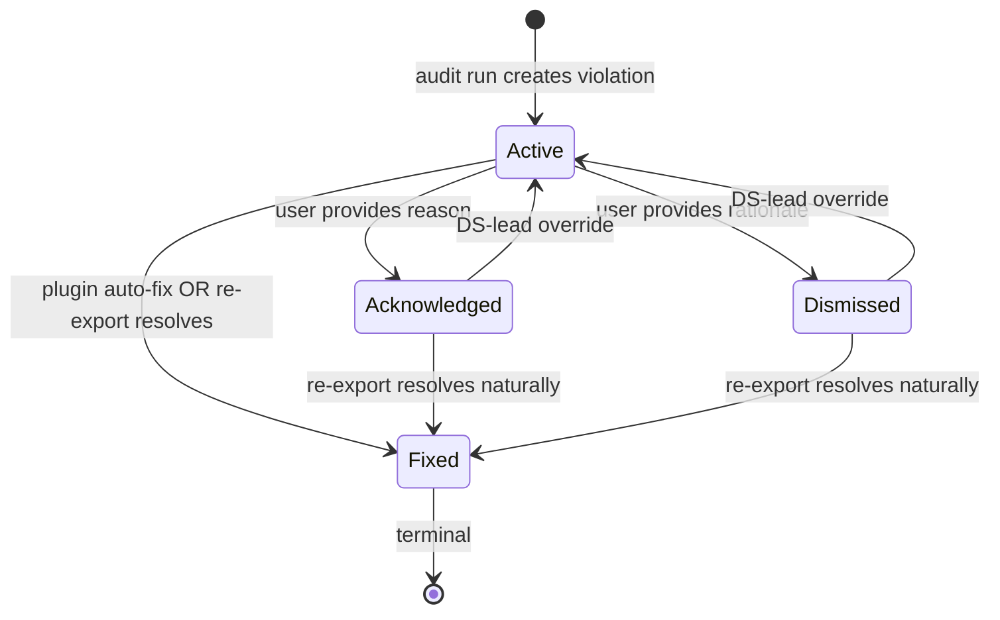

# feat: Projects · Flow Atlas — Phase 4 of 8 (violation lifecycle + designer surfaces)

> **Phase 4 of 8.** Phase 1-3 (+3.5) shipped the foundation: schema, plugin Projects mode, audit pipeline, atlas surface with bloom + KTX2 + LOD tiers + viewport culling, every audit rule class, fan-out worker, /onboarding route, Welcome demo project, EmptyState primitive, project-view 9-state machine, Shepherd tour. Phase 4 turns audit findings from a list into a workflow: designers can Acknowledge / Dismiss / Fix violations; their inbox surfaces every Active violation across their flows; auto-fix in the plugin closes the loop on token + style-class violations (~60% coverage); DS-leads see a dashboard rolling everything up by Product / severity / trend. Estimate: ~3-4 weeks across 14 implementation units.

## Overview

Phase 1-3 built the *visibility* surface — a designer can export a flow, see violations grouped by severity, filter by category, watch audit progress, and read the canonical_tree. Phase 4 builds the *action* surface. After this phase, a designer's day-1 with the product looks like:

1. Open `/inbox` → see 47 Active violations across 6 flows they own.
2. Filter to Critical theme parity → 4 violations on the Tax product.
3. Click one → atlas pre-zoomed to the offending frame; "Fix in Figma" button visible.
4. Click → plugin opens to Audit mode pre-loaded to the violation; one-click apply via `setBoundVariableForPaint`.
5. Confirm → plugin pings ds-service → violation flips to Fixed.
6. Inbox count drops 47 → 46. Designer keeps moving.

For the DS-lead the day-1 looks like:
1. Open `/atlas/admin` → see violations-by-Product leaderboard. Tax has 234 Critical.
2. Click trend chart → spike from a token rename last week. Confirm via decisions feed.
3. Click into Tax → see top-5 offending components. Plan a "Tax design-review week" for the affected designers.
4. Notice 12 Dismissed-without-decision rows; override 3 back to Active where the rationale doesn't hold up.

For the product owner of a component (e.g., engineer maintaining the `Toast` component) the day-1 looks like:
1. Open `app/components/toast` → "Where this breaks" section shows 23 flows × 47 violations against this component.
2. Sort by severity. Top: a contrast issue in the Tax/F&O flow.
3. Click → atlas + violation context. Decide whether to fix the component (and fan-out across 23 flows) or update guidance.

**Phase 4 deliberately stubs:**
- DRD multi-user collab via Yjs (Phase 5).
- Custom DRD blocks (`/decision`, `/figma-link`, `/violation-ref`) (Phase 5).
- Decisions first-class entities (Phase 5).
- Mind graph (`/atlas`) (Phase 6).
- Per-resource ACL grants (Phase 7) — Phase 4 lifecycle UX uses today's denormalized-tenant + role-based trust boundary.
- DS-lead admin surfaces for rule curation / persona library / taxonomy (Phase 7) — Phase 4 dashboard reads but doesn't write rule config.
- Notifications (Phase 7).
- Search (Phase 8).

The vertical slice: a designer fan-out of 47 violations becomes an empty inbox in 30 minutes via auto-fix + bulk-acknowledge instead of 4 hours of manual file-spelunking, and the DS-lead can see the result roll up to the dashboard in real time.

---

## Phased Delivery Roadmap

| Phase | Title | Outcome | Est. weeks |
|------|-------|---------|------------|
| 1 (shipped) | **Round-trip foundation** | Plugin → backend pipeline → project view + 4 tabs + cinematic animation | 3 |
| 2 (shipped) | **Audit engine extensions** | 5 new rule classes + fan-out + sidecar migration | 3-4 |
| 3 (shipped) | **Atlas polish + cold-start UX + onboarding** | Bloom + KTX2 + LOD + EmptyState + state machine + tour + Welcome demo | 5 |
| **4** (this plan) | **Violation lifecycle + designer surfaces** | Acknowledge / Dismiss / Fix lifecycle. /inbox. Per-component reverse view. DS-lead dashboard. Auto-fix in plugin. | 3-4 |
| 5 | DRD multi-user collab + decisions | Hocuspocus + Yjs + custom blocks + Decisions first-class | 3-4 |
| 6 | **Mind graph** (`/atlas`) | react-force-graph-3d with bloom + signal animations + filter chips + shared-element morph | 4-5 |
| 7 | Auth, ACL, admin | Per-resource grants + middleware + admin curation + audit-log + notifications | 3 |
| 8 | Search, asset migration, activity feed | Pagefind + S3 + activity feed | 2-3 |

**Total scope:** ~50 implementation units across 8 phases ≈ 24-30 weeks.

---

## Problem Frame

A 300-person org will produce thousands of violations. Phase 1-3 surfaced them; Phase 4 is the difference between "I can see my problems" and "I can solve my problems."

Three audiences this phase explicitly addresses:

- **Designer with a 47-violation backlog**: needs bulk action + auto-fix to keep their flow shippable. Without lifecycle, every violation requires a separate decision; with it, batch-acknowledge with a templated reason ("deferred to v2 unify-card-grid effort") clears 30 in one click.
- **Component owner**: needs reverse-lookup. Currently a component owner can only see violations one project at a time. With "Where this breaks", they see the cross-org impact + can prioritize component fixes that fan out.
- **DS lead**: needs a dashboard. Currently aggregates require manual SQL or eyeballing Violations tab counts across 100 projects. With `/atlas/admin`, leaderboards + trends + top-violators surface the org-wide pattern.

The auto-fix story is what compounds. ~60% of violations are token + style-class; if 60% become a single click instead of 5 minutes of "find the layer, find the variable, bind it, save, re-export," the per-violation cost drops 30×. That's the difference between Projects being a chore and Projects being the place designers actually live.

---

## Animation Philosophy

Phase 4 inherits Phase 1+3 (GSAP + Lenis + Framer Motion + reduced-motion). New surfaces:

| Surface | Treatment |
|---------|-----------|
| **Violation lifecycle button feedback** | Click "Acknowledge" → button morphs to spinner ~150ms → success checkmark fade-in (200ms) → row slides out of inbox (300ms ease-out) → inbox count tweens. Reduced-motion: instant. |
| **/inbox row stagger** | Rows fade-in stagger 50ms per row (max 800ms total) on initial load + on filter change. Mhdyousuf-style snappy. |
| **Bulk-acknowledge** | Selected rows highlight (scale 1 → 1.01) on bulk-action click, then collapse together (300ms) before the inbox refetches. |
| **Plugin auto-fix confirmation** | Plugin shows "Bound `colour.surface.button-cta` ✓" with a subtle green pulse; success ping triggers a toast in the docs site. |
| **Dashboard chart load-in** | Recharts area-chart line draws from left to right (~1200ms) on initial mount; bars fade up stagger; severity color tint on hover. |
| **Per-component reverse-view** | "Where this breaks" section types-in headline (60ms/char, mhdyousuf style); flow rows fade-stagger. |
| **Lifecycle status badge transitions** | Active → Acknowledged: badge color cross-fades (warning → text-3, 200ms); Active → Fixed: scale-pulse + checkmark; Active → Dismissed: opacity dim + strikethrough. |

**Tech stack additions:**
- **Recharts 2.x** (~50KB gz) — dashboard area + bar charts. Lazy-loaded into a `chunks/dashboard` split.

**Bundle impact:**
- New `chunks/inbox` ≤80KB gz (route shell + bulk-action UX).
- New `chunks/dashboard` ≤120KB gz (Recharts + leaderboard tables).
- Plugin grows ~15KB for auto-fix integration (still well under Figma's 5MB plugin cap).

---

## Requirements Trace

This plan advances:

- **R7 partial** — auto-fix scope: token + style-class only (~60% coverage). Other rule classes stay manual.
- **R8** — Violation lifecycle in full: Active → Acknowledged → Fixed | Dismissed.
- **R11** — Auto-fix in plugin: rebind raw fill to nearest token, apply textStyleId, snap dimension to 4-pt grid.
- **R14 extension** — Violations tab gains lifecycle buttons + Fix-in-Figma CTA on auto-fixable rows.
- **R16 extension** — JSON tab now supports a "view violation here" deeplink from the inbox.
- **R17** — Designer personal inbox `/inbox`.
- **R18** — Per-component reverse view (`app/components/[slug]` extension).
- **R19** — DS-lead dashboard `/atlas/admin`.

**Origin actors:** A1 (Designer), A3 (DS lead), A5 (Engineer = component owner), A7 (Plugin), A8 (Docs site).

**Origin flows:** F5 (Designer addresses a violation) — full implementation now.

**Origin acceptance examples:**
- **AE-2 reactivated** — auto-fix path now closes the loop. Designer hits Fix in Figma → plugin applies → violation Fixed.
- **AE-3 reactivated** — cross-persona violation now has Acknowledge with reason + Dismiss with rationale + DS-lead override.
- **AE-7 closes the loop** — token-publish fan-out lands violations; designers triage via /inbox; DS-lead watches the dashboard count drop.

---

## Scope Boundaries

### Deferred for later (carried from origin)

- Branch + merge review workflow.
- Comprehensive auto-fix beyond token + style class (instance-override unwinding, naming-hygiene, structural reorg).
- Cross-platform side-by-side comparison.
- Live mid-file audit.
- PRD / Linear / Jira integration.
- AI-suggested decisions.
- Mobile designer app / iPad viewer.
- Public read-only sharing.

### Outside this product's identity

- Replacing Figma / Notion / Linear / Mobbin.
- Hard governance / blocking PRs.

### Deferred to Follow-Up Work

- Phase 5 (DRD collab + decisions) — Phase 4's "decisions feed" on the dashboard reads from Phase 2's existing decisions placeholder; Phase 5 wires the real entity.
- Phase 7 (ACL + admin) — Phase 4 lifecycle uses denormalized-tenant + role; Phase 7 will gate per-resource via grants.
- Phase 8 (search) — /inbox v1 paginates via "Load more"; Phase 8's search surfaces the cross-flow query.

---

## Context & Research

### Relevant Code and Patterns

- `services/ds-service/internal/projects/types.go:Violation.Status` — already has `active | acknowledged | dismissed | fixed` enum; Phase 4 wires the transitions.
- `services/ds-service/internal/projects/types.go:Violation.AutoFixable` — Phase 2 added; Phase 4 reads it for the Fix-in-Figma CTA gating.
- `services/ds-service/internal/db/db.go:audit_log` — existing Phase 0 table. Every lifecycle transition writes a row (`action='violation.acknowledge'` etc.).
- `services/ds-service/internal/projects/repository.go:TenantRepo` — Phase 1 pattern. Phase 4 adds `UpdateViolationStatus(ctx, violationID, transition, reason)` + `BulkUpdateViolationStatus(ctx, filter, action)`.
- `services/ds-service/internal/projects/server.go` — Phase 1+2 handler pattern. Phase 4 adds `HandlePatchViolation`, `HandleBulkAcknowledge`, `HandleInbox`, `HandleComponentViolations`, `HandleDashboardSummary`.
- `components/projects/tabs/ViolationsTab.tsx` — Phase 1+2+3. Phase 4 wires lifecycle buttons + Fix-in-Figma CTA. The disabled-button placeholders from Phase 1 U10 become real.
- `components/empty-state/EmptyState.tsx` — Phase 3 U5. Used throughout /inbox + dashboard for loading / empty / error states.
- `lib/projects/view-machine.ts` — Phase 3 U7 state machine. Pattern reused for /inbox view-state machine.
- `figma-plugin/code.ts` Audit mode — Phase 1. Phase 4 extends with violation_id deeplink resolution + auto-fix application.
- `app/components/[slug]/page.tsx` — existing component detail page. Phase 4 adds "Where this breaks" section.
- `services/ds-service/migrations/0002_audit_rules_and_categories.up.sql` — Phase 2 schema. `violations.status` and `violations.auto_fixable` columns are already in place; Phase 4 doesn't need a new migration unless we want a `dismissed_violations_carry_forward` table for Phase 4 U3.

### Institutional Learnings

- `docs/solutions/2026-04-30-001-projects-phase-1-learnings.md` — tenant scoping by denormalization, migration discipline, r3f + Next 16 Suspense, SSE single-use ticket.
- `docs/solutions/2026-04-30-002-projects-phase-2-rules-learnings.md` — RuleRunner stable plug-in slot, tenant-aware composite per-Run, channel-notification + 100ms throttle for SSE progress, per-rule-not-per-screen progress decision.
- `docs/solutions/2026-05-01-001-designbrain-perf-findings.md` — DesignBrain LOD + atlas perf research; flag for Phase 4 dashboard charting (recharts already gives us tree-shake-friendly area charts; no need for custom WebGL2).

### External References

- [Recharts 2.x](https://recharts.org/) — area + bar + line charts for dashboard.
- [Figma plugin API: setBoundVariableForPaint](https://www.figma.com/plugin-docs/api/properties/PaintStyle-setBoundVariableForPaint/) — auto-fix mechanism for fill bindings.
- [Figma plugin API: setRangeTextStyleId](https://www.figma.com/plugin-docs/api/properties/TextNode-setRangeTextStyleId/) — auto-fix for text-style violations.

### Cross-cutting tech context

- **Stack:** Next.js 16.2.1 + React 19.2.4. Tailwind v4. Pagefind for search.
- **Backend:** Go (stdlib `net/http`, `modernc.org/sqlite`, JWT, no chi/echo).
- **Plugin:** Vanilla JS in `ui.html`. TypeScript `code.ts` compiled via `npx tsc -p .`.
- **Phase 1-3 conventions:** denormalized `tenant_id` everywhere; `TenantRepo` mandatory; cross-tenant 404; idempotent worker transactions; channel-notification (no polling); composite RuleRunner via tenant-aware wrapper; SSE with single-use ticket auth; `prefers-reduced-motion` honored.

---

## Key Technical Decisions

### Lifecycle audit log shape

- **Every transition writes to `audit_log`** (Phase 0 table). Schema: `(action, actor_user_id, tenant_id, violation_id, reason, ip, user_agent, trace_id, created_at)`. Replay-friendly: any state can be reconstructed from the log.
- **Allowed transitions** (enforced server-side):
  - `active → acknowledged` (requires `reason`, ≤256 chars)
  - `active → dismissed` (requires `reason`, ≤256 chars)
  - `active → fixed` (server-driven only, via plugin auto-fix or re-export resolution)
  - `acknowledged → active` (DS-lead override only)
  - `dismissed → active` (DS-lead override only)
  - `fixed → *` (immutable; re-export creates new Active violations naturally)
- **Reason templates** for bulk-acknowledge: pre-canned strings ("deferred to v2 unify-card-grid", "logged-out persona doesn't trigger network errors", etc.). Designer picks one or types free-text.

### Carry-forward semantics for Dismissed

- **Stable identity** = `(screen_logical_id, rule_id, property)`. Phase 1's `screen_logical_id` is what makes this work across re-exports.
- When a new Version is created (Phase 1 F4), the audit worker checks each newly-emitted Active violation against the prior Version's Dismissed violations. If `(screen_logical_id, rule_id, property)` matches AND the Dismissed reason exists, the new violation auto-marks Dismissed + carries the reason forward.
- **Override path**: DS-lead can flip Dismissed → Active in the dashboard. The override breaks the carry-forward — subsequent Versions see the violation as Active until re-fixed or re-dismissed.
- Schema: a new `dismissed_carry_forwards` table (one row per (logical_id, rule_id, property, tenant_id) → reason + dismissed_by + dismissed_at) makes this O(1) per re-audit instead of N×M scan.

### Inbox at-scale

- **Worst-case load**: 47 designers × ~50 active violations each = ~2350 inbox rows total org-wide; per-designer ~50 rows.
- **Single-table query** with index on `(tenant_id, status, severity, created_at)` handles it. Phase 1's existing indexes cover most of this; one new compound index `idx_violations_inbox` ships with Phase 4.
- **No pagination v1**; ship a "Load more" button at 100 rows. Phase 8 search adds full pagination + cross-flow query.
- **Editor scope**: an inbox row is "yours" if `auth.Claims.UserID == flow.owner_user_id` OR the user is a `designer`-or-higher role for the flow's product (Phase 1's role-based trust). Phase 7 ACL grants extend this with per-flow grants without changing the inbox query shape.

### Dashboard charting

- **Recharts** over D3 directly. Lighter (~50KB gz vs D3's ~80KB), tree-shakes well, and the API maps cleanly to our use case (area + bar). Lazy-loaded into `chunks/dashboard` so /atlas/admin's bundle stays bounded.
- **Aggregation queries** at request time. ~2350 violations × 5 severity tiers × 8 weeks = ~94K row scan in the worst case; SQLite handles in <100ms with the existing indexes. No materialized views needed for v1; Phase 7 admin can introduce them if dashboard latency degrades.
- **Trend window** defaults to last 8 weeks; user can flip to 4w / 12w / 24w. Buckets: weekly granularity (sufficient for org-wide spot-checks; daily comes in Phase 7 with finer-grained dashboards).
- **Recent decisions feed** stub: Phase 4 reads from Phase 2's `decisions` placeholder (empty table). Phase 5 lands real decisions; the feed activates without code changes.

### Auto-fix integration

- **Round-trip via plugin's existing Audit mode.** New deeplink shape: `figma://plugin/<plugin_id>/audit?violation_id=<id>` (Phase 4 adds the violation_id query param to the existing audit URL).
- **Plugin reads violation_id at boot**, fetches the violation from ds-service via the existing audit-server endpoint pattern (a new `GET /v1/projects/:slug/violations/:id` route Phase 4 ships). Locates the offending node in the Figma file via `node_id` from the violation.
- **Fix application**:
  - Token fill rebind: `node.setBoundVariableForPaint("fills", 0, variable)`.
  - Text style apply: `node.setRangeTextStyleId(0, length, textStyleId)`.
  - Spacing snap: `node.paddingLeft = nearestGridValue(node.paddingLeft, 4)` etc.
  - Radius snap: `node.cornerRadius = nearestRadiusValue(node.cornerRadius)`.
- **Designer confirms** before any write. Plugin shows preview ("Will bind `Button/CTA/fill` to `colour.surface.button-cta`") + "Apply" button. Reduced-motion-friendly progress UI per Phase 1 patterns.
- **Success ping**: `POST /v1/projects/:slug/violations/:id/fix-applied` from plugin → ds-service updates `status=fixed`, emits SSE `project.violation_fixed`, audit-log entry written. Inbox + Violations tab + dashboard all refresh via SSE without re-polling.
- **Auto-fixable scope**: rules where `audit_rules.auto_fixable=1` AND `violations.auto_fixable=1`. Phase 2 migration 0002 + 0003 already populate this for the ~60% subset (token-binding rule_ids + text-style + spacing-snap). Phase 4 doesn't expand the auto-fix surface; just wires the round-trip.

### Per-component reverse view

- **Existing route** `app/components/[slug]/page.tsx` extended with a "Where this breaks" section.
- **New endpoint** `GET /v1/components/:slug/violations` joins `violations × screens × project_versions × projects WHERE project_versions.id = (latest per project)` filtered by `violations.rule_id` matching the component's rule prefix (e.g., `Toast` component → rule_ids referencing `componentSetKey:Toast`).
- **Cross-tenant access**: components are org-wide (taxonomy curated by DS-lead), but violation visibility is tenant-scoped. The endpoint returns aggregate counts cross-tenant + per-flow detail only for flows the caller has visibility on.
- **Performance**: ~2350 violations × ~80 components ≈ a 188K row join in the worst case. Index on `violations.rule_id` covers; Phase 4 adds `idx_violations_rule_id` if profiling shows it.

### Lifecycle UX details

- **Acknowledge button**: shows reason input inline (textarea, ≤256 chars) + reason-template dropdown ("Pick a reason…"). Submit → optimistic UI flip + SSE confirmation.
- **Dismiss button**: same shape; rationale required, no template defaults (more consequential).
- **DS-lead override controls**: only visible when `auth.Claims.Role == 'admin' || tenant_admin'`. Surface in the dashboard's recent-Dismissed feed; per-row "Reactivate" button.
- **Optimistic UI**: lifecycle transitions update the row state immediately + roll back on server error. Phase 1+2 SSE pattern handles the broadcast.

### Audit-log retention

- Phase 0 table has no retention policy; Phase 4 introduces a 90-day rolling window via a `cmd/admin retention` subcommand (one-shot CLI; ops runs weekly via cron). Documented in the runbook.

### Performance budgets

| Surface | Budget | Notes |
|---|---|---|
| `app/inbox` initial route shell | ≤220KB gz | Reuses Phase 1 patterns; lifecycle UX adds ~30KB over the project shell. |
| `chunks/inbox` (lazy) | ≤80KB gz | Bulk-action UX + filter chips. |
| `chunks/dashboard` (lazy) | ≤120KB gz | Recharts (~50KB) + leaderboard table component. |
| Inbox initial fetch p95 | ≤500ms | 50-row query + 4 filter joins; SQLite handles. |
| Dashboard initial fetch p95 | ≤800ms | 5 aggregation queries in parallel. |
| Auto-fix round-trip p95 | ≤1.5s | Plugin → ds-service → Figma write → SSE → UI. |

CI extends Phase 1's `scripts/check-bundle-sizes.mjs`.

---

## Open Questions

### Resolved During Planning

- **Lifecycle audit-log table**: existing `audit_log` from Phase 0 — no new table needed.
- **Carry-forward identity**: `(screen_logical_id, rule_id, property)` — Phase 1's logical_id makes this work.
- **Inbox pagination**: "Load more" button at 100 rows for v1; Phase 8 search adds proper pagination.
- **Charting library**: Recharts (lighter + tree-shake-friendly + matches our stack better than D3).
- **Auto-fix scope**: token + style-class only (~60% coverage) per origin R11. Don't expand here.
- **Plugin deeplink shape**: `figma://plugin/<plugin_id>/audit?violation_id=<id>`.
- **DS-lead override**: dashboard recent-Dismissed feed has Reactivate button; gated by role.

### Deferred to Implementation

- Reason-template list — pick the 6-8 most common at code time based on dogfood feedback.
- Dashboard color scale — match Phase 1+2 severity tints; tune at code time.
- Auto-fix preview rendering — text vs. screenshot; pick at code time per Figma plugin API capabilities.
- Bulk-acknowledge selection limit — start at 100 rows; tune if performance degrades.
- Carry-forward table schema — decide at code time whether new `dismissed_carry_forwards` table or column on `violations` table; new table is cleaner but adds a migration.

### Carried Open from origin (Phase 5+)

- **Origin Q1** Decision supersession UX — Phase 5.
- **Origin Q3** DRD migration on flow rename — Phase 4 / 5 (Phase 4 leaves a TODO in the carry-forward path).
- **Origin Q5** Atlas zoom strategy — resolved in Phase 3.5 via LOD + viewport culling.
- **Origin Q6** Mind graph performance — Phase 6.
- **Origin Q7** Comment portability — Phase 5.
- **Origin Q8** Permission inheritance — Phase 7.
- **Origin Q10** Slack/email digest — Phase 7.

---

## Output Structure

```
app/
├── inbox/                                            ← NEW
│   ├── page.tsx                                      ← /inbox route
│   ├── layout.tsx                                    ← FilesShell wrapper, gated by auth
│   └── InboxShell.tsx                                ← list + filters + bulk action
├── atlas/                                            ← NEW
│   └── admin/
│       └── page.tsx                                  ← DS-lead dashboard
├── components/[slug]/
│   └── page.tsx                                      ← MODIFY: "Where this breaks" section

components/
├── inbox/                                            ← NEW
│   ├── InboxFilters.tsx                              ← rule_id / persona / mode / date range chips
│   ├── InboxRow.tsx                                  ← single violation row + lifecycle buttons
│   ├── BulkActionBar.tsx                             ← bulk-select + reason templates
│   └── ReasonTemplates.ts                            ← pre-canned acknowledge/dismiss reasons
├── projects/tabs/violations/
│   ├── LifecycleButtons.tsx                          ← Acknowledge / Dismiss / Fix-in-Figma row buttons
│   └── FixInFigmaButton.tsx                          ← deeplink to plugin auto-fix
├── components/[slug]/
│   └── WhereThisBreaks.tsx                           ← NEW: cross-flow violation surface
└── dashboard/                                        ← NEW
    ├── DashboardShell.tsx
    ├── ViolationsByProduct.tsx                       ← bar chart
    ├── SeverityTrend.tsx                             ← area chart over time
    ├── TopViolators.tsx                              ← leaderboard table
    └── RecentDecisions.tsx                           ← stub (Phase 5 wires real decisions)

lib/
├── inbox/                                            ← NEW
│   ├── client.ts                                     ← fetchInbox, bulkAcknowledge
│   └── filters.ts                                    ← URL-bound filter state
├── projects/                                         ← MODIFY: existing client.ts
│   └── client.ts                                     ← add updateViolationStatus, fetchComponentViolations
└── dashboard/                                        ← NEW
    └── client.ts                                     ← fetchDashboardSummary (5 aggregation queries)

services/ds-service/
├── cmd/admin/
│   └── main.go                                       ← MODIFY: add retention subcommand
├── internal/projects/
│   ├── repository.go                                 ← MODIFY: UpdateViolationStatus, BulkUpdateViolationStatus, GetInbox, ComponentViolations, DashboardSummary
│   ├── server.go                                     ← MODIFY: HandlePatchViolation, HandleBulkAcknowledge, HandleInbox, HandleComponentViolations, HandleDashboardSummary, HandleViolationFixApplied
│   ├── lifecycle.go                                  ← NEW: state-transition validation + audit-log writer
│   ├── carry_forward.go                              ← NEW: dismissed-violation carry-forward on re-audit
│   └── audit_log.go                                  ← MODIFY: WriteViolationLifecycle helper
└── migrations/
    └── 0006_dismissed_carry_forwards_index.up.sql    ← NEW: idx_violations_inbox + dismissed_carry_forwards table (or column on violations)

figma-plugin/
├── code.ts                                           ← MODIFY: violation_id deeplink + auto-fix application
├── ui.html                                           ← MODIFY: auto-fix preview + Apply button + success animation
└── auto-fix/                                         ← NEW (or inline in code.ts)
    └── apply.ts                                      ← per-rule fix application logic

tests/
├── inbox/
│   ├── inbox-route.spec.ts                           ← /inbox renders + filters + bulk action
│   └── lifecycle-transitions.spec.ts                 ← Active → Acknowledged → Fixed full path
├── projects/
│   ├── violation-lifecycle.spec.ts                   ← lifecycle UI in ViolationsTab
│   └── auto-fix-roundtrip.spec.ts                    ← AE-2 closure: plugin auto-fix → SSE → Fixed
├── components/
│   └── where-this-breaks.spec.ts                     ← reverse view renders + counts
└── dashboard/
    └── admin-dashboard.spec.ts                       ← /atlas/admin renders charts + leaderboards

docs/
├── runbooks/
│   └── 2026-05-NN-phase-4-deploy.md                  ← retention CLI + dashboard deploy notes
└── solutions/
    └── 2026-MM-DD-NNN-projects-phase-3-learnings.md  ← captured at Phase 3 close, references Phase 4 patterns
```

---

## High-Level Technical Design

### Lifecycle state machine



Every transition writes to `audit_log` with the actor + reason + timestamp. The reason field is required for explicit user transitions (Acknowledged / Dismissed) and optional for server-driven transitions (Fixed via auto-fix or re-export).

### Auto-fix round-trip

```mermaid
sequenceDiagram
    participant D as Designer (Violations tab)
    participant DS as docs-site
    participant DSS as ds-service
    participant FP as Figma plugin
    participant FG as Figma file

    D->>DS: Click "Fix in Figma" on violation row
    DS->>DS: figma://plugin/<id>/audit?violation_id=v1
    DS->>FP: Open plugin via deeplink
    FP->>DSS: GET /v1/projects/:slug/violations/v1
    DSS-->>FP: {rule_id, node_id, suggestion, target_token_path}
    FP->>FG: Locate node by node_id
    FP->>D: Show preview "Bind <node>/fill to <token>" + Apply button
    D->>FP: Click Apply
    FP->>FG: setBoundVariableForPaint("fills", 0, variable)
    FP->>DSS: POST /v1/projects/:slug/violations/v1/fix-applied
    DSS->>DSS: violations.status = 'fixed', audit_log entry
    DSS->>DS: SSE project.violation_fixed
    DS->>D: Inbox count tweens 47 → 46; Violations tab row flips to Fixed
```

---

## Implementation Units

- U1. **Lifecycle backend: status-transition endpoint + audit-log writer**

**Goal:** `PATCH /v1/projects/:slug/violations/:id` accepts `{action, reason}` and validates the transition + writes audit-log + emits SSE.

**Requirements:** R8.

**Dependencies:** None.

**Files:**
- Modify: `services/ds-service/internal/projects/repository.go` — add `UpdateViolationStatus(ctx, violationID, transition, reason, userID)` method on TenantRepo. Validates allowed transitions; rejects invalid (e.g., fixed → active). Writes the audit_log row in the same transaction.
- Create: `services/ds-service/internal/projects/lifecycle.go` — pure-function transition validator + AllowedTransitions table.
- Modify: `services/ds-service/internal/projects/server.go` — `HandlePatchViolation(w, r)` that wraps the repo call.
- Modify: `services/ds-service/cmd/server/main.go` — register `PATCH /v1/projects/{slug}/violations/{id}`.
- Create: `services/ds-service/internal/projects/lifecycle_test.go` — table-driven transition tests.

**Approach:**
- AllowedTransitions: map of (from, to) → bool. Rejects invalid transitions with 400.
- DS-lead override gate: `acknowledged|dismissed → active` requires `auth.Claims.Role` to be admin/tenant_admin.
- Reason validation: required + ≤256 chars for explicit transitions.
- SSE emission: `project.violation_lifecycle_changed` with the new status — Violations tab + Inbox subscribe.

**Test scenarios:**
- `active → acknowledged` with reason → 200, audit_log written, SSE fired.
- `active → fixed` from non-system user → 403 (server-driven only).
- `acknowledged → active` from designer → 403 (admin only).
- `acknowledged → active` from admin → 200.
- Missing reason on transition that requires it → 400.
- Non-existent violation_id (cross-tenant) → 404 (no existence oracle).

**Verification:** All scenarios pass; SSE event arrives on Violations tab + Inbox subscribers.

---

- U2. **Bulk-acknowledge endpoint**

**Goal:** `POST /v1/projects/:slug/violations/bulk-acknowledge` with `{violation_ids[], reason, action}` updates many in a single transaction.

**Requirements:** R8 + designer-inbox UX.

**Dependencies:** U1.

**Files:**
- Modify: `repository.go` — `BulkUpdateViolationStatus(ctx, ids, action, reason, userID)`.
- Modify: `server.go` — `HandleBulkAcknowledge(w, r)` with body validation.
- Test: integration test for 50-row bulk update.

**Approach:**
- Single SQLite transaction; rollback on first error.
- Per-row audit_log entry (still one log row per violation; bulk metadata key `bulk_id` so they can be aggregated later).
- Cap at 100 rows per request (rate-limit safety).

**Test scenarios:**
- 50 active violations → bulk-acknowledge → all flip to acknowledged + 50 audit_log rows written.
- 1 of 50 already acknowledged → endpoint succeeds for the 49 in active; reports 1 skipped in response.
- 101 ids → 400 (over cap).
- Cross-tenant ids in same batch → 404.

**Verification:** All scenarios pass; SSE fan-out works (one event per id, throttled at 100ms per channel).

---

- U3. **Carry-forward of Dismissed violations across re-exports**

**Goal:** When a new Version's audit finds a violation matching a previously-Dismissed `(screen_logical_id, rule_id, property)`, auto-mark Dismissed + carry the reason.

**Requirements:** R8.

**Dependencies:** U1.

**Files:**
- Create: `services/ds-service/migrations/0006_dismissed_carry_forwards.up.sql` — `dismissed_carry_forwards` table (`tenant_id, screen_logical_id, rule_id, property` PK + `reason, dismissed_by_user_id, dismissed_at, original_violation_id`).
- Create: `services/ds-service/internal/projects/carry_forward.go` — applied inside the worker's `PersistRunIdempotent` transaction. Looks up matching carry-forward markers; updates new violations to Dismissed in the same transaction.
- Modify: `services/ds-service/internal/projects/lifecycle.go` — when transitioning to Dismissed, write a `dismissed_carry_forwards` row.
- Modify: when DS-lead overrides Dismissed → Active, delete the carry_forward row.
- Test: re-audit fixture with a previously-Dismissed violation → new violation lands as Dismissed with the same reason.

**Approach:**
- Worker's PersistRunIdempotent (Phase 1) gets a hook before COMMIT: scan new violations for matching markers, set status='dismissed' + copy reason.
- DS-lead override path: lifecycle.go's `acknowledged|dismissed → active` transition deletes the carry_forward row.
- Migration includes index on `(tenant_id, screen_logical_id, rule_id, property)` for the per-screen lookup.

**Test scenarios:**
- Re-audit with previously-Dismissed violation → new violation status='dismissed', reason matches.
- DS-lead overrides Dismissed → Active → carry_forward row deleted.
- Subsequent re-audit → new violation lands as Active (override sticks).
- Multi-tenant: tenant A's carry_forward never bleeds into tenant B.

**Verification:** Carry-forward path works end-to-end against synthetic re-audit fixtures.

---

- U4. **Inbox endpoint + filters**

**Goal:** `GET /v1/inbox` returns the requesting user's Active violations across every flow they're editor on.

**Requirements:** R17.

**Dependencies:** U1.

**Files:**
- Modify: `repository.go` — `GetInbox(ctx, userID, filters) ([]InboxRow, int, error)`. JOIN violations × screens × flows × projects. Index hint on `idx_violations_inbox`.
- Create: `services/ds-service/migrations/0006...` — adds `idx_violations_inbox` on `(tenant_id, status, severity, created_at)` if not already covered.
- Modify: `server.go` — `HandleInbox(w, r)` with filter parsing.
- Filter params: `?rule_id=X&persona=Y&mode=Z&project=W&date_from=&date_to=`.

**Approach:**
- Editor scope: `flows.owner_user_id == userID OR auth.Claims.Role == 'designer' AND project.product == userProduct`. Phase 4's role-based scope; Phase 7 ACL extends.
- Returns rows + total count + applied filters echo.
- "Load more" pagination: `?cursor=<last_violation_id>` returns next 100.

**Test scenarios:**
- 50-violation inbox → returns 50 rows + count=50.
- Filter by rule_id=theme_parity_break → only matching rows.
- Filter by persona_id → only flows for that persona.
- Cross-tenant guarantee: user can't see violations from other tenants.

---

- U5. **/inbox route + bulk-action UX**

**Goal:** Render the inbox + lifecycle controls per row + bulk-select + reason-template dropdown.

**Requirements:** R17.

**Dependencies:** U1, U2, U4.

**Files:**
- Create: `app/inbox/page.tsx`, `app/inbox/layout.tsx`.
- Create: `components/inbox/{InboxShell,InboxFilters,InboxRow,BulkActionBar,ReasonTemplates}.tsx`.
- Create: `lib/inbox/{client.ts,filters.ts}`.

**Approach:**
- 9-state machine (mirrors Phase 3 U7 pattern): loading / ok / empty / filtered_empty / error.
- Bulk-select: checkbox per row + "Select all" header. Bulk Acknowledge button enabled when ≥1 selected.
- Reason-template dropdown: 6-8 pre-canned + "Custom" → free-text input.
- URL-bound filters: filter state lives in search params (deeplinkable + reload-stable).
- SSE: subscribes to `project.violation_lifecycle_changed`; row updates in place.

**Test scenarios:**
- 50-row inbox → renders.
- Filter by rule_id → URL updates + list filters.
- Bulk-select 10 rows → "Acknowledge 10" button enabled.
- Click Acknowledge → reason-template dropdown opens → pick "deferred to v2" → submit → 10 rows fade out + count drops.
- Reduced-motion: animations short-circuit.

---

- U6. **ViolationsTab lifecycle controls**

**Goal:** Replace Phase 1 U10's disabled lifecycle placeholders in `ViolationsTab.tsx` with real Acknowledge / Dismiss / Fix-in-Figma buttons.

**Requirements:** R8 + R14.

**Dependencies:** U1.

**Files:**
- Modify: `components/projects/tabs/ViolationsTab.tsx` — wire LifecycleButtons.
- Create: `components/projects/tabs/violations/LifecycleButtons.tsx`.
- Create: `components/projects/tabs/violations/FixInFigmaButton.tsx` — gated by `violation.auto_fixable`.

**Approach:**
- Per-row Acknowledge / Dismiss buttons inline (no modal — simpler than inbox bulk flow).
- Fix-in-Figma button visible only when `violation.auto_fixable === true`. Click opens `figma://plugin/<plugin_id>/audit?violation_id=<id>`.
- Optimistic UI: row state flips immediately + rolls back on error.

**Test scenarios:**
- Click Acknowledge → reason input expands inline → submit → row collapses.
- Click Dismiss → rationale required → empty submit blocked.
- auto_fixable=false row → Fix-in-Figma button hidden.
- auto_fixable=true row → Fix-in-Figma button visible + opens deeplink.

---

- U7. **Per-component reverse view: backend**

**Goal:** `GET /v1/components/:slug/violations` returns aggregate + per-flow violation data for a component.

**Requirements:** R18.

**Dependencies:** U1.

**Files:**
- Modify: `repository.go` — `ComponentViolations(ctx, componentSlug, callerUserID) (Aggregate, []FlowDetail, error)`.
- Modify: `server.go` — `HandleComponentViolations(w, r)`.

**Approach:**
- Aggregate: cross-tenant counts by severity. Numbers only, no per-tenant detail.
- Per-flow detail: scoped to the caller's visibility (Phase 4 = same role gate as inbox).
- Performance: ~80 components × ~30 violations each = 2400 row scan; index on `(rule_id)` covers.

**Test scenarios:**
- Toast component → returns 23 flows × 47 violations.
- Cross-tenant access: caller in tenant B sees Toast aggregate but only their per-flow detail.

---

- U8. **Per-component reverse view: frontend**

**Goal:** `app/components/[slug]/page.tsx` renders a "Where this breaks" section.

**Requirements:** R18.

**Dependencies:** U7.

**Files:**
- Modify: `app/components/[slug]/page.tsx`.
- Create: `components/components/[slug]/WhereThisBreaks.tsx`.

**Approach:**
- Section ordered by severity (Critical first); per-flow list collapsed by default; click to expand.
- Each flow row: project name, persona, mode, severity badge, "Open project" link.
- Empty-state via Phase 3 U5 EmptyState variant=zero-violations when component has no violations org-wide.

**Test scenarios:**
- Component with violations → section renders with counts.
- Component with zero violations → celebratory empty state.
- Cross-tenant: aggregate shown, per-flow list scoped.

---

- U9. **DS-lead dashboard: backend aggregation**

**Goal:** `GET /v1/atlas/admin/summary` returns 5 aggregations (by-product / by-severity / trend / top-violators / recent-decisions).

**Requirements:** R19.

**Dependencies:** None (independent of lifecycle).

**Files:**
- Modify: `repository.go` — `DashboardSummary(ctx, params)` with 5 sub-queries.
- Modify: `server.go` — `HandleDashboardSummary(w, r)` admin-only (`requireSuperAdmin`).

**Approach:**
- Trend window: default 8 weeks; configurable via `?weeks=4|8|12|24`.
- Top-violators: top 10 components by violation count.
- Recent decisions: stub (Phase 5 wires the real entity); empty array v1.
- All 5 queries run in parallel via goroutines + sync.WaitGroup.

**Test scenarios:**
- Empty database → all 5 aggregates return zero counts.
- Synthetic 47-flow fixture → counts match expected.
- Non-admin user → 403.

---

- U10. **DS-lead dashboard: frontend chrome**

**Goal:** `/atlas/admin` route renders the 5 aggregations.

**Requirements:** R19.

**Dependencies:** U9.

**Files:**
- Create: `app/atlas/admin/page.tsx`.
- Create: `components/dashboard/{DashboardShell,ViolationsByProduct,SeverityTrend,TopViolators,RecentDecisions}.tsx`.
- Create: `lib/dashboard/client.ts`.

**Approach:**
- Lazy-loaded `chunks/dashboard` (Recharts in here).
- Layout: 2x2 grid + recent-decisions feed below. Responsive collapse to 1-col on narrow viewports.
- Trend chart: area chart per severity tier, stacked.
- Top-violators: sortable table.

**Test scenarios:**
- Empty data → empty-states per panel.
- Non-zero data → charts render.
- Filter trend window 4 / 8 / 12 / 24 weeks → chart updates.

---

- U11. **Plugin auto-fix integration**

**Goal:** Plugin reads `?violation_id=<id>` deeplink param + applies fix via Figma plugin API.

**Requirements:** R11.

**Dependencies:** U1 (lifecycle endpoint exists for the success ping).

**Files:**
- Modify: `figma-plugin/code.ts` — parse deeplink + fetch violation + apply fix.
- Modify: `figma-plugin/ui.html` — preview + Apply button.
- Create: `figma-plugin/auto-fix/` (or inline) — per-rule fix application.

**Approach:**
- Deeplink: `figma://plugin/<plugin_id>/audit?violation_id=<id>`.
- Plugin fetches `GET /v1/projects/:slug/violations/:id` (new route Phase 4 ships in U12).
- Per-rule logic:
  - `drift.fill` / `unbound.fill` / `deprecated.fill` → `setBoundVariableForPaint("fills", 0, variable)`.
  - `drift.text` / `unbound.text` → `setRangeTextStyleId(0, length, textStyleId)`.
  - `drift.padding` / `drift.gap` → snap to nearest 4.
  - `drift.radius` → snap to nearest in {0, 4, 8, 12, 16, 24, 999} (pill rule).
- Designer confirms before write. Reduced-motion-friendly progress UI.

**Test scenarios:**
- Plugin opens with violation_id → fetches → shows preview.
- Click Apply → Figma node gets the binding → POST /fix-applied → 200.
- Unsupported rule_id → preview shows "Manual fix required" → no Apply button.
- Network failure during fetch → error UI with retry.

---

- U12. **Backend: GET /v1/projects/:slug/violations/:id + POST /fix-applied**

**Goal:** Single-violation fetch endpoint for plugin + the success ping endpoint that flips `status=fixed`.

**Requirements:** R11.

**Dependencies:** U1.

**Files:**
- Modify: `repository.go` — `GetViolation(ctx, slug, violationID) (*Violation, error)`.
- Modify: `server.go` — `HandleViolationGet`, `HandleViolationFixApplied`.

**Approach:**
- GET endpoint returns violation + parent screen + project metadata for the plugin.
- POST /fix-applied wraps U1's UpdateViolationStatus(action='fixed'); sets `fixed_by` (user) + `fixed_via='auto-fix'` in audit_log.
- Idempotency: if violation already Fixed, return 200 (not 409) — auto-fix retries shouldn't trip the plugin.

**Test scenarios:**
- GET non-existent violation_id → 404.
- POST fix-applied on Active violation → 200; status=fixed; SSE fires.
- POST fix-applied on already-Fixed violation → 200 (idempotent).
- POST fix-applied without auth → 401.

---

- U13. **Audit-log retention CLI**

**Goal:** `cmd/admin retention --days=90` deletes audit_log rows older than the cutoff.

**Requirements:** Operational hygiene.

**Dependencies:** None.

**Files:**
- Modify: `services/ds-service/cmd/admin/main.go` — add `retention` subcommand.
- Modify: existing repo helper for the DELETE.

**Approach:**
- Default 90 days; flag-overridable.
- Dry-run mode: `--dry-run` prints count without deleting.
- Single transaction; rollback on error.

**Test scenarios:**
- Synthetic 95-day-old log row + 89-day-old log row → retention deletes the 95-day, keeps the 89-day.
- Dry-run → count printed; no DELETE.

---

- U14. **Phase 4 Playwright integration tests + dashboard runbook**

**Goal:** End-to-end Playwright coverage of AE-2 closure + lifecycle + inbox + reverse view + dashboard. Plus deploy runbook.

**Requirements:** All AE-2/AE-3 closures + R11/R17/R18/R19.

**Dependencies:** U1-U13.

**Files:**
- Create: `tests/inbox/inbox-route.spec.ts`, `lifecycle-transitions.spec.ts`.
- Create: `tests/projects/violation-lifecycle.spec.ts`, `auto-fix-roundtrip.spec.ts`.
- Create: `tests/components/where-this-breaks.spec.ts`.
- Create: `tests/dashboard/admin-dashboard.spec.ts`.
- Create: `docs/runbooks/2026-05-NN-phase-4-deploy.md`.

**Approach:** Mirror Phase 2 U12 + Phase 3 U13 patterns. Each AE gets a dedicated test that walks the full flow.

**Verification:** Full Playwright suite passes.

---

## System-Wide Impact

- **Interaction graph:**
  - Designer → /inbox → ds-service GET /inbox → repo + filters.
  - Designer → ViolationsTab Acknowledge button → ds-service PATCH violations/:id → audit_log + SSE.
  - Designer → ViolationsTab Fix-in-Figma → plugin deeplink → plugin fetches violation → Figma write → POST /fix-applied → SSE.
  - DS-lead → /atlas/admin → ds-service GET /summary → 5 aggregation queries.
  - Worker re-audit → carry_forward.go pre-COMMIT hook → newly-emitted violations match prior Dismissed → status='dismissed' inline.
- **Error propagation:** lifecycle transitions roll back optimistic UI on server error; bulk-acknowledge surfaces per-row failure detail.
- **State lifecycle risks:** carry-forward + DS-lead override interact via the `dismissed_carry_forwards` table — overrides delete the marker; subsequent re-audit doesn't recreate.
- **API surface parity:** `internal/projects/types.ProjectsSchemaVersion` bumps `1.2 → 1.3` (additive: lifecycle fields + carry-forward). Existing clients tolerate.
- **Integration coverage:** AE-2 closes the loop. Cross-layer Playwright covers it.
- **Unchanged invariants:** Phase 1 RuleRunner, Phase 2 fan-out endpoint, Phase 3 state machine, Phase 3.5 atlas perf — all unchanged.

---

## Risks & Dependencies

| Risk | Likelihood | Impact | Mitigation |
|------|-----------|--------|------------|
| Auto-fix mis-applies a binding (writes wrong token to wrong layer) | Medium | High | Designer confirms preview before write; each rule's apply.ts is unit-tested; success ping records the exact write so an undo path is trivially reconstructable. |
| Carry-forward + DS-lead override race condition | Low | Medium | Single transaction in lifecycle.go; the override DELETE happens before the new audit's INSERT. Ordered by Phase 1's worker semantics. |
| Inbox at 5000+ rows starts to lag | Medium | Low | "Load more" pagination caps at 100/page; backend query covered by index. Phase 8 search adds proper pagination + cross-flow query. |
| Dashboard charts cause CLS on slow networks | Medium | Low | Reserve chart container heights; lazy-load Recharts chunk; skeleton state via Phase 3 U5 EmptyState variant=loading. |
| Reason-template proliferation (designers add 50 custom reasons) | Medium | Low | Keep templates in `ReasonTemplates.ts` as a const; designer can type free-text but the surfaced templates stay curated. |
| Plugin deeplink doesn't survive Figma plugin reinstall | Medium | Medium | Plugin ID stable in manifest.json; reinstall doesn't change it. Phase 7 plugin-update story revisits if/when manifest needs to bump. |
| `audit_log` growth at 90-day retention | Low | Low | Retention CLI runs weekly via cron; 90 days × ~10K transitions/day = ~900K rows = <100MB. SQLite handles. |
| DS-lead override flows lose context after Phase 7 ACL | Low | Medium | Phase 7 plan has a migration path; Phase 4 doesn't pre-optimize. |
| AE-2 auto-fix writes don't re-audit cleanly | Medium | Medium | Phase 4 U11 includes a "trigger re-audit" path post-fix-applied (optional; designer sees the Fixed state immediately + the next re-audit confirms). |

---

## Documentation / Operational Notes

### Operational changes

- **New CLI**: `cmd/admin retention --days=90 [--dry-run]`.
- **New env vars**: `DS_INBOX_PAGE_SIZE` (default 100), `DS_DASHBOARD_TREND_WEEKS_DEFAULT` (default 8).
- **Runbook**: `docs/runbooks/2026-05-NN-phase-4-deploy.md` — retention cron setup, dashboard deploy notes, plugin deeplink testing.

### Documentation

- `docs/security/data-classification.md` — add `audit_log.reason` (Confidential — may include free-text business rationale).
- `services/ds-service/README.md` — env vars + retention CLI section.
- `docs/solutions/2026-MM-DD-NNN-projects-phase-4-learnings.md` post-ship — capture the auto-fix UX learnings + any plugin-API quirks.

### Monitoring

- Per-action lifecycle latency (Acknowledge / Dismiss / Fixed p95).
- Auto-fix success rate (Fixed via plugin / total Fix-in-Figma clicks).
- Inbox query p95 (target ≤500ms).
- Dashboard query p95 (target ≤800ms).
- audit_log row count (alert if growth rate exceeds 50K/day for >3 days).

### Performance budgets (CI-asserted, Phase 4 extensions)

| Metric | Threshold | Source |
|--------|-----------|--------|
| Inbox initial fetch p95 | ≤500ms | Phase 4 |
| Dashboard initial fetch p95 | ≤800ms | Phase 4 |
| Auto-fix round-trip p95 | ≤1.5s | Phase 4 |
| Inbox chunk size | ≤80KB gz | Phase 4 |
| Dashboard chunk size | ≤120KB gz | Phase 4 |
| Lifecycle PATCH p95 | ≤200ms | Phase 4 |

---

## Sources & References

- **Origin:** [`docs/brainstorms/2026-04-29-projects-flow-atlas-requirements.md`](../brainstorms/2026-04-29-projects-flow-atlas-requirements.md)
- **Phase 1:** [`docs/plans/2026-04-29-001-feat-projects-flow-atlas-phase-1-plan.md`](2026-04-29-001-feat-projects-flow-atlas-phase-1-plan.md)
- **Phase 2:** [`docs/plans/2026-04-30-001-feat-projects-flow-atlas-phase-2-plan.md`](2026-04-30-001-feat-projects-flow-atlas-phase-2-plan.md)
- **Phase 3:** [`docs/plans/2026-05-01-001-feat-projects-flow-atlas-phase-3-plan.md`](2026-05-01-001-feat-projects-flow-atlas-phase-3-plan.md)
- **Phase 1 learnings:** [`docs/solutions/2026-04-30-001-projects-phase-1-learnings.md`](../solutions/2026-04-30-001-projects-phase-1-learnings.md)
- **Phase 2 learnings:** [`docs/solutions/2026-04-30-002-projects-phase-2-rules-learnings.md`](../solutions/2026-04-30-002-projects-phase-2-rules-learnings.md)
- **DesignBrain perf findings:** [`docs/solutions/2026-05-01-001-designbrain-perf-findings.md`](../solutions/2026-05-01-001-designbrain-perf-findings.md)
- **Recharts:** <https://recharts.org/>
- **Figma plugin API — setBoundVariableForPaint:** <https://www.figma.com/plugin-docs/api/properties/PaintStyle-setBoundVariableForPaint/>
