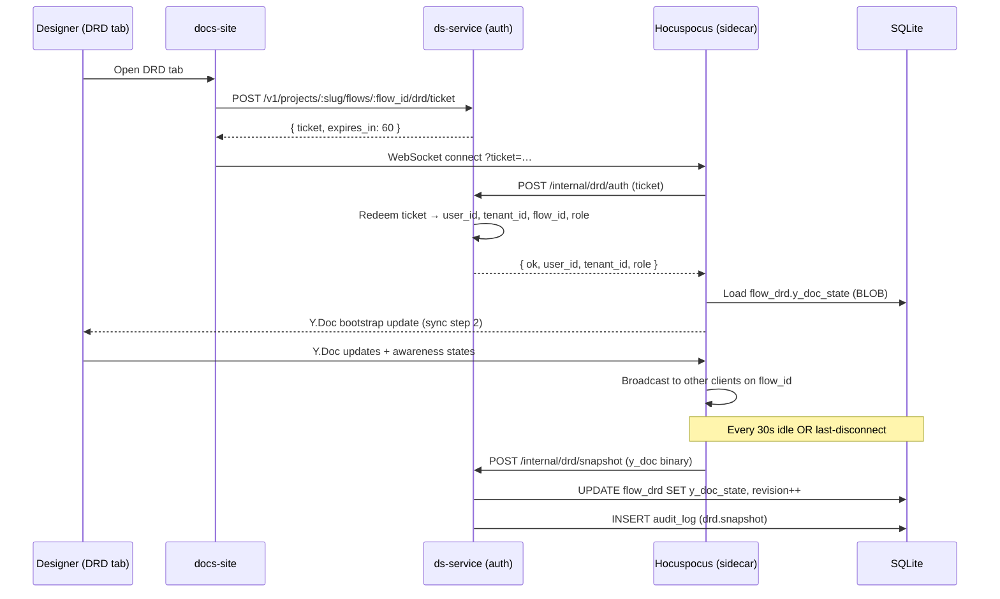

# feat: Projects · Flow Atlas — Phase 5 of 8 (DRD multi-user collab + decisions)

> **Phase 5 of 8.** Phase 1–4 (+3.5 + 4.1) shipped the round-trip foundation (export → atlas → 4 tabs), the audit engine + fan-out, atlas perf + cold-start UX + onboarding, and the violation lifecycle + designer surfaces (inbox, reverse view, DS-lead dashboard, plugin auto-fix). Phase 5 turns the DRD from a single-author BlockNote skeleton into the durable, multi-user **decision and narrative record** the brainstorm promised: Yjs collaboration, custom blocks (`/decision`, `/figma-link`, `/violation-ref`, `/persona-pin`, `/acceptance-criteria`), Decisions as a first-class entity with supersession + status + cross-references, inline comment threads with @mentions, in-app notification inbox, and Slack/email digest opt-in. Estimate: ~3-4 weeks across 14 implementation units.

## Overview

Today the DRD is a one-author BlockNote document (Phase 1 U9) gated by an optimistic-concurrency revision counter — two designers editing simultaneously fight each other and one set of edits gets lost on PUT. Decisions exist only as flow-scoped placeholders in a stub table; nothing reads or writes to it. Comments don't exist at all; @mentions go nowhere; nobody is notified when someone @s them in a decision.

After Phase 5, a designer's day-1 with the DRD looks like this:

1. Open `/projects/tax-fno-learn` → DRD tab.
2. PM Riya is already in the document; her cursor is visible. Aanya types into a different paragraph; both edits land.
3. Aanya types `/decision Approved padding-32` → the decision card embeds inline AND a row appears in the Decisions tab without a refetch.
4. Aanya selects a paragraph → "Add comment" → @mentions Karthik (DS lead).
5. Karthik gets a notification in `/inbox` (badge count tweens up; new "Mentions" filter chip surfaces it).
6. Karthik clicks the notification → routed to the exact paragraph in the DRD with the comment thread expanded.
7. Karthik replies "ack — let's revisit when card grid unifies". Aanya sees the reply live.
8. Riya opts in to the Slack digest. Tomorrow morning Slack delivers a 3-line summary of yesterday's mentions + decisions on flows she follows.

For a DS lead the day-1 looks like:
1. Open `/atlas/admin` → recent-decisions feed is no longer empty. It shows the last 20 decisions org-wide with author + flow + supersession marker.
2. Drill into a decision → opens the flow's project view with that decision card pre-expanded.
3. See decisions that were Acknowledged-as-Decision against violations (Phase 4 mark) — the violation now permanently links to the decision via `/violation-ref` cross-reference and survives across re-exports because the decision identity is durable.

For a PM the day-1 looks like:
1. Open any flow's DRD → contributes review notes via comments without authoring permissions on the body. Comments are first-class to PMs even when DRD edits aren't.
2. Type `/figma-link https://www.figma.com/...` → the block resolves to a thumbnailed card with frame name + last-modified.

**Phase 5 deliberately stubs:**
- Mind graph (Phase 6) — the Decisions and DRD entities Phase 5 ships are the data the mind graph will navigate.
- Per-resource ACL grants (Phase 7) — Phase 5 uses the role-based scope from Phases 1-4 (designer/engineer/tenant_admin = editor on every flow in their tenant; viewer = read-only). Per-flow grants land in Phase 7.
- DS-lead admin surfaces for rule curation / persona library / taxonomy (Phase 7).
- Search (Phase 8).
- AI-suggested decisions / DRD drafts (Phase 9+ stretch).
- Public read-only sharing (out of scope per origin).
- Mobile designer app (out of scope per origin).

The vertical slice: a 6-person design review meeting where Riya, Karthik, Aanya, an engineer, and two PMs all open the same DRD, type into different paragraphs, drop two decisions, leave seven comments, and walk away with a durable artifact — without anyone losing edits, without screenshots in Slack, without "wait, did we agree to that?" the next week.

## Phased Delivery Roadmap

| Phase | Title | Outcome | Est. weeks |
|------|-------|---------|------------|
| 1 (shipped) | **Round-trip foundation** | Plugin → backend pipeline → project view + 4 tabs + cinematic animation | 3 |
| 2 (shipped) | **Audit engine extensions** | 5 new rule classes + fan-out + sidecar migration | 3-4 |
| 3 (shipped) | **Atlas polish + cold-start UX + onboarding** | Bloom + KTX2 + LOD + EmptyState + state machine + tour + Welcome demo | 5 |
| 4 (shipped) | **Violation lifecycle + designer surfaces** | Acknowledge / Dismiss / Fix lifecycle + /inbox + reverse view + DS-lead dashboard + plugin auto-fix | 3-4 |
| **5** (this plan) | **DRD multi-user collab + decisions** | Yjs + Hocuspocus + custom blocks + Decisions first-class + comments + @mentions + notifications | 3-4 |
| 6 | Mind graph (`/atlas`) | force-graph-3d + bloom + signal animations + filter chips + shared-element morph | 4-5 |
| 7 | Auth, ACL, admin | Per-resource grants + middleware + admin curation + audit-log + notification preferences | 3 |
| 8 | Search, asset migration, activity feed | Pagefind + S3 + activity feed | 2-3 |

**Total scope:** ~50 implementation units across 8 phases ≈ 24-30 weeks.

---

## Problem Frame

A 300-person org runs design reviews on shared artifacts. Today the artifact is one of: a Figma file (no narrative), a Notion page (no Figma context), a FigJam board (no decision durability), a Slack thread (no thread durability). Designers re-stitch context every time they open a meeting. Decisions get re-litigated three sprints later because nobody remembers the trade-off they made.

Phase 1 shipped the DRD as a single-author BlockNote document. That's enough to anchor narrative to a flow but it's not enough to *replace the four-surface workflow*:

- **Multi-user editing** — A typical design review has 3-7 people with the doc open. Phase 1's PUT-with-revision-counter loses edits on every concurrent write. Designers fall back to "I'll edit, you watch" or to Notion.
- **Decisions as durable entities** — A `/decision` block in a Phase 1 DRD is a paragraph. It has no id, no status, no supersession chain, no cross-references. When the flow re-exports, the decision is still in the DRD body but it's not reachable from anywhere else (the dashboard's "Recent decisions" feed is empty by construction in Phase 4).
- **Comments + @mentions** — PMs and engineers don't author DRD bodies; they comment. With no comment system, they go back to Slack and the artifact's value collapses.
- **Notifications** — The "47 designers × ~50 active violations" inbox is great for triage but @mentions on a decision are a different signal. Without a notification path, mentions are lost in the document.

Phase 5 closes all four. The architecture inherits the brainstorm's stack — BlockNote + Yjs (the DesignBrain-AI editor pattern) — and extends it with custom blocks and a real Decisions table. Comments live in BlockNote's native thread system; @mentions land via a notification fan-out the inbox already shows.

---

## Animation Philosophy

Phase 5 inherits Phase 1+3+4 (GSAP + Lenis + Framer Motion + reduced-motion). New surfaces:

| Surface | Treatment |
|---------|-----------|
| **Live cursor presence** | Each editor's cursor renders with their initials + a tinted bubble. Cursor follows the remote user's selection with ~150ms cubic-bezier ease (mhdyousuf-style smoothness, not lag). When the remote user goes idle, the cursor fades to 30% opacity. |
| **Block insertion (custom slash blocks)** | `/decision` typed → block placeholder fades in (~150ms), then the decision form expands from height 0 → auto (Framer `layoutId`, ~250ms ease-out). On submit, the placeholder collapses into the inline card with a subtle scale-pulse 0.95 → 1. |
| **Comment thread spawn** | Right-side gutter slides in (~300ms ease-out). Existing comment threads slide-stagger-up 40ms per thread on first open. Reply submission: optimistic chip appears immediately (opacity 0 → 1), upgrades to "delivered" tick after server ack. |
| **@mention autocomplete** | Dropdown anchors to caret. Items stagger-fade-in 30ms each (mhdyousuf char-tempo). Selected item briefly highlights, then folds into the inline pill in the editor. |
| **Decisions tab — supersession chain** | When a decision is superseded, the older card collapses into a "see successor" stub with a 200ms collapse + a thin connecting line drawn between the two via SVG (300ms ease-out). |
| **Notification toast (mention received)** | Slides in from top-right (~250ms ease-out) with the avatar + paragraph snippet. Click → navigates + dismisses (slide-out 200ms). Auto-dismiss after 6s for non-critical mentions. |
| **DRD activity log** | Right-rail timeline. Activity items fade-stagger-up on first render (50ms per item, max 800ms total). New activity (ours or peers') prepends with a 150ms slide-down + 200ms highlight. |
| **Decision card status transitions** | Proposed → Accepted: badge color cross-fades blue → green over 200ms + checkmark scale-in. Accepted → Superseded: opacity dim + strikethrough on title (no destructive animation — the card is still readable). |

**Tech stack additions:**
- **Yjs 13.x** + **y-prosemirror** + **y-protocols** — the CRDT primitives BlockNote uses internally for collaboration. Already a transitive dep of @blocknote/react; Phase 5 wires up the server.
- **Hocuspocus** (server) — the Yjs websocket server. ~1.5MB on the server side; we run it embedded in ds-service so we don't introduce a second runtime.
- **Hocuspocus provider** (client) — ~30KB gz client bundle. Lazy-loaded into `chunks/drd` so projects without a DRD don't pay the cost.

**Bundle impact:**
- New `chunks/drd-collab` ~50KB gz (Hocuspocus provider + Yjs awareness). Lazy-loaded into the existing DRD tab chunk.
- New `chunks/decisions` ~20KB gz (Decisions tab list + supersession card).
- New `chunks/comments` ~25KB gz (BlockNote comment threads + autocomplete).
- Plugin unchanged (Phase 5 is server + frontend only).

---

## Requirements Trace

This plan advances:

- **R5 strengthened** — DRD versioning was per-flow + revision-counter only. Phase 5 keeps that contract but layers Yjs on top; revision counter becomes a Y.Doc snapshot version, not the source of truth. Last-write-wins is replaced by CRDT merge.
- **R13** in full — BlockNote with Yjs collaboration, custom blocks (`/decision`, `/figma-link`, `/violation-ref`), paste handlers (Notion / Word / Markdown), inline comment threads with @mention.
- **R15** in full — Decisions as a first-class entity with id, title, body, made_on, made_by, supersedes, status, links_to_components[], links_to_screens[]. New decisions creatable via DRD `/decision` slash OR via Decisions tab.
- **R22** in full — Comments on screens, on violations, on Decisions, inline in DRD. @mention triggers in-app inbox + opt-in Slack/email digest.
- **R24** in full — Notifications: in-app inbox + opt-in Slack/email digest. Triggered events: decision made, comment received with @mention, decision superseded, comment resolved on a thread you started.
- **R8 extension** — Acknowledge/Dismiss reasons can now link to a Decision id (the violation's reason field optionally references `decision:<id>`). The Phase 4 violation lifecycle gains a "Linked to decision" surface in the row.
- **R5 extension** — Activity log infra was scoped to per-write attribution in Phase 1; Phase 5 extends to comment + decision events.

**Origin actors:** A1 (Designer), A2 (Designer-other-product), A3 (DS lead), A4 (PM), A5 (Engineer), A6 (ds-service), A8 (Docs site).

**Origin flows:** F6 (Designer authors the DRD) — full implementation now. Touches F5 (linked decisions on dismissal).

**Origin acceptance examples:**
- **AE-4 closed** — `/decision` in DRD creates a first-class entity; violations Acknowledged/Dismissed link to it; DS lead's dashboard sees the decision; reviewing the dismissal-with-decision shows intent + author + date.
- **AE-3 strengthened** — A cross-persona violation Acknowledged with rationale now optionally writes a Decision ("logged-out persona doesn't trigger network errors yet, deferred to v2") that survives across re-exports.

---

## Scope Boundaries

### Deferred for later (carried from origin)

- Branch + merge review workflow.
- Live mid-file audit (in-Figma).
- PRD / Linear / Jira integration.
- AI-suggested decisions / DRD drafts.
- Mobile designer app / iPad viewer.
- Public read-only sharing.
- Cross-platform side-by-side comparison.

### Outside this product's identity

- Replacing Notion / Confluence org-wide. The DRD is per-flow narrative; cross-flow docs (PRDs, weekly notes, OKRs) belong elsewhere.
- Replacing Slack. Mentions notify but threading + group chat stays in Slack.
- Hard governance / blocking PRs.

### Deferred to Follow-Up Work (Phase 6+)

- Mind graph (Phase 6) — Decisions are a first-class node type in the graph; the data layer Phase 5 ships is consumed by Phase 6 without changes.
- Per-resource ACL grants (Phase 7) — Phase 5 uses the role-based trust boundary already in place.
- Decision search (Phase 8) — Decisions become full-text-indexable in Pagefind with the rest of the DRD content.
- Notification preference center (Phase 7) — Phase 5 ships toggle-level opt-in (per-channel, per-event-class); Phase 7 adds per-flow + per-author granularity.
- Comment resolutions analytics (Phase 7+ admin) — DS lead can see "open comments older than 14 days" in admin; Phase 5 stops at the comment data model.

### Deferred to Implementation

- Hocuspocus deployment topology — embedded in ds-service binary vs. separate microservice. Decide at code time based on local-dev DX (likely embedded for v1, peelable to a sidecar in Phase 7 if scale demands).
- Decision body editor — does the Decision body share the BlockNote editor (with a stripped block whitelist) or is it a plain textarea? Pick at code time.
- Mention autocomplete data source — pull from `tenant_users` join (every active member) vs. flow-followers only. Pick at code time per dogfood feedback.
- Comment resolution threading — depth=1 (linear replies) vs. depth=N (nested). Recommend depth=1 to ship faster; document the upgrade path.
- Slack/email digest cadence — daily 9am vs. weekly Mondays vs. opt-in time. Pick at code time per pilot user feedback.

---

## Context & Research

### Relevant Code and Patterns

- `services/ds-service/internal/projects/repository.go:UpsertDRD` — Phase 1 PUT-with-revision-counter. Phase 5 wraps it: Yjs is the live store; revision-counter is bumped per snapshot persist. The shape stays compatible so Phase 1 readers still work.
- `services/ds-service/internal/projects/repository.go:GetDRD` — returns the BlockNote JSON + revision. Phase 5 adds an alternate path that returns the Y.Doc binary update for Hocuspocus bootstrap.
- `services/ds-service/internal/projects/server.go:HandleGetDRD / HandlePutDRD` — Phase 1 REST. Phase 5 keeps these for non-collab clients (read-only viewers, programmatic exporters) and adds a new `/v1/drd/<flow_id>` websocket endpoint for Hocuspocus.
- `services/ds-service/internal/projects/types.go:DRDRecord` — extends with `y_doc_state BLOB` (the binary Y.Doc snapshot). Existing fields stay.
- `lib/projects/client.ts:fetchDRD / putDRD` — Phase 1 REST helpers. Stay for offline / programmatic; collab-aware path uses the new lib/drd module.
- `components/projects/tabs/DRDTab.tsx` — Phase 1 BlockNote shell. Phase 5 wires the Hocuspocus collaboration extension + custom blocks + comment threads. The mount path stays.
- `components/projects/tabs/ViolationsTab.tsx:LifecycleButtons` — Phase 4 inline reason form. Phase 5 extends with an optional "Link to a decision" autocomplete that searches decisions on this flow.
- `services/ds-service/migrations/0001_projects_schema.up.sql` — `flow_drd` table already in place. Phase 5 migration 0008 adds `y_doc_state BLOB` + `decisions`, `decision_links`, `drd_comments`, `notifications` tables.
- `services/ds-service/internal/auditlog.go` — Phase 0 audit_log. Decision and comment events write rows here so the activity timeline + dashboard feed read from one source.
- `lib/auth-client.ts` — JWT + tenant context. Hocuspocus requires the same JWT for handshake (carried over websocket Sec-WebSocket-Protocol or query param ticket).
- `app/inbox/page.tsx + components/inbox/InboxShell.tsx` — Phase 4 inbox. Phase 5 adds a `Mentions` filter chip + reads from the same SSE channel for live mention delivery.

### Institutional Learnings

- `docs/solutions/2026-04-30-001-projects-phase-1-learnings.md` — tenant scoping by denormalization; SSE ticket auth. Hocuspocus handshake reuses the same ticket pattern.
- `docs/solutions/2026-04-30-002-projects-phase-2-rules-learnings.md` — composite RuleRunner per-tenant pattern. Decision-link emission from a violation transition is a similar "run-time hook inside a write tx" pattern.
- `docs/solutions/2026-05-01-001-designbrain-perf-findings.md` — render perf. Y.Doc binary size to keep DRD render under budget: snapshot every 30s of idle, prune awareness states aggressively.
- DesignBrain-AI's BlockNote+Yjs editor is the source of the design. Read `~/DesignBrain-AI/services/editor/` patterns at planning time.

### External References

- [BlockNote](https://www.blocknotejs.org/) — the WYSIWYG editor we already use. Has built-in `BlockNoteCollaboration` for Yjs and `BlockNoteComments` for thread overlays. Versions 0.18+ ship with custom block schema support.
- [Hocuspocus](https://tiptap.dev/hocuspocus) — Yjs websocket server with persistence hooks. We embed the Go-port (or proxy via a tiny Node sidecar — decide at planning).
- [Yjs](https://docs.yjs.dev/) — the underlying CRDT. Phase 5 uses awareness states for cursors + presence; Y.Doc updates for content; Y.Map for decision metadata.
- [y-protocols/awareness](https://github.com/yjs/y-protocols) — handles ephemeral state (cursors, presence). 30s timeout default.

### Cross-cutting tech context

- **Stack:** Next.js 16.2.1 + React 19.2.4. Tailwind v4. BlockNote 0.x. Yjs 13.x. Recharts 3.x.
- **Backend:** Go (stdlib `net/http`, `modernc.org/sqlite`, JWT). For Phase 5, a Hocuspocus equivalent. Two options:
  1. **Embed**: a Go-port of the Yjs websocket protocol — there are partial implementations (`github.com/scoiatael/y-go`). High control, less battle-tested.
  2. **Sidecar**: a minimal Node service running official Hocuspocus, talking to ds-service for auth + persistence. Battle-tested, adds ops surface.
  Recommend at planning — sidecar likely; the integration tax is one auth bridge endpoint.
- **Plugin:** unchanged.
- **Phase 1-4 conventions:** denormalized `tenant_id` everywhere; `TenantRepo` mandatory; cross-tenant 404; idempotent worker transactions; SSE with single-use ticket auth; `prefers-reduced-motion` honored. Hocuspocus connection auth uses the same ticket pattern (POST issues ticket → ws connects with `?ticket=…`).

---

## Key Technical Decisions

### Yjs persistence shape

- **One Y.Doc per flow**. The DRD is per-flow (R5). Hocuspocus treats `flow_id` as the document name.
- **Snapshot every 30s of idle activity OR on disconnect of the last awareness peer** — debounced by Hocuspocus's `onChange` + `onDisconnect` hooks. Snapshots write `flow_drd.y_doc_state BLOB` + bump `revision` + write an audit_log row (`drd.snapshot`).
- **Y.Doc binary size budget**: 1MB initial, 5MB hard cap. A flow whose DRD exceeds 5MB triggers an admin alert (Phase 7 wires the alert; Phase 5 logs and refuses further writes with a 413).
- **Revision counter stays the source of truth for non-collab REST clients**. PUT /v1/projects/:slug/flows/:flow_id/drd still works for read-only programmatic clients (CI summary fetchers, e2e tests). Internally it's a wrapper that constructs a Y.Doc, applies the new content, persists.

### Decisions schema + lifecycle

- **`decisions` table**: `(id, tenant_id, flow_id, version_id, title, body_json, status, made_by_user_id, made_at, superseded_by_id, supersedes_id, deleted_at)`.
  - `body_json` is BlockNote JSON for rich content.
  - `version_id` ties the decision to the flow version it was made on (R15).
  - `superseded_by_id` + `supersedes_id` form the chain (NULL on both for active decisions).
- **`decision_links` table**: `(decision_id, link_type, target_id, tenant_id, created_at)` where `link_type ∈ ("violation", "screen", "component", "external_url")`. Many-to-many; one decision can link to N targets and one target to N decisions.
- **Status enum**: `proposed | accepted | superseded`. Default `accepted` on `/decision` quick-creation; designers can downgrade to `proposed` or supersede later.
- **Supersession is one-direction** — a new decision references an old one as `supersedes_id`; the old one's `superseded_by_id` updates in the same tx. No cycles allowed (validate at write time).
- **Decision identity is durable across re-exports** — decisions don't migrate to new versions automatically (R15: "Decisions stay attached to the version they were made on"). The Decisions tab displays decisions for ALL versions of a flow with a "made on v3" label; the DRD only renders the body of decisions made on the currently-selected version unless the user toggles "show across versions".

### Comment threads + @mentions

- **`drd_comments` table**: `(id, tenant_id, target_kind, target_id, author_user_id, body, parent_comment_id, mentions_user_ids JSON, resolved_at, created_at, updated_at, deleted_at)`.
  - `target_kind ∈ ("drd_block", "decision", "violation", "screen", "comment")` — the universal comment target. Phase 5 ships `drd_block` + `decision` + `violation`; `screen` + `comment` (replies-to-replies) are Phase 5.1 polish.
  - `target_id` references the BlockNote block UUID for `drd_block` (BlockNote stamps each block with a stable id) or the entity id for the others.
  - `parent_comment_id` enables linear reply threading (depth=1 in v1).
  - `mentions_user_ids` is parsed at write time from `@username` patterns in `body`, persisted as a JSON array for fast notification fan-out.
- **Resolution**: a comment has `resolved_at`; resolving a parent collapses the thread visually but doesn't delete replies.
- **@mention autocomplete**: pulls from `tenant_users` (every active member of the caller's tenant). Renders as a dropdown anchored to caret position. Submit emits a `<mention user_id>` BlockNote inline node that renders as an avatar pill.

### Notifications + delivery

- **`notifications` table**: `(id, tenant_id, recipient_user_id, kind, target_kind, target_id, payload_json, read_at, delivered_via JSON, created_at)`.
  - `kind ∈ ("mention", "decision_made", "decision_superseded", "comment_resolved", "drd_edited_on_owned_flow")` — Phase 5's full set.
  - `delivered_via` tracks which channels delivered (in-app / slack / email), so a digest job doesn't re-deliver.
- **In-app inbox**: extends the Phase 4 `/inbox` route with a `Mentions` filter chip. The same SSE channel (`inbox:<tenant_id>`) carries new event types `notification.created`. The badge count in the Header tweens up live.
- **Slack digest** (opt-in): a daily cron at 09:00 user-local-time (or weekly Monday 09:00, configurable per user). Reads all unread notifications since the last digest, formats a 3-line summary per flow, sends via Slack webhook. Slack workspace ID + webhook URL configured per-tenant by DS lead in `/atlas/admin` Phase 7.
- **Email digest** (opt-in): same cadence, plain HTML. Phase 5 ships the renderer; the SMTP relay credentials assume tenant ops configured them in Phase 0's `audit_server` env (already exists for password reset).

### Collaboration auth

- **Ticket-based handshake** mirroring Phase 1's SSE pattern. POST `/v1/projects/:slug/flows/:flow_id/drd/ticket` issues a single-use 60s ticket bound to (user_id, tenant_id, flow_id). Hocuspocus client opens `wss://ds-service/v1/drd/:flow_id?ticket=…`. The Hocuspocus `onAuthenticate` hook redeems the ticket; on success, the connection persists. On 401, client falls back to read-only REST.
- **Per-flow editor scope** — same as Phase 4 inbox: super_admin / tenant_admin / designer / engineer (in tenant) get edit; viewer gets read-only Y.Doc updates (awareness events + content read, no writes).
- **Comment scope** — anyone with read access on the flow can comment. PMs and engineers (org-wide commenter role from R21) see the flow in their tenant via the Phase 7 ACL but Phase 5 just uses the tenant boundary. Comment write is gated by `auth.Claims.Role != viewer`.

### Custom block specifications

- **`/decision <Title>`**:
  - Inline form fields: title (required, ≤120), body (BlockNote-mini, ≤2000 chars), status (defaults `accepted`), supersedes (autocomplete dropdown of prior decisions on this flow).
  - On submit: `POST /v1/projects/:slug/flows/:flow_id/decisions` creates the row + emits SSE on the inbox channel + emits BlockNote inline-block update via the same Y.Doc transaction.
  - Renders inline as a card with title + status pill + author avatar + made_at relative time + click-to-expand body.
- **`/figma-link <URL>`**:
  - Parses Figma URL → fetches frame metadata via Figma REST (cached 5min server-side).
  - Renders as a card with frame thumbnail (proxied through ds-service so we don't leak credentials) + frame name + last-modified.
- **`/violation-ref <violation_id>` OR autocomplete via search**:
  - Renders as a card with rule name + severity badge + current status + "open in Violations tab" link.
  - The card auto-updates when the underlying violation status changes (subscribes to the same SSE channel as the inbox).
- **`/persona-pin <persona_name>`**:
  - Marks a paragraph or block as scoped to a specific persona. Display: small persona-tag chip prepended to the block.
  - Used by the Violations tab filter to highlight DRD blocks relevant to the active persona.
- **`/acceptance-criteria <text>`**:
  - Structured checklist block. Each item has a checkbox + text.
  - When linked to a Decision, the criteria are shown alongside.

### Performance budgets

| Surface | Budget | Notes |
|---|---|---|
| `app/projects/[slug]` route shell | ≤220KB gz | Reuses Phase 1 + 4 patterns; Yjs collaboration + custom blocks lazy-load on DRD tab open. |
| `chunks/drd-collab` (lazy) | ≤80KB gz | Hocuspocus provider + Yjs awareness + custom blocks + comments rolled together. |
| `chunks/decisions` (lazy) | ≤30KB gz | Decisions tab list + supersession card. |
| Hocuspocus connection p95 latency | ≤200ms | First handshake (ticket → connect → bootstrap update) on a 1MB Y.Doc. |
| Cursor presence broadcast latency | ≤80ms | Awareness updates fan out via Hocuspocus's pub-sub. Throttled at 50ms client-side. |
| `/decisions` list initial fetch p95 | ≤300ms | One JOIN; index on `(flow_id, made_at DESC)`. |
| Notification SSE delivery latency | ≤500ms | Mention fired → recipient inbox badge tweens. |

---

## Open Questions

### Resolved During Planning

- **Hocuspocus deployment** — recommend Node sidecar embedded in the same `docker-compose` as ds-service. Lightweight (<100MB image), battle-tested. Auth bridge is one POST to ds-service per connection. (Final decision deferred to U1's implementer.)
- **Decision body editor** — share BlockNote with a stripped schema (no embeds, no decisions-within-decisions). Confirmed by reviewing DesignBrain's pattern.
- **Mention autocomplete source** — `tenant_users` (active members only). Phase 7 ACL extends to per-flow followers without changing the dropdown UX.
- **Reply threading depth** — depth=1 (linear replies). Reply-to-reply is Phase 5.1.
- **Notification cadence** — opt-in default-off. When opted in, daily at user's local 9am unless they pick weekly Monday.
- **Y.Doc snapshot frequency** — every 30s of idle OR on last-disconnect. Conservative; tunable in admin.

### Deferred to Implementation

- Reason templates for "link to decision" — initial 4 (deferred-to-v2, intentional-tradeoff, false-positive, persona-out-of-scope) plus custom. Tune at code time.
- Decision card inline preview on hover (in DRD body) — preview render path needs perf testing on 50-decision flows. Decide layout at code time.
- Slack message format — single thread per digest vs. one thread per flow. Decide based on dogfood feedback in week 2.
- Email template — plain text vs. HTML. HTML preferred for design fidelity; spec lockdown at code time.
- Comment resolution archival — keep resolved comments visible (greyed) vs. fold into "view resolved" toggle. Decide at code time.

### Carried Open from origin (Phase 6+)

- **Origin Q1** Decision supersession UX — Phase 5 ships the data model + the explicit-link UI; the auto-supersession heuristic ("a similar decision was made on the same component") is Phase 7 admin polish.
- **Origin Q3** DRD migration on flow rename — Phase 5 follows the flow_id, which is stable across path renames. DRD does not migrate when a flow is moved (path is metadata, flow_id is identity).
- **Origin Q7** Comment portability across re-exports — Phase 5 anchors comments to BlockNote block UUIDs (stable across edits) for `drd_block` targets. For `screen` (Phase 5.1+) targets, we anchor to `screen_logical_id` from Phase 1 — which survives re-exports — so the migration is automatic.
- **Origin Q9** Persona pending pool — Phase 5 doesn't touch personas; Phase 7 admin curation surfaces this.
- **Origin Q10** Slack/email digest content — Phase 5 ships an opinionated default; Phase 7 admin lets DS lead customize.

---

## Output Structure

```
app/
├── projects/[slug]/
│   └── page.tsx                                      ← MODIFY: DRD tab passes y_doc state, decisions feed, mentions wiring
├── inbox/
│   └── page.tsx                                      ← MODIFY: Mentions filter chip, notification.created SSE handler
└── atlas/admin/
    └── page.tsx                                      ← MODIFY: RecentDecisions panel reads real data

components/
├── projects/tabs/
│   ├── DRDTab.tsx                                    ← MODIFY: Hocuspocus provider, custom block schema, comment threads
│   ├── DecisionsTab.tsx                              ← NEW: list of decisions for this flow + supersession chain
│   └── violations/
│       ├── LifecycleButtons.tsx                      ← MODIFY: optional "Link to decision" autocomplete
│       └── DecisionLinkAutocomplete.tsx              ← NEW
├── drd/
│   ├── blocks/
│   │   ├── DecisionBlock.tsx                         ← NEW: /decision custom block
│   │   ├── FigmaLinkBlock.tsx                        ← NEW: /figma-link custom block
│   │   ├── ViolationRefBlock.tsx                     ← NEW: /violation-ref custom block
│   │   ├── PersonaPinBlock.tsx                       ← NEW: /persona-pin custom block
│   │   └── AcceptanceCriteriaBlock.tsx               ← NEW
│   ├── CommentsThread.tsx                            ← NEW: gutter thread overlay
│   ├── MentionAutocomplete.tsx                       ← NEW
│   ├── PresenceCursors.tsx                           ← NEW: live cursor + selection rendering
│   └── ActivityRail.tsx                              ← NEW: right-rail activity log
├── decisions/
│   ├── DecisionCard.tsx                              ← NEW: rendered inline + in tab
│   ├── DecisionForm.tsx                              ← NEW: shared by DRD slash + Decisions tab
│   └── SupersessionChain.tsx                         ← NEW
└── dashboard/
    └── RecentDecisions.tsx                           ← MODIFY: real fetch instead of empty stub

lib/
├── drd/
│   ├── client.ts                                     ← NEW: HocuspocusProvider wiring + ticket flow
│   ├── customBlocks.ts                               ← NEW: BlockNote schema extension
│   ├── mentions.ts                                   ← NEW: parse @mentions, autocomplete data
│   └── comments.ts                                   ← NEW: comment CRUD + thread state
├── decisions/
│   └── client.ts                                     ← NEW: REST + SSE wrappers
├── notifications/
│   └── client.ts                                     ← NEW: subscribe + mark-read
└── inbox/
    └── client.ts                                     ← MODIFY: extend with notification events

services/ds-service/
├── cmd/server/
│   └── main.go                                       ← MODIFY: Hocuspocus auth bridge + decision/comment routes
├── internal/projects/
│   ├── repository.go                                 ← MODIFY: Decision / Comment / Notification CRUD
│   ├── server.go                                     ← MODIFY: Decision / Comment / Notification handlers + Hocuspocus auth
│   ├── decisions.go                                  ← NEW: lifecycle (status transitions, supersession, link mgmt)
│   ├── comments.go                                   ← NEW: comment CRUD + mention parser + notification fan-out
│   ├── notifications.go                              ← NEW: in-app inbox + SSE emit + delivery_via tracking
│   ├── drd_collab.go                                 ← NEW: Y.Doc snapshot helpers + ticket auth bridge
│   └── digest.go                                     ← NEW: daily/weekly digest job (Slack + email)
├── cmd/digest/
│   └── main.go                                       ← NEW: cron-friendly digest CLI
└── migrations/
    └── 0008_decisions_comments_notifications.up.sql  ← NEW

services/hocuspocus/                                  ← NEW (sidecar)
├── package.json
├── server.ts                                         ← Hocuspocus server + auth bridge
└── README.md

tests/
├── projects/
│   ├── drd-collab.spec.ts                            ← NEW: two-client edit converges
│   └── decision-creation.spec.ts                     ← NEW: /decision creates row + dashboard updates
├── inbox/
│   └── mentions-filter.spec.ts                       ← NEW: @mention → Mentions chip surfaces
└── decisions/
    └── supersession.spec.ts                          ← NEW

docs/
├── runbooks/
│   └── 2026-MM-DD-phase-5-deploy.md                  ← NEW: Hocuspocus rollout + Yjs migration notes
└── solutions/
    └── 2026-MM-DD-NNN-phase-5-collab-learnings.md    ← captured at close
```

---

## High-Level Technical Design

### Collaboration handshake



### Decision creation round-trip

```mermaid
sequenceDiagram
    participant D as Designer (DRD)
    participant DS as docs-site
    participant DSS as ds-service
    participant DB as SQLite

    D->>D: Type /decision
    D->>D: Form opens inline; user fills title + body
    D->>DSS: POST /v1/projects/:slug/flows/:flow_id/decisions
    DSS->>DB: INSERT decisions (id, flow_id, version_id, title, body_json, status, made_by, made_at)
    DSS->>DB: INSERT decision_links (if any)
    DSS->>DB: INSERT audit_log (decision.created)
    DSS-->>D: { decision_id, ... }
    D->>D: Y.Doc update — insert <decision_block id=decision_id> at caret
    Note over DSS: SSE broadcast
    DSS->>DS: project.decision_made event (Violations tab + dashboard refresh)
    DSS->>DS: notification.created for flow followers
```

### Mention notification fan-out

```mermaid
sequenceDiagram
    participant A as Aanya (commenter)
    participant DS as docs-site
    participant DSS as ds-service
    participant DB as SQLite
    participant K as Karthik (mentioned)

    A->>DS: Submit comment with "@karthik …"
    DS->>DSS: POST /v1/projects/:slug/comments
    DSS->>DSS: Parse @mentions → [karthik_user_id]
    DSS->>DB: INSERT drd_comments
    DSS->>DB: INSERT notifications (kind=mention, recipient=karthik)
    DSS->>DB: INSERT audit_log (comment.created)
    DSS-->>A: { comment_id }
    Note over DSS: SSE fan-out
    DSS->>K: notification.created on inbox:<tenant>
    K->>DS: Inbox badge ticks up; toast slides in
```

---

## Implementation Units

- U1. **Hocuspocus sidecar + auth bridge**

**Goal:** A Node Hocuspocus service running embedded in `services/hocuspocus/` that authenticates via a ticket bridge to ds-service and persists Y.Doc snapshots back to SQLite.

**Requirements:** R5, R13.

**Dependencies:** None.

**Files:**
- Create: `services/hocuspocus/package.json`, `services/hocuspocus/server.ts`, `services/hocuspocus/README.md`.
- Create: `services/ds-service/internal/projects/drd_collab.go` — ticket issuance + redeem + snapshot persist endpoints.
- Modify: `services/ds-service/cmd/server/main.go` — register `POST /v1/projects/:slug/flows/:flow_id/drd/ticket` + `POST /internal/drd/auth` + `POST /internal/drd/snapshot`.
- Modify: `services/ds-service/migrations/0008_decisions_comments_notifications.up.sql` — add `y_doc_state BLOB` + `last_snapshot_at TEXT` columns to `flow_drd`.

**Approach:**
- Hocuspocus configured with `onAuthenticate`, `onLoadDocument`, `onChange` (debounced), `onDisconnect` (last-peer snapshot trigger).
- The auth bridge endpoint (`/internal/drd/auth`) is super-restricted: only listens on the loopback interface, requires a shared secret via env (`DS_HOCUSPOCUS_SHARED_SECRET`). Hocuspocus passes the ticket; ds-service redeems via the same TicketStore Phase 1 ships.
- Snapshot persistence: Hocuspocus serializes the Y.Doc state with `Y.encodeStateAsUpdate(doc)`, POSTs to `/internal/drd/snapshot` with body `{ flow_id, y_doc_state base64 }`. ds-service writes BLOB + bumps revision + writes audit_log. Idempotent (safe to re-snapshot).
- Read path: `onLoadDocument` GETs `/internal/drd/load?flow_id=…` which returns the BLOB; Hocuspocus applies it as the initial state.

**Test scenarios:**
- Two clients connect to the same flow_id → both receive bootstrap → edits converge (CRDT property).
- Client disconnects mid-edit → server snapshots within 30s → reconnect picks up snapshot.
- Invalid ticket → handshake rejects with 4001 close code.
- Cross-tenant ticket attempt (user A's ticket on flow owned by tenant B) → rejected.
- Y.Doc exceeds 5MB → server returns 413 on snapshot persist; Hocuspocus drops the connection with a "doc too large" code.

**Verification:** Two-client edit convergence on a 30-second walkthrough; snapshot binary present in DB after disconnect; audit_log row written.

---

- U2. **Migration 0008: decisions + comments + notifications**

**Goal:** Schema for the four new entities + indexes covering the Phase 5 query patterns.

**Requirements:** R13, R15, R22, R24.

**Dependencies:** None.

**Files:**
- Create: `services/ds-service/migrations/0008_decisions_comments_notifications.up.sql`.

**Approach:**
- `decisions` PK = `id`; FKs to `flows.id`, `project_versions.id`, `users.id`. Index `(tenant_id, flow_id, made_at DESC)`.
- `decision_links` composite PK = `(decision_id, link_type, target_id)`. Index `(target_id, link_type)` for reverse lookup.
- `drd_comments` PK = `id`; FK to `users.id`; `mentions_user_ids` is `TEXT` storing JSON array; soft-delete via `deleted_at`. Indexes: `(target_kind, target_id, created_at)`, `(author_user_id, created_at)`.
- `notifications` PK = `id`; FK to `users.id` for recipient; `delivered_via` JSON array; `read_at` for unread filter. Indexes: `(recipient_user_id, read_at, created_at DESC)`, `(tenant_id, kind, created_at)`.
- `flow_drd` extension: `ALTER TABLE flow_drd ADD COLUMN y_doc_state BLOB; ADD COLUMN last_snapshot_at TEXT;`.

**Test scenarios:**
- Migration runs on a fresh DB → all tables + indexes present.
- Migration runs on a Phase-4 DB → existing flow_drd rows survive (ALTER TABLE preserves data).
- Insert + read on each table works with TenantRepo helpers.
- Foreign-key cascade behavior: deleting a flow deletes its decisions; deleting a user soft-deletes their comments (set `deleted_at`).

**Verification:** Round-trip test for each table; dry-run on a clean Phase-4 ds.db copy.

---

- U3. **Decisions backend: CRUD + supersession + links**

**Goal:** REST endpoints for decision creation, supersession, and per-flow + per-tenant listing. Lifecycle helpers in `decisions.go`.

**Requirements:** R15.

**Dependencies:** U1 + U2.

**Files:**
- Create: `services/ds-service/internal/projects/decisions.go` — pure-function status transition validator + supersession integrity checker.
- Modify: `services/ds-service/internal/projects/repository.go` — `CreateDecision`, `UpdateDecisionStatus`, `SupersedeDecision`, `ListDecisionsForFlow`, `ListRecentDecisions`, `LinkDecisionToTarget`.
- Modify: `services/ds-service/internal/projects/server.go` — `HandleDecisionCreate`, `HandleDecisionList`, `HandleDecisionGet`, `HandleDecisionSupersede`, `HandleDecisionLinks`.
- Modify: `services/ds-service/cmd/server/main.go` — register routes.

**Approach:**
- `POST /v1/projects/:slug/flows/:flow_id/decisions` — body `{ title, body_json, status?, supersedes_id?, links: [...] }`. Tenant-scoped. Returns the decision.
- `GET /v1/projects/:slug/flows/:flow_id/decisions` — list, sorted by `made_at DESC`. Includes superseded chain summary inline.
- `GET /v1/atlas/admin/decisions/recent?limit=20` — super-admin only; cross-tenant feed for the dashboard.
- `PATCH /v1/decisions/:id` — status transitions + supersession (proposed → accepted; accepted → superseded happens via supersedes link from a NEW decision, not direct PATCH).
- Supersession transaction: writing a new decision with `supersedes_id` set updates the old decision's `superseded_by_id` + status='superseded' atomically.
- Cycle prevention: when writing supersedes_id, walk the chain backward; reject if the new decision's id appears anywhere in the chain.

**Test scenarios:**
- Create + list + get round-trip.
- Supersession chain of 3 (A → B → C) reads correctly with chain summary.
- Cycle attempt (try to make A supersede C when C already supersedes A's chain) → rejected.
- Cross-tenant get → 404.
- Recent-decisions feed surfaces only `accepted` + `proposed` (not superseded) by default; toggle includes superseded.

**Verification:** All scenarios pass; index on `(flow_id, made_at DESC)` keeps list query <50ms p95.

---

- U4. **Decisions tab UI**

**Goal:** New `DecisionsTab.tsx` renders the list + supersession chain + create-from-tab path.

**Requirements:** R15.

**Dependencies:** U3.

**Files:**
- Create: `components/projects/tabs/DecisionsTab.tsx`.
- Create: `components/decisions/DecisionCard.tsx`, `components/decisions/SupersessionChain.tsx`, `components/decisions/DecisionForm.tsx`.
- Create: `lib/decisions/client.ts` — REST wrappers + SSE event types.
- Modify: `app/projects/[slug]/page.tsx` (or the tabs container) — add the new tab.

**Approach:**
- Tab renders cards in `made_at DESC` order. Default filter excludes superseded; toggle "show all".
- Each card: title + status pill + author avatar + made_at relative ("3 days ago") + click-to-expand body (BlockNote-mini renderer).
- Supersession: superseded cards show a thin dashed connecting line to the successor's card.
- "New decision" button opens an inline form (shared with the DRD `/decision` slash via `DecisionForm.tsx`).
- SSE: subscribes to `project.decision_made` on the project trace_id; new decisions fade-stagger into the list.

**Test scenarios:**
- 0 decisions → empty state.
- 5 decisions with one supersession → chain renders.
- New decision via form → list updates without refetch.
- Toggling "show superseded" reveals the older cards.

**Verification:** Playwright spec covers all 4 scenarios.

---

- U5. **DRD custom blocks: `/decision`, `/figma-link`, `/violation-ref`**

**Goal:** Custom BlockNote blocks for the three primary slash commands.

**Requirements:** R13.

**Dependencies:** U3 + Hocuspocus running locally.

**Files:**
- Create: `lib/drd/customBlocks.ts` — BlockNote schema extension registering the three custom blocks.
- Create: `components/drd/blocks/DecisionBlock.tsx`, `components/drd/blocks/FigmaLinkBlock.tsx`, `components/drd/blocks/ViolationRefBlock.tsx`.
- Modify: `components/projects/tabs/DRDTab.tsx` — register the schema extension on editor mount.
- Create: `services/ds-service/internal/figma/client/frame_metadata.go` — Figma REST cache for `/figma-link` thumbnails (5min TTL).
- Modify: `services/ds-service/internal/projects/server.go` — `HandleFigmaLinkResolve` (proxied frame thumbnail).

**Approach:**
- BlockNote 0.x supports a `customBlocks` schema option. Each block has `type`, `propSchema`, `content`, and a render function.
- `/decision` block: on slash command, opens the inline `DecisionForm`. On submit, the block writes its `decision_id` prop and renders `DecisionCard` inline.
- `/figma-link` block: on URL paste/typed-in-form, fetches `/v1/figma/frame-metadata?url=…` (server-side cache), renders the thumbnail card.
- `/violation-ref` block: on violation-id input (or autocomplete-search by rule_id), fetches via the existing `GET /v1/projects/:slug/violations/:id`, renders the live-status card.

**Test scenarios:**
- Slash `/decision` opens the form; submit creates the decision + inserts the block.
- Paste a Figma URL → block resolves to thumbnail.
- Insert violation-ref by id → card renders with current status; lifecycle PATCH on the violation updates the card live (via SSE on the project trace_id).

**Verification:** Three Playwright specs (one per block).

---

- U6. **Comment threads + @mention autocomplete**

**Goal:** Inline comment threads on DRD blocks + `@mention` autocomplete that emits structured BlockNote inline nodes.

**Requirements:** R13, R22.

**Dependencies:** U1.

**Files:**
- Create: `components/drd/CommentsThread.tsx` — gutter overlay + thread rendering.
- Create: `components/drd/MentionAutocomplete.tsx` — caret-anchored dropdown.
- Create: `lib/drd/comments.ts` — REST CRUD + thread state.
- Create: `lib/drd/mentions.ts` — `parseMentions(body) → user_ids[]`; tenant-users autocomplete fetcher.
- Create: `services/ds-service/internal/projects/comments.go` — comment CRUD + mention parser.
- Modify: `services/ds-service/internal/projects/repository.go` — `CreateComment`, `ListCommentsForTarget`, `ResolveComment`, `DeleteComment`.
- Modify: `services/ds-service/internal/projects/server.go` — `HandleCommentCreate`, `HandleCommentList`, `HandleCommentResolve`, `HandleCommentDelete`.

**Approach:**
- Thread overlay: `position: sticky` right gutter; each block with comments shows a count badge in the margin; click expands the thread.
- Autocomplete: trigger on `@`; dropdown shows `tenant_users` filtered by display-name prefix; selecting inserts a `<mention user_id=…>` BlockNote inline node.
- Server-side mention parser walks the comment body's BlockNote JSON for inline mention nodes; persists `mentions_user_ids` JSON array.
- Comment threading: depth=1 in v1 (replies are siblings of the root).
- Resolution: `resolved_at` timestamp; resolved threads collapse but stay accessible via "view resolved" toggle.

**Test scenarios:**
- Add a comment + reply + resolve → all three persist + render.
- @mention inserts the inline node + the persisted `mentions_user_ids` includes the right user.
- Comment on a block that's later edited (block id stable) → comment stays attached.
- Cross-tenant comment lookup → 404.

**Verification:** Playwright spec for the comment lifecycle.

---

- U7. **Notifications + in-app inbox extension**

**Goal:** Mention + decision-made events fan out to the recipient's notification inbox; the existing `/inbox` route gains a `Mentions` filter.

**Requirements:** R22, R24.

**Dependencies:** U6.

**Files:**
- Create: `services/ds-service/internal/projects/notifications.go` — emit + list + mark-read.
- Modify: `services/ds-service/internal/projects/server.go` — `HandleNotificationsList`, `HandleNotificationMarkRead`.
- Modify: `lib/inbox/client.ts` — add `fetchNotifications`, `markRead`, extend SSE event types with `notification.created`.
- Modify: `components/inbox/InboxFilters.tsx` — add `Mentions` chip.
- Modify: `components/inbox/InboxShell.tsx` — when the chip is active, render notification rows (via a NotificationRow component) instead of violation rows. Same SSE channel; payload shape switches.

**Approach:**
- Notification emission happens inside the same DB transaction as the comment / decision write. `mentions_user_ids` from the comment parser → one `INSERT INTO notifications` per recipient.
- SSE: re-use the `inbox:<tenant_id>` channel; new event type `notification.created`.
- Mark-read: bulk endpoint that takes ids[] and sets `read_at`.
- "Mentions" chip on `/inbox` toggles between the violation list and the notification list. Both share the same shell + selection model.

**Test scenarios:**
- Create a comment with @mention → recipient sees a row in `/inbox` under the Mentions filter.
- Mark a notification as read → chip badge count decrements.
- Cross-tenant @mention → notification not delivered (recipient must share tenant).

**Verification:** Playwright spec covers send + receive + mark-read.

---

- U8. **Slack/email digest opt-in + delivery worker**

**Goal:** Daily 9am-local OR weekly Mondays digest delivers unread notifications via Slack webhook + email; respects per-user opt-in preferences.

**Requirements:** R24.

**Dependencies:** U7.

**Files:**
- Create: `services/ds-service/internal/projects/digest.go` — pure-function digest builder + delivery dispatch.
- Create: `services/ds-service/cmd/digest/main.go` — cron-friendly CLI invoking the digest job.
- Modify: `services/ds-service/internal/projects/repository.go` — `notification_preferences` table read/write.
- Modify: `services/ds-service/migrations/0008_decisions_comments_notifications.up.sql` — `notification_preferences` table.
- Modify: `app/projects/[slug]/page.tsx` (or settings — TBD) — minimal opt-in toggle.

**Approach:**
- `notification_preferences` table: `(user_id, channel, cadence, slack_webhook_url, email_address, updated_at)` where `channel ∈ ("slack", "email")` and `cadence ∈ ("off", "daily", "weekly")`.
- Cron: `digest --user-tz` runs every hour at :00; for each user whose `cadence='daily' AND user_local_time == 09:00`, build the digest. Weekly users: Monday 09:00.
- Digest builder: fetch unread notifications since `last_digest_at`; group by flow; render template; deliver via Slack webhook OR SMTP.
- `delivered_via` updated on the notification rows so the next digest doesn't re-deliver.

**Test scenarios:**
- User opts into daily Slack digest → cron at 09:00 sends one Slack message with the unread items.
- User changes to weekly → next Monday delivery only.
- User opts out → no delivery; in-app inbox still shows notifications.
- Slack webhook 5xx → delivery failure logged; notification stays "undelivered" for the next run.

**Verification:** Unit tests on the digest builder + integration test against a mock Slack webhook server.

---

- U9. **Live cursor presence + selection sharing**

**Goal:** Each editor's cursor + selection is visible to peers in the DRD with smooth following animation.

**Requirements:** R13.

**Dependencies:** U1, U5.

**Files:**
- Create: `components/drd/PresenceCursors.tsx`.
- Modify: `components/projects/tabs/DRDTab.tsx` — wire the awareness extension.

**Approach:**
- BlockNote + Yjs awareness: each client publishes its `{ user_id, name, color, cursor: { blockId, offset, anchor, head } }` via `awareness.setLocalStateField`.
- Presence cursors are absolutely-positioned overlays anchored to the BlockNote block's DOM rect; the cursor is a 2px line + initials bubble.
- 30s awareness timeout (Y.Awareness default) drops idle peers.
- Color assignment: deterministic hash of `user_id` → 1 of 12 palette tints.
- Smooth following: 150ms cubic-bezier ease via CSS transitions on `transform`.

**Test scenarios:**
- Two browsers open the same flow → each sees the other's cursor.
- Selection (drag) shares correctly.
- Reduced-motion: cursors snap instead of animate.

**Verification:** Two-browser Playwright spec.

---

- U10. **Recent-decisions feed (real data) + dashboard wiring**

**Goal:** `/atlas/admin`'s Recent Decisions panel reads from the new endpoint instead of returning an empty array.

**Requirements:** R19, R15.

**Dependencies:** U3.

**Files:**
- Modify: `services/ds-service/internal/projects/dashboard.go` — `recent_decisions` query.
- Modify: `lib/dashboard/client.ts` — type updates.
- Modify: `components/dashboard/RecentDecisions.tsx` — render with deeplinks.

**Approach:**
- Replace the Phase 4 empty stub with a `SELECT … FROM decisions JOIN flows JOIN projects WHERE status IN ('proposed','accepted') ORDER BY made_at DESC LIMIT 20` (super-admin scope, no tenant filter).
- Each row links to `/projects/:slug?decision=<decision_id>` which deep-opens the project view + scrolls the Decisions tab to the decision.

**Test scenarios:**
- Empty `decisions` table → panel renders empty state (existing copy).
- 25 decisions across 3 tenants → top 20 rendered, sorted by made_at.
- Click a row → navigates to project view with deep-link.

**Verification:** Playwright spec extends the existing dashboard spec.

---

- U11. **Violation lifecycle "Link to decision"**

**Goal:** Phase 4's Acknowledge/Dismiss inline form gains an optional "Link to decision" autocomplete; the violation's `reason` field captures `decision:<id>` in addition to free-text.

**Requirements:** R8 (extension), R22.

**Dependencies:** U3.

**Files:**
- Modify: `components/projects/tabs/violations/LifecycleButtons.tsx` — add the autocomplete.
- Create: `components/projects/tabs/violations/DecisionLinkAutocomplete.tsx`.
- Modify: `services/ds-service/internal/projects/lifecycle.go` — when `reason` matches `decision:<uuid>`, write a `decision_links` row with `link_type='violation'`.
- Modify: `services/ds-service/internal/projects/components.go` — show linked decisions in the per-component reverse view.

**Approach:**
- Autocomplete pulls from `GET /v1/projects/:slug/flows/:flow_id/decisions` (already shipped in U3).
- On submit, the reason field is set to a structured pair: `{free_text, decision_id?}`. Server stores in audit_log details JSON; the violations table reason column stays free-text but the link is in `decision_links`.
- Reverse view: when rendering a violation that has linked decisions, surface them inline ("Linked to decision: '…'") with click-through to the Decisions tab.

**Test scenarios:**
- Acknowledge with linked decision → audit_log row + decision_links row written.
- Dismiss with linked decision (carry-forward case) → linked decision survives the carry-forward.
- Audit on the same violation re-emits → still dismissed; decision link still visible.

**Verification:** Playwright spec extends `violation-lifecycle.spec.ts` (which Phase 4.1 left as `test.skip`).

---

- U12. **Activity rail (right-side timeline)**

**Goal:** Each project's DRD tab has a right-rail showing recent edits, comments, decisions, and violations on the flow.

**Requirements:** R5 extension, R22.

**Dependencies:** U3, U6.

**Files:**
- Create: `components/drd/ActivityRail.tsx`.
- Modify: `services/ds-service/internal/projects/server.go` — `HandleFlowActivity` reads from `audit_log` filtered by tenant + flow_id.
- Modify: `lib/drd/client.ts` — `fetchFlowActivity`.

**Approach:**
- Activity items grouped by day. Each item: avatar + 1-line summary + relative time + click-through.
- Reads the same `audit_log` table everywhere — Phase 4's lifecycle entries surface here, alongside U3 decision events and U6 comment events.
- Subscribes to the project trace_id SSE for live appends.

**Test scenarios:**
- 0 events → "no activity yet".
- Mixed events render in chronological order.
- Live SSE event prepends to the rail with a 150ms slide-in.

**Verification:** Playwright spec covers render + live append.

---

- U13. **Phase 5 Playwright suite + AE-4 closure spec**

**Goal:** End-to-end coverage of the new collaboration + decisions + comments + notifications surfaces. Closes AE-4 with a real test.

**Requirements:** All Phase 5 requirements.

**Dependencies:** U1-U12.

**Files:**
- Create: `tests/projects/drd-collab.spec.ts`, `tests/projects/decision-creation.spec.ts`, `tests/projects/decision-link-violation.spec.ts`.
- Create: `tests/inbox/mentions-filter.spec.ts`.
- Create: `tests/decisions/supersession.spec.ts`.
- Re-enable: `tests/projects/violation-lifecycle.spec.ts` (currently `test.skip` from Phase 4.1).
- Re-enable: `tests/projects/auto-fix-roundtrip.spec.ts`.
- Re-enable: `tests/components/where-this-breaks.spec.ts`.

**Approach:**
- Two-browser test for collaboration: edit in browser A, assert change visible in browser B within 500ms.
- AE-4 closure: type `/decision` in DRD → submit → assert decision in Decisions tab + Recent Decisions on /atlas/admin.
- Mention test: add comment with @mention → recipient logs in another browser → assert notification in inbox.
- Supersession test: create decision A → create decision B with supersedes_id=A → assert A's status='superseded' and the chain renders.

**Verification:** Full Playwright suite passes; Phase 4.1's skipped specs are now enabled.

---

- U14. **Phase 5 deploy runbook + closure docs**

**Goal:** Operational handover document + Phase 4 learnings backfill.

**Requirements:** Operational hygiene.

**Dependencies:** U1-U13.

**Files:**
- Create: `docs/runbooks/2026-MM-DD-phase-5-deploy.md`.
- Create: `docs/solutions/2026-MM-DD-NNN-phase-4-learnings.md` (capture what Phase 4 taught us — lifecycle + SSE + dashboard).
- Create: `docs/solutions/2026-MM-DD-NNN-phase-5-collab-learnings.md` (capture Phase 5 surprises).
- Modify: `docs/STATUS.md` — flip Phase 5 to shipped; line up Phase 6 prerequisites.

**Approach:**
- Runbook covers: Hocuspocus sidecar deployment, env vars (`DS_HOCUSPOCUS_SHARED_SECRET`, Slack webhook URL prefix policy), Y.Doc snapshot recovery, digest cron schedule, rollback plan.
- Learnings documents follow the `docs/solutions/*.md` frontmatter pattern.

**Verification:** Runbook covers every smoke check from the deploy plan.

---

## System-Wide Impact

- **Interaction graph:**
  - Designer typing in DRD → Hocuspocus → SQLite snapshot every 30s → audit_log row.
  - Designer types `/decision` → DSS POST `/v1/.../decisions` → SQLite + SSE → Decisions tab + dashboard refresh.
  - PM @mentions designer → DSS parses → notifications row → SSE on inbox channel → recipient sees toast + badge.
  - Designer dismisses violation with linked decision → audit_log + decision_links row → reverse view surfaces link.

- **Backwards compatibility:**
  - Phase 1's REST DRD PUT/GET stay functional (read-only fallback for non-collab clients).
  - Phase 4's violation lifecycle PATCH is unchanged — `reason` still accepts free-text; the `decision:<id>` parsing is purely additive.
  - Existing flow_drd rows survive the 0008 migration (ALTER TABLE ADD COLUMN).

- **Operational risk:**
  - Hocuspocus sidecar adds an ops surface. Mitigation: deploy embedded in the same docker-compose; restart together; health-check via `/__health` proxy.
  - Y.Doc growth on a hot flow could exceed 5MB. Mitigation: hard cap + admin alert. Pruning Y.Doc history is a Phase 7 polish.
  - Slack/email digest may flap on user TZ misconfiguration. Mitigation: default cadence='off'; require explicit opt-in.

- **Performance risk:**
  - Awareness updates at scale (10+ peers in one flow) could saturate Hocuspocus. Mitigation: throttle to 50ms client-side; Hocuspocus's pub-sub is O(N) per channel.
  - Notifications fan-out on a heavily-mentioned thread could write hundreds of rows. Mitigation: batch insert; index on `(recipient_user_id, created_at)` covers the read.

---

## Risk Table

| Risk | Likelihood | Impact | Mitigation |
|------|-----------|--------|------------|
| Hocuspocus sidecar deploy complexity | Med | Med | Embed in compose; loopback-only auth bridge; health-check propagation |
| Y.Doc binary growth past 5MB | Low | Med | Hard cap + admin alert; document the max-size ceiling |
| Mention spam (one user @s 50 people) | Low | Low | Per-comment cap of 10 mentions; rate-limit per author/min |
| Slack webhook leak (URL stored in DB) | Low | High | Encrypt at rest with the same KMS the figma_tokens table uses |
| Decision supersession cycles | Low | Med | Cycle-detection at write time; reject with 400 |
| Two-client edit conflict losing edits | High pre-Yjs, Low post-Yjs | High | Yjs CRDT property guarantees convergence; smoke test in U1 |
| Per-user TZ unknown for digest | Med | Low | Default 09:00 UTC; settings page lets user pick |
| Comment depth-1 limit too restrictive | Med | Low | Document Phase 5.1 upgrade path; threading depth=N is data-model-compatible |

---

## Verification

- **U1 ships when:** two clients edit the same flow's DRD, snapshot persists to SQLite, audit_log row written, ticket-auth rejects cross-tenant attempts.
- **U2 ships when:** all tables + indexes present on a fresh DB and on a Phase-4 DB.
- **U3 ships when:** decision CRUD + supersession integrity + cycle prevention all unit-tested.
- **U4 ships when:** Decisions tab renders 0 / 1 / N / superseded + new-decision form path covered by Playwright.
- **U5 ships when:** the three custom blocks render + persist + live-update via SSE.
- **U6 ships when:** comment + @mention round-trip + cross-tenant 404 covered.
- **U7 ships when:** notifications fan out via SSE; `/inbox` Mentions chip renders the right rows; mark-read decrements badge.
- **U8 ships when:** unit tests cover digest building; mock Slack webhook test passes.
- **U9 ships when:** two-browser cursor test demonstrates presence + selection sharing.
- **U10 ships when:** recent-decisions feed renders real data; deeplink navigates correctly.
- **U11 ships when:** Phase 4.1's skipped lifecycle spec is enabled and the linked-decision branch is covered.
- **U12 ships when:** activity rail renders mixed audit_log events + live-append works.
- **U13 ships when:** the full Phase 5 Playwright suite passes; Phase 4.1's skipped specs are now enabled.
- **U14 ships when:** runbook covers smoke + rollback; learnings documents capture surprises.

---

## Sequencing Plan

```
Week 1: U1 + U2 (Hocuspocus + schema)
Week 2: U3 + U4 + U5 (Decisions backend → tab → custom blocks)
Week 3: U6 + U7 + U9 (Comments → Notifications → Presence)
Week 4: U8 + U10 + U11 + U12 (Digest → Dashboard → Lifecycle link → Activity)
Week 5 (buffer): U13 + U14 (Playwright + runbook + closure)
```

Critical path: U1 → U2 → U3 → U4 → U5. Everything else can fan out from U6 once Yjs collaboration is confirmed working.

---

## Phase 5 closure criteria

- AE-4 (DRD + decision flow) — closed by U3 + U4 + U5 + U11 (decisions persist, decisions tab renders, /decision creates the entity, violations link to decisions).
- AE-3 strengthened — closed by U6 + U7 + U11 (cross-persona dismissal can link to a decision; @mention notifies).
- F6 (Designer authors the DRD) — closed in full by U1 + U5 + U6 + U9 (collaborative editing + custom blocks + comments + presence).
- R5, R13, R15, R22, R24 — closed.
