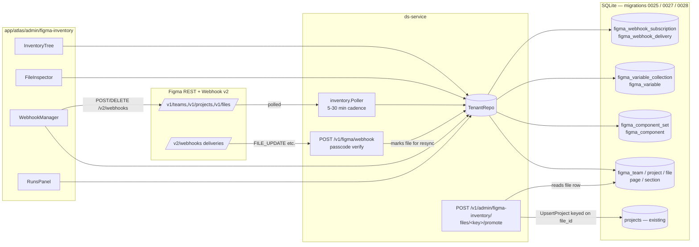

# FIGMA DB Phase 2 — admin UI, webhooks, component/variable inventory, DS cross-link

## Overview

Phase 1 shipped the read side of FIGMA DB: migration `0025`, a 5-minute polling crawler (`services/ds-service/internal/figma/inventory/poller.go`), JSON admin endpoints under `/v1/admin/figma-inventory/*`, and ~482 files / 301 pages / 377 sections already mirrored for team `898419887480849435` (INDmoney) under the dev tenant. Phase 2 turns that data into something a person and the audit pipeline can actually use.

Four workstreams, delivered in four sub-phases that land independently:

| Phase | Workstream | What it unlocks |
|---|---|---|
| **2A** | Admin UI foundation | A page at `/atlas/admin/figma-inventory` with tree, search, sync, runs log — the inventory becomes visible |
| **2B** | DS-data cross-link | "Promote to project" CTA lets admins surface inventory files into the audit pipeline without pasting URLs |
| **2C** | Component & variable inventory | Mirror Figma components, component sets, and variables per file so the DB has full design-system surface coverage |
| **2D** | Webhooks | Subscribe to Figma FILE_UPDATE / FILE_DELETE / LIBRARY_PUBLISH events on Fly.io; drop poller cadence to 30 min as safety net |

All four use the same patterns Phase 1 established: `STRICT`-mode SQLite tables, denormalized `tenant_id`, soft-delete via `deleted_at`, `TenantRepo` for all reads/writes, `super_admin`-gated `/v1/admin/*` HTTP surface, shared per-PAT rate limiter on the Figma client.

---

## Problem Frame

**Today.** Phase 1 left two gaps. First, the data exists but has no UI — admins can only see it through `sqlite3` or `curl`. Second, the inventory is disconnected from the existing audit pipeline: when an admin wants to audit a file, they still paste a Figma URL into the export endpoint, even though the same file is already in `figma_file`. There's also a coverage gap: pages and sections are mirrored, but components, component sets, and variables — the actual atoms the audit cares about — are not. And the 5-minute poll cadence is wasteful when Figma can push updates directly.

**Why now.** The inventory is real (482 files, 43 projects) and the patterns from Phase 1 are still warm in everyone's head. Building on them while the conventions are obvious is cheaper than coming back in three months and re-learning them. The audit pipeline's "paste a URL" UX is also the single most-friction-y step in the export flow today — closing that gap pays back continuously.

**Boundary.** Phase 2 does not change the Phase 1 schema (it adds tables, never alters existing ones). It does not change the existing `/v1/projects/export` request/response contract — the promote endpoint is a new surface. It does not introduce a new auth model — every admin endpoint stays behind `super_admin`.

---

## Requirements Trace

- **R1.** Admins can see the FIGMA DB inventory tree (team → project → file → page → section) in a web UI without using SQL.
- **R2.** Admins can trigger an immediate sync from the UI and see per-cycle run statistics (counts, duration, errors).
- **R3.** Admins can add and disable team seeds from the UI.
- **R4.** Each file in the inventory can be promoted to a DS-internal `projects` row in one click; the audit pipeline can then pick it up via the existing `HandleExport` flow keyed on `file_id`.
- **R5.** The inventory mirrors Figma components, component sets, and variables per file alongside the existing pages and sections. Components and variables are upserted/swept on the same change-detection window as pages.
- **R6.** Admins can browse a file's components and variables in a side panel without leaving the inventory page.
- **R7.** When a Figma file is updated, edited, or deleted, the corresponding inventory rows reflect that within Figma's documented debounce window (≤30 min) without depending on the 5-min poller.
- **R8.** Admins can register, pause, and delete team-scoped Figma webhook subscriptions from the UI; the passcode is stored hashed and verified on every delivery.
- **R9.** The system keeps the 5-min polling poller as a safety net but reduces its cadence to 30 min for tenants that have an active `FILE_UPDATE` webhook on every seeded team.
- **R10.** Cross-tenant isolation is preserved end-to-end: webhooks, components/variables, links, and UI views are all `tenant_id`-scoped at the repository layer.

---

## Scope Boundaries

- No node-tree mirroring beyond sections (still metadata-only; full canonical tree stays the audit pipeline's responsibility).
- No mutation of Figma data — every external call is read-only or webhook-management. We never PUT files.
- No support for branches / branched file workflows beyond what Phase 1 already stores in `figma_file.branch_of_file_key`.
- No backfill of historical file versions (`/v1/files/{key}/versions`); creator/created_at remain unavailable.
- No comments, library analytics, or activity-log replication.
- The webhook receiver handles `PING` (auto-fired by Figma on creation, not subscribable) plus four subscribable event types: `FILE_UPDATE`, `FILE_DELETE` (auto-included with FILE_UPDATE per Figma docs), `FILE_VERSION_UPDATE`, `LIBRARY_PUBLISH`. Events outside this set (`FILE_COMMENT`, `DEV_MODE_STATUS_UPDATE`) are explicitly out of scope.
- No local dev tunnel for webhook receiver — webhooks are tested only against the deployed Fly.io endpoint.

### Deferred to Follow-Up Work

- Bulk "Promote N files at once" admin action — single-row promote ships in 2B; bulk is a Phase 3 ergonomics pass.
- Search across components and variables (free-text fuzzy search) — basic name-substring filter ships in 2C; ranked search is later.
- Per-component usage stats ("how many times is button-primary referenced across the corpus") — would require canonical-tree traversal, not Phase 2 scope.

---

## Context & Research

### Relevant Code and Patterns

- **Admin UI conventions** — Next.js App Router; reference page at `app/atlas/admin/organisms/page.tsx` (527 lines, shipped 2026-05-13). Pattern: `"use client"`, `AdminShell` wrapper, `adminFetchJSON` helper, CSS variables + styled-jsx (no tailwind/shadcn).
- **AdminShell + nav** — `app/atlas/admin/_lib/AdminShell.tsx` has `NAV_LINKS` array; add the new page there. Built-in auth redirect to `/login?next=...`.
- **adminFetch helper** — `app/atlas/admin/_lib/adminFetch.ts` reads `NEXT_PUBLIC_DS_SERVICE_URL` and the JWT from `lib/auth-client` zustand store.
- **Admin server pattern** — `services/ds-service/internal/projects/server_organism_admin.go` and `server_figma_inventory_admin.go` (just shipped in Phase 1). Use `requireOrganismAdminTenant`-style helpers; inline `isAdmin(claims)` checks per docs/solutions/2026-05-01-003.
- **TenantRepo + repository pattern** — `services/ds-service/internal/projects/repository_organism.go` and `repository_figma_inventory.go`. UPSERT + prepared statement inside tx; soft-delete via sweep keyed on crawl timestamp.
- **Figma URL parser** — `services/ds-service/internal/projects/figma_proxy.go:48` `ParseFigmaURL` is pure-function; reuse for any "paste a Figma URL" UI input.
- **HMAC constant-time compare** — `services/ds-service/internal/auth/asset_token.go:89` uses `hmac.Equal`. Reuse pattern for webhook passcode comparison (`crypto/subtle.ConstantTimeCompare`).
- **Idempotency cache** — `services/ds-service/internal/projects/idempotency.go` (60s in-memory). Webhook delivery dedupe uses a stronger DB-backed mechanism (partial UNIQUE index per Phase 1 `audit_jobs` precedent).
- **Existing `projects` cross-link surface** — `migrations/0001_projects_schema.up.sql` defines `projects(id, slug, name, platform, product, path, owner_user_id, tenant_id, …)`. Migration `0013_projects_file_id.up.sql` added `file_id` with partial unique `(tenant_id, file_id) WHERE deleted_at IS NULL`. `UpsertProject` in `repository.go:146` resolves on `file_id`.
- **Existing variable extractor** — `services/ds-service/internal/figma/extractor/variables.go:53` has parser shapes for `/v1/files/{key}/variables/local` response — reuse the field walks.
- **Existing components consumer (CLI only)** — `cmd/variants/published_index.go` calls `GetFileComponents` + `GetFileComponentSets`; not persisted. Inspect for response-shape hints, but Phase 2 introduces real DB tables.

### Institutional Learnings

- **Reuse `ParseFigmaURL`, `FigmaPATResolver`, and `(tenant_id, file_key, node_id)` cache key shape** — `docs/solutions/2026-05-02-003-phase-5-2-collab-polish.md` (lines 81-112). Don't re-implement.
- **Inline `isAdmin(claims)` check, defer middleware until >5 handlers** — `docs/solutions/2026-05-01-003-phase-7-8-closure.md`. Matches the Phase 1 pattern in `server_figma_inventory_admin.go`.
- **Partial UNIQUE index for idempotency** — `docs/solutions/2026-04-30-001-projects-phase-1-learnings.md` (lines 109-115). Use it on `figma_webhook_delivery` to dedupe repeat deliveries.
- **Tenant-scoped denormalized `tenant_id` on every table** — same source, lines 16-28. Every new table in Phase 2 carries `tenant_id`.
- **Read source rows BEFORE opening the SQLite write tx** — `docs/solutions/2026-05-01-003-phase-7-8-closure.md` (line 34). Webhook handler will likely cross-read `figma_file` then write `figma_webhook_delivery` — order matters.

### External References

- [Figma Webhooks V2 overview](https://developers.figma.com/docs/rest-api/webhooks/) — caps (Professional 150 / Org 300 / Ent 600), retry schedule (5m / 30m / 3h), `FILE_UPDATE` debounce up to 30 min.
- [Webhooks endpoints](https://developers.figma.com/docs/rest-api/webhooks-endpoints/) — `POST /v2/webhooks`, body `{event_type, context, context_id, endpoint, passcode}`. `PING` event auto-fires on creation.
- [Webhooks events](https://developers.figma.com/docs/rest-api/webhooks-events/) — `FILE_UPDATE` payload: `{event_type, file_key, file_name, passcode, timestamp, webhook_id}`. `FILE_DELETE` is implicitly subscribed alongside `FILE_UPDATE`.
- [Webhooks security](https://developers.figma.com/docs/rest-api/webhooks-security/) — Figma does NOT sign deliveries with HMAC. Verification is the `passcode` echoed in payload body.
- [Webhooks scopes](https://developers.figma.com/docs/rest-api/scopes/) — `webhooks:write` required; PATs support it.

### Slack Context

Not searched (user did not request).

---

## Key Technical Decisions

- **Webhook verification by passcode, not HMAC.** Figma's docs explicitly: deliveries are NOT signed with a request signature header — verification is a passcode you provide at creation and Figma echoes in every payload body. Store a hash of the passcode (`figma_webhook_subscription.passcode_hash`) and compare with `subtle.ConstantTimeCompare`. This is simpler than HMAC and matches Figma's contract.
- **Production-only webhook receiver.** No local tunnel. The webhook URL is the deployed Fly.io ds-service endpoint. Dev tests use fixture payloads (`internal/projects/server_figma_webhook_test.go`). Approved with the user; matches the team's deploy model.
- **Polling stays. Cadence drops when a webhook is healthy.** Webhooks debounce up to 30 min, so they aren't strictly real-time. They reduce *delta detection load*, not *project/file membership reconciliation* (Figma doesn't fire events for project create/rename/move). Keep the poller; reduce its cadence to 30 min only for tenants whose seeded teams all have an active `FILE_UPDATE` webhook. Teams without a healthy webhook stay on 5-min.
- **Manual "Promote to project" CTA.** Admin clicks a file in the tree → server creates/upserts a `projects` row keyed on `(tenant_id, file_id=file_key)`. Idempotent: re-promoting the same file resurfaces the existing project. No automatic linking on export — the export path stays untouched, but it now finds the linked row when an admin has promoted the file beforehand.
- **`STRICT` SQLite mode for all new tables.** Phase 1 (migration 0025) adopted STRICT. Phase 2 continues — gives column-type enforcement at row level.
- **Component / variable rows live in separate tables, not as JSON columns on `figma_file`.** Querying ("show every component named `button-primary` across the corpus") would be miserable on a JSON blob. Separate tables also let us sweep cleanly when a component is deleted from a file.
- **Webhook subscription rows store `webhook_id` from Figma + a local row.** Both directions need to be in sync. On delete-from-Figma, we soft-delete the local row (preserve audit history). On delete-from-our-UI, we call Figma's `DELETE /v2/webhooks/{id}` and only soft-delete locally if Figma acks.
- **No new auth model.** All admin endpoints use existing `requireFigmaInventoryAdminTenant`. Webhook receiver is the one public endpoint (no JWT); it's gated by passcode + rate-limit + idempotency.
- **Component table is keyed on Figma's durable `Component.Key`; `node_id` is also stored for cross-reference.** Figma's docs note `Component.Key` is stable across publish cycles while `node_id` can change. Primary key on `(tenant_id, file_key, component_key)`; `node_id` is a non-key reference column used when calling other Figma endpoints that take a node id.

---

## Open Questions

### Resolved During Planning

- *Where does the webhook receiver live publicly?* — On Fly.io (existing `fly.toml`). Dev tests use fixtures only.
- *How are figma_file rows linked to `projects`?* — Manual promote action; one-click admin CTA per file.
- *Phase 2 admin UI scope?* — Full: tree + runs + promote CTA + component/variable inspector side panel + webhook subscription manager UI.
- *HMAC signing for webhooks?* — Not used by Figma. Passcode-based verification (constant-time compare).
- *Polling cadence after webhooks?* — Per-seed override column on `figma_team_seed.poll_interval_minutes` (nullable; NULL = use default 5 min). U16 sets it to 30 when a healthy FILE_UPDATE webhook is created for the team; U16 clears it when the last webhook on the team is paused or deleted. No 6-hour freshness heuristic — webhook lifecycle drives the column directly.
- *Is ds-service deployed on Fly.io?* — Yes. `fly.toml` at repo root declares `app = 'indmoney-ds-service'`. Webhook URL is `https://indmoney-ds-service.fly.dev/v1/figma/webhook` (parametrized as `FIGMA_WEBHOOK_URL` env var so dev / staging can override).

### Deferred to Implementation

- Retention policy for `figma_webhook_delivery` rows — start unbounded; add a sweep job in Phase 3 once we see real volume.
- Exact components-per-file payload size at scale — `/v1/files/{key}/components` may approach tier-3's 80-RPM ceiling on large corpora. If observed, reduce per-cycle batch or shift to webhook-only refresh.
- Per-file component count threshold at which the inspector switches from list to virtual scroll.

---

## High-Level Technical Design

> *This illustrates the intended end-state and dependency flow. Directional guidance for review, not implementation specification.*



Phase 2A delivers the four UI components reading the existing Phase 1 endpoints. Phase 2B extends both the Tree and the server with the promote path. Phase 2C adds two new table groups (components, variables) and an inspector side-panel. Phase 2D adds the receiver and the subscription manager.

---

## Output Structure

```
services/ds-service/
├── migrations/
│   ├── 0027_figma_components_variables.up.sql        # U8 (Phase 2C)
│   └── 0028_figma_webhooks.up.sql                    # U13 (Phase 2D)
├── internal/figma/client/
│   └── webhooks.go                                   # U14 (Phase 2D)
├── internal/projects/
│   ├── repository_figma_components.go                # U10 (Phase 2C)
│   ├── repository_figma_webhooks.go                  # U13/U16 (Phase 2D)
│   ├── server_figma_components_admin.go              # U12 (Phase 2C)
│   ├── server_figma_promote.go                       # U5 (Phase 2B)
│   ├── server_figma_webhook.go                       # U15 (Phase 2D — public receiver)
│   ├── server_figma_webhook_admin.go                 # U16 (Phase 2D — subscription CRUD)
│   └── repository_figma_inventory.go                 # U7 modify (linkage join)
└── cmd/server/
    └── main.go                                       # U1, U5, U12, U15, U16 — route registration

app/atlas/admin/
├── _lib/AdminShell.tsx                               # U1 — add NAV_LINKS entry
└── figma-inventory/
    ├── page.tsx                                      # U1
    ├── types.ts                                      # U1
    └── _components/
        ├── TeamList.tsx                              # U2
        ├── InventoryTree.tsx                         # U3, U6
        ├── SearchBox.tsx                             # U3
        ├── RunsPanel.tsx                             # U4
        ├── PromoteButton.tsx                         # U6
        ├── FileInspector.tsx                         # U12
        └── WebhookManager.tsx                        # U16
```

---

## Implementation Units

### Phase 2A — Admin UI Foundation

- U1. **Admin page scaffolding + nav entry**

**Goal:** Create the `/atlas/admin/figma-inventory` page shell with the AdminShell wrapper, the typed DTOs that mirror Go DTOs, and add a nav entry to AdminShell so the page is reachable.

**Requirements:** R1, R10

**Dependencies:** None (uses Phase 1 endpoints + existing AdminShell).

**Files:**
- Create: `app/atlas/admin/figma-inventory/page.tsx`
- Create: `app/atlas/admin/figma-inventory/types.ts`
- Modify: `app/atlas/admin/_lib/AdminShell.tsx` (add to `NAV_LINKS`)

**Approach:**
- `"use client"` page. Mirror the structure of `app/atlas/admin/organisms/page.tsx`: outer flex layout, left sidebar from AdminShell, main content with three panels (Teams | Tree | Runs).
- DTO interfaces in `types.ts` mirror the Go DTOs (`figmaTeamSeedDTO`, `figmaInventoryRunDTO`, `FigmaInventoryTreeNode`).
- Nav entry: `{ href: "/atlas/admin/figma-inventory", label: "Figma Inventory" }` inserted alphabetically.

**Patterns to follow:**
- `app/atlas/admin/organisms/page.tsx` — layout, `useEffect` data fetching, `<style jsx>` blocks.
- `app/atlas/admin/_lib/adminFetch.ts` — fetch helper with bearer token.

**Test scenarios:**
- *Happy path:* unauthenticated → AdminShell redirects to `/login?next=/atlas/admin/figma-inventory`.
- *Happy path:* nav entry visible in admin shell and clickable.
- *Error path:* server returns 403 → page renders error banner ("no admin access for this tenant").
- *Test expectation:* manual smoke + visual check; no e2e harness in repo for `app/atlas/admin/*`.

**Verification:** Page loads at `/atlas/admin/figma-inventory`, AdminShell nav entry visible and active, empty placeholders render before data fetch resolves.

---

- U2. **Team management UI (list / add / disable)**

**Goal:** Render the list of seeded teams with last-crawl status. "Add team" modal with `team_id` + `team_name`. Per-row "Disable" button.

**Requirements:** R3

**Dependencies:** U1.

**Files:**
- Create: `app/atlas/admin/figma-inventory/_components/TeamList.tsx`
- Modify: `app/atlas/admin/figma-inventory/page.tsx` (mount TeamList in left panel)

**Approach:**
- Mounts `GET /v1/admin/figma-inventory/teams` on mount + after add/disable mutations.
- Add modal: simple controlled form, posts `{team_id, team_name}` to `POST /v1/admin/figma-inventory/teams`. On success the server triggers an immediate sync (Phase 1 behavior); UI shows a "Syncing…" badge until the next runs-list poll reflects a new finished run.
- Disable button calls `DELETE /v1/admin/figma-inventory/teams/{team_id}` and re-fetches.
- Status badges: `ok` = green, `forbidden` = red, `error` = yellow; tooltip shows truncated error.

**Patterns to follow:**
- `app/atlas/admin/organisms/page.tsx` modal + button patterns.
- `app/atlas/admin/_lib/adminFetch.ts` for both GET and POST.

**Test scenarios:**
- *Happy path:* list renders, add modal submits, disable removes from "enabled" filter.
- *Edge case:* empty list shows "no teams seeded yet — paste a team id from a Figma URL" hint.
- *Error path:* POST returns 400 (missing fields) → modal shows field-level error.
- *Test expectation:* manual smoke; component unit test if a test runner exists in `app/` (verify with `pnpm test` discovery during implementation).

**Verification:** Add a new team via the UI, see it appear in the list and trigger a sync.

---

- U3. **Inventory tree view + search**

**Goal:** Render the team → project → file → page → section tree returned by `GET /v1/admin/figma-inventory/tree?team_id=…`. Searchable by name (substring, case-insensitive). Collapsible at each level.

**Requirements:** R1, R2

**Dependencies:** U1, U2 (to know which team to load).

**Files:**
- Create: `app/atlas/admin/figma-inventory/_components/InventoryTree.tsx`
- Create: `app/atlas/admin/figma-inventory/_components/SearchBox.tsx`
- Modify: `app/atlas/admin/figma-inventory/page.tsx` (mount InventoryTree in main panel)

**Approach:**
- Tree node renders kind ("project" | "file" | "page" | "section") with an icon, name, and conditional metadata (file's `last_modified`, section's `x/y/width/height`).
- Search filters by name across all levels; matching nodes expand to root so their ancestor chain is visible. Highlighted span on the matched substring.
- Tree fetch is per-team and cached client-side in component state; "Refresh" button bypasses cache.
- Render performance: with ~482 files and ~377 sections the tree is ~1.5k nodes — fine without virtualization. Add a note in the file header that virtual scrolling is a follow-up if a tenant exceeds ~5k nodes.
- Soft-deleted rows are hidden unless a "Show deleted" toggle is enabled (passes `include_deleted=1`).

**Patterns to follow:**
- `app/atlas/admin/organisms/page.tsx` — same layout primitives.
- Search highlighting: simple `<mark>` wrapper, no external lib.

**Test scenarios:**
- *Happy path:* renders full tree for INDmoney team (43 projects, 482 files).
- *Happy path:* expand/collapse each level, state persists per session.
- *Happy path:* search "INDstocks" filters tree to matching files only with ancestors visible.
- *Edge case:* tree fetch returns 404 (team not crawled yet) — show "no inventory for this team yet" message.
- *Edge case:* `Show deleted` toggle adds soft-deleted rows with strikethrough styling.
- *Test expectation:* manual smoke; component unit test for search filter if testing harness exists.

**Verification:** Tree renders, expanding a project shows its files, expanding a file shows pages + sections with bbox metadata.

---

- U4. **Runs log panel + Sync Now button**

**Goal:** Right-panel widget showing the last 20 inventory runs (start, duration, counts, error count). "Sync Now" button calls `POST /v1/admin/figma-inventory/sync`. Auto-refresh every 10 s while page is open.

**Requirements:** R2

**Dependencies:** U1.

**Files:**
- Create: `app/atlas/admin/figma-inventory/_components/RunsPanel.tsx`
- Modify: `app/atlas/admin/figma-inventory/page.tsx` (mount RunsPanel in right panel)

**Approach:**
- `GET /v1/admin/figma-inventory/runs?limit=20` polled on a 10 s interval while mounted (`setInterval` cleaned in unmount).
- Sync Now button posts to `/sync`, shows a transient "Triggered — next run will appear here" toast.
- Each run row shows: started_at (relative time), duration, counts (projects/files/pages/sections), error count (with hover for `error_sample` JSON).
- An "in-progress" row (where `finished_at` is empty) gets a pulsing indicator and updates every 2 s.

**Patterns to follow:**
- `app/atlas/admin/organisms/page.tsx` polling cleanup pattern (`useEffect` returns a cleanup).

**Test scenarios:**
- *Happy path:* renders runs, refreshes every 10 s, sync button shows toast.
- *Edge case:* zero runs → "no runs yet — poll cycle will appear here when complete".
- *Error path:* 503 from `/sync` (no poller wired) → toast shows "poller not configured".
- *Integration:* mounting + unmounting clears the interval (verify via React Strict Mode in dev — no duplicate intervals).

**Verification:** Click Sync Now and observe a new run row appear and complete in real time.

---

### Phase 2B — DS-data cross-link (Promote)

- U5. **Backend: Promote-to-project endpoint**

**Goal:** Add `POST /v1/admin/figma-inventory/files/{file_key}/promote` that creates (or returns) a `projects` row keyed on `(tenant_id, file_id=file_key)`. Idempotent.

**Requirements:** R4, R10

**Dependencies:** None (server-only; can ship before its UI consumer in U6).

**Files:**
- Create: `services/ds-service/internal/projects/server_figma_promote.go`
- Modify: `services/ds-service/internal/projects/repository_figma_inventory.go` (add `LookupProjectByFileKey`, `PromoteInventoryFile`)
- Modify: `services/ds-service/cmd/server/main.go` (route registration)

**Approach:**
- Handler reads the `figma_file` row for `(tenant_id, file_key)`, then calls `UpsertProject` (existing, in `repository.go:146`) with `file_id=file_key`, `name=figma_file.name`, `platform="web"` (default; may be overridden by query param), `product="figma-inventory"`, `path=project_name/file_name`, `owner_user_id=claims.Sub`.
- Returns `{project_id, slug, created: true|false}` — `created=false` means an existing project was returned (idempotent re-promote).
- If the `figma_file` row is missing or soft-deleted, return 404.
- Audit-log the promote action via `auditlog.go` (existing pattern).

**Patterns to follow:**
- `services/ds-service/internal/projects/server.go` `HandleExport` (`type ExportRequest`) — auth + tenant resolution + audit-log shape.
- `repository.go:146` `UpsertProject` — `file_id`-keyed existing resolution path.

**Test scenarios:**
- *Happy path:* promote a known `figma_file` → `projects` row exists, response has `created: true`.
- *Happy path:* re-promote same file_key → `created: false`, same project_id.
- *Edge case:* file_key matches a soft-deleted `figma_file` → 404.
- *Edge case:* file_key matches no row at all → 404.
- *Edge case:* slug derived from the Figma file name collides with an existing project's slug in the same tenant — verify `UpsertProject`'s slug disambiguation (existing behavior in `repository.go:146`) appends a numeric suffix so the promote succeeds without conflict. If `UpsertProject` does NOT currently disambiguate slugs server-side, the test must fail loudly so we can fix `UpsertProject` first.
- *Error path:* non-admin claims → 403 (existing `requireFigmaInventoryAdminTenant`).
- *Integration:* `audit_log` row written with `event_type="figma_inventory_promote"`, `details` includes both file_key and project_id.

**Verification:** Promote `2m7ouydXKfxY` (INDstocks V4 in the current inventory) → `projects` row appears with that `file_id`; re-promoting returns the same row.

---

- U6. **Promote UI CTA per file row**

**Goal:** Add a "Promote to project" button next to each file in the tree. If already linked, render a "✓ Linked to {project_slug}" badge with a click-through to the existing project page.

**Requirements:** R4

**Dependencies:** U3, U5, U7.

**Files:**
- Create: `app/atlas/admin/figma-inventory/_components/PromoteButton.tsx`
- Modify: `app/atlas/admin/figma-inventory/_components/InventoryTree.tsx` (render PromoteButton at file rows)
- Modify: `app/atlas/admin/figma-inventory/types.ts` (extend file node DTO with `linked_project_id`, `linked_project_slug`)

**Approach:**
- Button posts `POST /v1/admin/figma-inventory/files/{file_key}/promote`. On success, parent tree re-fetches and the badge appears.
- Linked badge has a hover tooltip showing the full project path; click navigates to `/atlas/projects/{slug}` (existing).

**Patterns to follow:**
- `app/atlas/admin/organisms/page.tsx` inline action buttons.

**Test scenarios:**
- *Happy path:* unlinked file → click promote → badge updates to "✓ Linked".
- *Happy path:* clicking the linked badge navigates to the project page.
- *Error path:* server returns 404 (file vanished mid-click) → toast shows "file not found".
- *Test expectation:* manual smoke; basic onClick → fetch assertion if a test runner exists.

**Verification:** From the UI, promote a file and confirm the project page exists.

---

- U7. **Tree endpoint augmentation: include `linked_project_id` per file**

**Goal:** Extend `GetFigmaInventoryTree` to LEFT JOIN `projects` on `(tenant_id, file_id=file_key, deleted_at IS NULL)` and surface `linked_project_id` + `linked_project_slug` on each file node.

**Requirements:** R4

**Dependencies:** None (data-layer change only).

**Files:**
- Modify: `services/ds-service/internal/projects/repository_figma_inventory.go` (`GetFigmaInventoryTree`)
- Modify: `services/ds-service/internal/projects/server_figma_inventory_admin.go` (the tree DTO inline structure already passes through — but extend the node shape)
- Modify: `services/ds-service/internal/projects/repository_figma_inventory_test.go` (assert linkage info in tree output)

**Approach:**
- Replace the existing per-file query with a LEFT JOIN onto `projects` filtered by tenant + deleted_at.
- Add `LinkedProjectID`, `LinkedProjectSlug` fields on `FigmaInventoryTreeNode` (optional, JSON-omit-empty).
- The query stays under 5 statements (still 5-query tree assembly).

**Patterns to follow:**
- Existing `repository_figma_inventory.go:GetFigmaInventoryTree` 5-query pattern.

**Test scenarios:**
- *Happy path:* tree with one promoted file shows the linkage; un-promoted files have empty fields.
- *Edge case:* a file linked to a soft-deleted project does NOT show as linked.
- *Integration:* tree for a tenant with zero links works unchanged (no SQL errors).

**Verification:** After promoting one file, the next `GET /tree` includes `linked_project_id` for that file row.

---

### Phase 2C — Component & Variable inventory

- U8. **Migration 0027 — component + variable tables**

**Goal:** Create tables for Figma components, component sets, variable collections, and variables, all tenant-scoped + soft-deletable.

**Requirements:** R5, R10

**Dependencies:** None.

**Files:**
- Create: `services/ds-service/migrations/0027_figma_components_variables.up.sql`

**Approach:**
- Four new tables in `STRICT` mode plus two ALTERs on existing tables:
  - `figma_component_set`: `(tenant_id, file_key, component_set_key)` PK + `node_id`, `name`, `description`, `published`, `first_seen_at`, `last_seen_at`, `deleted_at`.
  - `figma_component`: `(tenant_id, file_key, component_key)` PK + `node_id`, `component_set_key` (nullable, FK-like to the set), `name`, `description`, `documentation_links_json`, `published`, `first_seen_at`, `last_seen_at`, `deleted_at`.
  - `figma_variable_collection`: `(tenant_id, file_key, collection_id)` PK + `name`, `modes_json` (array of `{id, name}`), `default_mode_id`, `hidden_from_publishing`, lifecycle fields.
  - `figma_variable`: `(tenant_id, file_key, variable_id)` PK + `collection_id`, `name`, `resolved_type` (`BOOLEAN`|`FLOAT`|`STRING`|`COLOR`), `scopes_json`, `code_syntax_json`, `values_by_mode_json`, lifecycle fields.
  - `ALTER TABLE figma_file ADD COLUMN variables_last_synced_at TEXT` — lets the poller (U11) mark variables-fetch success independently of pages-fetch success, so a 403 on variables doesn't trigger infinite retries.
  - `ALTER TABLE figma_inventory_run ADD COLUMN components_upserted INTEGER NOT NULL DEFAULT 0` and `variables_upserted INTEGER NOT NULL DEFAULT 0` — run counters for the new tables. (Owned by U8, NOT U11, so the migration is finalized in one place.)
- Indexes: `(tenant_id, file_key, deleted_at)` on each new table for tree assembly + sweep.
- All `tenant_id` FK → `tenants(id) ON DELETE CASCADE`. `file_key` is NOT a real FK (matches Phase 1 convention — `figma_file` is identified by `(tenant_id, file_key)` composite, no single-column unique to reference). Race protection between FILE_DELETE and component upserts is handled at the repository layer via `WHERE EXISTS` guards (see U10).

**Patterns to follow:**
- `services/ds-service/migrations/0025_figma_inventory.up.sql` — STRICT mode, naming, soft-delete pattern.

**Test scenarios:**
- *Test expectation: none* (pure migration — verified by U10's repository tests).

**Verification:** `go test ./internal/projects/...` passes; `sqlite3 .schema` shows all four tables.

---

- U9. **Figma client: typed component + variable wrappers**

**Goal:** Add strongly-typed wrappers around the existing `GetFileComponents`, `GetFileComponentSets`, `GetLocalVariables`, `GetPublishedVariables` methods (currently `map[string]any`).

**Requirements:** R5

**Dependencies:** None.

**Files:**
- Modify: `services/ds-service/internal/figma/client/client.go` (add typed shapes + new methods OR new file `client_components_variables.go`)

**Approach:**
- Typed result types: `ComponentsResponse`, `ComponentSetsResponse`, `LocalVariablesResponse`. Pull the field shapes from the existing extractor at `services/ds-service/internal/figma/extractor/variables.go:53` so we don't rebuild parsers.
- New public methods (preferred): `GetFileComponentsTyped`, `GetFileComponentSetsTyped`, `GetLocalVariablesTyped`. Leave the existing `map[string]any` methods for the CLI consumer at `cmd/variants/published_index.go` until that's migrated.

**Patterns to follow:**
- `services/ds-service/internal/figma/client/client.go` `FilePagesAndSections` typed shape pattern from Phase 1.

**Test scenarios:**
- *Happy path:* fixture file shape (record one real response into `testdata/`) parses into typed struct with no field loss.
- *Edge case:* response with missing `description` field — typed struct uses `""` not panic.
- *Error path:* tier-3 rate limit (existing client behavior) — surface as `*APIError`.

**Verification:** `go test ./internal/figma/client` passes; CLI at `cmd/variants/published_index.go` still builds and produces identical output (verify via diff on `published_index.json`).

---

- U10. **Repository: UpsertComponents / UpsertComponentSets / UpsertVariables + sweeps**

**Goal:** Add `TenantRepo` methods to batch-upsert components, component sets, variable collections, and variables for one file, plus a single combined sweep that soft-deletes rows under `(tenant_id, file_key)` not touched this crawl.

**Requirements:** R5, R10

**Dependencies:** U8, U9.

**Files:**
- Create: `services/ds-service/internal/projects/repository_figma_components.go` (`UpsertFigmaComponentSets`, `UpsertFigmaComponents`, sweep)
- Create: `services/ds-service/internal/projects/repository_figma_variables.go` (`UpsertFigmaVariableCollections`, `UpsertFigmaVariables`, sweep)
- Create: `services/ds-service/internal/projects/repository_figma_components_test.go`
- Create: `services/ds-service/internal/projects/repository_figma_variables_test.go`

**Approach:**
- Two files instead of one — component and variable tables share zero columns and have independent failure modes (variables can 403 while components succeed). Separate files keep test failures clearly attributed.
- One method per table for upsert: `UpsertFigmaComponentSets(ctx, fileKey, sets, seenAt)`, `UpsertFigmaComponents(ctx, fileKey, components, seenAt)`, `UpsertFigmaVariableCollections(...)`, `UpsertFigmaVariables(...)`.
- Each upsert prepared statement guards against the FILE_DELETE race using `WHERE EXISTS (SELECT 1 FROM figma_file WHERE tenant_id = ? AND file_key = ? AND deleted_at IS NULL)`. If a webhook handler stamped the file as deleted between the poller starting and this call, the upsert is a no-op rather than resurrecting components for a deleted file. Cheap (one indexed lookup) and eliminates the logical-orphan race the absence of FK constraint exposes.
- One combined sweep `SweepFigmaFileChildren(fileKey, seenAt)` runs four UPDATE … `deleted_at = ? WHERE last_seen_at < ? AND deleted_at IS NULL` statements in a single tx. Lives in `repository_figma_components.go` since components are the more common case; documented cross-reference in `repository_figma_variables.go`.
- Same prepared-statement-inside-tx pattern as `repository_figma_inventory.go:UpsertFigmaPagesAndSections`.

**Patterns to follow:**
- `services/ds-service/internal/projects/repository_figma_inventory.go:UpsertFigmaPagesAndSections` — sweep-in-same-tx pattern.

**Test scenarios:**
- *Happy path:* upsert N components + sweep, then re-upsert with one removed; the missing row is soft-deleted with correct `deleted_at`.
- *Happy path:* idempotent re-upsert of the same set → no spurious updates.
- *Edge case:* empty slice for one of the four kinds → that kind's table is untouched.
- *Edge case:* component without a parent component_set_key → row stored with NULL FK.
- *Edge case (race protection):* mark `figma_file.deleted_at = now`, then call `UpsertFigmaComponents` for that file_key — assert NO rows are inserted (EXISTS guard fired). Then clear `deleted_at` and re-upsert → rows appear.
- *Error path:* tenant_id mismatch (caller passes wrong tenant) → method forces correct tenant on every row.
- *Integration:* full round-trip (upsert → tree query → component appears in file's children).

**Verification:** Unit tests pass; mirror of `repository_figma_inventory_test.go` covers tenant isolation across both tenants.

---

- U11. **Poller integration: extend Tier-B fetch to include components + variables**

**Goal:** When the poller refetches a file (because `last_modified` moved), also call the components + component sets + local variables endpoints in the same cycle. Stays under tier-3 budget.

**Requirements:** R5

**Dependencies:** U9, U10.

**Files:**
- Modify: `services/ds-service/internal/figma/inventory/poller.go` (`syncFilePages` → rename to `syncFile` and extend)
- Modify: `services/ds-service/internal/projects/repository_figma_inventory.go` — write the `components_upserted` and `variables_upserted` counters added in U8's migration onto the run row
- Modify: `services/ds-service/internal/projects/repository_figma_inventory_test.go` and the new `repository_figma_components_test.go`

**Approach:**
- Existing `syncFilePages` becomes `syncFile`: still fetches `depth=2` for pages/sections, but also issues the three new typed-client calls.
- Each fetch is wrapped in its own per-error-accumulation block — failure to fetch components doesn't kill pages/sections for that file.
- Variables endpoint returns 403 on tenants without `file_variables:read` on their PAT. Treat this as soft-fail: log once per cycle, mark the file's `variables_last_synced_at` separately so we don't infinite-retry.

**Patterns to follow:**
- `services/ds-service/internal/figma/inventory/poller.go:syncFilePages` and `crawlTeam` — per-step error capture.

**Test scenarios:**
- *Happy path:* file with components + variables refetched; all four tables get rows; run row counters incremented.
- *Edge case:* 403 on variables (Free plan / missing scope) — pages + sections + components still write; an error is recorded in `error_sample_json` once.
- *Edge case:* file with no components or variables (empty arrays) → no rows inserted; no error.
- *Error path:* tier-3 rate-limit 429 — error captured, file's `pages_last_synced_at` is NOT advanced so the next cycle retries.
- *Integration:* a Tier-B cycle that drains 30 files writes 30 sets of (pages, sections, components, component_sets, variables) without crashing.

**Verification:** Run an integration sync against the real DB and observe rows in all four new tables; verify run row's `components_upserted` and `variables_upserted` are non-zero.

---

- U12. **File inspector side panel + components/variables admin endpoints**

**Goal:** Click a file in the tree → side panel slides in showing tabs for Components / Component Sets / Variables. Server adds three thin read endpoints.

**Requirements:** R6

**Dependencies:** U10 (data), U3 (tree to click into).

**Files:**
- Create: `services/ds-service/internal/projects/server_figma_components_admin.go`
- Modify: `services/ds-service/cmd/server/main.go` (route registration)
- Create: `app/atlas/admin/figma-inventory/_components/FileInspector.tsx`
- Modify: `app/atlas/admin/figma-inventory/_components/InventoryTree.tsx` (click-to-open inspector)

**Approach:**
- Endpoints:
  - `GET /v1/admin/figma-inventory/files/{file_key}/components` — combined response `{components: [], component_sets: []}`. Ordered by name.
  - `GET /v1/admin/figma-inventory/files/{file_key}/variables` — `{collections: [{id, name, modes}], variables: [...] }`. Variables ordered by collection + name.
  - `GET /v1/admin/figma-inventory/files/{file_key}/summary` — counts only (`{components: N, variable_collections: N, variables: N}`) for the tree node badge.
- Side panel uses tabs (vanilla React state); each tab fetches on first open and caches.
- Inspector also shows the file's `last_modified`, `pages_last_synced_at`, `linked_project_slug` (from the tree DTO already).

**Patterns to follow:**
- `app/atlas/admin/organisms/page.tsx` modal/panel pattern.
- `services/ds-service/internal/projects/server_figma_inventory_admin.go` handler shape.

**Test scenarios:**
- *Happy path:* click file → side panel opens, three tabs work, list renders.
- *Happy path:* close panel → reopening with same file does NOT re-fetch (cache).
- *Edge case:* file with zero components → "no components published in this file" message.
- *Edge case:* variables tab when the file never synced variables → "variables not yet synced — next poll cycle will hydrate".
- *Error path:* 404 on file_key not in inventory → panel shows "file no longer exists".
- *Integration:* summary endpoint counts equal the lengths returned by the full endpoints.

**Verification:** Open inspector on a file with components (e.g. `2m7ouydXKfxY` INDstocks V4) and see the published component list.

---

### Phase 2D — Webhooks

- U13. **Migration 0028 — webhook subscription + delivery tables**

**Goal:** Two tables: `figma_webhook_subscription` (one row per Figma webhook we created) and `figma_webhook_delivery` (one row per incoming delivery, deduplicated by Figma's `webhook_id + file_key + timestamp`).

**Requirements:** R7, R8, R10

**Dependencies:** None.

**Files:**
- Create: `services/ds-service/migrations/0028_figma_webhooks.up.sql`

**Approach:**
- `figma_webhook_subscription`:
  - PK `(tenant_id, webhook_id)`. `webhook_id` is Figma's generated id from `POST /v2/webhooks`.
  - Cols: `team_id` (for team-scope), `context` (`team`|`project`|`file`), `context_id`, `event_types_json`, `endpoint_url`, `passcode_hash` (sha256 of passcode), `status` (`active`|`paused`|`failed`), `last_ping_at`, `last_delivery_at`, `created_by_user_id`, `created_at`, `updated_at`, `deleted_at`.
- `figma_webhook_delivery`:
  - PK `id INTEGER PRIMARY KEY AUTOINCREMENT`.
  - Cols: `tenant_id`, `webhook_id`, `event_type`, `file_key`, `event_timestamp` (from payload), `received_at`, `dedupe_key` (`{webhook_id}:{file_key}:{event_timestamp}`), `processed_at`, `outcome` (`ok`|`skipped`|`error`), `error_message`.
  - Plain `UNIQUE(tenant_id, dedupe_key)` — no `WHERE outcome != 'error'` carve-out. Figma's retry schedule (5m / 30m / 3h) is outside our control, so reclassifying a row from `error` to `ok` on retry is fine; the simpler INSERT path uses `INSERT ... ON CONFLICT(tenant_id, dedupe_key) DO UPDATE SET outcome = excluded.outcome, processed_at = excluded.processed_at`. No additional row created on retry, no index complexity.
  - Add column on `figma_team_seed`: `poll_interval_minutes INTEGER` (nullable). NULL = default poll cadence (5 min). U16 sets it to 30 when a healthy FILE_UPDATE webhook is created for the team; U16 clears it back to NULL when the last webhook is paused/deleted.
- Add columns to `figma_inventory_run` (defensible: keep migration coherent): `webhook_deliveries_processed INTEGER NOT NULL DEFAULT 0`.

**Patterns to follow:**
- `services/ds-service/migrations/0025_figma_inventory.up.sql` for STRICT + naming + indexes.

**Test scenarios:**
- *Test expectation: none* (pure migration — verified by U15 + U16 tests).

**Verification:** Migration applies cleanly; `sqlite3 .schema` shows partial unique index.

---

- U14. **Figma client: webhook CRUD methods**

**Goal:** Add typed methods for `POST /v2/webhooks`, `GET /v2/webhooks`, `GET /v2/teams/{id}/webhooks`, `DELETE /v2/webhooks/{id}`.

**Requirements:** R8

**Dependencies:** None.

**Files:**
- Create: `services/ds-service/internal/figma/client/webhooks.go`

**Approach:**
- Methods on `*Client`: `CreateWebhook(ctx, req CreateWebhookRequest) (*Webhook, error)`, `GetWebhook(ctx, id) (*Webhook, error)`, `ListTeamWebhooks(ctx, teamID) ([]*Webhook, error)`, `DeleteWebhook(ctx, id) error`.
- Types mirror Figma's docs payload (`event_type`, `context`, `context_id`, `endpoint`, `passcode`, `status`).
- All methods route through `Client.get` / a new `Client.post` / `Client.delete` helper that mirrors `get`'s rate-limiter + APIError surface. Webhook CRUD is tier-3 per Figma docs.

**Patterns to follow:**
- `services/ds-service/internal/figma/client/client.go` existing typed methods (`GetFilePagesAndSections`).

**Test scenarios:**
- *Happy path:* httptest server stubs Figma response → CreateWebhook returns parsed struct.
- *Edge case:* 400 from Figma (invalid endpoint URL) → `*APIError` with body text.
- *Error path:* 429 (rate limited) → `*APIError.IsRateLimit()` returns true.

**Verification:** `go test ./internal/figma/client` passes including webhook tests.

---

- U15. **Webhook receiver handler — passcode verify, idempotent, marks files for resync**

**Goal:** Public `POST /v1/figma/webhook` endpoint. Verifies `passcode` against the stored hash via constant-time compare, deduplicates by `UNIQUE(tenant_id, dedupe_key)` + `ON CONFLICT … DO UPDATE`, marks the affected `figma_file` row's `pages_last_synced_at = NULL` (forcing the next poll cycle to refetch). Handles `PING`, `FILE_UPDATE`, `FILE_DELETE` (cascade soft-delete to children inside the same tx), `FILE_VERSION_UPDATE`, `LIBRARY_PUBLISH`.

**Requirements:** R7, R8, R10

**Dependencies:** U13.

**Files:**
- Create: `services/ds-service/internal/projects/server_figma_webhook.go`
- Create: `services/ds-service/internal/projects/server_figma_webhook_test.go`
- Modify: `services/ds-service/cmd/server/main.go` (register PUBLIC route — no JWT middleware)

**Approach:**
- **No JWT** on this route — Figma can't send Authorization headers. Wrap it in the existing per-route rate limiter (basic, e.g. 60 RPM) keyed on source IP to prevent abuse.
- **Read-before-tx contract (explicit).** All reads happen before opening the write tx. The handler builds a `webhookPayload` parsed struct, then a `subscriptionRow` from `GetSubscriptionByWebhookID`, then a `fileRow` from `GetFileByKey` (for non-PING events). Both reads land in local variables. THEN the write tx is opened with `BeginTx`, and the prepared inserts/updates receive those local structs as parameters. This mirrors `repository_figma_inventory.go:UpsertFigmaPagesAndSections`'s signature shape and avoids the SQLite single-writer deadlock cited in `docs/solutions/2026-05-01-003-phase-7-8-closure.md` (line 34).
- Request flow:
  1. Read body (cap 64 KiB; webhook payloads are tiny).
  2. Parse JSON to `WebhookPayload`.
  3. Find the `figma_webhook_subscription` row by `webhook_id` (carry tenant from there — payload doesn't carry tenant). Capture into local `sub`.
  4. If `subtle.ConstantTimeCompare(sha256(payload.passcode), sub.passcode_hash) != 1` → 401 + no DB write.
  5. For non-PING events: `file := repo.GetFileByKey(ctx, sub.tenant_id, payload.file_key)`. Capture for use inside tx.
  6. Open write tx. Inside the tx:
     - Compute `dedupe_key = webhook_id:file_key:timestamp`. INSERT into `figma_webhook_delivery` with `ON CONFLICT(tenant_id, dedupe_key) DO UPDATE SET outcome = excluded.outcome, processed_at = excluded.processed_at`. If the existing row already had `outcome='ok'`, short-circuit the tx (return 200, no further work).
     - Dispatch by event type to a private handler function (see below).
     - Update `figma_webhook_subscription.last_delivery_at` (or `last_ping_at` for PING).
- **Event type dispatch — extract FILE_DELETE specifically.** Because FILE_DELETE is the only event type that performs irreversible structural mutation, it gets its own private function `handleFileDeleteEvent(tx, sub, file, deletedAt)`. The other four events route to `handleResyncEvent(tx, sub, file, eventType, eventTimestamp)`. This keeps the test matrix linear and makes the irreversible path explicit:
  - `PING` → no event-specific work (sub `last_ping_at` already updated above).
  - `FILE_UPDATE` / `FILE_VERSION_UPDATE` / `LIBRARY_PUBLISH` → `handleResyncEvent`: set `figma_file.pages_last_synced_at = NULL` and `figma_file.last_modified = max(last_modified, event_timestamp)` so the next poll cycle treats it as dirty.
  - `FILE_DELETE` → `handleFileDeleteEvent`: stamp `deleted_at = received_at` on `figma_file` AND on every dependent child row (`figma_page`, `figma_section`, `figma_component`, `figma_component_set`, `figma_variable_collection`, `figma_variable`) WHERE `(tenant_id, file_key) = (sub.tenant_id, payload.file_key) AND deleted_at IS NULL`. **Cascade is intentional and inside the same tx** — without it, an admin under U17's 30-min cadence would see "live-looking" pages/sections/components/variables for a deleted file for up to 30 minutes. Bounded work (a few dozen rows per file).

**Patterns to follow:**
- `services/ds-service/internal/auth/asset_token.go:89` — `hmac.Equal` constant-time pattern (we use `subtle.ConstantTimeCompare` for raw bytes).
- `services/ds-service/internal/projects/idempotency.go` — concept of replay protection (we don't need its 60s cache, but the philosophy carries).

**Test scenarios:**
- *Happy path:* `FILE_UPDATE` with valid passcode → 200, `figma_file.pages_last_synced_at` cleared, delivery row created.
- *Happy path:* `PING` payload → 200, `subscription.last_ping_at` updated, no file mutation.
- *Happy path:* duplicate delivery (same `dedupe_key` within minutes) → 200, second attempt is a no-op.
- *Happy path:* `FILE_DELETE` → file soft-deleted AND all children (pages, sections, components, component_sets, variable_collections, variables) get their `deleted_at` stamped to the same timestamp in the same tx. Tree fetch immediately after returns no descendants. Subsequent poll cycle sees nothing to do.
- *Edge case:* unknown `webhook_id` → 404 + no DB write.
- *Edge case:* `event_type` we don't subscribe to → 200 + delivery row with `outcome='skipped'` (so we observe what arrives).
- *Error path:* mismatching passcode → 401, no delivery row.
- *Error path:* body > 64 KiB → 413 Payload Too Large.
- *Error path:* malformed JSON → 400.
- *Integration:* after FILE_UPDATE, the next poller cycle picks up the file as dirty (via `FilesNeedingPagesSync` returning it).

**Verification:** Curl the route with a fixture payload + correct passcode → 200; check DB shows the delivery row + cleared sync timestamp.

---

- U16. **Webhook subscription admin endpoints + UI**

**Goal:** Admin endpoints to list / create / pause / delete team-scoped subscriptions. Frontend admin page section under the inventory page.

**Requirements:** R8

**Dependencies:** U13, U14, U15.

**Files:**
- Create: `services/ds-service/internal/projects/server_figma_webhook_admin.go`
- Modify: `services/ds-service/cmd/server/main.go` (route registration)
- Create: `app/atlas/admin/figma-inventory/_components/WebhookManager.tsx`
- Modify: `app/atlas/admin/figma-inventory/page.tsx` (mount WebhookManager in a new section)

**Approach:**
- Endpoints (all `requireFigmaInventoryAdminTenant`):
  - `GET /v1/admin/figma-inventory/webhooks` — list local subscription rows + last_delivery_at + last_ping_at.
  - `POST /v1/admin/figma-inventory/webhooks` — body `{team_id, event_types: ["FILE_UPDATE", …]}`. (`PING` is NOT a valid event_type — Figma auto-fires it on creation regardless. Server should reject it with 400 if included.) Server: generates a 32-byte hex passcode, calls `client.CreateWebhook(...)` with the public webhook URL (from config `FIGMA_WEBHOOK_URL`, default `https://indmoney-ds-service.fly.dev/v1/figma/webhook`), stores the row with `passcode_hash = sha256(passcode)`. **Passcode return contract:** the response body contains the plain passcode exactly ONCE, in this single creation response. The admin must save it externally (e.g. paste into a 1Password vault entry or audit ticket) — there is no endpoint that re-exposes the plain passcode afterwards. The UI explicitly tells the admin "Save this passcode — you will not see it again." Subsequent GETs return only the hash-derived fields (`status`, `last_ping_at`, etc.).
  - On successful create: also set `figma_team_seed.poll_interval_minutes = 30` for the (`tenant_id`, `team_id`) so the poller (U17) drops to 30-min cadence for that team's seed.
  - `POST /v1/admin/figma-inventory/webhooks/{id}/pause` — calls Figma `DELETE /v2/webhooks/{id}` and marks local row `status=paused, deleted_at=now`. If it was the last active webhook for the team_id, clear `figma_team_seed.poll_interval_minutes` back to NULL.
  - `DELETE /v1/admin/figma-inventory/webhooks/{id}` — same as pause but also wipes delivery history (optional flag).
- WebhookManager UI: table of subscriptions, "Subscribe team" button, per-row pause/delete. Status column color-coded by `status` and recency of `last_delivery_at`. Creation modal includes copy-to-clipboard for the passcode + an "I've saved this" checkbox-gate before closing.

**Execution note:** The Figma-CRUD half of U16 (POST/GET/DELETE roundtrip against `*client.Client`) can be fully tested with `httptest` fixtures and ships without prod. The PING-round-trip half (Figma → our receiver → `last_ping_at` populated) requires the deployed `indmoney-ds-service.fly.dev` URL to be reachable from Figma. Merge U16 in two halves: U16-a (admin CRUD against mocked Figma) lands first, U16-b (live PING verification) lands once the receiver from U15 is deployed and the prod URL is reachable. Both halves share the same files; track via PR description, not separate units.

**Patterns to follow:**
- `services/ds-service/internal/projects/server_figma_inventory_admin.go` admin shape.
- `app/atlas/admin/figma-inventory/_components/TeamList.tsx` from U2 for the UI table.

**Test scenarios:**
- *Happy path:* create subscription → row stored, Figma `CreateWebhook` called, response includes passcode.
- *Happy path:* PING from Figma after creation lands on U15's handler → `last_ping_at` populated; UI shows green badge.
- *Edge case:* duplicate subscription (same team_id + event_type) → 409 conflict, suggest pause-and-recreate.
- *Edge case:* pause when Figma already returned 404 on the webhook id (manually deleted in Figma's UI) → local row pauses anyway with a warning.
- *Error path:* `client.CreateWebhook` returns 400 (invalid endpoint URL) → 422 to UI with "configure FIGMA_WEBHOOK_URL first".
- *Integration:* end-to-end against live Fly.io endpoint (manual smoke during U17).

**Verification:** From the UI, subscribe the INDmoney team; observe the Figma-generated PING arriving and the badge flipping to green.

---

- U17. **Per-seed polling cadence override**

**Goal:** When a team's seed has `poll_interval_minutes` set (U16 writes 30 on webhook creation, clears on last-webhook-delete), the poller treats that team as "cadence-downshifted": it only crawls the team if `time_since_last_team_crawl >= poll_interval_minutes`. Teams without an override stay on the default 5-min cycle.

**Requirements:** R7, R9

**Dependencies:** U13 (column added), U16 (writes the column).

**Files:**
- Modify: `services/ds-service/internal/figma/inventory/poller.go` (`crawlTeam` early-skip check)
- Modify: `services/ds-service/internal/projects/repository_figma_inventory.go` (extend `ListEnabledFigmaTeamSeeds` to include `poll_interval_minutes` + `last_crawl_at` in the returned struct)

**Approach:**
- Poller's global ticker stays at 5 min — no per-tenant timer logic.
- Inside `crawlTenant`, when iterating seeds, the seed struct now carries `PollIntervalMinutes` (*int, nil = default) and `LastCrawlAt`. If `PollIntervalMinutes != nil` AND `now - LastCrawlAt < PollIntervalMinutes minutes` → skip this seed on this tick. Otherwise crawl normally.
- That's the entire mechanism. No `IsTenantFullyWebhooked`, no 6-hour freshness check, no per-tenant-crawl-lookup, no warning-log heuristic. The webhook lifecycle (U16) drives the column; the poller reads it.
- The Tier-B sweep (pages/sections/components/variables) keeps running normally when triggered — webhooks just signal which files are dirty via U15's `pages_last_synced_at = NULL`.

**Patterns to follow:**
- Existing `crawlTenant` early-exit on "no seeds" — same idea.

**Test scenarios:**
- *Happy path:* seed with `poll_interval_minutes=30` + last crawl 10 min ago → seed skipped this tick.
- *Happy path:* seed with `poll_interval_minutes=30` + last crawl 35 min ago → seed crawled.
- *Happy path:* seed with NULL override → 5-min default applies, seed crawled every tick.
- *Edge case:* seed never crawled (`last_crawl_at IS NULL`) + override set → crawl immediately on first tick (treat as "infinitely old").
- *Edge case:* admin pauses the team's last webhook (U16 clears the override) → next tick treats seed as default-cadence.
- *Integration:* webhook-driven file flips `pages_last_synced_at = NULL`; the next 30-min cycle picks it up.

**Verification:** Set `poll_interval_minutes=30` directly via SQL, observe the seed gets crawled exactly once per 30 min by tailing the structured logs.

---

## System-Wide Impact

- **Interaction graph:**
  - The poller's `crawlTenant` now consults `figma_webhook_subscription` (U17) and writes `figma_inventory_run.webhook_deliveries_processed` (U13).
  - `HandleExport` (existing) gains a no-op interaction with the new `projects` rows promoted via U5 — if a designer pastes a Figma URL that already corresponds to a promoted file, the existing `UpsertProject` finds the row by `file_id` and reuses it.
  - `AdminShell` nav gains one entry (U1) — visible in every other admin page too.
- **Error propagation:**
  - Webhook deliveries with bad passcode never write a row (401); deliveries with unknown event types write a delivery row with `outcome='skipped'` for observability.
  - Variables 403 (Free-plan tenant) is treated as a soft-fail (logged once, doesn't poison the cycle).
  - Figma API 429 in webhook CRUD bubbles up to the admin handler as 503 + Retry-After (existing `APIError` plumbing).
- **State lifecycle risks:**
  - **Replay protection:** partial UNIQUE index on `figma_webhook_delivery(tenant_id, dedupe_key) WHERE outcome != 'error'`. Errored deliveries can be retried (no stuck-state).
  - **Soft-delete cascade:** when `figma_file.deleted_at` is set via FILE_DELETE webhook, children (pages, sections, components, variables) stay alive until the next poll cycle sweeps them. Acceptable because they're tenant-scoped and unreferenced from the tree query once their parent file is hidden.
  - **Webhook subscription drift:** if an admin deletes a webhook in Figma's UI directly (not via our admin endpoint), our `last_ping_at` won't refresh and U17's healthy check fails — poller falls back to 5 min, no inventory data loss.
- **API surface parity:**
  - Webhook receiver is the only public (no-JWT) route added. All other new admin endpoints follow the existing `super_admin` gating.
- **Integration coverage:**
  - End-to-end: FILE_UPDATE webhook → file marked dirty → next cycle refetches pages/sections/components/variables. Tested in U15's integration scenario.
  - End-to-end: tree fetch with a promoted file → linkage info present (U7).
- **Unchanged invariants:**
  - Existing `projects.file_id` semantics: still a Figma file_key, still uniquely identifying one file per tenant.
  - Existing `HandleExport` request/response contract: unchanged.
  - Existing `figma_render_blocklist`: independent — webhooks don't touch it.

---

## Risks & Dependencies

| Risk | Mitigation |
|---|---|
| Webhook receiver depends on a public HTTPS URL. If Fly.io deploy isn't ready or the URL changes, all of Phase 2D is blocked. | Confirm Fly.io setup before starting U13. The webhook URL becomes a config env var (`FIGMA_WEBHOOK_URL`) so it can change without redeploy. |
| Figma's 30-min `FILE_UPDATE` debounce means webhooks aren't actually near-real-time — admins may expect instant updates. | Document the 30-min ceiling in the WebhookManager UI tooltip + the readme for U16. |
| Rate-limit contention across tiers when adding component + variable fetches. Per `internal/figma/client/client.go`: `/v1/files/{key}?depth=2` is **tier-1 (12 RPM)** — the binding constraint Phase 1 already sized against. `/components` and `/component_sets` are **tier-3 (80 RPM)** — ample headroom. `/variables/local` is **tier-2 (40 RPM)**, which is also where `/v1/teams/{id}/projects` and `/v1/projects/{id}/files` live, so adding variables fetches creates tier-2 contention with the existing Tier-A team/project crawl. | The shared per-PAT limiter coordinates all three buckets. Tier-1 ceiling stays the binding constraint, so the existing `PagesSyncBatch = 30` (sized for tier-1 = 12 RPM × 5 min × ~50% headroom) keeps holding. Tier-3 has ~400 calls per 5-min cycle of headroom — fine for 30 files × 2 tier-3 calls = 60. The new tier-2 concern is real: monitor in U11 via per-cycle logs (count tier-2 calls). If observed tier-2 saturation appears, split the variables fetch into a separate, lower-frequency cycle (e.g. variables refresh hourly, not per file-change) rather than expanding budget. Do not rely on "staggering" calls inside a single `syncFile` — the limiter is process-global; spreading three calls within one function is a no-op. |
| `figma_variable` table can grow large (1k+ variables per design-system file). UI lag if rendered naively. | UI sorts + filters by collection; pagination kicks in at >500 variables per file. |
| Promote flow creates a `projects` row that may have a slug collision with an existing project. | `UpsertProject` already disambiguates slugs (existing behavior); validate via U5's test cases. |
| Webhook receiver is a new public endpoint and a new attack surface. | Strict per-IP rate limit (60 RPM), constant-time passcode compare, 64 KiB body cap, no JWT bypass possible, audit log every delivery. |
| Components and variables tables can drift from `figma_file` if soft-delete cascade is wrong (deleted file leaves orphaned variable rows). | U10's combined sweep verifies orphans get `deleted_at` stamped at the same poll cycle. Add an integrity test in U11 that asserts no orphan rows. |
| Phase 2D ships to production but admins forget to subscribe — Phase 2A users wonder why the cadence didn't change. | U17 logs a per-tenant `slow_cadence_inactive` warning every cycle when expected webhooks aren't healthy. |

---

## Phased Delivery

### Phase 2A — Admin UI Foundation (1-2 days)
- Units: U1, U2, U3, U4
- Ships the visible surface for everything that exists today. Unblocks 2B, 2C UI work.
- Dependencies: none (Phase 1 endpoints exist).

### Phase 2B — DS-data cross-link (0.5-1 day)
- Units: U5, U7, U6 (server-then-UI order)
- Smallest phase; rides on Phase 2A's tree UI.
- Dependencies: 2A complete.

### Phase 2C — Component & Variable Inventory (2-3 days)
- Units: U8, U9, U10, U11, U12 (DB-then-client-then-repo-then-poller-then-UI order)
- Can start in parallel with Phase 2B once 2A's tree is in.
- Dependencies: 2A complete for U12's UI; U8-U11 are backend-only.

### Phase 2D — Webhooks (2-3 days, gated on prod deploy)
- Units: U13, U14, U15, U16, U17
- Highest-risk phase. Cannot fully test U15+U16 until the receiver is reachable from Figma.
- Dependencies: 2A complete for U16's UI; production deploy ready for E2E.

**Recommended delivery order:** 2A → (2B and 2C in parallel) → 2D. Whole phase ~6-9 working days at one engineer.

---

## Documentation Plan

- Add a "FIGMA DB Phase 2 (2026-05-13)" section to `docs/solutions/` capturing:
  - Webhook passcode (not HMAC) verification pattern + Figma docs URL.
  - 30-min debounce reality vs admin expectations.
  - Components / variables endpoint plan-tier gotchas (variables 403 on Free).
- Update `services/ds-service/cmd/server/main.go` header comments where new routes are added.
- Tooltip help text in `WebhookManager.tsx` explaining the 30-min debounce so admins don't open bugs about "webhook is slow".

---

## Sources & References

- **Phase 1 plan:** [docs/plans/2026-05-13-001-feat-organism-pattern-detection-plan.md](docs/plans/2026-05-13-001-feat-organism-pattern-detection-plan.md) (for naming + STRICT conventions)
- **Phase 1 migration:** `services/ds-service/migrations/0025_figma_inventory.up.sql`
- **Phase 1 poller:** `services/ds-service/internal/figma/inventory/poller.go`
- **Phase 1 admin endpoints:** `services/ds-service/internal/projects/server_figma_inventory_admin.go`
- **Phase 5.2 P4 institutional learnings:** `docs/solutions/2026-05-02-003-phase-5-2-collab-polish.md` — `ParseFigmaURL`, `FigmaPATResolver`, cache key shape
- **Phase 1 audit fan-out idempotency:** `docs/solutions/2026-04-30-001-projects-phase-1-learnings.md` — partial UNIQUE index pattern
- **Phase 7/8 admin closure:** `docs/solutions/2026-05-01-003-phase-7-8-closure.md` — inline `isAdmin` check, SQLite read-before-tx
- **Figma Webhooks V2:** https://developers.figma.com/docs/rest-api/webhooks/
- **Figma Webhook endpoints:** https://developers.figma.com/docs/rest-api/webhooks-endpoints/
- **Figma Webhook events:** https://developers.figma.com/docs/rest-api/webhooks-events/
- **Figma Webhooks security:** https://developers.figma.com/docs/rest-api/webhooks-security/
