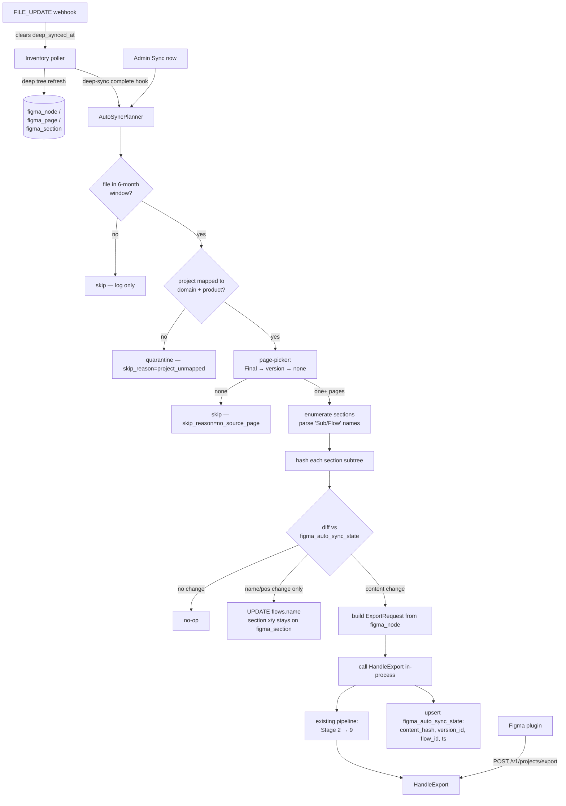

# FIGMA DB → audit pipeline auto-sync bridge

## Overview

A new in-process **AutoSyncPlanner** that turns the FIGMA DB inventory (migrations 0025 + 0027) into a continuous, webhook-driven feed for the existing audit pipeline (`HandleExport` at `services/ds-service/internal/projects/server.go`). Designers stop clicking the Figma plugin to push a section — every section under a "Final Design" page on a file modified in the last 6 months auto-flows into `flows` + `screens` whenever Figma sends a `FILE_UPDATE`, and only when the section's *content* (not just its x/y) actually changed.

Three things make this practical now:
1. Phase 1 + Phase 2C already mirror every file's full structural tree into `figma_node` / `figma_page` / `figma_section`. The planner doesn't need to re-fetch from Figma to know what's in a file — it queries the DB.
2. Phase 2D's `FILE_UPDATE` webhook receiver already clears `figma_file.deep_synced_at`, which triggers the deep poller, which refreshes `figma_node`. The planner sits one stage downstream of that signal.
3. `HandleExport`'s existing `UpsertFlow` is already idempotent on `(tenant_id, file_id, section_id, persona_id)`. The planner can replay the same section_id repeatedly without duplicating rows; old screens for prior versions stay in place.

The plugin keeps working unchanged — it's a fallback for files the planner skips, for the 81 files in the 6-month window without a clean "Final" page, and for legacy ingestion.

---

## Problem Frame

**Today.** Three ingestion paths feed the audit pipeline (`POST /v1/projects/export`):
- the Figma plugin (designer clicks Export)
- `cmd/import-figma-url` (engineer pastes a URL on a CLI)
- `cmd/sheets-sync` (a Google-Sheet row maps to a Figma section)

All three are *pull*: a human or process explicitly decides "this section, now." Designers ship work daily but the audit only sees what they bother to push. Adoption gates on remembering-to-click. New sections in old files never get audited unless someone manually surfaces them.

**Webhooks shift this to push.** Figma v2 webhooks deliver `FILE_UPDATE` within ~30 minutes of edit-quiet. Phase 2D wires the receiver. With the deep node tree already mirrored in `figma_node`, we have everything we need to:
1. Detect *which page* in a file is the source of truth (the "Final Design" page or the highest version-suffixed page).
2. Detect *which sections* under that page changed (by hashing their subtrees).
3. Build the same `ExportRequest` the plugin would have built, **server-side**, and call `HandleExport` directly in-process.

**Boundary.** This plan does NOT:
- Change the pipeline downstream of `HandleExport` (Stages 2-9 run unchanged).
- Add per-frame incremental re-process (sections re-export end-to-end; if one frame inside a 12-frame section changes, all 12 re-render — that's the existing pipeline's shape and outside this plan).
- Replace the plugin. Plugin keeps working; auto-sync is layered on top of the same handler.

---

## Requirements Trace

- **R1.** For every Figma file modified in the last 6 months on a seeded team, identify "the page to audit" — preferring a `Final*` page, then the highest version-suffixed page. Files with neither are skipped.
- **R2.** Multi-Final files emit one flow per Final page; persona is derived from the page name (`Trader FINAL DESIGN` → persona `Trader`).
- **R3.** Section names in the chosen page are parsed as `Sub-product/Sub-flow` (slash-delimited). Slash-less names land in an `(unassigned)` sub-product bucket; the audit pipeline still ingests them.
- **R4.** Each section's full subtree is hashed. When the hash differs from the last-synced hash, the section re-exports through `HandleExport` end-to-end. When the section's own x/y/name/order changed but its subtree hash is identical, only `flows.name` is updated — no Figma re-fetch. The section's own x/y/w/h continues to live on `figma_section` and is refreshed by every poll cycle independently; the `flows` table has no x/y columns and we do not add any.
- **R5.** Files older than 6 months never auto-sync, even when their last_modified moves; the 6-month cutoff is computed at planner entry.
- **R6.** Each tenant has a configurable mapping from `figma_project.name` → `(domain, product)`. The planner refuses to auto-sync files in projects without a mapping (admin must classify first).
- **R7.** Sync state — last-synced content_hash, last-synced version_id, exported flow_id, last status, error — is persisted per `(tenant, file_key, page_id, section_id)` in a new `figma_auto_sync_state` table. Independent of `figma_section` so re-crawl doesn't wipe history.
- **R8.** The planner is triggered by webhook delivery (preferred), the poller's deep-sync completion (safety net), or an admin "Sync now" button per file (manual override). All three converge on the same planner entry.
- **R9.** Plugin-driven and auto-sync-driven exports coexist safely. Same idempotency key shape, same `UpsertFlow` semantics; last writer wins per `(file_id, section_id, persona_id)`.
- **R10.** Tenant-scoped throughout. Every read and write respects `tenant_id`; the planner never crosses tenants on a single cycle. The audit pipeline's per-PAT tier-1 rate limit is honored via the existing shared limiter.

---

## Scope Boundaries

- No new Figma API calls. The planner reads from `figma_node` (already mirrored) and only calls Figma indirectly via `HandleExport`'s existing Stage 2-3 path.
- No pipeline refactor for per-frame incremental processing. A section is the smallest re-fetch unit.
- No new auth model. The planner runs in-process under the existing tenant; admin endpoints stay behind `super_admin`.
- No domain/product auto-inference from project names. Admin maps projects → domain/product explicitly. The planner refuses to ingest unmapped projects.
- No backfill of files older than the 6-month cutoff. If an old file's last_modified moves into the window (which only happens when a designer edits it), it becomes eligible going forward; nothing reaches back further.
- No replacement of the Figma plugin, `import-figma-url`, or `sheets-sync`. Plugin stays the designer's escape hatch when the planner skips a file.

### Deferred to Follow-Up Work

- Per-frame incremental re-process inside a section (would touch pipeline Stages 2-4): separate plan once we measure how often section-level re-export wastes work.
- Variables / components-detail mirror tables: tracked in `docs/plans/2026-05-13-002-feat-figma-db-phase-2-plan.md` (Phase 2C remainder).
- Real-time UI showing "which flows are auto-synced vs plugin-sourced": ride-along after auto-sync ships.
- **Project mapping admin UI (was U13)**: v1 ships with SQL + REST endpoint only. Admins use `PUT /v1/admin/figma-autosync/projects/{project_id}/mapping` via curl or the dev console. A React panel lands after we see how often admins change mappings in practice.
- **Page classification preview UI (was U14)**: Phase B's dry-run CLI (U8) already dumps the classifier output as JSON. The React preview component lands only after a real misclassification is reported.
- **Bulk-sync progress tracking table** (was part of U17): bulk-run status is computed on-demand by aggregating `figma_auto_sync_state.last_attempt_at > run_start`. No separate `figma_autosync_bulk_run` table.
- **Per-tenant page-picker rule overrides** (was part of U1): the `ClassifyPages` function signature accepts a `rules []PagePickerRule` slice; v1 always passes empty. The `figma_page_picker_rule` table ships only when a tenant actually needs to override the default classifier — defer the migration until then.

---

## Context & Research

### Relevant Code and Patterns

- **Existing audit-pipeline entry point** — `services/ds-service/internal/projects/server.go` `HandleExport`. Accepts `ExportRequest{file_id, file_name, flows[]: FlowPayload{section_id, frame_ids, frames, platform, product, path, persona_name, name, mode_groups}}`. Inline tx writes flows + screens skeleton; spawns async goroutine for `pipeline.RunFastPreview()`. **The planner will call this function directly in-process** rather than POSTing over HTTP — same handler, no auth roundtrip, no JSON re-marshal.
- **Idempotency on flows** — `services/ds-service/internal/projects/repository.go` `UpsertFlow` keyed on `(tenant_id, file_id, section_id, persona_id)`. Re-export of the same section creates a new version and new screens; the flow row updates `name` and `updated_at`. The planner relies on this exact semantic.
- **Frame enumeration walker** — `services/ds-service/cmd/sheets-sync/figma_resolve.go` `walkScreens` (battle-tested). Calls `/v1/files/{key}/nodes?ids={section_id}&geometry=paths`, recurses SECTION/GROUP children, stops at FRAME/COMPONENT/INSTANCE leaves ≥ 280×80, plus RECTANGLE-with-image-fill at the same size gate. **Direct lift.**
- **Tier-1 rate limiter** — `services/ds-service/internal/figma/client/ratelimit.go` `WaitTier1`. Per-PAT process-global bucket, paced at 12 RPM × 80%. The planner consumes the same bucket as the inventory poller and the audit pipeline; no new limiter.
- **CLI ingestion analog** — `services/ds-service/cmd/sheets-sync/orchestrate.go` + `export.go` build `ExportRequest` from a sheet row, hash content into a deterministic idempotency key (`sha256(tab|row_index|row_hash)`), retry on 429/transient with backoff. Reuse the deterministic-key pattern.
- **Existing FIGMA DB schema** — `services/ds-service/migrations/0025_figma_inventory.up.sql` + `0027_figma_node.up.sql`. The planner queries these; the new state table lives next to them.
- **Webhook receiver** — Phase 2D U15 (`services/ds-service/internal/projects/server_figma_webhook.go`, planned in `docs/plans/2026-05-13-002-feat-figma-db-phase-2-plan.md`). On `FILE_UPDATE` it clears `figma_file.pages_last_synced_at` so the poller re-fetches; we add planner-trigger downstream of the poller's success.
- **Admin endpoint conventions** — `services/ds-service/internal/projects/server_figma_inventory_admin.go`. Same DTO + `requireFigmaInventoryAdminTenant` helper pattern.
- **Admin UI conventions** — `app/atlas/figma-inventory/*` (this session's work). `Shell` chrome, `_lib/Table.tsx` primitives, CSS variables — match it.

### Institutional Learnings

- **Reuse `ParseFigmaURL` + `FigmaPATResolver` + `(tenant_id, file_key, node_id)` cache key** — `docs/solutions/2026-05-02-003-phase-5-2-collab-polish.md`. The planner doesn't need URL parsing (it has IDs directly) but the cache-key shape applies if we ever add a per-section response cache.
- **Inline `isAdmin(claims)` check, defer middleware until >5 handlers** — `docs/solutions/2026-05-01-003-phase-7-8-closure.md`. Phase 2 admin pattern stands; auto-sync admin endpoints follow it.
- **Partial UNIQUE index for idempotency dedup** — `docs/solutions/2026-04-30-001-projects-phase-1-learnings.md`. Used on `audit_jobs`; applies to `figma_auto_sync_state` to dedupe concurrent planner runs for the same `(file_key, section_id)`.
- **Tenant-scoped denormalized `tenant_id` on every table** — same source. Every new column and table here carries it.
- **Read source rows BEFORE opening the SQLite write tx** — `docs/solutions/2026-05-01-003-phase-7-8-closure.md`. The planner pre-reads `figma_node` + `figma_auto_sync_state` rows, computes hashes in memory, THEN opens the tx for the state-write + HandleExport call. Mirrors Phase 2D U15's webhook-handler contract.

### External References

- [Figma Webhooks V2](https://developers.figma.com/docs/rest-api/webhooks/) — `FILE_UPDATE` debounced up to 30 min, 3 retries on 5m / 30m / 3h. Verification via passcode.
- [Figma Files endpoint](https://developers.figma.com/docs/rest-api/file-endpoints/) — `lastModified` is file-level, no per-node timestamps. `?depth=N` works for arbitrary N.

### Slack Context

Not searched (user did not request).

---

## Key Technical Decisions

- **In-process call to `HandleExport`, not HTTP POST.** Both existing CLIs POST over HTTP. The planner runs inside the same Go process — calling `HandleExport` directly skips JSON marshal/unmarshal, skips JWT mint, and lets us pass a synthesized `*http.Request` with a pre-resolved tenant context. Functionally identical from the pipeline's perspective; cheaper at scale.
- **Section as the smallest re-fetch unit.** A page may have 30 sections; only changed sections re-export. Sub-frame incremental processing is out of scope.
- **Hash shape: `sha256` of `(node_id, parent_id, type, name, x, y, w, h)` for every descendant of the section, sorted by `(depth, node_id)` — NOT by `order_index`.** Sibling reorder inside Figma isn't a real "content change" semantically; excluding `order_index` from the hash avoids spurious re-exports when a designer drags-to-reorder leaves without changing what's there. Excludes the section's own bbox so x/y moves don't flip the content hash. Stored alongside a separate `position_hash` that captures only the section's own name + bbox + parent's order_index — used for the cheap-update path.
- **RECTANGLE-with-image-fill is NOT eligible for auto-sync.** The existing `walkScreens` (sheets-sync) accepts RECTANGLE leaves when their `fills` array contains an IMAGE paint, treating them as image-backed screens. Phase 2C's `figma_node` schema deliberately excludes `fills` ("metadata only, no fills") — so auto-sync can't know which RECTANGLEs qualify. **Trade-off accepted: image-rectangle screens are missed by auto-sync.** Designers who need to audit an image-rectangle screen wrap it in a FRAME (which is the recommended Figma practice anyway), OR use the plugin fallback. Document in the admin UI + readme. A future migration can add `has_image_fill BOOLEAN` on `figma_node` populated during deep-sync; we don't need it for v1.
- **Idempotency: deterministic key + persistent dedup, not in-memory cache.** Idempotency key = `sha256(file_key|section_id|content_hash)`. Same content → same key. The existing in-memory 60s cache in HandleExport catches duplicates within a window; we add **persistent dedup** by checking `figma_auto_sync_state.last_synced_version_id` before calling runExport — if a state row already exists for this (file, section, content_hash) tuple with `status='ok'`, the planner skips the runExport call entirely. Cross-restart safe.
- **Page-picker is a pure function over `figma_page` + `figma_section` + a per-tenant rules table.** No side effects. The planner can dry-run it ("what would I sync?") without writing anywhere.
- **Persona derivation is regex-based, deterministic.** Strip case-insensitive `FINAL\s*DESIGN[S]?` (and `FINAL`, `🏁`, emoji) from the page name; whatever remains, trimmed of `/-_` and lowercased, is the persona. Empty remainder → persona `default`. Page named exactly `Final Design` → persona `default`. Page `Trader FINAL DESIGN` → persona `trader`.
- **`(unassigned)` for slash-less sections** rather than skip. Admin can rename in Figma to add the prefix and the next cycle picks it up. Skipping would silently lose data.
- **Domain + Product mapping is admin-managed, not auto-inferred.** A new `figma_project.domain` + `figma_project.product` per-tenant config table. Files whose `figma_project` lacks a mapping are quarantined — the planner emits a row in `figma_auto_sync_state.skip_reason = 'project_unmapped'` and admin sees them in a "Needs classification" tab.
- **Phase A ships data + read-only planner; Phase C ships writes.** Letting admins see the planner's "would-export" plan before any data lands gates risk on the most consequential phase.
- **State table is independent of `figma_section`.** Re-crawling Figma rewrites `figma_section` rows; the planner's history of "we last synced section X at hash Y, exported as flow Z" stays in `figma_auto_sync_state` and doesn't get blown away.
- **6-month cutoff applies at planner entry, not crawler entry.** The inventory keeps crawling all 502 files (full team coverage matters for cross-file component usage). The planner just filters at its own front door.
- **Conflict with plugin: last writer wins.** Both paths key on `(file_id, section_id, persona_id)`. If a designer pushes via plugin while the planner is mid-cycle, both end up writing the same flow row with their own `name`; whichever finishes commits last. No locking, no queueing.
- **No new auth model.** Planner runs in-process with admin context; admin endpoints (review / sync-now / mapping CRUD) gate on existing `super_admin` check.
- **Feature flag: env var, not DB column for v1.** `FIGMA_AUTOSYNC_ENABLED=true` toggles the entire planner behavior on/off process-wide. When we have a second tenant with a different preference, we promote it to a per-tenant DB column; until then, an env var keeps the migration footprint small.
- **`runExport` arg surface is explicit.** The refactor extracts these parameters: `ctx context.Context, tenantID string, userID string, source string, clientIP string, userAgent string, req ExportRequest`. The HTTP handler reads everything from `*http.Request` and calls runExport; the planner passes `source="autosync"`, `clientIP=""`, `userAgent="autosync"`. HTTP-specific concerns (rate-limit, idempotency-cache, JSON decode) stay in the HTTP wrapper.
- **U16 trigger is poller deep-sync completion, NOT webhook receipt.** The webhook receiver only marks the file dirty and accelerates the poll cycle. The Planner runs after `figma_node.content_hash` is freshly populated — never before. This sequencing avoids the race where a webhook arrives but content_hash is stale or NULL.

---

## Open Questions

### Resolved During Planning

- *In-process HandleExport vs HTTP POST?* — In-process. Same code, cheaper, lets us pass the planner's pre-resolved tenant context directly.
- *Persona derivation rule?* — Strip `FINAL\s*DESIGN[S]?`, emoji, and noise from the page name; trim + lowercase the remainder; empty → `default`.
- *Section without `/` delimiter?* — Bucket as `(unassigned)/<section_name>` and ingest. Don't skip.
- *Domain + Product auto-inference?* — Admin-managed mapping table per `figma_project`. Unmapped projects quarantined.
- *Multi-Final page emission?* — One flow per Final page, persona derived per-page.
- *6-month cutoff enforcement?* — At planner entry, not at the crawler. Inventory stays comprehensive.

### Deferred to Implementation

- *Exact content-hash schema (which JSON fields, what ordering)* — implementer chooses based on which combination yields stable hashes across re-crawls. Plan specifies the WHAT (descendant id/type/name/x/y/w/h, ordered) not the exact serializer.
- *Whether to surface auto-sync as a Replace / Augment vs. plugin in the admin UI from day one* — Phase C decides based on first-week observation. Phase A/B don't touch UI.
- *DRD external snippet fetching (the `external_drd_title` / `external_drd_snippet` fields sheets-sync populates)* — defer. Auto-sync emits empty values; we can add DRD lookup later if it proves needed.
- *Whether to keep `cmd/import-figma-url` after auto-sync proves itself* — keep for now; engineering uses it for ad-hoc imports.
- *Per-tenant page-picker rule overrides (e.g. "this tenant's source page is named 'Production' not 'Final')* — `ClassifyPages` accepts a rules slice for forward-compat; the `figma_page_picker_rule` table is NOT in v1's migration. When a tenant needs the override, ship a small migration + admin UI as a follow-up.

---

## Output Structure

The plan adds files in three areas — Go service, frontend admin, and migration:

```
services/ds-service/
├── migrations/
│   └── 0028_figma_autosync_state.up.sql                              # U1 (state + mapping tables; no page-picker-rule)
├── internal/projects/
│   ├── figma_page_classifier.go                                      # U2
│   ├── figma_page_classifier_test.go                                 # U2
│   ├── figma_section_parser.go                                       # U3
│   ├── figma_section_parser_test.go                                  # U3
│   ├── figma_hash.go                                                 # U4
│   ├── figma_hash_test.go                                            # U4
│   ├── repository_figma_autosync.go                                  # U6, U10, U18
│   ├── repository_figma_autosync_test.go                             # U6, U10, U18
│   ├── server_figma_autosync_admin.go                                # U11, U17
│   ├── server.go                                                     # modify (U9 — extract runExport)
│   └── repository_figma_inventory.go                                 # modify (U4 — hash population during poll)
├── internal/figma/inventory/
│   ├── autosync_planner.go                                           # U7, U10, U18
│   ├── autosync_planner_test.go                                      # U7, U10, U18
│   └── poller.go                                                     # modify (U15 — Execute trigger)
├── cmd/server/
│   └── main.go                                                       # modify (U11 routes, U15 wiring, U16 webhook hook)
└── cmd/figma-autosync-dryrun/
    └── main.go                                                       # U8

app/atlas/figma-inventory/
├── _components/
│   └── AutoSyncStatusPanel.tsx                                       # U12 (mapping panel + classification preview deferred — see Scope Boundaries)
└── page.tsx                                                          # modify (U12)
```

---

## High-Level Technical Design

> *This illustrates the intended approach and is directional guidance for review, not implementation specification. The implementing agent should treat it as context, not code to reproduce.*



The orchestration is one new planner loop. Everything downstream is existing code.

---

## Implementation Units

### Phase A — Schema + page-picker + hashes (read-only, no exports)

- U1. **Migration 0028 — auto-sync state + project taxonomy**

**Goal:** Add the two tables the planner needs plus the hash columns on `figma_page` / `figma_section`. `figma_auto_sync_state` carries per-section sync history; `figma_project_mapping` carries admin-managed `(domain, product)` per Figma project. The page-picker-rule table is intentionally deferred — see Scope Boundaries.

**Requirements:** R5, R6, R7

**Dependencies:** None.

**Files:**
- Create: `services/ds-service/migrations/0028_figma_autosync_state.up.sql`

**Approach:**
- `figma_auto_sync_state` PK `(tenant_id, file_key, page_id, section_id)` + columns: `content_hash TEXT`, `position_hash TEXT`, `last_synced_version_id TEXT`, `last_synced_flow_id TEXT`, `last_synced_at TEXT`, `last_attempt_at TEXT`, `last_attempt_status TEXT CHECK (last_attempt_status IN ('ok','skipped','error','quarantined'))`, `skip_reason TEXT`, `error_message TEXT`, `first_seen_at TEXT NOT NULL`. STRICT mode.
- `figma_project_mapping` PK `(tenant_id, project_id)` + `domain TEXT`, `product TEXT`, `platform_default TEXT CHECK (platform_default IN ('mobile','web','unspecified'))`, `enabled_for_autosync INTEGER NOT NULL DEFAULT 1`, `mapped_by_user_id TEXT`, `mapped_at TEXT`. The planner refuses to ingest unmapped projects.
- **`figma_page_picker_rule` is NOT created in v1.** Deferred to follow-up when a tenant actually needs to override the default classifier. The `ClassifyPages` function in U2 accepts `rules []PagePickerRule` for forward-compat — Planner always passes an empty slice.
- Add columns on `figma_page`: `content_hash TEXT`, `position_hash TEXT`, `derived_last_modified TEXT`, `page_classification TEXT CHECK (page_classification IN ('final','version','noise','unknown'))`, `version_base TEXT`, `version_n INTEGER`, `persona_hint TEXT`.
- Add columns on `figma_section`: `content_hash TEXT`, `position_hash TEXT`.
- Indexes: `(tenant_id, last_attempt_status)` on state; `(tenant_id, enabled_for_autosync)` on mapping; `(tenant_id, page_classification)` on page.

**Patterns to follow:**
- `services/ds-service/migrations/0027_figma_node.up.sql` — STRICT mode + ADD COLUMN convention.

**Test scenarios:**
- *Test expectation: none — pure migration.* Verified by U4's repository tests applying the migration and inserting/reading rows.

**Verification:** `go test ./internal/projects/...` passes; `sqlite3 .schema` shows the three new tables + the added columns; FK constraints to `tenants(id)` resolve.

---

- U2. **Page classifier — pure function over `figma_page` rows**

**Goal:** Given a list of figma_page rows for one file (plus any tenant rules from `figma_page_picker_rule`), classify each as `final`/`version`/`noise`/`unknown`. Compute `version_base` + `version_n` for versioned pages. Compute `persona_hint` for `Final*` pages.

**Requirements:** R1, R2, R3

**Dependencies:** U1.

**Files:**
- Create: `services/ds-service/internal/projects/figma_page_classifier.go`
- Create: `services/ds-service/internal/projects/figma_page_classifier_test.go`

**Approach:**
- Pure function: `ClassifyPages(rows []FigmaPageRow, rules []PagePickerRule) []ClassifiedPage`.
- Classification order: explicit rule (highest priority) → noise match (Cover/Dump/WIP/Archive/Old/Draft/Don't open/Exploration, plus emoji-prefixed variants) → final match (case-insensitive `(emoji)?\s*final` family) → version match (trailing `V\d+` / `v\d+`, including suffixed forms like `V2 Q2 2023`) → `unknown`.
- `version_base`: strip the trailing `\s*[Vv]\d+(\s.*)?$` from the page name. Two pages with the same `version_base` form a version group; the highest `version_n` wins.
- `persona_hint`: for final pages, strip `final\s*design[s]?`, emoji, and trailing punctuation. Empty remainder → `default`. The remainder is lowercased.

**Patterns to follow:**
- `services/ds-service/internal/projects/figma_proxy.go` `ParseFigmaURL` — pure function with regex-driven classification, no I/O.

**Test scenarios:**
- *Happy path:* Real page names from the discovery (Final, FInal Design, 🏁 Final, Final 🚀, FINAL DESIGN, Trader FINAL DESIGN, IPO Center V3 + V2 + v1, Mini App v4 (Q2, 2023)) classify as expected.
- *Happy path:* `version_base` strips correctly: `Onboarding v2` → base=`Onboarding`, n=2. `Mini App v4 (Q2, 2023)` → base=`Mini App`, n=4.
- *Happy path:* Persona derivation: `Trader FINAL DESIGN` → `trader`; `🏁 Final Designs` → `default`; `Investor FINAL DESIGN` → `investor`; `Final Design (Flutter)` → `flutter`.
- *Edge case:* Page name is exactly `Final` → classification=`final`, persona=`default`.
- *Edge case:* Page name is `v2` only (no base) → classification=`version`, version_base=`""`, version_n=2.
- *Edge case:* Multiple pages with same base + same version_n (rare but possible) → both kept, planner deduplicates downstream.
- *Edge case:* Noise patterns: `Cover Page`, `Dump`, `WIP`, `🗄️ archive`, `📔 cover`, `😕 exploration`, `Don't open` → all classify as `noise`.
- *Edge case:* Empty input list → empty output.
- *Edge case:* Explicit rule overrides default: a rule `{match='Production', classification='final'}` makes `Production` page classify as final even though it doesn't match the default regex.

**Verification:** Unit tests pass; running the classifier against the 145 files in our current inventory matches the manual triage counts (64 final, 17 version-only, 81 neither).

---

- U3. **Section name parser — `Sub-product/Sub-flow` extraction**

**Goal:** Given a section name, emit `(sub_product, sub_flow)`. Slash-less names → `("(unassigned)", section_name)`. Trim emoji and whitespace.

**Requirements:** R3

**Dependencies:** None.

**Files:**
- Create: `services/ds-service/internal/projects/figma_section_parser.go`
- Create: `services/ds-service/internal/projects/figma_section_parser_test.go`

**Approach:**
- Pure function: `ParseSectionName(raw string) (subProduct, subFlow string)`.
- Logic: trim → strip leading emoji/punct → split on first `/` → trim both halves → if no `/`, return `("(unassigned)", trimmed)`.
- Edge: section name with multiple `/` (e.g. `Wallet/MTM/Settlement`) — first split wins: sub_product=`Wallet`, sub_flow=`MTM/Settlement`. Document this choice in the function comment.

**Patterns to follow:**
- `services/ds-service/internal/projects/figma_proxy.go` `ParseFigmaURL` style.

**Test scenarios:**
- *Happy path:* `Wallet/Main Flow` → `("Wallet", "Main Flow")`.
- *Happy path:* `Wallet/MTM/Settlement` → `("Wallet", "MTM/Settlement")`.
- *Edge case:* `Hero` (no slash) → `("(unassigned)", "Hero")`.
- *Edge case:* `  Wallet  /  Main Flow  ` → trimmed both sides.
- *Edge case:* `🏁 Wallet/Main` → emoji stripped before split.
- *Edge case:* Empty input → `("(unassigned)", "")`.

**Verification:** Unit tests pass; running against current `figma_section` corpus produces sub_product values dominated by `(unassigned)` today (expected — designers haven't adopted the convention yet), with a sprinkle of `s`, `SIP`, `MTF`, `stock deets`, etc.

---

- U4. **Content + position hash on `figma_page` and `figma_section`**

**Goal:** During the poller's deep-sync write, compute and store `content_hash` + `position_hash` for every page and section. Bump `derived_last_modified` on `figma_page` whenever `content_hash` changes.

**Requirements:** R4

**Dependencies:** U1.

**Files:**
- Modify: `services/ds-service/internal/projects/repository_figma_inventory.go` (`UpsertFigmaPagesAndSections`, `UpsertFigmaNodes`)
- Create: `services/ds-service/internal/projects/figma_hash.go`
- Create: `services/ds-service/internal/projects/figma_hash_test.go`

**Approach:**
- `ComputeSubtreeHashes(rootNodeID string, nodes []FigmaNodeRow) (contentHash, positionHash string)`. Operates over the in-memory flat-node list the poller already produces (no DB roundtrip).
- `contentHash`: sort the subtree by `(depth, order_index, node_id)`; serialize each descendant as `id|type|name|x|y|w|h`; sha256 the joined string. Page-level content_hash hashes the page's whole subtree minus the page's own bbox; section-level content_hash hashes the section's whole subtree minus the section's own bbox.
- `positionHash`: sha256 of `(name|x|y|w|h|order_index)` of the node itself only. Lets the planner detect "moved/renamed but unchanged inside."
- `UpsertFigmaPagesAndSections` and `UpsertFigmaNodes` invoke the hash function once per crawl; the values land in the same tx.
- `derived_last_modified` on `figma_page`: when the new content_hash differs from the existing row's hash, set to crawl timestamp; otherwise preserve the old value.

**Patterns to follow:**
- `services/ds-service/internal/figma/client/client.go` `FileDeepTree.Flatten()` — depth-first walk, deterministic ordering.
- `services/ds-service/internal/projects/repository_organism.go` — sha256 hex pattern for fingerprint hashes.

**Test scenarios:**
- *Happy path:* Two identical subtrees produce identical content_hashes regardless of order_index drift within siblings (canonical ordering).
- *Happy path:* Moving a parent FRAME (changing its x/y) without changing children keeps the children's content_hashes intact and changes only the parent's position_hash.
- *Happy path:* Adding a new TEXT node inside a section changes the section's content_hash.
- *Happy path:* Renaming a section flips its position_hash but not its content_hash.
- *Edge case:* Empty subtree (section with zero children) → stable empty-hash sentinel, not nil.
- *Edge case:* Section that contains only deleted nodes (after sweep) → content_hash treats deleted as absent.
- *Integration:* Full poller cycle on a fixture file populates both hashes on every page and every section; a second cycle on the same data leaves hashes identical.

**Verification:** Unit tests pass; querying live inventory shows non-NULL `content_hash` + `position_hash` on every live row after the next poll cycle.

---

- U5. **Update Phase 2C's `ListComponentUsage` to be unaffected**

**Goal:** Confirm Phase 2C's cross-file component-usage query still works after adding new columns and tables. Pure regression-check unit, no behavior change.

**Requirements:** None (regression coverage).

**Dependencies:** U1, U4.

**Files:**
- Modify: `services/ds-service/internal/projects/repository_figma_promote_test.go` (extend existing tests if column additions affect SELECT lists)

**Approach:**
- Audit every existing SELECT against `figma_page` / `figma_section` / `figma_file` for column-count drift from migration 0028's ADD COLUMNs. Existing patterns use explicit column lists, so adding columns is safe — verify nothing uses `SELECT *`.

**Test scenarios:**
- *Integration:* Existing Phase 2 tests (`TestPromoteRoundTrip_IdempotentAndTreeLinkage`, `TestFigmaInventory_FullRoundTrip`, `TestComponentUsage_*`) still pass after migration 0028 applies.

**Verification:** `go test ./internal/projects/...` shows no new failures relative to the pre-U1 baseline.

---

### Phase B — Read-only AutoSyncPlanner (dry-run)

- U6. **`figma_auto_sync_state` repository**

**Goal:** `TenantRepo` methods to read/write `figma_auto_sync_state`. Same convention as the Phase 1/2 repository methods.

**Requirements:** R7

**Dependencies:** U1.

**Files:**
- Modify: `services/ds-service/internal/projects/repository_figma_autosync.go` (add `UpsertAutoSyncState`, `ListAutoSyncState`, `LookupAutoSyncState(file_key, page_id, section_id)`, `ListQuarantinedStates(skip_reason)`)
- Modify: `services/ds-service/internal/projects/repository_figma_autosync_test.go`

**Approach:**
- Single-tx upsert keyed on the 4-tuple PK.
- `LookupAutoSyncState` returns `ErrNotFound` when no prior row exists — the planner uses this to decide "first sync" vs "diff vs prior".
- `ListAutoSyncState` paginated for the admin UI; supports filtering by file_key, status, skip_reason.
- All methods inject `tenant_id` from `TenantRepo`, never trust caller-passed values.

**Patterns to follow:**
- `services/ds-service/internal/projects/repository_figma_inventory.go` — same TenantRepo conventions, ErrNotFound sentinel, force tenant_id.

**Test scenarios:**
- *Happy path:* Upsert + Lookup round-trip for a single section.
- *Happy path:* Idempotent re-upsert with same content_hash → row updated with new `last_attempt_at`, no new row.
- *Happy path:* `ListQuarantinedStates('project_unmapped')` returns only quarantined rows.
- *Edge case:* tenant isolation — tenant B can't read tenant A's state for the same `(file_key, section_id)`.
- *Error path:* Empty tenant_id → error before any SQL runs.

**Verification:** Tests pass; cross-tenant integrity check passes (mirror `TestFigmaInventory_TenantIsolation` shape).

---

- U7. **AutoSyncPlanner — dry-run planner (Phase B core)**

**Goal:** `AutoSyncPlanner.Plan(ctx, tenantID, fileKey)` returns a `[]PlannedSync` describing what would be exported, what would be skipped (and why), and what would only get a cheap name/position update. **No writes to `figma_auto_sync_state`. No calls to HandleExport.** Pure read.

**Requirements:** R1-R6, R8 (manual trigger only in Phase B)

**Dependencies:** U2, U3, U4, U6.

**Files:**
- Create: `services/ds-service/internal/figma/inventory/autosync_planner.go`
- Create: `services/ds-service/internal/figma/inventory/autosync_planner_test.go`

**Approach:**
- The Planner is a struct with a TenantRepo + a clock + a logger. No external client; reads from DB only.
- Inputs: tenantID, fileKey.
- Steps:
  1. Read `figma_file` — apply 6-month cutoff. If older, return `[]` with skip_reason=`out_of_window`.
  2. Read `figma_project_mapping` for the file's project_id. If unmapped or `enabled_for_autosync=0`, return `[]` with skip_reason=`project_unmapped`.
  3. Read all `figma_page` rows for the file. Apply page classifier (U2). Pick the page set: all `final` pages, OR if none, the max-version page per `version_base`. If empty, return `[]` with skip_reason=`no_source_page`.
  4. Read all `figma_section` rows for the chosen page_ids.
  5. For each section: parse name (U3) → `(sub_product, sub_flow)`. Look up prior `figma_auto_sync_state` (U6). Decide:
     - `prior == nil` → `action=full_export, reason=new_section`
     - `prior.content_hash == section.content_hash AND prior.position_hash == section.position_hash` → `action=skip_unchanged`
     - `prior.content_hash != section.content_hash` → `action=full_export, reason=content_changed`
     - `prior.content_hash == section.content_hash AND prior.position_hash != section.position_hash` → `action=cheap_update, reason=position_or_name_changed`
  6. Emit `PlannedSync` per section.
- The returned plan is JSON-serializable so the admin UI can render it.

**Patterns to follow:**
- `services/ds-service/internal/figma/inventory/poller.go` — package layout, error-accumulation pattern, structured logging.

**Test scenarios:**
- *Happy path:* File with 5 sections under one Final page. 3 unchanged, 1 content-changed, 1 brand-new → plan emits 1 skip + 2 (1 cheap-update + 1 full_export) + 1 full_export.

Wait — let me re-read that. 3 unchanged → 3 skip. 1 content-changed → 1 full_export. 1 new → 1 full_export. So plan emits 3 skip + 2 full_export = 5 rows total. Let me restate:

- *Happy path:* File with 5 sections under one Final page. 3 unchanged, 1 content-changed, 1 brand-new → 5 PlannedSync rows: 3 with action=skip_unchanged, 1 with action=full_export (reason=content_changed), 1 with action=full_export (reason=new_section).
- *Happy path:* Section name changed but subtree identical → 1 row with action=cheap_update, reason=position_or_name_changed.
- *Happy path:* Multi-Final file with 2 Final pages × 3 sections each → 6 PlannedSync rows, persona differs per page.
- *Happy path:* Version-only file (Mini App v4 vs v3 vs v2 vs v1) → only v4's sections appear; v3/v2/v1 silently dropped.
- *Edge case:* File created 7 months ago, last modified 8 days ago → in window (modification date wins). File created 1 month ago, last modified 7 months ago → out of window (modification date wins).
- *Edge case:* Section with `/` parsing → sub_product / sub_flow split correctly.
- *Edge case:* Section without `/` → sub_product=`(unassigned)`.
- *Error path:* tenantID empty → returns error immediately.
- *Error path:* fileKey unknown → returns `[]` + skip_reason=`file_not_found`.
- *Integration:* Run against a fixture inventory of the 145 in-window files — full planner pass completes in < 5 s.

**Verification:** Unit tests pass; CLI smoke (U8) emits a JSON plan matching expectations against the real DB.

---

- U8. **CLI: `cmd/figma-autosync-dryrun`**

**Goal:** A one-shot CLI that runs the Planner against a real DB and prints the plan as JSON. Lets admins eyeball what would happen before any writes ship.

**Requirements:** R8 (manual trigger)

**Dependencies:** U7.

**Files:**
- Create: `services/ds-service/cmd/figma-autosync-dryrun/main.go`

**Approach:**
- Flags: `-tenant`, `-file-key` (optional — when omitted, runs against every file in the tenant's 6-month window), `-format` (text|json), `-skip-empty` (drop sections whose action=skip_unchanged for readability).
- Opens the DB the same way `cmd/figma-inventory-sync` does. Instantiates the Planner. Loops files. Pretty-prints.

**Patterns to follow:**
- `services/ds-service/cmd/figma-inventory-sync/main.go` — DB discovery, env loading, flag parsing.

**Test scenarios:**
- *Test expectation: none — pure CLI wrapper.* Verified by U7's unit tests + a manual smoke run.

**Verification:** Running the CLI against the dev DB produces a readable plan with file → page → section breakdown; numbers (sections, would-export, would-skip, quarantined) match what the admin UI later shows.

---

### Phase C — Actually call HandleExport (writes; admin opt-in per file)

- U9. **In-process HandleExport invoker**

**Goal:** A thin adapter that calls `HandleExport`'s underlying business logic without going through HTTP. Mirrors the request shape but accepts pre-resolved `tenant_id` + `user_id` in-process.

**Requirements:** R9

**Dependencies:** U7.

**Files:**
- Modify: `services/ds-service/internal/projects/server.go` — extract HandleExport's body into an internal function `runExport(ctx, tenantID, userID, req ExportRequest) (ExportResponse, error)`. The HTTP handler becomes a thin wrapper that does request parsing + auth + then calls `runExport`. The Planner calls `runExport` directly.
- Modify: `services/ds-service/internal/projects/server_test.go` if affected.

**Approach:**
- Two-step refactor inside the same PR:
  1. Move the existing HandleExport logic (after auth + decoding) into `runExport(ctx, tenantID, userID, req, source)`. `source` is `"plugin"`, `"sheets-sync"`, `"autosync"`, etc. — used in audit_log.
  2. HTTP handler keeps doing its existing work (rate limit, idempotency cache, JSON decode, tenant resolve) then calls `runExport`.
- Returns same `ExportResponse` struct.
- Audit-log `event_type` gets a new column or just embeds `source` in `details` JSON.

**Execution note:** Characterization-first — write integration tests against the existing HTTP HandleExport BEFORE the refactor so the refactor preserves observable behavior.

**Patterns to follow:**
- `services/ds-service/internal/projects/server.go` `HandleExport` — preserve every existing line, just slice it into two functions.

**Test scenarios:**
- *Characterization:* All existing HandleExport tests pass unchanged after the refactor.
- *Happy path:* `runExport` called in-process produces the same ExportResponse shape as the HTTP path on identical input.
- *Error path:* `runExport` with empty tenant_id → error.
- *Integration:* Audit log entry carries `source` field that distinguishes plugin vs autosync.

**Verification:** All existing tests pass; new in-process test calls `runExport` and asserts the same flow_id + version_id come out as the HTTP route on the same input.

---

- U10. **AutoSyncPlanner.Execute — full_export path**

**Goal:** `Planner.Execute(ctx, tenantID, fileKey)` runs `Plan()`, then for each non-skip section with action=`full_export`: builds an `ExportRequest`, calls `runExport`, upserts `figma_auto_sync_state`. The `cheap_update` action is handled separately in U18 so this unit stays focused on the audit-pipeline-triggering path.

**Requirements:** R7, R8, R9, R10

**Dependencies:** U7, U9.

**Files:**
- Modify: `services/ds-service/internal/figma/inventory/autosync_planner.go` (`Execute`)
- Modify: `services/ds-service/internal/figma/inventory/autosync_planner_test.go`

**Approach:**
- For each `PlannedSync` with action=`full_export`:
  1. **Persistent idempotency check.** Look up `figma_auto_sync_state` for `(file_key, page_id, section_id)`. If `last_attempt_status='ok' AND content_hash == section.content_hash`, the runExport already succeeded for this content — skip with status='skipped', skip_reason='already_synced'. Cross-restart safe; doesn't rely on HandleExport's 60s in-memory cache.
  2. Build `ExportRequest` from `figma_node` rows (DB-only, no Figma API): walk the section subtree, filter to FRAME / COMPONENT / INSTANCE leaves ≥ 280×80. **RECTANGLE-with-image-fill leaves are NOT included** — `figma_node` doesn't carry fills metadata. See Key Technical Decisions for the trade-off.
  3. Set FlowPayload fields: `section_id` (from figma_section), `frame_ids` (from walk), `frames[]` (with id+name from figma_node), `platform` (from project mapping default), `product` (from project mapping), `path` (`<sub_product>/<sub_flow>`), `persona_name` (from page classifier persona_hint), `name` (the section's raw name — don't rebuild from parsed parts; raw name preserves designer intent).
  4. Set ExportRequest `file_id` + `file_name`, idempotency_key = `sha256(file_key|section_id|content_hash)`.
  5. Call `runExport(ctx, tenantID, "autosync-system", "autosync", "", "autosync", req)` — passing the explicit arg surface the U9 refactor exposes (ctx, tenantID, userID, source, clientIP, userAgent, req).
  6. On success: upsert `figma_auto_sync_state` with new content_hash, flow_id (from ExportResponse), version_id (from ExportResponse), status='ok', last_synced_at=now. **Separate tx from runExport's writes** — SQLite is single-writer, no nested tx. Acceptable: persistent idempotency check (step 1) catches any duplicate runExport from a process-crash-then-restart between commit-of-flows and commit-of-state.
  7. On runExport failure: upsert with status='error', error_message preserved; flow_id/version_id remain at their last-known-good values.
- Read everything needed (figma_section row, figma_node subtree, mapping row) BEFORE opening any write tx — mirrors the institutional-learning rule from Phase 2D U15.

**Patterns to follow:**
- `services/ds-service/cmd/sheets-sync/figma_resolve.go` `walkScreens` — frame eligibility (lift but drop the RECTANGLE branch).
- `services/ds-service/cmd/sheets-sync/export.go` — deterministic idempotency-key shape.
- `docs/solutions/2026-05-01-003-phase-7-8-closure.md` — read-before-tx pattern.

**Test scenarios:**
- *Happy path:* Plan with 3 full_export sections → 3 runExport calls, 3 state rows written, all with status='ok'.
- *Happy path:* Re-run Execute on same file with no changes → persistent idempotency check fires, all sections skip with `skip_reason='already_synced'`; zero runExport calls.
- *Happy path:* Re-run on a file where one section's content changed → state row updated, one new flow version created via runExport.
- *Edge case:* Section has zero eligible frames after the 280×80 + type filter (e.g. section is full of small icons or RECTANGLEs only) → state row written with status='skipped', skip_reason='no_eligible_frames'. No runExport call.
- *Edge case:* runExport returns 422 (invalid input) → state row updated to status='error' with error_message preserved; subsequent run on identical content_hash treats it as a retry (re-attempts runExport because last_attempt_status!='ok').
- *Edge case:* Section's `(file_id, section_id)` already has a plugin-driven flow → UpsertFlow finds it, updates name; existing screens for prior versions stay; state row records the existing flow_id from this point forward.
- *Edge case:* Process crash between commit-of-flows-and-screens and commit-of-state → on restart, planner re-runs; persistent idempotency check sees the prior `last_attempt_status='ok'` was never written, treats as new section, but the runExport call's deterministic idempotency_key is identical → HandleExport's 60s in-memory cache may or may not still hold; in the worst case we get one duplicate version with same content (wasteful, not corrupt). Document.
- *Error path:* DB write of state row fails after runExport success → log + retry-next-cycle (the planner's next run will see content_hash on the live section, compare to the prior persisted state, and either skip-as-already-synced if state did write OR re-export if it didn't).
- *Integration:* End-to-end run against a real test fixture → flows rows exist, screens skeleton exists, async pipeline kicks off (verified by SSE channel emitting `project_view_ready`).
- *Integration:* Two-tenant test — Execute for tenant A doesn't touch tenant B's data.

**Verification:** Tests pass; running Execute against a single test file produces the same `flows` + `screens` rows that a plugin-driven export of the same section would produce, and persistent idempotency makes a second run a no-op.

---

- U18. **AutoSyncPlanner.Execute — cheap_update path**

**Goal:** For sections whose content_hash matches the prior state row BUT position_hash differs (name or x/y changed), update the existing `flows.name` directly without invoking runExport. Bypasses the audit pipeline entirely.

**Requirements:** R4

**Dependencies:** U10.

**Files:**
- Modify: `services/ds-service/internal/figma/inventory/autosync_planner.go` (extend `Execute` with the cheap_update branch)
- Create: `services/ds-service/internal/projects/repository_figma_autosync.go` `UpdateFlowName(ctx, flowID, name)` method
- Modify: `services/ds-service/internal/figma/inventory/autosync_planner_test.go`

**Approach:**
- The `PlannedSync` struct (from U7) carries: prior `last_synced_flow_id`, the live `figma_section.name`, the live `position_hash`, the prior `position_hash`. The planner already has everything needed.
- For each `PlannedSync` with action=`cheap_update`:
  1. If `last_synced_flow_id` is empty (e.g. prior state was a quarantine), demote to `full_export` so a flow row gets created.
  2. Otherwise call `repo.UpdateFlowName(flowID, section.name)` — direct UPDATE on `flows.name` + `updated_at`. The section's x/y/w/h is already current on `figma_section` (refreshed every poll cycle); we do NOT mirror it onto `flows` because no such columns exist there.
  3. Upsert `figma_auto_sync_state` with the new position_hash, last_synced_at=now, status='ok', skip_reason='position_only'. content_hash and flow_id are unchanged.
- The cheap_update path NEVER calls runExport. No new screens. No new version. No audit-pipeline work.

**Patterns to follow:**
- `services/ds-service/internal/projects/repository.go` `UpdateFlowName` if one exists; otherwise mirror the simple-UPDATE pattern in `repository.go` `UpsertProject`'s update branch.

**Test scenarios:**
- *Happy path:* Section renamed in Figma; subtree unchanged → action=cheap_update → flows.name updated, no new project_version row, state row's position_hash bumped.
- *Happy path:* Section moved (x/y changed) but subtree identical → cheap_update → flows.name update is a no-op (name unchanged); state row's position_hash still updated.
- *Edge case:* prior `last_synced_flow_id` is empty → demote to full_export. State row created on first sync.
- *Edge case:* flows row was deleted out-of-band (e.g. admin manually purged) → UpdateFlowName affects 0 rows; log warning; demote to full_export on next cycle.
- *Integration:* Run sequence: full_export (creates flow) → cheap_update (renames flow) → cheap_update (renames again) → no new project_versions created across the 3 cycles; flows.name reflects the latest section name.

**Verification:** Tests pass; the `project_versions` table row count stays constant across cheap_update cycles for the same section.

---

- U11. **Admin endpoints — review, sync-now, mapping CRUD**

**Goal:** Three admin endpoint groups: (a) read planner output + state, (b) trigger sync per file or per tenant, (c) CRUD on `figma_project_mapping`.

**Requirements:** R6, R8

**Dependencies:** U6, U10.

**Files:**
- Create: `services/ds-service/internal/projects/server_figma_autosync_admin.go`
- Modify: `services/ds-service/cmd/server/main.go` (route registration)

**Approach:**
- Endpoints (all `requireFigmaInventoryAdminTenant`):
  - `GET  /v1/admin/figma-autosync/plan?file_key=` — runs Plan() dry-run, returns the plan JSON.
  - `GET  /v1/admin/figma-autosync/state?status=&limit=&offset=` — paginated state rows for the admin UI.
  - `POST /v1/admin/figma-autosync/sync-now` — body `{file_key}` — runs Execute() for one file synchronously, returns the resulting plan + per-section outcome.
  - `POST /v1/admin/figma-autosync/sync-now-all` — runs Execute() for every in-window mapped file in the tenant (async; returns a run_id).
  - `GET  /v1/admin/figma-autosync/projects` — lists every `figma_project` row + its mapping (or "(unmapped)" placeholder).
  - `PUT  /v1/admin/figma-autosync/projects/{project_id}/mapping` — body `{domain, product, platform_default, enabled_for_autosync}`.
  - `DELETE /v1/admin/figma-autosync/projects/{project_id}/mapping` — clears the mapping; the project becomes quarantined again.

**Patterns to follow:**
- `services/ds-service/internal/projects/server_figma_inventory_admin.go` — handler shape, tenant resolution, JSON envelope.

**Test scenarios:**
- *Happy path:* GET /plan with a known file_key returns the expected JSON.
- *Happy path:* PUT /mapping creates a row; subsequent GET /projects shows it.
- *Edge case:* GET /plan on unmapped file → returns plan with skip_reason=project_unmapped, status 200 (not 4xx — the plan is the truth).
- *Edge case:* POST /sync-now on out-of-window file → returns plan with skip_reason=out_of_window, no execution.
- *Error path:* PUT /mapping with missing domain → 400.
- *Integration:* End-to-end: PUT mapping → GET plan → POST /sync-now → state row exists.

**Verification:** Endpoints return correct shapes; admin UI in U12 successfully consumes them.

---

- U12. **Admin UI — auto-sync status panel**

**Goal:** Add an "Auto-sync" panel to `/atlas/figma-inventory` that shows per-file status: in-window? mapped? page classification? per-section sync state? Lets admins click "Sync now" per file.

**Requirements:** R8

**Dependencies:** U11.

**Files:**
- Create: `app/atlas/figma-inventory/_components/AutoSyncStatusPanel.tsx`
- Modify: `app/atlas/figma-inventory/page.tsx` (mount it)
- Modify: `app/atlas/figma-inventory/types.ts` (add `AutoSyncStateRow`, `PlannedSync`, etc.)

**Approach:**
- Panel renders a table: file_name | project | mapping_status (mapped|unmapped) | page_classification (final|version|none) | sections_total | sections_synced | sections_pending | sections_quarantined | last_synced_at | actions.
- Per-row "Sync now" button → POST /sync-now → re-renders with new state.
- Per-row "View plan" expand → GET /plan → shows the planner's output inline (action per section).

**Patterns to follow:**
- `app/atlas/figma-inventory/_components/FilesTable.tsx` + `ComponentsPanel.tsx` — same table primitives and styling.

**Test scenarios:**
- *Happy path:* Panel renders with real data after a successful sync; "Sync now" shows progress.
- *Happy path:* Expand-row reveals the per-section plan.
- *Edge case:* Unmapped file → panel highlights the row, deeplinks to the mapping panel (U13).
- *Test expectation:* manual smoke (no E2E framework in this repo).

**Verification:** Manual: open `/atlas/figma-inventory`, see the new panel, click Sync now, observe state row update.

---

- U13. *(deferred to follow-up — see Scope Boundaries)*
- U14. *(deferred to follow-up — see Scope Boundaries)*

---

### Phase D — Webhook + poller triggers + global automation

- U15. **Wire planner into poller deep-sync completion**

**Goal:** When the poller successfully completes a deep-sync of a file (writes `figma_file.deep_synced_at`), automatically trigger `Planner.Execute()` for that file (if it's in-window + mapped + `FIGMA_AUTOSYNC_ENABLED=true`).

**Requirements:** R8

**Dependencies:** U10.

**Files:**
- Modify: `services/ds-service/internal/figma/inventory/poller.go` — after `UpdateFigmaFileDeepSynced`, if `FIGMA_AUTOSYNC_ENABLED` env var is true, enqueue `Planner.Execute(file_key)` via a bounded worker pool. Async (don't block the cycle).
- Modify: `services/ds-service/cmd/server/main.go` — Planner is injected into the poller's Config struct + reads the env var at startup.

**Approach:**
- Process-wide env var `FIGMA_AUTOSYNC_ENABLED=true|false` (default false). Promotion to a per-tenant DB column is deferred until two real tenants need different behavior.
- When enabled: after each successful deep-sync, the poller fires a bounded goroutine running `Planner.Execute(ctx, tenantID, fileKey)`. The goroutine logs errors; doesn't block cycle progress.
- Bounded concurrency: at most 3 concurrent Execute goroutines per process (configurable via `FIGMA_AUTOSYNC_CONCURRENCY` env var). Avoids tier-1 budget thrash when many files deep-sync in the same cycle.
- **Tier-1 capacity math** (per Risks table): a 30-file deep-sync cycle that finds 5 changed sections per file = 150 full_export calls. Each runExport triggers Stage 2 (1 tier-1 call) + Stage 3 (tier-3 PNG-render). 150 tier-1 calls / 9.6 RPM = ~16 min to drain; poller waits on the shared bucket for its next file fetch. On steady state (most sections unchanged thanks to content_hash skip), this drops to <10 full_exports per cycle. On first rollout, the planner sequentially walks all files with `FIGMA_AUTOSYNC_FIRST_RUN_BATCH=20` cap per cycle (separate env knob) so a thundering-herd doesn't materialize.

**Patterns to follow:**
- `services/ds-service/internal/projects/worker.go` — bounded-worker-pool pattern.

**Test scenarios:**
- *Happy path:* `FIGMA_AUTOSYNC_ENABLED=true`; poller deep-syncs a mapped in-window file → Execute fires; state rows appear.
- *Happy path:* env var unset/false → poller deep-syncs but Planner doesn't fire (still writes inventory rows).
- *Edge case:* Concurrent deep-syncs of 10 files → at most 3 Execute calls run in parallel; remainder queue. The poller's deep-sync goroutine isn't blocked by full Execute queue (fire-and-forget into a buffered channel; oldest dropped if buffer full + logged).
- *Error path:* Planner.Execute panics → caught + logged via deferred recover; poller cycle continues unaffected.
- *Edge case:* First-run mode (no state rows exist) — env-gated `FIGMA_AUTOSYNC_FIRST_RUN_BATCH=20` ensures only 20 files attempt full_export per cycle until the corpus is hydrated.

**Verification:** Set the env vars on the dev tenant; trigger a manual sync; observe state rows materialize within seconds of the cycle completing.

---

- U16. **Wire planner into webhook receiver**

**Goal:** When Phase 2D's webhook receiver gets a `FILE_UPDATE`, it clears `figma_file.deep_synced_at` AND (if autosync_enabled) enqueues an immediate poll cycle for that file → which triggers U15's path. End result: a Figma edit → ~30 min later → flows updated automatically.

**Requirements:** R8

**Dependencies:** U15, Phase 2D U15 (webhook receiver shipped).

**Files:**
- Modify: `services/ds-service/internal/projects/server_figma_webhook.go` (per Phase 2D plan) — after marking file dirty, if autosync_enabled, also call `Poller.TriggerFileSync(file_key)` so the deep-sync happens promptly instead of waiting for the next 5/30-min tick.

**Approach:**
- The webhook handler doesn't run the Planner directly — the poller still owns the deep-sync. The webhook accelerates the schedule.
- `Poller.TriggerFileSync(file_key)` is a new method that enqueues a single-file cycle without disturbing the global ticker.

**Test scenarios:**
- *Happy path:* Inject a synthetic `FILE_UPDATE` payload → file's `deep_synced_at` clears → poller picks up the single-file enqueue → deep-sync completes → Planner.Execute fires → state rows updated.
- *Edge case:* Webhook fires for an out-of-window file → planner skips with reason=out_of_window; poller still ran (we want the inventory fresh regardless of autosync).
- *Integration:* End-to-end against a Fly.io-deployed receiver — Figma sends a real FILE_UPDATE, the audit pipeline produces a fresh project_version within an hour.

**Verification:** Synthetic webhook → audit pipeline trace from receipt to flow update is observable in `audit_log`.

---

- U17. **Bulk sync admin endpoint + UI button**

**Goal:** Admin one-click "Run autosync across every mapped in-window file in this tenant." Useful for first-time enrollment, post-mapping changes, or recovery after a bug.

**Requirements:** R8

**Dependencies:** U10, U11, U12.

**Files:**
- Modify: `services/ds-service/internal/projects/server_figma_autosync_admin.go` (`POST /v1/admin/figma-autosync/sync-now-all`, `GET /v1/admin/figma-autosync/bulk-status`)
- Modify: `app/atlas/figma-inventory/_components/AutoSyncStatusPanel.tsx` (top-of-panel "Run all" button with confirmation modal)

**Approach:**
- POST returns immediately with a `run_id` (UUID generated in-memory); backend spawns a goroutine that iterates every in-window mapped file and runs Planner.Execute for each, respecting the U15 bounded-concurrency pool.
- **No new `figma_autosync_bulk_run` table.** Progress is computed on-demand by GET /bulk-status which aggregates `figma_auto_sync_state` rows with `last_attempt_at > run_started_at` (where run_started_at is in-memory + echoed in the POST response). Admin UI polls /bulk-status with the run_id + run_started_at and renders `{files_planned, files_executed, files_errored}` from the aggregation.
- run_id is purely a UI affordance; the source of truth is the state rows themselves.
- The bulk run uses the persistent idempotency check from U10 — sections already at status='ok' with matching content_hash skip without calling runExport.

**Test scenarios:**
- *Happy path:* Bulk run on a tenant with 50 mapped in-window files completes; GET /bulk-status returns accurate aggregations from state rows.
- *Edge case:* Bulk run while a webhook-triggered single-file Execute is in flight → both paths call Planner.Execute on the same file; persistent idempotency check (U10) makes one a no-op.
- *Edge case:* Process restart mid-bulk-run → the run_id is lost but state rows from completed sections survive; admin sees stale `bulk-status` showing what landed before the restart, can re-trigger the bulk run safely (it'll skip already-synced sections).

**Verification:** Manual: click "Run all"; observe progress aggregation from state rows; confirm bulk completion matches per-file state.

---

## System-Wide Impact

- **Interaction graph:**
  - Poller (`internal/figma/inventory/poller.go`) gains a downstream consumer (Planner.Execute) called after each deep-sync of a mapped in-window file. Bounded-concurrency.
  - Webhook receiver (Phase 2D U15) gains a downstream poll-trigger that bypasses the global ticker for a single file.
  - HandleExport (server.go) gets a sibling `runExport(ctx, tenantID, userID, req, source)` that the Planner calls in-process. HTTP handler becomes a thin wrapper.
  - `audit_log` rows for auto-sync-driven exports carry `source: "autosync"` for differentiation from plugin-driven rows.
- **Error propagation:**
  - Planner.Execute swallows per-section errors (logs + writes state.error_message); subsequent sections continue.
  - runExport errors bubble back to the Planner; state row records `status='error'`.
  - Webhook handler doesn't depend on the Planner — if Planner panics, only the autosync chain breaks, not the inventory.
- **State lifecycle risks:**
  - **Stale state row after partial failure:** If runExport succeeds but the subsequent state-upsert fails, the next Planner run sees the OLD state and re-exports. Idempotency-key cache (60s) suppresses if the second runExport happens within the window; outside it, we get a duplicate version with no harm beyond extra work. Acceptable.
  - **Concurrent webhook + bulk-run + manual sync-now** for the same file: deterministic idempotency-key (sha256 of file_key|section_id|content_hash) collapses duplicates inside the 60s cache. Outside the window, three duplicate flow-versions could result; the latest still has the right content. Document as known.
  - **Mapping change mid-cycle:** If admin changes a project's mapping while Execute is mid-flight, the in-flight cycle uses the old mapping. Next cycle picks up the new mapping. Acceptable.
- **API surface parity:**
  - New `/v1/admin/figma-autosync/*` endpoints. All `super_admin`-gated. No new auth flow.
  - The HTTP `POST /v1/projects/export` route stays unchanged — plugin and CLI consumers unaffected.
- **Integration coverage:**
  - Plugin + autosync coexistence is the highest-risk cross-layer scenario. Integration test asserts: trigger plugin export → assert flow row exists → trigger Planner.Execute for the same section with same content_hash → assert no second version created (state row records the existing flow_id).
  - Two-tenant integration test asserts tenant A's mapping changes don't affect tenant B's plan output.
- **Unchanged invariants:**
  - Existing `flows`/`screens`/`project_versions` schema unchanged.
  - Existing pipeline stages 2-9 unchanged.
  - Existing webhook receiver schema (Phase 2D) unchanged — we only add a `TriggerFileSync` call site.
  - `UpsertFlow` idempotency key shape unchanged; same `(tenant, file_id, section_id, persona_id)`.

---

## Risks & Dependencies

| Risk | Mitigation |
|---|---|
| Planner emits a duplicate flow because state row write failed between runExport success and state upsert | **Persistent idempotency check** (U10 step 1): planner reads `figma_auto_sync_state` BEFORE calling runExport; if a row already exists with `last_attempt_status='ok'` and matching content_hash, skip. Cross-restart safe (doesn't rely on HandleExport's in-memory cache). Worst case after crash + restart: one duplicate version with same content (wasteful, not corrupt). Monitor `audit_log` for repeat `source='autosync'` exports of the same (file, section) inside 5 min. |
| Tier-1 burst on first rollout: 30 deep-synced files × 5 changed sections each = 150 runExport calls hitting the same tier-1 bucket | **First-run batch cap** via `FIGMA_AUTOSYNC_FIRST_RUN_BATCH=20` env var: Planner only attempts full_export for the first 20 not-yet-state-rowed sections per cycle; remainder defer to next cycle. Bounded concurrency `FIGMA_AUTOSYNC_CONCURRENCY=3` prevents thundering-herd. Steady state is sub-second per file thanks to persistent idempotency skip. |
| `content_hash` false-positive from Figma server-side reorder | Hash sorts by `(depth, node_id)`, NOT by `order_index`. Sibling reorder doesn't flip the hash. Document in U4's approach. |
| RECTANGLE-with-image-fill screens are missed because `figma_node` lacks fill metadata | Documented trade-off in Key Technical Decisions. Designers wrap image-rectangles in FRAME (recommended Figma practice). Plugin fallback covers the gap. Future migration can add `has_image_fill BOOLEAN` to `figma_node` if usage warrants. |
| Page classifier mis-classifies a legitimate Final page as noise (e.g. `Final Old Reference`) | U14's classification preview surfaces the decision per page. Admin can add a `figma_page_picker_rule` override. Phase B's dry-run gates writes — admin sees the issue before Execute fires. |
| Project mapping table grows unbounded across tenants | Per-tenant rows, bounded by `figma_project` count (low tens). No risk. |
| Tier-1 rate limit saturation when bulk-sync runs across 145 files | Bounded concurrency (3 Execute goroutines per tenant); each Execute issues a single ExportRequest which spawns one tier-1 fetch in pipeline Stage 2. Math: 50 mapped files × 1 tier-1 call each = 50 calls / 9.6 RPM = ~5 min. Acceptable for a manual bulk run. |
| Content-hash false-negative: section's children content actually changed but hash didn't (e.g. node renamed back-and-forth between two crawls — hash converges) | Acceptable. Designers explicitly making no-op changes is rare and benign; next real change still triggers a re-export. |
| Content-hash false-positive: hash differs because of node sweep noise (re-crawl reorders children) | U4's hash uses canonical ordering `(depth, order_index, node_id)`. If Figma's API returns inconsistent ordering across crawls, we'd get false positives. Mitigation: the existing `figma_node.order_index` is captured directly from Figma's response in the same crawl, so order is stable per crawl. Verified empirically via U4 tests. |
| Plugin and autosync stomping the same flow's name back-and-forth | Last write wins per `(file_id, section_id, persona_id)`. The plugin uses the section's Figma name; the Planner uses the parsed `Sub-product/Sub-flow` shape. To converge, document that auto-sync ALWAYS uses the section's raw name in `flows.name` (skip the parse-and-rebuild). Sub-product/sub-flow live in flows.path; name stays raw. |
| 6-month cutoff edge: a file edited exactly at the boundary timestamp jumps in/out across runs | Cutoff computed as `now() - 180 days` per cycle start; rounds to second-precision. Boundary jitter affects at most 1-2 files per cycle. Not material. |
| New columns on `figma_file` / `figma_page` / `figma_section` break the inventory poller's existing UPSERT clauses | All existing inserts use explicit column lists; ADD COLUMN is safe. U5 audits. |
| The 81 "neither Final nor version" files get permanently invisible to auto-sync; admin doesn't notice | Admin UI (U12) surfaces them as "no_source_page" status; designers can add a Final page in Figma and the next cycle picks them up. Quarantine ≠ silent skip. |
| Webhook-driven Execute fires before the deep-sync has populated content_hashes (race between U4 and U10) | The Planner reads `figma_section.content_hash` directly. If NULL (deep-sync hasn't run yet), Planner emits `skip_reason=hash_not_ready`. The next cycle (poller-triggered after deep-sync completes) re-runs Planner. No infinite retry. |

---

## Phased Delivery

### Phase A — Schema + classifiers (data shape only, no exports)
- Units: U1, U2, U3, U4, U5
- Ships: migration 0028, page classifier function, section parser, content_hash + position_hash populated on every figma_page + figma_section row, regression tests pass.
- No behavior change visible to designers or admins. Pure data layer.
- Risk: lowest. Easy to revert (drop migration 0028, remove generated columns).
- Duration estimate: ~1-2 days.

### Phase B — Read-only Planner (dry-run only)
- Units: U6, U7, U8
- Ships: state-table repo, AutoSyncPlanner.Plan(), CLI to dump plan JSON.
- Admin can see "what would run" against the dev DB. Zero writes to audit-pipeline rows.
- Validates the page-picker, section-parser, and content-hash logic against real data before risking production exports.
- Duration estimate: ~1 day.

### Phase C — Execute writes (manual trigger only, admin opt-in per file)
- Units: U9, U10, U18, U11, U12
- Ships: refactored runExport, Planner.Execute full_export + cheap_update paths, admin endpoints, AutoSyncStatusPanel UI.
- Auto-sync is OFF by default (`FIGMA_AUTOSYNC_ENABLED` env var unset). Admin sets mapping via REST → admin clicks Sync now on a single file → state rows + flow versions appear.
- Plugin path stays the dominant ingestion route while admins build confidence.
- U13 (project mapping panel) + U14 (page classification preview) deferred — admins use SQL/REST to bootstrap.
- Duration estimate: ~3-4 days.

### Phase D — Trigger automation (poller + webhook)
- Units: U15, U16, U17
- Ships: poller-deep-sync-complete hook, webhook receiver hook (gated on Phase 2D U15 being deployed), bulk-sync admin endpoint + button.
- `FIGMA_AUTOSYNC_ENABLED=true` env var flips behavior from manual to automatic.
- Production rollout: enable env var on a single dev tenant → observe for 48h via state-row aggregation → flip on production.
- Duration estimate: ~1-2 days.

Total: ~6-9 working days at one engineer. Each phase ships independently and rolls back independently.

**Cross-plan dependency note:** U16 requires Phase 2D U15 (the webhook receiver) to be deployed to a public-reachable endpoint. If Phase 2D slips, U16 can ship behind a feature-disabled flag; the poller-only path (U15) covers safety-net coverage at 30-min cadence regardless.

---

## Alternative Approaches Considered

- **Alternative 1: Run AutoSyncPlanner as a separate worker process consuming a Postgres queue.** Rejected — overkill for current scale; ds-service is single-binary today, splitting would add ops complexity. The poller's existing in-process goroutine model is sufficient and proven.
- **Alternative 2: Skip the content-hash diff and re-export every section on every webhook.** Rejected — wastes 95%+ of pipeline work since most sections don't change between webhooks. Section-level hash is cheap (sha256 of ordered ids); the diff pays back instantly.
- **Alternative 3: POST to /v1/projects/export over HTTP from inside the planner instead of in-process call.** Rejected — adds JSON marshal + HTTP roundtrip + JWT mint for zero benefit. We control both sides. In-process is cheaper and clearer.
- **Alternative 4: Use the Figma plugin's existing section_id + frame walking by RPCing into a plugin-only API.** Rejected — there's no such API. The plugin runs in Figma's sandbox; we'd have to invert control entirely. The existing `walkScreens` in `sheets-sync` already does this server-side.
- **Alternative 5: Auto-classify project → domain/product from project name regex.** Rejected — discovered project names like `Marketing` / `IN Stocks` / `Goals, Insurance` don't cleanly fit any regex without ambiguity. Admin mapping is the only reliable approach. The quarantine UX gives admins clear next-step.
- **Alternative 6: Per-frame incremental re-process instead of section-level.** Rejected as out of scope (deferred to follow-up). Would require pipeline refactor for partial-frame-list ExportRequests. Section-level is the sweet spot for the current pipeline shape.

---

## Documentation Plan

- Add `docs/solutions/2026-05-14-001-figma-db-autosync-bridge.md` after Phase C ships: page classifier rules, version-base extraction logic, content-hash semantics, persona-derivation regex, runExport's `source` field semantics, idempotency-key shape.
- Update `services/ds-service/cmd/server/main.go` header comments where new routes are added.
- Tooltip help text in `AutoSyncStatusPanel.tsx`:
  - "Why isn't my file showing here?" → quick reference to the 6-month cutoff + project-mapping requirement.
  - "Why is this section quarantined?" → reasons table (out_of_window, project_unmapped, no_source_page, no_eligible_frames, hash_not_ready, error).
  - "What's a content_hash?" → "We hash every node in your section. If it's the same as last time, we skip work. If only position changed, we just update the name."
- Update README sub-section (if any exists for ds-service) explaining the auto-sync path.

---

## Operational / Rollout Notes

- **Feature flag:** `tenants.figma_autosync_enabled` (new column, default 0). Phase D respects this flag end-to-end.
- **Monitoring:** Add structured-log counters per Planner.Execute run: planned / executed / skipped / errored / cheap_updated. Phase 2D's `figma_inventory_run` log surface is a good template.
- **Rollback:** Each phase is reversible. Phase A drops migration 0028 + reverts columns. Phase B removes the Planner (no DB writes). Phase C requires reverting runExport refactor (use Phase A's characterization tests as the safety harness). Phase D flips `figma_autosync_enabled` to 0.
- **First-week observability:** After Phase D enables on a real tenant, watch `audit_log` for unexpected re-exports (same file+section in <60s) and `figma_auto_sync_state` for rising `status='error'` counts. Both have obvious queryable shapes.
- **Capacity:** Each Planner.Execute = 1 tier-1 fetch + 1 tier-3 PNG-render + N tier-3 PNG downloads per changed section. 145 in-window files × ~10 sections/file = ~1450 sections; daily change rate likely <5% (~70 section re-exports/day). Well within tier-1 12 RPM budget.

---

## Sources & References

- **Origin:** No upstream brainstorm doc; planning from feature description + this session's discovery work.
- **Related plan:** [docs/plans/2026-05-13-002-feat-figma-db-phase-2-plan.md](docs/plans/2026-05-13-002-feat-figma-db-phase-2-plan.md) (Phase 2D webhook receiver is a prerequisite for U16).
- **Phase 1 plan:** [docs/plans/2026-05-13-001-feat-organism-pattern-detection-plan.md](docs/plans/2026-05-13-001-feat-organism-pattern-detection-plan.md) (TenantRepo + STRICT migration conventions).
- **Inventory poller:** `services/ds-service/internal/figma/inventory/poller.go`
- **Existing CLIs to mirror:** `services/ds-service/cmd/sheets-sync/figma_resolve.go` (walkScreens), `services/ds-service/cmd/sheets-sync/export.go` (ExportRequest assembly).
- **Existing audit-pipeline entry:** `services/ds-service/internal/projects/server.go` HandleExport.
- **Phase 5.2 P4 institutional learnings:** `docs/solutions/2026-05-02-003-phase-5-2-collab-polish.md` (ParseFigmaURL, FigmaPATResolver, cache key shape).
- **Phase 1 audit fan-out idempotency:** `docs/solutions/2026-04-30-001-projects-phase-1-learnings.md` (partial UNIQUE index pattern).
- **Phase 7/8 admin closure:** `docs/solutions/2026-05-01-003-phase-7-8-closure.md` (inline isAdmin, SQLite read-before-tx).
- **Figma Webhooks V2:** https://developers.figma.com/docs/rest-api/webhooks/
- **Figma Files endpoint:** https://developers.figma.com/docs/rest-api/file-endpoints/
