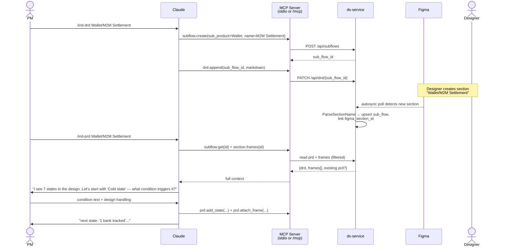

# feat: MCP server + PM authoring workflow (DRD → Figma autosync → typed PRD with role-bound frames)

**Target repo:** indmoney-design-system-docs (this repo)

> **Revision note (2026-05-17):** Plan revised after a `/ce-ideate` pass that produced 7 survivors plus an additional user-requested workflow (HTML prototype as canvas placeholder until designer ships). User direction: "not building MVP." Key shape changes: (a) PRD schema becomes typed *stems* instead of prose blobs so Mixpanel ships in-scope, (b) binding moves from frame-name equality to a Figma `@role` component property, (c) MCP tool surface presents 3 visible verbs with lazy-discovered deep tools, (d) Phase 2 auth becomes file-scoped instead of an OAuth shim, (e) `{sub_product}/{sub_flow}` slug becomes an org-wide join key, (f) autosync auto-creates state skeletons, (g) coverage-wall tool fixes resumption, (h) **HTML prototype attached to DRD renders in a sandboxed iframe in the canvas slot until autosync detects the design on the configured "Final Designs" Figma page, then auto-swaps live**.

> **Execution audit (2026-05-17, post-/ce-work kickoff):** A pre-execution audit + duplication audit ran before any subagent dispatched. The audit surfaced (a) several plan-vs-reality conflicts and (b) high-value reuses where existing patterns or code subsume what the plan would have built. **The corrections below override the plan body where they conflict — units are implemented against the corrections, not the original spec.** See the `## Execution Notes` section near the end of this document for the full audit findings, per-unit reuse pointers, user clarifications, and a running ship log.

---

## Summary

Expose the ds-service backend as MCP tools so PMs author DRDs and PRDs from inside Claude, with the existing Figma autosync + render pipelines binding their writing to specific frames *by stable role*, not by frame name. The PRD is stored as typed stems (acceptance criteria, edge cases, copy strings, events, a11y notes) — not prose blobs — so the same authoring action seeds Mixpanel tracking plans, Playwright test stubs, Storybook stories, and JIRA story descriptions for free. Autosync pre-creates state skeletons from designer-named frames, so the PM never re-encodes the structure the designer already built.

Ships in two phases: local-stdio MCP first (Claude Code / Desktop, no auth lift), then a remote `/mcp` endpoint on ds-service authenticated by **Figma file access** — sidestepping the Claude org-connector shared-OAuth gap (issue #46207) entirely.

The plan rests on one observation drawn from the supplied PRD (`Copy of Dashboard V5`) and three Figma sections (`Asset Widget`, `Liabilities widget`, `Action card`): **PM-meaningful Figma frame names already match PRD "Possible State" row labels** (`Cold state`, `1 bank tracked`, `4+ banks tracked`, `Refresh in progress`, `Offer expiring`, `ROI reduced`, `1 ST EMI next in 45 days`, etc.). That observation seeded the original frame-name binding; the revised plan upgrades it to role-binding (`@role` component property → stable contract; frame name → human label) so renames never silently orphan PRD content. Variant frames (Android / iOS / device duplicates) attach to the same role with different `variant` discriminators.

---

## Problem Frame

Today's PM workflow at INDmoney:

1. PM writes a DRD describing a new flow (e.g. `Wallet/M2M Settlement`).
2. DRD is handed to the designer along with an HTML prototype.
3. Designer creates a Figma section in the appropriate file with the canonical name `{sub_product}/{sub_flow}` (e.g. `Wallet/M2M Settlement`). Inside that section, individual screen frames are named in state language (`Cold state`, `4+ banks tracked`).
4. The autosync pipeline (`figma-autosync-classify`, `figma_node_metadata` mig 0034) already detects new sections, extracts screens, and renders PNGs.
5. **Gap:** the PM then has to write the PRD somewhere disconnected from the design — typically a Google Doc — describing each state's `{Condition, Design Handling, FE Handling}`. Reviewers must cross-reference the doc against the canvas manually. Frames and PRD rows drift. Claude has no way to read the design context when helping the PM write the PRD.

This plan closes that loop:

- **DRD authoring** moves into Claude (via an `ind-drd` / existing skill that calls MCP tools), backed by the existing `drd_collab` YDoc store, but now keyed to a registered `sub_flow` row.
- **Autosync** parses the Figma section name `{sub_product}/{sub_flow}` (parser already exists at `services/ds-service/internal/projects/figma_section_parser.go:41`), looks up the matching `sub_flow` row created from the DRD, and binds frames to it.
- **PRD authoring** runs through a new/updated `ind-prd` skill that pulls the bound frames into Claude's context, asks the PM clarifying questions per state, and writes structured `prd_state` rows (each carrying `{label, condition, design_handling, fe_handling}`) plus `frame_tag` rows linking specific `figma_node_metadata.id` to each state. The PRD is reconstructible end-to-end, and the Next.js viewer (existing `/projects/[id]` routes) renders it with embedded frame thumbnails from the render pipeline.

---

## Output Structure

```
services/ds-service/
  cmd/
    mcp-server/                  # NEW — Phase 2 binary (Phase 1 reuses ds-service /mcp)
      main.go
  internal/
    mcp/                         # NEW — tool registry, JSON-RPC handlers
      registry.go
      meta.go                    # NEW — 3 visible verbs (drd.read, prd.author, section.inspect)
      tools_subflow.go
      tools_section.go
      tools_drd.go
      tools_prd.go               # add_state, add_event, add_acceptance_criterion, …
      tools_export.go
      tools_resolve.go           # NEW — universal slug resolver (#7)
      transport_http.go          # Phase 2: HTTP/SSE handler
      auth_figma_file.go         # NEW — file-scoped auth (replaces auth_oauth)
    projects/
      subflow.go                 # NEW — sub_product + sub_flow repo methods
      subflow_test.go
      prd.go                     # NEW — PRD repo (prd, prd_tab, prd_state, stems, frame_tag, role)
      prd_test.go
      figma_role.go              # NEW — @role component-property read + persistence
      figma_role_test.go
      drd_collab.go              # MODIFIED — accept sub_flow_id key
      repository_figma_autosync.go  # MODIFIED — upsert sub_flow + auto-skeleton prd_state + @role read
      figma_section_parser.go    # UNCHANGED — already parses {sub_product}/{sub_flow}
  migrations/
    0036_sub_flow.up.sql                          # NEW
    0037_prd_and_frame_tags.up.sql                # NEW — typed stems schema
    0038_figma_role.up.sql                        # NEW — role binding

# Local-stdio MCP bridge (Phase 1)
~/.claude/plugins/ind-suite/mcp-bridge/  # ind-suite repo
  package.json
  src/server.ts                  # NEW — stdio MCP server proxying to ds-service HTTP

# Figma plugin (Phase 2, designer tooling for @role)
figma-plugin-role-tagger/         # NEW (separate plugin or extension of existing figma-plugin/)
  manifest.json
  src/ui.tsx
  src/code.ts

# ind-suite skills
ind-prd/                         # MODIFIED — stem-by-stem authoring, opens with the wall
  SKILL.md
  scripts/

# Next.js viewer (this repo)
app/projects/[id]/prd/
  page.tsx                       # NEW — render PRD from API + coverage wall view
  Wall.tsx                       # NEW — corkboard view component
app/api/projects/[id]/prd/
  route.ts                       # NEW — proxy to ds-service
app/api/resolve/[slug]/
  route.ts                       # NEW — universal slug resolver proxy

# Conventions doc
docs/conventions/sub-product-slug.md  # NEW — Mixpanel/Storybook/Sentry/JIRA slug convention
```

The per-unit `**Files:**` lists below remain authoritative. The implementer may adjust if the layout reveals friction.

---

## Scope Boundaries

**In scope (this plan):**
- New `sub_product` + `sub_flow` first-class entities and migrations.
- Wire the existing section-name parser into autosync so sub-flow rows are upserted automatically.
- **Auto-skeleton:** autosync auto-creates `prd_state` rows from designer-named frames so the PM never re-encodes structure.
- Extend `drd_collab` to key DRDs by `sub_flow_id`.
- **Typed PRD storage** — `prd`, `prd_tab`, `prd_state`, `frame_tag`, plus typed-stem children (`prd_state_acceptance_criterion`, `prd_state_edge_case`, `prd_state_copy_string`, `prd_state_event`, `prd_state_a11y_note`) and a `figma_role` table.
- **Mixpanel event tracking-plan is in-scope** via `prd_state_event` — typed name + properties schema + fires_on. No deferred JSONB blob.
- **Role binding:** read Figma component property `@role` during autosync; persist as `figma_role.name` keyed to `figma_node_id`. PRD content binds through `role_id`, not name.
- New `internal/mcp/` Go package implementing the tool registry over JSON-RPC with **progressive discovery** — 3 visible verbs (`drd.read`, `prd.author`, `section.inspect`) and ~13 deep tools reachable via on-demand schemas. Phase 1 exposes it through a local-stdio bridge in `ind-suite/mcp-bridge/`. Phase 2 adds an HTTP/SSE `/mcp` endpoint on ds-service for Claude Connector registration.
- **Coverage-wall tool:** `section.outline_states` returns the corkboard view (frames + binding status + word count + last-touched) so PMs resume at the wall, not a blank cursor.
- **File-scoped auth (Phase 2):** Figma file access verification replaces the OAuth shim. Claude org-connector's shared-OAuth gap is sidestepped entirely.
- Updated `ind-prd` skill that drives **stem-by-stem** authoring through the MCP tools (state → criteria → edge cases → copy → events → a11y), always opens with the wall.
- Next.js `/projects/[id]/prd` route rendering the PRD with embedded frame PNGs **and** the coverage wall as a first-class view.
- **Universal slug resolver:** new `resolve(slug)` tool returns Figma + PRD + Storybook + events + Sentry joined by `{sub_product}/{sub_flow}` slug. Conventions doc captures the org-wide identifier contract.
- Filesystem export tool (`prd.export`) writing markdown to `~/INDmoney/<sub_product>/Documents/` for ind-suite parity. Markdown is the rendered prose; the typed stems are also exported as a sidecar `prd.json` so downstream tools don't re-parse markdown.
- **Figma plugin (Phase 2):** small plugin that makes setting `@role` a one-keystroke designer action; not blocking Phase 1 (Phase 1 works on whatever roles the designer manually applies).
- **HTML prototype as canvas placeholder (KTD-8):** new MCP tool `drd.attach_prototype(sub_flow_id, html_url, title?)` lets the PM attach a prototype URL at DRD time. Viewer renders the prototype in a sandboxed iframe in the canvas slot until autosync detects the final design on the configured "Final Designs" Figma page, at which point the canvas auto-swaps to rendered frames. Lifecycle: `proto-only` → `proto + design-in-WIP` → `design-shipped`.

**Deferred to Follow-Up Work:**
- **Concurrent multi-PM PRD editing** — DRD uses YDoc (Yjs) for collaborative editing. PRD ships single-writer with optimistic locking; YDoc parity is a future migration if friction demands it.
- **Phase 2 production hosting** — Cloudflare tunnel covers dev. Choosing prod hosting (Fly app, Vercel function, etc.) is operational and decided when Phase 2 ships.
- **Fuzzy / slug-based section name matching** — workflow guarantees exact match (designer follows the `{sub_product}/{sub_flow}` convention). Overrides table covers human error; broader matching strategies wait for a real collision.
- **Cross-team adoption of the universal slug as Mixpanel / Storybook / Sentry / JIRA convention** — KTD-6 ships the ds-service side; adoption is org coordination work that ratchets over quarters.
- **PRD-as-state-machine reframe** (modeling transitions explicitly, not just states) — honorable mention from ideation; deferred to v2.
- **Unified DRD+PRD single document** — honorable mention from ideation; would collapse two storage layers. Re-litigate when the seam becomes painful.

**Out of scope (not this product):**
- Changes to the figma autosync extraction itself, render pipeline, or asset stream. Those are reused as-is.
- Replacing the existing DRD store with something other than `drd_collab`. We extend it.
- Building a separate web editor for PRDs. The authoring surface is Claude; the viewer is read-only.

---

## Key Technical Decisions

### KTD-1. Two-phase MCP delivery: local-stdio first, remote follow-up

Ships in two phases to derisk the auth/transport story while still letting PMs use the tools in week one.

- **Phase 1 (local-stdio):** A small Node MCP server in `ind-suite/mcp-bridge/` runs as a stdio server registered in Claude Desktop / Code config. It accepts MCP tool calls, forwards them as HTTP requests to ds-service (`http://localhost:8080`) with the PM's existing JWT (minted by `mint-tokens` CLI) in the `Authorization` header. No OAuth, no tunnel, no new public surface. Works in Claude Code and Claude Desktop — not claude.ai web.
- **Phase 2 (remote MCP):** Same `internal/mcp/registry.go` is bound to a new `/mcp` HTTP/SSE route on ds-service. An OAuth 2.0 authorization-code shim wraps the JWT mint, so Claude Connector's standard registration flow works. Cloudflare tunnel exposes the dev port; prod hosting decided separately.

The shared registry means Phase 2 is a transport change, not a re-implementation.

### KTD-2. Sub-product and sub-flow are first-class rows, not parsed strings

`ParseSectionName` exists but its output isn't persisted. We add `sub_product` and `sub_flow` tables keyed by name (case-insensitive, trimmed). Figma autosync upserts these when it sees a new section. DRD and PRD rows reference `sub_flow_id` (foreign key), so the entire authoring graph navigates by ID, not string match.

This matters because the workflow allows a DRD to exist *before* the Figma section (PM writes the DRD first, designer creates the section later). The `sub_flow` row is created at DRD time; autosync looks it up by name when the section appears.

### KTD-3. PRD schema is **typed stems**, not a prose blob

After reading `Copy of Dashboard V5`, the PRD layout is the same across every widget. But the *value* of each PRD row is split across several distinct kinds of content — and every downstream consumer wants only one of those kinds. A prose-blob PRD forces Storybook, Playwright, Mixpanel, and JIRA to each re-parse markdown to extract the bit they need.

The schema therefore stores the typed stems directly:

- `prd` (one per `sub_flow`) — top-level prose like "Investment widget to support 3 tabs..."
- `prd_tab` (one per tab in the PRD: Investment Tab, Banks Tab, Protection Tab, etc.) — carries `overview_md` (the bullet list before the "Possible States" table)
- `prd_state` (one per state) — carries `label`, `position`, `role_id` (FK → `figma_role`), and per-state freeform `condition_md` / `design_handling_md` / `fe_handling_md`
- `prd_state_acceptance_criterion` (many per state) — `(prd_state_id, position, criterion)`
- `prd_state_edge_case` (many per state) — `(prd_state_id, position, case)`
- `prd_state_copy_string` (many per state) — `(prd_state_id, key, value, locale)`
- `prd_state_event` (many per state) — `(prd_state_id, position, name, properties_schema JSONB, fires_on)` — the Mixpanel tracking-plan source of truth
- `prd_state_a11y_note` (many per state) — `(prd_state_id, position, note)`
- `frame_tag` (many-to-one onto `prd_state`) — links `figma_node_metadata.id` → `prd_state.id` with an optional `variant` discriminator (`android`, `ios`, etc.). The binding is canonically through `role_id`; `figma_node_id` is the concrete frame currently fulfilling that role.

The viewer composes prose at render time from these stems. Storybook story generation reads `copy_strings` + `role`; Playwright test gen reads `acceptance_criteria` + `edge_cases`; Mixpanel tracking-plan export reads `events`; JIRA story creation reads `acceptance_criteria`. One PM authoring action populates four downstream systems for free. **Mixpanel is no longer deferred** — the `prd_state_event` table is the typed shape it always needed.

### KTD-4. Binding is by **`@role` component property**, not by frame name

The original draft of this plan made frame names canonical. The revised plan keeps designer naming canonical for *display*, but binding flows through a separate stable identifier: a Figma component property `@role` that the designer attaches to each PM-meaningful frame (`cold_state`, `loading`, `bank_tracking_failed`, `four_plus_banks_tracked`). `frame_tag` references `(figma_node_id, role)`, and `prd_state.role_id` is the canonical link.

Why this changes from the previous KTD-4:

- Code Connect issue #194 documents that name-string binding is unresolved-fragile in production. Frame renames silently break links.
- The DNS analogy is the right one: `figma_node_id` = IP (opaque + stable, but rotates on file moves), `@role` = canonical alias (stable contract, refactor-safe), frame name = hostname (human-readable, mutable, display-only).
- The new contract: **frame rename does nothing. Role change is intentional and surfaces as a binding event.** PRD content survives any designer refactor that doesn't change role assignments.

`section.frames` still returns names verbatim (per the original KTD: designer naming is canonical for display). The change is at the *binding* layer, not the display layer. A small Figma plugin (U12) makes setting `@role` a one-keystroke action.

### KTD-5. MCP tool surface is **progressively discovered** — 3 visible tools, ~13 lazy

Production MCP servers exhibit a documented anti-pattern: large flat tool catalogs that consume thousands of cold tokens before the user types. 4 MCP servers already cost 7k cold tokens. 97.1% of production MCP tool descriptions have at least one "smell."

The revised surface exposes **3 visible verbs**: `drd.read`, `prd.author`, `section.inspect`. Each returns inline next-action hints and on-demand schemas for the deep tools. The deep tools (`prd.add_state`, `prd.add_event`, `prd.add_acceptance_criterion`, `prd.attach_frame`, `section.outline_states`, `resolve`, etc.) are reachable but not always-loaded.

- Cold context drops from ~3-4k tokens (10 flat tools, full descriptions) to ~1.5k (3 visible + meta-schema).
- Three workflow verbs map to the PM mental model (`read what's there`, `write the spec`, `look at the section`).
- The full ~16 deep tools remain accessible to automation that bypasses the meta layer.

### KTD-6. `{sub_product}/{sub_flow}` is the **universal join key** across the org

1,313 Figma sections are already canonically named `{sub_product}/{sub_flow}`. The revised plan locks that slug as the org-wide identifier across every system: Mixpanel event prefix (`wallet.m2m_settlement.cold_state_viewed`), Storybook story path (`wallet/m2m-settlement/cold-state`), Sentry tag (`feature=wallet/m2m_settlement`), JIRA component, ds-service entity. A new `resolve(slug)` tool returns Figma frames + PRD states + Storybook stories + last week's events + open Sentry issues — joined by slug.

This is the compounding move: every new tool that joins on the slug becomes 10× more valuable. The work in this plan is small (a slug resolver, a conventions doc, helper functions); the leverage scales over quarters as downstream systems adopt.

### KTD-8. **HTML prototype is the canvas placeholder** until the designer ships

The DRD-to-design handoff has a real-world gap: the PM has the prototype today, the designer ships final frames days later. The viewer should not be empty during that gap — it should render the PM's HTML prototype in the place where the Figma canvas will eventually appear, then auto-swap when autosync detects the final design on the right Figma page.

Lifecycle of a `sub_flow`'s center pane:

1. **Proto-only** (`figma_section_id IS NULL`, `prototype_url IS NOT NULL`) — PM has authored a DRD and attached a prototype URL. Viewer renders the prototype in a sandboxed iframe alongside the DRD. PRD authoring is allowed against proposed state names; frames bind later.
2. **Proto + design-in-WIP** — designer is working on the section but it's not on the configured "Final Designs" page yet. Viewer still shows the prototype. autosync has parsed the WIP section but does not flip `figma_section_id`.
3. **Design-shipped** (`figma_section_id IS NOT NULL`) — autosync detected the section on the **Final Designs page** (per-sub-product convention, default page name `Final Designs`). Viewer swaps from the iframe to the rendered Figma frames. The prototype URL stays on `sub_flow` for history but gets a "superseded" badge.

The "Final Designs page" gate is the crucial part: designers WIP sections in scratch pages without triggering the swap. The flip is deliberate and inspectable.

---

### KTD-7. Phase 2 auth is **file-scoped**, not OAuth-shim-wrapped per-user

The original plan added an OAuth shim wrapping the existing JWT mint for Phase 2. But Claude org-connectors currently use a single shared OAuth token (issue #46207), making per-user data isolation impossible at the connector layer regardless of how clean our OAuth shim is.

The revised auth model: Phase 2 remote MCP authenticates by **Figma file ID**. The PM presents a Figma session token or a short-lived ds-service-minted bridge token verifying Figma edit access. Authz becomes "do you have edit on file `aIgxN…`?" If yes, you can author the spec for any section in that file. Identity is logged for audit, but authorization is file-scoped.

This matches how Notion+Figma, Linear+Figma, and Productboard actually behave in practice (file access = workflow access) and sidesteps the connector OAuth gap entirely.

### KTD-4. **The designer's naming is canonical. The server does not filter, infer, or guess.**

Whatever names the designer applies in Figma are returned verbatim by `section.frames`. There is no blocklist, no regex, no heuristic, no "PM-meaningful vs generic" distinction. If the designer names a frame `Cold state`, the tool returns `Cold state`. If they name it `Frame 2147227476`, the tool returns `Frame 2147227476`. The contract is: **designer-named frames are the truth**, and naming hygiene lives with the designer at section authoring time — the same place `{sub_product}/{sub_flow}` section naming already lives.

This eliminates an entire class of disagreement between server and human. The PM and the designer both look at the same names, the tool reflects them, and the loop closes without server-side interpretation. If a frame name is wrong, the fix happens in Figma, not in code.

### KTD-5. MCP tool surface stays at the verb/noun level

The tool list is small and stable:

| Tool | Direction | Purpose |
|---|---|---|
| `subflow.list` | read | PM browses what exists |
| `subflow.get` | read | Pull DRD + PRD + frames for a sub-flow |
| `subflow.create` | write | Register a new sub-flow when starting a DRD |
| `section.frames` | read | List taggable frames for a sub-flow's bound section |
| `drd.get` / `drd.append` | r/w | Read or extend the DRD YDoc snapshot |
| `prd.get` | read | Load PRD as structured JSON |
| `prd.upsert_tab` | write | Add or update a tab with its overview |
| `prd.add_state` | write | Add a state row to a tab |
| `prd.attach_frame` | write | Tag a frame to a state row |
| `prd.export` | write | Mirror PRD to `~/INDmoney/<sub_product>/Documents/` markdown |

Skill scripts in `ind-suite/ind-prd/` compose these — the MCP server stays free of workflow opinions.

---

## High-Level Technical Design

The end-to-end flow once both phases ship:



This illustrates the intended approach and is directional guidance for review, not implementation specification.

---

## Implementation Units

### U1. Add `sub_product` and `sub_flow` tables + repo

**Goal:** First-class storage for the `{sub_product}/{sub_flow}` taxonomy that already exists as parsed strings.

**Files:**
- `services/ds-service/migrations/0036_sub_flow.up.sql` (new)
- `services/ds-service/internal/projects/subflow.go` (new)
- `services/ds-service/internal/projects/subflow_test.go` (new)

**Approach:**
- `sub_product (id, name UNIQUE, slug UNIQUE, tenant_id, created_at)` — slug is the org-wide identifier (KTD-6).
- `sub_flow (id, sub_product_id FK, name, slug, tenant_id, drd_id NULL, figma_section_id NULL, created_at, UNIQUE(sub_product_id, name), UNIQUE(sub_product_id, slug))`
- **Composite slug** is `{sub_product.slug}/{sub_flow.slug}` — the universal join key (KTD-6). Helper `(s *SubFlow) FullSlug() string` returns it. Mixpanel events, Storybook stories, Sentry tags, JIRA components all use this string verbatim. The conventions doc (U9b) is the contract.
- Repo methods: `UpsertSubProduct`, `UpsertSubFlow`, `GetSubFlowByName(sub_product, name)`, `GetSubFlowBySlug(fullSlug)`, `GetSubFlowByFigmaSection(section_id)`, `ListSubFlows(sub_product?)`.
- Case-insensitive matching on names; slugs are normalized lowercase + kebab during upsert (`m2m settlement` → `m2m-settlement`).

**Patterns to follow:** Tenant scoping in `services/ds-service/internal/projects/repository.go` (every query joins on `tenant_id`). Migration style in `services/ds-service/migrations/0034_figma_node_metadata.up.sql`.

**Test scenarios:**
- Happy path: `UpsertSubProduct("Wallet")` returns a stable id on second call.
- Edge: `UpsertSubFlow("WALLET", "M2M Settlement")` matches existing `("Wallet", "M2M settlement")` row case-insensitively.
- Edge: Two sub-flows with the same name under different sub-products coexist.
- Error: Empty name rejected with explicit error.
- Integration: After `UpsertSubFlow`, `GetSubFlowByName` round-trips with original casing preserved.

**Verification:** Migration applies cleanly on a fresh DB and on the current 106 MB dev DB. Repo tests pass.

---

### U2. Wire autosync to upsert sub-flow rows on section detection

**Goal:** When `figma-autosync-classify` discovers a new section, parse its name and ensure the matching `sub_product` / `sub_flow` rows exist, binding `sub_flow.figma_section_id`.

**Dependencies:** U1

**Files:**
- `services/ds-service/internal/projects/repository_figma_autosync.go` (modified)
- `services/ds-service/internal/projects/repository_figma_autosync_test.go` (modified)

**Approach:**
- In the section-classification path, call `ParseSectionName(section.Name)` (already at `services/ds-service/internal/projects/figma_section_parser.go:41`).
- `UpsertSubProduct(subProduct)` → `UpsertSubFlow(sub_product_id, subFlow)` → set `sub_flow.figma_section_id = section.id`.
- If a `sub_flow` row already exists (PM created it via the DRD path before the section appeared), the upsert links the existing row instead of creating a duplicate.
- Slash-less section names land under the `(unassigned)` sub-product (parser's existing behavior) — keep the existing bucket.

**Patterns to follow:** Existing autosync stages in `repository_figma_autosync.go` — keep this step idempotent and inside the existing transaction boundary.

**Test scenarios:**
- Happy path: New section `Wallet/M2M Settlement` creates `sub_product=Wallet`, `sub_flow=M2M Settlement`, linked to section.
- Edge: Existing `sub_flow` (created via DRD) gets its `figma_section_id` filled on first autosync pass.
- Edge: Section rename from `Wallet/Foo` to `Wallet/Bar` creates a new `sub_flow` (the old one stays — represents PM intent that may still hold).
- Edge: Slash-less section name `Onboarding` lands under `(unassigned)`.
- Integration: Re-running autosync on an unchanged section is a no-op (no duplicate rows, no FK churn).

**Verification:** Run autosync against the dev DB. The three demo sections (`Asset Widget`, `Liabilities widget`, `Action card`) produce three `(unassigned)` sub-flow rows (no `/` in names). Re-run is idempotent.

---

### U2b. Auto-skeleton: pre-create `prd_state` rows from designer-named frames

**Goal:** When autosync binds a Figma section, ds-service auto-creates one `prd_state` row per PM-meaningful frame, pre-titled from the frame name. The PM never re-encodes the state structure — they only fill content. (Survivor #1.)

**Dependencies:** U1, U2, U4 (typed schema must exist), U5b (`@role` read must run first so the auto-skeleton can carry `role_id`)

**Files:**
- `services/ds-service/internal/projects/repository_figma_autosync.go` (modified — extend the section-classification path)
- `services/ds-service/internal/projects/prd.go` (extends — `AutoSkeleton(sub_flow_id, frames []FrameWithRole)`)
- `services/ds-service/internal/projects/repository_figma_autosync_test.go` (modified)

**Approach:**
- Inside the same transaction that upserts the `sub_flow` row (U2), upsert a `prd` row, a default `prd_tab` (if the section has no tab structure yet), and one `prd_state` row per direct-child frame in the section.
- Each `prd_state` row carries: `label = frame.name` (verbatim, per KTD-4 designer-canonical display), `role_id` (resolved from U5b), `position` (Figma canvas y-order), and empty stem children.
- Skip frames whose name is a Figma default (`Frame \d+`, `Rectangle \d+`, `List \d+`, etc.). Use the same regex blocklist used today only for *skeleton creation* — `section.frames` still returns these per the unchanged U5 contract.
- **Idempotent re-runs**: re-running autosync on an existing section does not duplicate `prd_state` rows. Match on `(prd_tab_id, role_id)` when role exists, falling back to `(prd_tab_id, label)` when role is null.
- **Deletion on rename**: if a designer removes a frame from the section, the corresponding `prd_state` row is *soft-deleted* (a `deleted_at` column) so authored content isn't lost on a temporary refactor. PM sees orphans in the coverage wall (U6b) with a "this frame was removed from Figma" badge and can either restore (designer adds the frame back) or hard-delete via `prd.purge_orphan_state`.

**Test scenarios:**
- Happy path: First autosync of a fresh section with 7 named frames creates 7 `prd_state` rows in canvas y-order with matching labels.
- Edge: Re-running autosync on the same section is a no-op (no duplicate rows, no churn).
- Edge: Designer adds an 8th frame → next autosync creates the 8th `prd_state` row at the correct position; existing 7 untouched.
- Edge: Designer removes a frame → corresponding `prd_state` row is soft-deleted; authored content (acceptance criteria, events, etc.) preserved.
- Edge: Frames named `Frame 217312`, `Rectangle 4327…` are skipped during skeleton creation.
- Integration: Run against the 3 demo sections; verify `prd_state` rows for `Asset Widget` map 1:1 with frames `Cold state`, `Hot state`, `Track policy`, etc.

**Verification:** PM running `/ind-prd` on a freshly-bound section sees a populated wall (U6b) immediately, never a blank doc.

---

### U3. Extend `drd_collab` to key DRDs by sub_flow_id

**Goal:** DRDs reference a registered `sub_flow` rather than a free-form slug.

**Dependencies:** U1

**Files:**
- `services/ds-service/internal/projects/drd_collab.go` (modified)
- `services/ds-service/internal/projects/drd_collab_test.go` (modified)

**Approach:**
- Add `sub_flow_id` column to the DRD table (or whatever `LoadYDocState` reads). Backfill the existing rows by best-effort name match; rows that can't be matched keep their legacy slug and a NULL `sub_flow_id` until manually relinked.
- New repo methods: `CreateDRDForSubFlow(sub_flow_id)`, `LoadYDocStateBySubFlow(sub_flow_id)`.
- Existing `resolveDRDFlowID(slug, flowID)` stays for backwards compatibility but acquires a `sub_flow_id` lookup path.

**Execution note:** Start with a characterization test capturing current DRD load/persist behavior before threading `sub_flow_id` through — this code carries YDoc snapshot state and is easy to break invisibly.

**Test scenarios:**
- Happy path: `CreateDRDForSubFlow(id)` creates a fresh YDoc snapshot keyed to the sub-flow.
- Edge: Loading a DRD twice returns identical bytes (snapshot stability).
- Edge: Legacy slug-based load path still works for un-migrated rows.
- Integration: A DRD created against a `sub_flow` row, then linked to a Figma section by U2, is reachable from both `LoadYDocStateBySubFlow` and the existing slug path.

**Verification:** Existing DRD UI continues to work unchanged. New `sub_flow_id`-keyed access works in parallel.

---

### U3b. DRD prototype attachment + canvas lifecycle (KTD-8, Survivor: prototype-as-placeholder)

**Goal:** Let the PM attach an HTML prototype URL to a `sub_flow` at DRD time. Persist a canvas-lifecycle state (`proto-only` / `proto+wip` / `design-shipped`). Gate the swap to "design-shipped" on the section appearing on the configured **Final Designs** Figma page, not on any page in the file.

**Dependencies:** U1, U3

**Files:**
- `services/ds-service/migrations/0036_sub_flow.up.sql` (modified — add `prototype_url`, `prototype_title`, `prototype_attached_at`, `prototype_superseded_at` columns to `sub_flow`; add `final_design_page_name TEXT DEFAULT 'Final Designs'` to `sub_product`)
- `services/ds-service/internal/projects/subflow.go` (extends — `AttachPrototype`, `DetachPrototype`, `CanvasLifecycle(sub_flow_id) → state enum`)
- `services/ds-service/internal/projects/subflow_test.go` (modified)
- `services/ds-service/internal/projects/repository_figma_autosync.go` (modified — gate `figma_section_id` flip on Final-Designs-page residency)
- `services/ds-service/internal/projects/repository_figma_autosync_test.go` (modified)

**Approach:**

**Schema additions:**

```
sub_product
  + final_design_page_name TEXT DEFAULT 'Final Designs'   -- per-LOB designer convention

sub_flow
  + prototype_url TEXT NULL                               -- iframe target
  + prototype_title TEXT NULL                             -- shown in viewer
  + prototype_attached_at TIMESTAMP NULL
  + prototype_superseded_at TIMESTAMP NULL                -- set when figma_section_id flips
```

**Autosync gate (the load-bearing change):**

The current autosync upserts `sub_flow.figma_section_id` as soon as a section parses to a matching `{sub_product}/{sub_flow}` name, regardless of which Figma page hosts the section. The revised autosync checks page residency before flipping:

- If the section lives on the sub-product's configured `final_design_page_name` page → flip `sub_flow.figma_section_id` to that section, set `sub_flow.prototype_superseded_at = NOW()`, emit `figma.design_shipped` SSE event on `inbox:<tenant_id>`.
- If the section lives on any other page → parse and store the section data normally (so U2b auto-skeleton can still propose state structures the PM can preview), but do **not** flip `figma_section_id`. Surface this as `design_in_wip` status on `section.inspect` so PM/designer can see the WIP section before it's promoted.

**Lifecycle resolver:** `CanvasLifecycle(sub_flow_id)` returns one of:
- `proto-only` — `prototype_url NOT NULL AND figma_section_id IS NULL`
- `proto+wip` — `prototype_url NOT NULL AND figma_section_id IS NULL AND` at least one section parsed to this slug on a non-final page
- `design-shipped` — `figma_section_id IS NOT NULL`
- `empty` — neither prototype nor section (DRD just created, no attachment yet)

**MCP tool surface additions** (added to U6 deep-tool catalog):
- `drd.attach_prototype(sub_flow_id, html_url, title?)` — validates URL is HTTPS, stores on `sub_flow`, emits `drd.prototype_attached` SSE event
- `drd.detach_prototype(sub_flow_id)` — manual detach (rarely needed; auto-detach happens when design ships)

**Iframe sandboxing (U9 viewer concern, foreshadowed here):** the viewer renders `prototype_url` in `<iframe sandbox="allow-scripts allow-same-origin allow-forms" referrerpolicy="no-referrer">`. URL must be HTTPS. We accept any host in v1 — PM-hosted Figma prototypes, internal preview environments, public sandboxes. A future hardening pass can restrict to an allowlist.

**Test scenarios:**
- Happy path: PM attaches prototype URL to fresh sub_flow → `CanvasLifecycle = proto-only`; designer ships section on WIP page → `proto+wip`; designer moves section to Final Designs page → `design-shipped`, `prototype_superseded_at` set, SSE event fires.
- Edge: PM attaches a non-HTTPS URL → rejected with explicit error.
- Edge: Section appears directly on Final Designs page (designer skips WIP) → lifecycle goes `empty → design-shipped` or `proto-only → design-shipped` in one autosync pass.
- Edge: Section moves *off* Final Designs page (designer demotes back to WIP) → `figma_section_id` stays linked (we don't un-flip; would lose authored PRD bindings) but autosync emits a warning. The PM can choose to manually clear via override.
- Edge: Sub-product has custom `final_design_page_name` (e.g. some LOBs use `Final` or `Production`) — autosync honors the per-sub-product config.
- Edge: PM attaches prototype after design ships (out-of-sequence) → stored with `prototype_superseded_at` already set; viewer ignores it (Figma takes precedence) but the URL is preserved for history.

**Verification:** Full lifecycle walkthrough — PM attaches a prototype, viewer renders it in iframe, designer ships to Final Designs page, viewer auto-swaps to Figma frames on the next SSE tick without a page reload.

---

### U4. PRD schema: typed stems (KTD-3)

**Goal:** Persistent storage for the PRD as **typed stems**, not prose blobs. Mirrors the supplied sample but factors each value-class into its own table so downstream consumers (Storybook gen, Playwright gen, Mixpanel export, JIRA story creation) read their own stem without re-parsing markdown.

**Dependencies:** U1

**Files:**
- `services/ds-service/migrations/0037_prd_and_frame_tags.up.sql` (new)
- `services/ds-service/internal/projects/prd.go` (new)
- `services/ds-service/internal/projects/prd_test.go` (new)

**Approach:**

Schema (KTD-3):
```
prd (id, sub_flow_id FK UNIQUE, title, summary_md, design_notes_md, created_at, updated_at)
prd_tab (id, prd_id FK, name, position INT, overview_md, UNIQUE(prd_id, name))
prd_state (
  id, prd_tab_id FK, label, position INT,
  role_id FK→figma_role NULL,   -- KTD-4: canonical binding via role
  condition_md, design_handling_md, fe_handling_md,
  deleted_at NULL,              -- U2b soft-delete on frame removal
  UNIQUE(prd_tab_id, label) WHERE deleted_at IS NULL
)

-- Typed stems (KTD-3) — every downstream consumer's source of truth
prd_state_acceptance_criterion (id, prd_state_id FK, position INT, criterion TEXT)
prd_state_edge_case (id, prd_state_id FK, position INT, case TEXT)
prd_state_copy_string (id, prd_state_id FK, key TEXT, value TEXT, locale TEXT DEFAULT 'en', UNIQUE(prd_state_id, key, locale))
prd_state_event (
  id, prd_state_id FK, position INT,
  name TEXT,                    -- Mixpanel event name; conventions doc enforces {slug}.{verb}
  properties_schema JSONB,      -- {prop_name: type, ...} — typed, validated
  fires_on TEXT,                -- e.g. "user_taps_cta" / "screen_viewed" / "submit_success"
  UNIQUE(prd_state_id, name)
)
prd_state_a11y_note (id, prd_state_id FK, position INT, note TEXT)

frame_tag (
  id, prd_state_id FK,
  figma_node_id FK→figma_node_metadata,
  role_id FK→figma_role NULL,
  variant TEXT NULL,            -- android | ios | desktop | mobile_web
  position INT,
  UNIQUE(prd_state_id, figma_node_id, variant)
)
```

- **Mixpanel is in-scope**: `prd_state_event` is the typed tracking-plan source of truth. No JSONB-blob with deferred schema. The `name` column is validated to match `{sub_product.slug}.{sub_flow.slug}.{verb}` at write time (KTD-6 convention).
- **Role-canonical binding**: `frame_tag.role_id` ties the tag to a stable `figma_role` row (U5b); `figma_node_id` is the concrete frame currently fulfilling that role. Frame rename does nothing; role change is the intentional event.
- Repo methods mirror the MCP tool list: `UpsertPRD`, `UpsertPRDTab`, `UpsertPRDState`, `AddAcceptanceCriterion`, `AddEdgeCase`, `UpsertCopyString`, `AddEvent`, `AddA11yNote`, `AttachFrameTag`, `DetachFrameTag`, `LoadPRD(sub_flow_id)` (returns full nested struct with stems).
- Composed-prose helper `RenderPRDMarkdown(prd_id)` walks the typed stems and emits the markdown the viewer shows + `prd.export` writes.

**Test scenarios:**
- Happy path: Round-trip a full PRD (1 tab, 3 states, 6 frames, 12 acceptance criteria, 8 events, 4 copy strings) through `UpsertPRD` + stem `Add*` calls → `LoadPRD`.
- Edge: Re-running `UpsertPRDState` with the same `(prd_tab_id, label)` updates in place.
- Edge: Soft-deleted `prd_state` (deleted_at NOT NULL) hides from `LoadPRD` by default but is recoverable via `UpsertPRDState` with the same label (clears `deleted_at`).
- Edge: `AddEvent` rejects a `name` that doesn't match the `{sub_product}.{sub_flow}.{verb}` shape.
- Error: Attach a `figma_node_id` that doesn't belong to the sub_flow's bound section — rejected.
- Integration: Cascading delete of `sub_flow` clears PRD, all stems, and frame_tags.
- Composed: `RenderPRDMarkdown` for the Asset Widget Investment Tab matches the structure of the supplied sample (table-like layout of states with their stems).

**Verification:** Manual seeding of the Asset Widget sample (Investment Tab + 7 states with their states, criteria, events, copy) reconstructs into the same structure on `LoadPRD`. `RenderPRDMarkdown` output matches the supplied sample's layout.

---

### U5. Section-frames listing helper (no filtering, designer names are canonical)

**Goal:** Return every frame in a section with the designer's name, exactly as Figma stores it. The tool does not filter, deduplicate, or interpret names.

**Dependencies:** none (uses existing `figma_node_metadata`)

**Files:**
- `services/ds-service/internal/projects/figma_section_subtree.go` (modified — extend, don't replace existing fns)
- `services/ds-service/internal/projects/figma_section_subtree_test.go` (modified)

**Approach:**
- Per KTD-4: the designer's frame name is the truth. No blocklist, no regex, no candidate/non-candidate distinction.
- Public function `ListSectionFrames(sectionID string) []FrameRow`. `FrameRow` carries `{node_id, name, parent_node_id, depth, bbox, has_render}`.
- Variant disambiguation: if two frames share the same name within the same section, return both rows — the PM/Claude assigns a `variant` label at `prd.attach_frame` time. The server does not pre-classify.
- Ordering: by section subtree depth-first traversal, then by `absoluteBoundingBox.y` ascending — so the PM sees frames in the order the designer laid them out on the canvas.
- Empty section: return an empty array, not an error. If there are zero frames, that's a designer/Figma fact, not a tool failure.

**Test scenarios:**
- Happy path: From the `Asset Widget` section, return all 166 direct children with their designer-given names verbatim (`Cold state`, `Hot state`, `Frame 2147227476`, `List 343` — all of them).
- Happy path: Frame names with leading/trailing whitespace are returned as-is (designer's choice).
- Edge: Same-name frames at different positions return as separate rows in canvas order.
- Edge: Empty section returns `[]`, not nil, not an error.
- Edge: Section with only Figma-default-named frames (no state-language names) returns those frames unchanged — the PM and designer resolve naming offline, not via the tool.

**Verification:** Run against the three sample sections. Total row count matches the Figma API's direct-children count exactly. No names are altered, dropped, or grouped.

---

### U5b. Read Figma `@role` component property during autosync (KTD-4)

**Goal:** Persist the designer-applied `@role` component property as the stable binding identifier. Frame name remains canonical for display (U5); `@role` becomes canonical for binding. (Survivor #3.)

**Dependencies:** U1; runs as part of the autosync pipeline before U2b (auto-skeleton needs `role_id`).

**Files:**
- `services/ds-service/migrations/0038_figma_role.up.sql` (new)
- `services/ds-service/internal/projects/figma_role.go` (new)
- `services/ds-service/internal/projects/figma_role_test.go` (new)
- `services/ds-service/internal/projects/repository_figma_autosync.go` (modified — extract `@role` from `figma_node_metadata.component_properties`)
- `services/ds-service/internal/figma/inventory/` (modified — ensure component-property data is captured during the existing extraction; it likely already is, just unsurfaced)

**Approach:**
- Schema: `figma_role (id, name TEXT, tenant_id, figma_node_id FK UNIQUE, sub_flow_id FK NULL, deleted_at NULL, UNIQUE(sub_flow_id, name) WHERE deleted_at IS NULL)`.
- Autosync step: when ingesting a section, walk its direct-child frames; for each frame, read its `componentProperties["@role"]` (or whatever convention we lock — see Open Questions). If present, upsert a `figma_role` row keyed to `(sub_flow_id, name)`, linked to `figma_node_id`.
- **Role events** (audit + cross-surface visibility): on role *change* (a role name on a node changes between syncs) or role *deletion* (frame loses its `@role` property), emit a `figma.role_changed` SSE event on `inbox:<tenant_id>` so the viewer and `/ind-prd` skill can surface the change to the PM.
- **Fallback when designer hasn't applied `@role`** (Phase 1 reality): if a frame has no `@role`, the auto-skeleton (U2b) creates a `prd_state` with `role_id = NULL`. The binding still works via `figma_node_id` for now; the PM sees a "role missing — ask designer to tag" badge on the wall (U6b). When the designer applies `@role`, autosync upserts the role and links existing `prd_state.role_id`. This makes role adoption gradual — Phase 1 PMs can author against name-binding while the Figma plugin (U12) drives role adoption in Phase 2.

**Test scenarios:**
- Happy path: Frame with `@role=cold_state` produces a `figma_role` row; `prd_state.role_id` is set on auto-skeleton creation.
- Edge: Frame without `@role` — `prd_state` created with `role_id = NULL`; viewer shows "role missing" badge.
- Edge: Designer renames a frame from `Cold state` → `Frozen state` but keeps `@role=cold_state` — `figma_role` row unchanged, `prd_state.role_id` survives, `prd_state.label` updates on next autosync to `Frozen state` (display follows display).
- Edge: Designer changes `@role` from `cold_state` to `empty_state` — emits `figma.role_changed` event; existing `prd_state.role_id` becomes orphaned; surfaced in wall as "binding broken — review."
- Edge: Two frames with the same `@role` within a section — rejected with a clear error (role names must be unique within sub-flow).

**Verification:** Apply `@role` properties to 3 frames in the `Asset Widget` test file; re-run autosync; confirm 3 `figma_role` rows + auto-skeleton `prd_state` rows linked correctly.

---

### U6. MCP tool registry with progressive discovery (KTD-5)

**Goal:** A transport-agnostic JSON-RPC tool registry that both Phase 1 (stdio) and Phase 2 (HTTP/SSE) call into. The registry implements **progressive discovery** (KTD-5) — 3 always-loaded meta-verbs and ~13 deep tools reachable via on-demand schemas — so cold context drops from ~3-4k tokens to ~1.5k.

**Dependencies:** U1, U3, U4, U5, U5b

**Files:**
- `services/ds-service/internal/mcp/registry.go` (new)
- `services/ds-service/internal/mcp/meta.go` (new — 3 visible meta-verbs)
- `services/ds-service/internal/mcp/tools_subflow.go` (new)
- `services/ds-service/internal/mcp/tools_section.go` (new)
- `services/ds-service/internal/mcp/tools_drd.go` (new)
- `services/ds-service/internal/mcp/tools_prd.go` (new)
- `services/ds-service/internal/mcp/tools_export.go` (new)
- `services/ds-service/internal/mcp/registry_test.go` (new)

**Approach:**

Tool surface, divided into **visible** (always in the MCP catalog) and **deep** (reachable via meta-verb response payloads):

**Visible (3 meta-verbs)** — Claude sees these in the cold catalog:
| Tool | Purpose |
|---|---|
| `drd.read` | One-shot read of a DRD by `(sub_product, sub_flow)` or `sub_flow_id`. Returns DRD content + the next-action hints + schema fragments for `drd.append`. |
| `prd.author` | The PRD authoring verb. Accepts `{op, args}` where `op ∈ {get, add_state, add_event, add_acceptance_criterion, add_edge_case, upsert_copy_string, add_a11y_note, attach_frame, upsert_tab, export}`. Returns the result + next-action hints for the next likely `op`. |
| `section.inspect` | Returns the section overview + frame list + role status + wall view + next-action hints + schema fragments for `prd.author`. The PM's default first call. |

**Deep (~15 tools)** — reachable but not always-loaded; schemas returned by the meta-verbs on demand:
- `subflow.list`, `subflow.get`, `subflow.create`
- `section.frames`, `section.outline_states` (U6b)
- `drd.append`, `drd.attach_prototype` (U3b), `drd.detach_prototype` (U3b)
- `prd.get`, `prd.upsert_tab`, `prd.add_state`, `prd.add_event`, `prd.add_acceptance_criterion`, `prd.add_edge_case`, `prd.upsert_copy_string`, `prd.add_a11y_note`, `prd.attach_frame`, `prd.export`
- `resolve` (U9b — universal slug resolver)

Each deep tool's schema is generated once at registry construction time, cached in memory, returned inline when a meta-verb needs to hint at the next call.

Implementation notes:
- Tool spec: `{Name, Description, InputSchema (JSON Schema), Handler func(ctx, json.RawMessage) (json.RawMessage, error), Visibility (Visible | Deep)}`.
- Registry: `ListTools()` returns only `Visibility == Visible` for cold catalog. `Invoke(ctx, name, args)` works for both.
- Meta-verb handlers compose deep-tool responses (e.g. `prd.author` with `op:get` delegates to `prd.get` internally) and append a `next_actions` array — `[{tool, op?, when, input_hint}]` — that Claude reads as workflow guidance.
- Handlers delegate to existing repo methods — no business logic lives in `internal/mcp/`.
- Tenant context comes from request JWT claims (Phase 1: env-based JWT; Phase 2: file-scoped — see U11).

**Patterns to follow:** Tenant-scoped repo wiring as in `services/ds-service/internal/projects/server.go`. Logging via the existing `log` package. Tool = single-method `Runner` shape per the past Phase 2 learning.

**Test scenarios:**
- Happy path: `Invoke("section.inspect", {"sub_flow_id": "..."})` returns the wall + next-action hints pointing at `prd.author` with `op:add_state`.
- Happy path: `Invoke("prd.author", {"op":"add_event", "args":{...}})` writes the row and returns `next_actions: [{tool:"prd.author", op:"add_acceptance_criterion", ...}]`.
- Edge: `ListTools()` returns exactly 3 tools (cold catalog).
- Edge: `Invoke("unknown.tool", {})` returns a structured error, not a panic.
- Edge: Invalid `op` in `prd.author` returns "op X not valid — valid ops: [get, add_state, …]".
- Edge: Cold token cost for the 3 meta-verb descriptions measured under 1.5k tokens (snapshot test).
- Integration: A full conversation script using only meta-verbs reconstructs the Asset Widget Investment Tab PRD from the sample.

**Verification:** Registry test suite passes. Cold catalog (`ListTools`) returns ≤3 entries. Composed-prose `RenderPRDMarkdown` matches the sample's structure.

---

### U6b. Coverage wall: `section.outline_states` (Survivor #6)

**Goal:** Single tool that returns the corkboard view — every frame in the section with its binding status, PRD coverage, and last-touched metadata — so PMs resume any session at the wall, not a blank cursor. Solves both resumption and coverage in one call.

**Dependencies:** U2b, U4, U5b

**Files:**
- `services/ds-service/internal/mcp/tools_section.go` (extends — adds `section.outline_states` handler)
- `services/ds-service/internal/projects/prd.go` (extends — `LoadOutline(sub_flow_id)` query)
- `services/ds-service/internal/projects/prd_test.go` (modified)

**Approach:**
- One read query joins `figma_node_metadata` ← `figma_role` → `prd_state` ← (stems aggregate count).
- Returns per-frame: `{figma_node_id, frame_name, role_name|null, role_status (bound|missing|orphaned), prd_state_id|null, prd_state_label, criteria_count, events_count, copy_count, total_word_count, last_touched_by, last_touched_at, has_render}`.
- Ordering: canvas y-axis ascending (designer's layout order, same as U5).
- `last_touched_by` threaded from every write tool — small change to all `prd.*` handlers to record `(user_id, timestamp)` on every stem insert/update. Audit table `prd_audit(prd_state_id, user_id, op, at)` keeps the log.
- `section.inspect` (U6 meta-verb) returns the outline inline + next-action hints pointing at the first untagged or thinnest-content state.

**Test scenarios:**
- Happy path: Section with 8 frames, 5 with bound `prd_state` + criteria, 3 untagged — returns 8 rows with correct status mix.
- Edge: Section with orphaned state (designer removed frame; state soft-deleted in U2b) — returns the orphan row with `role_status=orphaned`.
- Edge: Empty section (no frames) — returns `[]`, not nil, not error.
- Edge: PM hasn't touched any state — `last_touched_*` are NULL; viewer renders "never authored."
- Integration: After 3 PMs author different states in different sessions, `last_touched_by` correctly reflects each state's last author.

**Verification:** `/ind-prd` opens with the wall rendered as ASCII; viewer's wall view at `/projects/[id]/prd` shows the same data.

---

### U7. Local-stdio MCP bridge (Phase 1 ship target)

**Goal:** A small Node MCP server that runs as a stdio process under Claude Code / Desktop and proxies tool calls to ds-service HTTP.

**Dependencies:** U6

**Files (in the `ind-suite` repo, not this repo):**
- `mcp-bridge/package.json` (new)
- `mcp-bridge/src/server.ts` (new)
- `mcp-bridge/README.md` (new — registration instructions)

**Approach:**
- Built on `@modelcontextprotocol/sdk`. Implements `ListTools` / `CallTool` by calling `GET /api/mcp/tools` and `POST /api/mcp/invoke/{name}` on ds-service (new minimal HTTP routes that wrap `registry.Invoke`).
- JWT is read from `~/.indmoney/jwt` (existing convention from `mint-tokens` CLI).
- Registration: doc in README explaining the Claude Code MCP config block.

**Patterns to follow:** Other ind-suite plugin entry points use TypeScript + ESM; mirror that.

**Test scenarios:**
- Happy path: Bridge starts, lists tools, invokes `subflow.list` end-to-end against a running ds-service.
- Edge: JWT missing → bridge emits a clear MCP error pointing to `mint-tokens`.
- Edge: ds-service down → tool call returns a structured error, bridge stays alive.
- Edge: Long-running tool (`prd.export` writing many files) doesn't time out the stdio transport.

**Verification:** PM registers the bridge in Claude Code config and successfully runs `/ind-prd` against the seeded Asset Widget sub-flow.

---

### U8. `ind-prd` skill update for MCP-driven authoring

**Goal:** The PM-facing skill that orchestrates DRD-aware, frame-aware PRD authoring via the MCP tools.

**Dependencies:** U7

**Files (in the `ind-suite` repo):**
- `ind-prd/SKILL.md` (modified — or new variant `ind-prd-v2/SKILL.md` if we want to keep the old one around)
- `ind-prd/scripts/` (modified)

**Approach:**
- **Open with the wall, never a blank cursor.** Skill's first MCP call is `section.inspect` (U6 meta-verb) which returns the outline (U6b). Claude shows the PM: "8 states, 3 written (Cold state, 1 bank tracked, Refresh in progress), 5 untagged. Which next?"
- **Stem-by-stem authoring** per state (KTD-3 typed schema):
  1. PM picks a state from the wall (or Claude suggests the first untagged).
  2. Pull DRD via meta-verb `drd.read` once at session start; cache in context.
  3. For the chosen state, walk the stems in order:
     - **Condition** (free prose) — `prd.author op:upsert_state args:{condition_md}`
     - **Acceptance criteria** (typed list) — for each: `prd.author op:add_acceptance_criterion`
     - **Edge cases** (typed list) — for each: `prd.author op:add_edge_case`
     - **Copy strings** (typed key/value) — for each: `prd.author op:upsert_copy_string`
     - **Events** (typed Mixpanel tracking-plan) — for each: `prd.author op:add_event` (Claude validates the name matches `{sub_product}.{sub_flow}.{verb}` per KTD-6).
     - **A11y notes** (typed list) — for each: `prd.author op:add_a11y_note`
     - **Design handling** (free prose) — `prd.author op:upsert_state args:{design_handling_md}`
     - **FE handling** (free prose) — `prd.author op:upsert_state args:{fe_handling_md}`
     - **Frame attachment** — `prd.author op:attach_frame args:{role_name, variant?}` — uses the role from U5b when present, else falls back to `figma_node_id`.
  4. After all stems for a state, return to the wall; ask for next state.
- **Resumption is trivial** — every session starts with the wall, so "where was I" is the first thing the PM sees.
- **Coaching for typed stems**: skill prompt includes few-shot examples of "PM says X, you call `prd.author op:add_event` with `{name:..., properties_schema:..., fires_on:...}`" to keep Claude from regressing into prose-blob writing.
- **Tab overview + widget design notes** at the section boundaries.
- **Export** offered after a state is fully populated or at any point on request.
- Skill includes few-shot examples reconstructed from the supplied sample (`Banks Tab` states with typed criteria + events).

**Test scenarios (manual, not automated):**
- Run end-to-end against the Asset Widget sample, reproduce the Banks Tab section of the supplied doc — including realistic events (`wallet.banks_tab.cold_state_viewed`, `wallet.banks_tab.consent_initiated`) the original doc only implies.
- Run against a fresh sub-flow with no existing PRD — wall shows all frames untagged; PM walks through stem-by-stem.
- Run against a sub-flow with a partial PRD — skill resumes at the first untagged state per wall ordering.
- Run with a designer-renamed frame mid-session — `figma.role_changed` event surfaces in the next wall refresh; PM confirms re-binding.

**Verification:** PM walks through one full widget authoring flow producing typed criteria + typed events + typed copy strings. The Mixpanel tracking-plan export (the `prd_state_event` rows for the sub-flow) is ready for the analytics team to ingest without translation.

---

### U9. Next.js viewer: `/projects/[id]/prd` route + coverage wall view + prototype-iframe canvas

**Goal:** Read-only HTML rendering of the PRD with a center canvas that adapts to the sub_flow's lifecycle (KTD-8): HTML prototype iframe when `proto-only` or `proto+wip`; rendered Figma frames when `design-shipped`. Plus a first-class **wall view** for coverage at a glance.

**Dependencies:** U3b, U4, U6b

**Files:**
- `app/projects/[id]/prd/page.tsx` (new)
- `app/projects/[id]/prd/Wall.tsx` (new — corkboard view component)
- `app/projects/[id]/prd/PRDView.tsx` (new — full document view component)
- `app/projects/[id]/prd/PrototypeCanvas.tsx` (new — sandboxed iframe with "superseded by Figma" detection)
- `app/projects/[id]/prd/CanvasShell.tsx` (new — picks `PrototypeCanvas` vs Figma-frames render based on lifecycle)
- `app/api/projects/[id]/prd/route.ts` (new)

**Approach:**
- API route proxies `GET ds-service/api/subflows/{id}/prd` → return PRD JSON (with typed stems, prototype fields, canvas lifecycle).
- **CanvasShell** reads `sub_flow.canvas_lifecycle` (proto-only / proto+wip / design-shipped / empty) and picks the renderer:
  - `proto-only` / `proto+wip` → `<PrototypeCanvas url={prototype_url} title={prototype_title} />` with a small banner ("Prototype — designer hasn't shipped final design yet" or "Designer is working on the section; preview not yet on Final Designs page")
  - `design-shipped` → existing Figma frames grid (rendered PNGs from the render pipeline)
  - `empty` → "Attach a prototype with `drd.attach_prototype`, or wait for designer to ship the section" empty state
- **PrototypeCanvas** renders `<iframe sandbox="allow-scripts allow-same-origin allow-forms" referrerpolicy="no-referrer" loading="lazy">` with the URL. Includes a small "Open in new tab" affordance and a "View in Figma when ready" placeholder (clickable once `figma_section_id` is set).
- The DRD pane (existing `drd_collab` editor) sits side-by-side with the canvas so the PM and reviewers see DRD + prototype together, exactly the user's stated requirement.
- **Auto-swap on `figma.design_shipped` SSE** (U3b): when the lifecycle event fires, the CanvasShell re-fetches and re-renders without a page reload. The iframe unmounts; the Figma frames mount in its place. A small toast tells the PM "Design shipped — canvas updated."
- **Wall view (existing)**: grid of frame thumbnails for the design-shipped state; for proto-only / proto+wip, the wall is hidden and a "states are proposed in your DRD; bind to frames after designer ships" notice replaces it.
- **Document view**: nested `prd_tab` → `prd_state` blocks. Each state shows: label, condition_md, **typed lists** (criteria as bullets, edge cases as bullets, copy strings as a key-value table, events as a typed table with name/properties/fires_on, a11y notes as bullets), design_handling_md, fe_handling_md, then a grid of frame thumbnails fetched via the existing PNG endpoint (only populated for design-shipped lifecycle; proto/wip lifecycle shows the proposed state name without thumbnails).
- "View in Figma" deep-link button next to each frame; "Open in Claude" button next to each untagged state pointing at the `/ind-prd` invocation.
- **Live updates via `inbox:<tenant_id>` SSE** — `drd.prototype_attached`, `figma.design_shipped`, `prd.state_added`, `frame_tag.created` all flow through this channel. The viewer re-fetches affected sections on each event.

**Patterns to follow:** Existing `/atlas` and `/projects/[id]` routes for layout, fetch wrapper, error states. Reuse the existing frame thumbnail proxy + 5-min cache (no new endpoint).

**Test scenarios:**
- Happy path: Wall view renders seeded Asset Widget PRD with 8 frames, 5 written + 3 untagged with correct counts.
- Happy path: Document view shows typed criteria/events/copy as structured tables, not prose blobs.
- Happy path: `proto-only` sub_flow renders the iframe with the PM's HTML prototype; DRD pane sits beside it.
- Happy path: Auto-swap — start in `proto-only`, simulate `figma.design_shipped` SSE, watch the iframe unmount and Figma frames mount without page reload.
- Edge: PRD with no states yet renders the wall with all frames flagged "untagged" + "Start authoring in Claude" hint.
- Edge: Frame thumbnail 404 falls back to placeholder with the frame name.
- Edge: SSE-driven update — author a state in Claude, watch viewer card update without page reload.
- Edge: `proto+wip` lifecycle shows the prototype with a "designer is working on the section; not yet on Final Designs" banner.
- Edge: Prototype URL fails to load in iframe (404, CSP block, expired) — viewer shows fallback "Prototype unavailable; open in new tab: <link>".
- Security: Iframe sandbox attributes are correct; the prototype cannot pop out of the iframe or access viewer-side cookies.

**Verification:** Visit `/projects/<sub-flow-slug>/prd` for a seeded `proto-only` sub-flow; confirm iframe + DRD side-by-side. Then trigger the design-ship SSE and confirm auto-swap. For a fully `design-shipped` sub-flow, wall matches `section.outline_states` data; Document view reproduces the structure of the supplied sample.

---

### U9b. Universal slug resolver + conventions doc (Survivor #7, KTD-6)

**Goal:** Lock `{sub_product.slug}/{sub_flow.slug}` as the org-wide spec identifier. New tool `resolve(slug)` returns everything joined by it. Conventions doc captures the contract so analytics, Storybook, Sentry, JIRA teams adopt the same shape.

**Dependencies:** U1, U4

**Files:**
- `services/ds-service/internal/mcp/tools_resolve.go` (new)
- `services/ds-service/internal/projects/slug_resolver.go` (new)
- `services/ds-service/internal/projects/slug_resolver_test.go` (new)
- `app/api/resolve/[slug]/route.ts` (new)
- `docs/conventions/sub-product-slug.md` (new — the contract)

**Approach:**
- `resolve(slug)` accepts `{sub_product}/{sub_flow}` (full slug) or `{sub_product}/{sub_flow}/{role}` (state-level). Returns: `{sub_flow, prd_url, figma_frames[], roles[], storybook_paths[] (suggested), mixpanel_event_names[] (declared), recent_events[] (placeholder until analytics adopts), open_sentry_issues[] (placeholder until Sentry adopts), jira_components[] (placeholder)}`.
- The "recent_events / open_sentry_issues / jira_components" arrays are stubs in v1 that return empty + a link to the conventions doc; they wire up as downstream teams adopt the convention. The point of shipping the resolver now is that the *shape* is committed.
- Conventions doc explains: slug is lowercase-kebab; `{sub_product}/{sub_flow}` is the entity slug; `{sub_product}.{sub_flow}.{verb}` is the Mixpanel event prefix; `{sub_product}/{sub_flow}/{role}` is the state-level identifier; Storybook story path mirrors `{sub_product}/{sub_flow}/{role}`. Examples drawn from the supplied samples.
- Next.js `/api/resolve/[slug]` proxies the MCP `resolve` tool — same data, web-accessible.

**Test scenarios:**
- Happy path: `resolve("wallet/m2m-settlement")` returns the sub_flow, 12 frames, 7 roles, 0 events, links to conventions doc.
- Happy path: `resolve("wallet/m2m-settlement/cold-state")` returns one role + one prd_state + its stems + its bound frames.
- Edge: Unknown slug — structured error pointing at `subflow.list`.
- Edge: Slug with extra segments — error suggesting the correct shape.

**Verification:** `resolve("dashboard/asset-widget")` on the seeded data returns matching frames + states from the Asset Widget sample. Conventions doc is reviewed by analytics, eng leads, and DS team before merge.

---

---

### U10. Phase 2: Remote MCP HTTP/SSE transport on ds-service

**Goal:** Same tool registry exposed at `/mcp` so Claude Connectors can register against it.

**Dependencies:** U6, U11

**Files:**
- `services/ds-service/internal/mcp/transport_http.go` (new)
- `services/ds-service/internal/projects/server.go` (modified — route registration)
- `services/ds-service/internal/mcp/transport_http_test.go` (new)

**Approach:**
- Implement the MCP HTTP/SSE protocol: `POST /mcp/messages` for JSON-RPC requests, `GET /mcp/sse` for server-sent events.
- Auth via the OAuth shim from U11 (bearer JWT in `Authorization`).
- Reuse `registry.Invoke` directly — no new business logic.

**Test scenarios:**
- Happy path: Connector-style `tools/list` request returns the tool spec.
- Happy path: `tools/call` for `subflow.list` returns the same payload as the stdio bridge.
- Edge: Missing / expired JWT returns 401 with a Connector-recognizable error.
- Edge: SSE connection drop is recoverable on reconnect.

**Verification:** Local Claude.ai connector registration succeeds via Cloudflare tunnel (manual smoke test).

---

### U11. Phase 2: File-scoped auth (KTD-7, Survivor #5)

**Goal:** Authenticate the remote MCP endpoint by Figma file access, not by user OAuth. Sidesteps the Claude org-connector shared-OAuth gap (issue #46207) entirely.

**Dependencies:** none from this plan; depends on existing Figma PAT plumbing (`FIGMA_PAT` env + per-tenant PAT decrypt).

**Files:**
- `services/ds-service/internal/mcp/auth_figma_file.go` (new — replaces the original `auth_oauth.go`)
- `services/ds-service/internal/projects/server.go` (modified — route registration)
- `services/ds-service/internal/mcp/auth_figma_file_test.go` (new)

**Approach:**
- The PM (in Claude Code or via the Connector) presents one of:
  - A **Figma session token** (for users who have Figma logged in in the same browser) — verified via a single Figma API call to `GET /v1/me` + `GET /v1/files/{file_key}` to confirm read access.
  - A **ds-service-minted bridge token** — short-lived (24h), returned by `POST /api/bridge/mint` after the user proves Figma access once. Stored in `~/.indmoney/jwt` for stdio mode reuse.
- Authz on every `/mcp` request: extract the `file_key` from the request (each tool call carries it; resolved from `sub_flow_id` if not present), verify the presented token grants access to that file via Figma API call (5-min cache to avoid Figma rate limits).
- Identity (the Figma `user.handle` / `user.email`) is logged for audit on every write, threaded into `prd_audit.user_id`, but does not drive authz.
- The original OAuth shim is **dropped**; the OAuth gap doesn't need to be bridged because we don't ride on connector-supplied identity for authorization.

**Test scenarios:**
- Happy path: Valid Figma session token + sub_flow tied to file `aIgxN…` → tool call succeeds; audit row records the user.
- Happy path: Bridge token mint flow — `POST /api/bridge/mint` with Figma session → returns 24h JWT.
- Edge: Token has read but not edit access — write tools rejected with "requires edit on Figma file."
- Edge: Token grants access to a different file — cross-file write rejected.
- Edge: Figma API rate limit hits during cache miss — fall back to the cached entry's last-known status if <10 min stale; reject after.
- Security: Token leak doesn't grant access beyond what the leaked token's Figma access already grants (file-scoped, time-bound).

**Verification:** Local Connector registration completes; tool calls succeed for files the registering user has edit access to and fail for others.

---

### U12. Phase 2: Figma plugin for `@role` tagging (designer tooling, Survivor #3)

**Goal:** Lower the friction of applying `@role` component properties so the role-binding contract (KTD-4) actually gets adopted in practice. Not blocking Phase 1.

**Dependencies:** U5b (the `@role` read path must exist before the plugin's writes are observable in PRD)

**Files (separate Figma plugin, in a new directory or extending the existing `figma-plugin/`):**
- `figma-plugin-role-tagger/manifest.json` (new)
- `figma-plugin-role-tagger/src/ui.tsx` (new)
- `figma-plugin-role-tagger/src/code.ts` (new)
- `figma-plugin-role-tagger/README.md` (new)

**Approach:**
- Plugin runs in the Figma UI. When a designer selects one or more frames, the plugin shows a sidebar with:
  - The selected frames' names.
  - A `@role` text input (auto-suggested from the frame name, e.g. `Cold state` → `cold_state`).
  - Optional `variant` dropdown (`android`, `ios`, `desktop`, `mobile_web`, `default`).
  - A "Apply to selection" button that writes the component property.
- One-keystroke shortcut: Cmd-K opens the plugin with the selected frame's name pre-filled as the role. Enter to apply.
- The plugin can also **bulk-apply** roles from the section name structure (read frame names, propose roles for each, designer confirms once).
- Backed by Figma's `setPluginData` if component properties aren't available, but the autosync (U5b) reads whichever location we settle on — see Open Questions.

**Test scenarios (manual):**
- Designer selects a frame, runs the plugin, applies `cold_state` → next autosync surfaces the role; PRD content survives renames.
- Bulk-apply on a section of 12 frames — all roles set in under a minute.
- Designer renames a role in the plugin → `figma.role_changed` SSE event fires on next autosync; PM sees the change in the wall.

**Verification:** Designer onboards a new section without manually editing component properties through Figma's native UI.

---

## System-Wide Impact

| Surface | Impact |
|---|---|
| **Autosync pipeline** | U2 adds an idempotent step (upsert sub-flow rows). No change to extraction or rendering. Risk: a deluge of `(unassigned)` rows for slash-less section names — mitigated by the existing parser already handling this case. |
| **DRD UI** | U3 keeps the existing slug-based path for backwards compatibility. Should be invisible to current users. |
| **Render pipeline** | Untouched. The viewer (U9) fetches existing PNG outputs by `figma_node_id`. |
| **ds-service HTTP surface** | Adds `/api/subflows/*`, `/api/prd/*`, `/api/mcp/*` (Phase 1: registry endpoints used by the bridge) and `/mcp/*`, `/oauth/*` (Phase 2). Existing routes unchanged. |
| **DB size** | New tables are small (a few hundred rows per active LOB). No risk to the 106 MB dev DB. |
| **ind-suite skills** | `ind-prd` changes shape; existing `ind-drd` flow remains but should be updated in a follow-up to register the sub-flow row at creation time (currently it writes filesystem only). |
| **Tenant isolation** | All new tables scope by `tenant_id`. MCP handlers extract `tenant_id` from JWT claims. |

---

## Risks & Mitigations

- **Risk: PM creates a DRD with sub_flow name `M2M Settlement` but designer uses `M2M settlement` (lowercase s).**
  Mitigation: case-insensitive matching at upsert time. We store original casing but match on `LOWER(TRIM(name))`. The samples confirm this is robust.

- **Risk: Designer creates a section without the `{sub_product}/{sub_flow}` convention (just `M2M Settlement`).**
  Mitigation: Section lands under `(unassigned)` sub-product (existing parser behavior). The MCP server returns a clear "this section is not bound to a sub-flow yet — ask the designer to rename" error from `section.frames`.

- **Risk: PRD authoring is interrupted halfway and the PM forgets where they left off.**
  Mitigation: `prd.get` returns the partial PRD; the `ind-prd` skill diffs against frames and resumes at the first untagged state.

- **Risk: A frame is renamed in Figma after being tagged.**
  Mitigation: `frame_tag` references `figma_node_metadata.id` (stable across renames), not the name. PRD survives renames. The viewer shows the current frame name on render.

- **Risk: A designer ships a section with poorly named or Figma-default frame names.**
  Mitigation: Per KTD-4, the designer's naming is canonical and the server returns names verbatim. If the PM sees `Frame 2147227476` in their candidate list, that's a real designer-side fact, and the fix happens in Figma. The MCP server stays out of naming judgment — the workflow surfaces the truth and the team resolves it offline.

- **Risk: YDoc snapshot bytes (DRD) break under the U3 column addition.**
  Mitigation: Characterization test before modification (per U3's execution note). The column is additive; existing rows get a NULL `sub_flow_id` and the legacy slug path still resolves them.

- **Risk: Phase 1 stdio bridge encourages PMs to skip Phase 2, leaving claude.ai web users without the workflow.**
  Mitigation: Phase 2 is in this plan, not a separate one. Ship Phase 1 to unblock, Phase 2 within the same calendar week.

- **Risk: Local JWT in `~/.indmoney/jwt` leaks via shell history or file scrape.**
  Mitigation: Existing `mint-tokens` convention. No worse than today; harden in a separate security pass. The Phase 2 file-scoped auth (U11) caps damage even if a token leaks — it only grants whatever the leaked user's Figma access already grants.

- **Risk: Claude writes prose into the wrong place — calls `prd.author op:upsert_state` with `condition_md: "fires home_viewed event when..."` instead of `prd.author op:add_event`.**
  Mitigation: `ind-prd` skill prompt includes typed-stem few-shots that name the failure mode. `prd.add_event` rejects names that don't match `{sub_product}.{sub_flow}.{verb}` so events written as prose can't sneak in as events. Coaching loop: when Claude writes prose mentioning "event", "track", "fires" into a freeform field, the meta-verb's next-action hint suggests `op:add_event` instead.

- **Risk: Designer doesn't adopt `@role` and Phase 1 ships with name-binding fallback indefinitely.**
  Mitigation: U5b explicitly supports the no-role fallback (auto-skeleton creates `prd_state` with `role_id = NULL`); PM sees "role missing" badges. U12 Figma plugin makes role adoption cheap. Phase 2 ships only when ≥1 representative section has full role coverage as a smoke test.

- **Risk: Typed-stem schema migrations break running PRDs as the team learns what stems they actually need.**
  Mitigation: Stem tables are additive; new stem types are new tables, not column additions. `prd_state` itself stays narrow. Removing a stem type is a separate migration with explicit data-loss confirmation.

- **Risk: Universal slug adoption stalls when analytics/eng teams resist the convention.**
  Mitigation: KTD-6 ships the ds-service-side resolver regardless. Downstream adoption is documented (U9b conventions doc) and incentivized by the resolver's value, not forced. Worst case, the resolver still works on Figma + PRD; the empty `recent_events / open_sentry_issues / jira_components` arrays become a roadmap signal.

---

## Open Questions (to be discussed before extending)

- **Mixpanel event tagging — schema is locked, validation rules and conventions still need a working session.** The plan ships `prd_state_event` as the typed source of truth (KTD-3) with name format `{sub_product}.{sub_flow}.{verb}` enforced at write. **Still to decide with the analytics team:**
  - The verb taxonomy (`viewed` / `submitted` / `succeeded` / `failed` / `dismissed` / `tapped_{cta}` — what's the canonical list?)
  - Properties schema convention: are properties always typed (`{user_id: string, amount_paise: int}`) or sometimes free-form?
  - Super-properties: are some event properties auto-attached at the SDK layer, and how does the PRD declare them?
  - Whether `prd.add_event` validates names against a global registry (preventing typos) or accepts anything matching the pattern.
- **Figma `@role` storage location.** U5b plans to read a component property called `@role`. Two viable storage shapes in Figma:
  - **Variant property** on a master component — clean, native, but requires the frame to be a component instance.
  - **`setPluginData` on the node** — works for any node, requires the role-tagger plugin (U12) to read/write.
  - **Settle this before U5b implementation starts** — picking the wrong one means redoing the Figma API integration.
- **"Final Designs" page name convention.** KTD-8 / U3b gates the canvas swap on a section appearing on a specific Figma page (default `Final Designs`). Decide:
  - Is one default page name (`Final Designs`) sufficient across all LOBs, or do INDstocks / Wallet / Lending each use different conventions worth honoring per-sub-product?
  - Should the page be matched by exact name or by a tag/naming pattern? (e.g. `Final Designs`, `📦 Final Designs`, `[Final] Dashboard v5`)
  - When designers move a section *off* the Final Designs page back to WIP, what should happen? Current plan: keep `figma_section_id` linked, emit a warning. Alternative: auto-revert and restore the prototype.
- **Multi-PM concurrent PRD editing.** Single-writer with optimistic locking ships first; YDoc parity is a future migration if the workflow demands it.
- **Slug adoption coordination with non-DS teams** (analytics, eng platform, support). KTD-6 commits the ds-service side; the org-wide rollout (Mixpanel event naming guideline, Storybook story path convention, Sentry tag convention, JIRA component naming) is operational work outside this plan but tracked in `docs/conventions/sub-product-slug.md`.

---

## Verification

The plan is "done" when:

1. A PM can `/ind-drd Wallet/M2M Settlement` in Claude Code, write a DRD, attach an HTML prototype URL via `drd.attach_prototype`, and the `sub_flow` row appears in ds-service with `{sub_product:"wallet", sub_flow:"m2m-settlement"}` slugs plus `prototype_url`. The viewer at `/projects/wallet-m2m-settlement/prd` renders the prototype iframe in the canvas slot alongside the DRD pane immediately.
2. A designer creates a Figma section `Wallet/M2M Settlement` with `@role` tagged on each state frame on a WIP page; autosync parses it but **does not flip** `figma_section_id` (viewer still shows prototype, banner says "design in WIP"). When the designer moves the section to the **Final Designs** page, autosync flips `figma_section_id`, sets `prototype_superseded_at`, emits `figma.design_shipped` SSE; `figma_role` rows materialize; **`prd_state` rows auto-materialize for each frame** (U2b auto-skeleton), pre-titled from frame names and bound by `role_id`. **Viewer auto-swaps from iframe to Figma frames without a page reload.**
3. The PM runs `/ind-prd Wallet/M2M Settlement` — the **wall** opens (U6b), showing all 12 frames with their binding status, and the first untagged state highlighted.
4. The PM walks stem-by-stem through 3 states, calling `prd.author op:add_acceptance_criterion`, `op:add_event`, `op:upsert_copy_string`, etc. — `prd.author op:export` writes a composed markdown to `~/INDmoney/Wallet/Documents/m2m-settlement.md` plus a typed sidecar `m2m-settlement.json` with the stems.
5. `/projects/<sub-flow-slug>/prd` in the Next.js viewer renders **two views**: a wall matching the `section.outline_states` data, and a document view with typed criteria/events/copy as structured tables. SSE-driven live updates work when the PM writes from Claude.
6. `resolve("wallet/m2m-settlement")` returns the full sub_flow + frames + roles + the (empty in v1, ready for analytics adoption) `mixpanel_event_names` derived from `prd_state_event` rows.
7. **Cold MCP catalog returns 3 tools** (`drd.read`, `prd.author`, `section.inspect`); the rest are reachable via on-demand schemas. Token budget for cold catalog under 1.5k.
8. A designer renames a frame from `Cold state` to `Frozen state` *without changing `@role=cold_state`* — `prd_state.label` updates on next autosync; bound content (criteria, events) is preserved; no PRD orphans.
9. A designer changes `@role` from `cold_state` to `empty_state` — emits `figma.role_changed` SSE; PM sees the binding change in the wall and re-binds.
10. (Phase 2) The same workflow works in claude.ai web after registering the Cloudflare-tunneled `/mcp` endpoint as a Connector. Auth is file-scoped (U11); a PM without Figma edit access on the file can't author the PRD.
11. (Phase 2) Designer installs the role-tagger Figma plugin (U12); applying `@role` to a new section takes under a minute.

---

## Execution Notes

This section is the **live source of truth during /ce-work execution**. The plan body above describes the intended design; this section records (a) user clarifications that override the body, (b) audit findings and conflicts surfaced during execution, (c) per-unit reuse pointers, and (d) a running ship log. When a unit's spec in the body conflicts with this section, **this section wins**.

### A. User clarifications (override the plan body)

| # | Topic | Original plan | User decision (2026-05-17) | Effect |
|---|---|---|---|---|
| 1 | Workspace | Worktree recommended | **Stay on `main`, commit directly** | Each unit commits to main on completion |
| 2 | Binding contract | `@role` Figma component property (KTD-4) | **Use frame name** ("component composer too if it's working should be the reference" — not in code yet) | **U5b dropped entirely.** `figma_role` table, mig 0038, and `role_id` columns all dropped. `prd_state.frame_name TEXT NULL` holds the designer's name; `frame_tag` references frame node id directly |
| 3 | "Final Designs" gate | New `sub_product.final_design_page_name` column (KTD-8) | **Reuse existing `figma_page_classifier.PageClassFinal`** ("we have this handling already in system") | U3b reads `figma_page.page_classification == 'final'` from mig 0029. No new column on `sub_product` |
| 4 | Mixpanel validation | Verb taxonomy + allowlist enforcement (KTD-3 open question) | **TODO for now**, no validation enforcement | `prd_state_event` ships with no CHECK/FK on name; `// TODO(mixpanel): verb taxonomy and validation per analytics team` comment in the migration |

### B. Pre-execution audit (codebase architecture)

Run via `ce-repo-research-analyst` on the full `services/ds-service/` + `app/` + `lib/` surface plus ind-suite (`~/.claude/plugins/ind-suite/`).

**Critical conflicts with the plan as written:**

1. **DRD table is `flow_drd`, not `drd_collab`** — the file is `services/ds-service/internal/projects/drd_collab.go` but the table name is `flow_drd` (created by mig 0001, extended by 0008, 0015). PK is `flow_id` only, not composite. **U3 adds a nullable `sub_flow_id` column to `flow_drd`** with a partial unique index.
2. **`figma_node_metadata` (mig 0034) has no Go writer.** The table is populated externally by `/tmp/run_step2_nodes.py` and `/tmp/run_step2_frames.py` (37,557 rows as of audit). **U5 and U2b read from `LoadSectionSubtree` (mig 0030 zstd blob, Go-written by `repository_figma_autosync.go:826`) instead** — the blob path is canonical inside the Go service. The Python writers are temp scaffolding tracked separately as a follow-up.
3. **`ParseSectionName` is dead code on the hot path.** Defined at `figma_section_parser.go:41`, only consumed by `autosync_planner.go:331` for in-flight string building — never persisted. **U2 is the first wiring of `ParseSectionName` → persisted `sub_flow` rows.**
4. **`page_classification` already populated.** `figma_page.page_classification` is written by `ClassifyPages` during `syncFileDeep` (mig 0029). U3b reads it directly.
5. **No graceful shutdown** (observation 3831) — MCP /mcp SSE handler inherits this; not blocking but noted.
6. **Migration numbers**: next is **0036** (sub_flow, shipped). **0037** for PRD schema (U4). No 0038 (U5b dropped).
7. **Tenant scoping**: every new `TenantRepo` method **must** include `WHERE tenant_id = ?` at the SQL site (not at a middleware layer). Canonical example: `drd_collab.go:82`.
8. **Read-before-tx is mandatory** — single-writer pool (`MaxOpenConns=1`); any method opening a write tx finishes all reads first. Documented in `internal/db/db.go`.
9. **Migration shape**: STRICT mode, `ON DELETE CASCADE` on tenant FK, partial unique indexes for sparse-unique nullable columns (`WHERE col IS NOT NULL`), inline backfills in the migration file itself (mig 0035 precedent).
10. **`internal/mcp/` is greenfield** — no Go MCP code exists; `package.json` has no `@modelcontextprotocol/sdk`. Go-side MCP must vendor a Go SDK.

### C. Duplication audit (existing code to reuse)

For each remaining unit, the audit identified existing code that overlaps. Where possible, units **reuse** or **mirror** rather than build new. Format: `[unit] → ACTION (target) — reason`.

| Unit | Action | Target | Reason |
|---|---|---|---|
| U2 | MIRROR | `repository_figma_autosync.go:760-810` (`UpsertFigmaSectionClassification`) | Same shape: tenant-scoped upsert from autosync hot path. Respect existing override columns (`sub_product_override`, `sub_flow_override` from mig 0029) as precedence input — admin overrides win, same as `autosync_planner.go:327` does today. |
| U2b | MIRROR + BUILD | Frame filter at `pipeline_cluster_prerender.go:609` (`node_type IN FRAME/INSTANCE/COMPONENT`); regex blocklist style at `figma_section_parser.go:32` | Skeleton creation is new shape; component filter and regex blocklist already exist. Read frames from `LoadSectionSubtree` blob — not `figma_node_metadata` — because Go writes the blob today. |
| U3 | EXTEND | `flow_drd` schema (mig 0001 / 0008 / 0015) | Add nullable `sub_flow_id` + partial unique index. New methods `LoadYDocStateBySubFlow` / `CreateDRDForSubFlow` mirror existing `LoadYDocState` / `PersistYDocSnapshot` shape. Keep `resolveDRDFlowID` slug path intact. **DO NOT repurpose `flow_aliases`** — that's append-only URL redirect, different semantics. |
| U3b | REUSE + EXTEND | `PageClassFinal` at `figma_page_classifier.go:29` (already wired); `lifecycle.go` for state-machine transitions; **DO NOT** reuse `screen_prototype_links` (mig 0002 — different concern, Figma-internal prototype graph). Mirror BlockNote `FigmaLinkRenderer` aesthetic for the iframe component but not its data path. |
| U4 | MIRROR | `decisions.go` + mig 0008 (typed row + child links pattern; `Validate*Input` → typed structs → INSERT inside tx → sentinel errors with `Err*` exports → length caps as constants) | Proven INDmoney shape for typed sub-entity tables with child detail tables. PRD schema is structurally `decisions`-shaped at scale. |
| U5 | MIRROR + REUSE | `repository_figma_inventory.go:1437-1450` (existing section-subtree filter helper using `LoadSectionSubtree`) | Five-line filter: `LoadSectionSubtree → filter depth==1 && node_type ∈ {FRAME,INSTANCE,COMPONENT}`. No new `figma_node_metadata` reader needed; the blob path is the canonical Go-written source. |
| U6 | MIRROR | `RuleRunner` interface at `runner.go:24` (single-method `Run(ctx, v)`); `internal/auditbyslug/handler.go` for the `Deps` constructor + `Handler()` factory pattern | Tool dispatcher gets the same shape: `type Tool interface { Name() string; InputSchema() json.RawMessage; Invoke(ctx, args) (json.RawMessage, error); Visibility() ToolVisibility }`. Subsystem wiring mirrors auditbyslug. |
| U6b | MIRROR | `inbox.go::ListInboxRows` (per-row enriched-context query); `auditlog.go` for `last_touched_*` audit-log shape | Same query pattern (left-join enrich + return as slice of rows for UI). Audit log threading is already a solved problem. |
| U7 | REUSE (copy verbatim) | `~/.claude/plugins/ind-suite/src/mcp/server.ts` (379 lines, fully working) | Swap `WORKER_BASE` URL from `:37778` to ds-service `:8080`; add `Authorization: Bearer <jwt>` header reading from `~/.indmoney/jwt`; replace hardcoded tool list with `GET /v1/mcp/tools` fetch so tools stay server-side. **Highest-leverage reuse in the plan.** |
| U8 | EXTEND (do not rewrite) | `~/.claude/plugins/ind-suite/skills/ind-prd.md` (479 lines, fully working CREATE/EDIT modes + Trove sync + substrate block) | Add a Phase 0c that calls `section.inspect` (the "open with the wall" pattern); replace data-source phase + per-state authoring loop with MCP tool calls. **Side fix: path is `~/INDmoney/` on this Mac, not `~/Desktop/INDmoney/` (per `~/.claude/CLAUDE.md`)** — update during the extend. |
| U9 | MIRROR + REUSE | `app/atlas/_lib/Shell.tsx` (canvas + side panel layout); `lib/drd/collab.ts` for YDoc DRD pane; `/v1/figma/frame-metadata` endpoint for thumbnails (reuse 5-min cache at `figma_proxy.go:85`); BlockNote `FigmaLinkRenderer` at `lib/drd/customBlocks.tsx:151` for thumbnail-fetch aesthetic | Atlas shell is the proven canvas+panel chrome; DRD pane is battle-tested YDoc. Only Wall, PrototypeCanvas (sandboxed iframe), and Document view need fresh code. |
| U9b | MIRROR | `internal/auditbyslug/handler.go` (slug-based GET handler, JWT-claim tenant resolution, returns enriched data) | Same access pattern, multi-source fan-out is new but small. Reuse `subflow.GetSubFlowBySlug` (already shipped in U1). |

### D. /tmp pipeline status — temp scaffolding to absorb later

`figma_node_metadata` (mig 0034, 37,557 rows) is populated externally by:
- `/tmp/run_step2_nodes.py` — primary writer, batched `/nodes?ids=<section_ids>&depth=8` Figma API calls → INSERT
- `/tmp/run_step2_frames.py` — alternative depth=1 writer
- `/tmp/run_extraction_all.py`, `/tmp/run_extraction_resume.py` — readers/triggers (POST to `/v1/projects/export`)

**Implication for this plan**: U5 and U2b read from `LoadSectionSubtree` (Go-written zstd blob, mig 0030) instead, avoiding dependency on the Python harness. The blob path is canonical inside the Go service.

**Follow-up needed (not in this plan)**: absorb the /tmp Python writers into a Go autosync stage so `figma_node_metadata` is populated by the running service rather than manual scripts. Tracked as a sibling plan (TBD).

### E. Ship log

| Date | Commit | Unit | Notes |
|---|---|---|---|
| 2026-05-17 | `74d0a76` | **U1** — sub_product + sub_flow tables + repo | 973 lines added (mig 0036 + subflow.go + subflow_test.go). 17/17 tests pass. `subFlowSlugify` file-local to avoid collision with `makeSlug` at `repository.go:1337`. `FullSlug` is a method on `SubFlow`. Foundation for U2, U3, U4, U9b. |

(Subsequent units appended here on each commit.)

### F. Cross-unit gotchas worth re-reading per unit

- **Slug normalization at U1**: `subFlowSlugify("(unassigned)")` → `"unassigned"` (parens silently stripped). U2 should be aware when materializing the `(unassigned)` bucket for slash-less section names.
- **Multi-slash section names** (`Wallet/MTM/Settlement` → sub_flow=`"MTM/Settlement"`) slugify to `mtm-settlement`, which could collide with `Wallet/MTM Settlement`. U2 should defensively check for collisions and surface them rather than overwrite silently.
- **Two `ParseFigmaURL` definitions** exist — use `internal/projects/figma_proxy.go:48`, NOT `cmd/sheets-sync/parse.go:43` (different return shape, sheets-sync-only).
- **5-min Figma metadata cache** at `internal/projects/figma_proxy.go:85` — reuse for any new tool that needs frame thumbnails / file metadata. Do NOT invent a new cache.
- **Inbox channel function**: `inboxBroadcastChannel(tenantID) → "inbox:" + tenantID` at `server.go:3134`. All new events publish there via `s.deps.Broker.Publish(...)`.
- **No naming collisions** for `prd.state_added`, `prd.tab_added`, `prd.event_added`, `figma.design_shipped`, `drd.prototype_attached`. Register them in `internal/sse/events.go`.

---

## Sequencing

```
Phase 1 (target: 1.5–2 weeks for full ambition)
  U1 ┬─→ U2 ───┐
     │         │
     ├─→ U3 ─→ U3b ──┐  (prototype attach + canvas lifecycle gate)
     │               │
     ├─→ U4 ─────────┼─→ U6 (+U6b coverage wall) ──→ U7 → U8 ──→ ship to first PM
     │               │   ↑
     └─→ U5b ────────┼───┤
                     │   │
       U2 ─→ U2b ────┘   │  (auto-skeleton needs U4 + U5b)
                         │
       U5 ───────────────┘  (parallel, no deps)

       U3b + U4 ─→ U9 + U9b (viewer w/ proto iframe + slug resolver — parallel to U6/U7/U8)

Phase 2 (target: following week)
  U11 (file-scoped auth) → U10 (remote MCP transport) ──→ register Connector
  U12 (Figma plugin) — parallel, designer rollout
```

Critical path: U1 → U4 → U2b → U6 → U6b → U7 → U8 → first PM session. U3b runs in parallel after U1/U3 land — it unblocks the viewer's prototype canvas and the autosync page gate. U5b sits between U2 and U2b. U9/U9b parallel the bridge work. Phase 2 (U11, U10, U12) lands the remote story and the designer-tooling polish.
