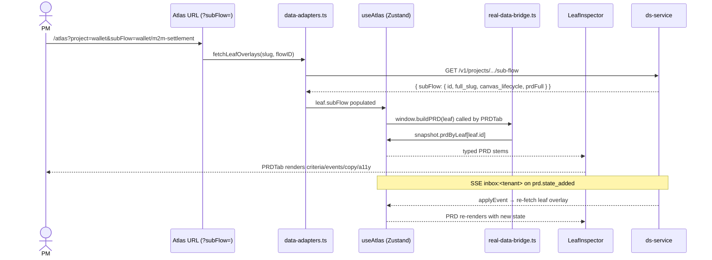

# feat: Integrate PM authoring (PRD/prototype/wall/audit) into Atlas's existing inspector + center pane

**Target repo:** indmoney-design-system-docs

This plan remediates a mistake from plans 002 + 004: the PM-authoring viewer was built as a parallel route (`/prd/<sub_product>/<sub_flow>`) instead of being integrated into Atlas's existing right-rail inspector + center pane. Atlas is the PM's working surface — DRD, Comments, Activity, Violations, Decisions, Copy already render there with real-data bridges and live SSE. The new MCP-shipped surfaces (typed PRD, prototype canvas, coverage wall, sub_flow audit) belong inside Atlas, not alongside it.

---

## Summary

Eight units that make Atlas sub_flow-aware and fold every PM-authoring surface into its existing inspector + center pane:

- **U1 — Sub_flow context plumbing.** Extend the `Leaf` type with `subFlow?: SubFlowSummary`, populate it from the leaf-overlay fetch path (leaf's flow → bound figma_section → sub_flow). Add `?subFlow=<slug>` URL state for explicit overrides + shareable PRD deeplinks.
- **U2 — PRD tab.** Adapt the relocated `DocumentView` into a new `PRDTab` rendering typed PRD stems (criteria / events / copy / a11y / frame-tags) with Atlas's existing `lc-*` className conventions. Wired via a new `bridgeBuildPRD` in `real-data-bridge.ts`.
- **U3 — Sub_flow-aware tab list.** Modify `LeafInspector` so leaves with a `subFlow` bound render `[DRD, PRD, Activity, Comments]`; legacy leaves keep the original 6 tabs. No overflow menu (data layer for Violations/Decisions/Copy keeps running for legacy use cases).
- **U4 — Activity tab extension.** Merge `prd_audit` rows into the existing activity stream via `bridgeBuildActivity`. PMs see who-touched-what-state alongside today's Atlas activity entries.
- **U5 — Comments tab extension.** Extend `CommentTargetKind` with `prd_state`. Sub_flow-keyed comment list + post via existing `drd_comments` table (resolved through `flow_drd.sub_flow_id`). PMs can comment on individual PRD states from the same rail.
- **U6 — Prototype canvas in center pane.** Adapt the relocated `PrototypeCanvas` into Atlas's center-pane rendering region. When `leaf.subFlow.canvas_lifecycle ∈ {proto-only, proto-wip}`, replace leafcanvas with sandboxed iframe. SSE auto-swap on `figma.design_shipped` event. Real Figma thumbnails (from plan 004 U1) flow through for the design-shipped lifecycle.
- **U7 — Coverage wall mode.** Adapt the relocated `Wall` component into a center-pane mode toggleable via a "View wall" button in the LeafInspector header. Works for proto-* and design-shipped lifecycles. Click a frame → swap to leafcanvas + select.
- **U8 — Deprecate `/prd/<sub_product>/<sub_flow>`.** Replace `app/prd/[subProduct]/[subFlow]/page.tsx` with a server redirect to `/atlas?project=<sp>&subFlow=<sp>/<sf>`. Delete the unused viewer components (their logic now lives in Atlas via U2/U6/U7). Keep the Next.js API proxies under `app/api/prd/` (slug-keyed MCP proxies that Atlas's new code calls).

All backend work from plans 002 + 004 stays as-is. The `/v1/figma/frame-png` endpoint, `prd_audit` table + thread-through, `ResolveFlowIDForSubFlow`, `prd.export` JSON sidecar, `figma_node_metadata` Go writer, MCP tool registry, typed PRD schema, sub_flow tables, autosync gate — none of that needs to change. This is a pure UI-integration plan.

---

## Problem Frame

Plans 002 + 004 shipped a parallel PM viewer at `/prd/<sub_product>/<sub_flow>` because the original plan said *"new Next.js viewer route"* and the implementing subagents took that literally. That was the wrong call:

1. **Atlas is the existing PM surface.** It has the right-rail inspector with 6 tabs already wired to real data via `real-data-bridge.ts` (which intercepts `window.buildX(leaf)` calls and reads from a Zustand live store fed by SSE + leaf-overlay fetches). It has the center pane with `leafcanvas` rendering frames and sub-flows. It has shared chrome, auth, BlockNote+Hocuspocus DRD wiring, URL state machine, and SSE infrastructure.

2. **The parallel viewer duplicated the chrome.** The `/prd/` route built `PRDShell`, `CanvasShell`, a read-only DRD pane (Atlas's full editor was already working), a separate API proxy layer (which works fine — its the chrome that was the duplication), and a new URL space — none of which any PM ever asked for. PMs want their PRD work alongside their existing Atlas review work.

3. **The mistake also surfaced a namespace bug** (caught earlier and fixed in commit `51d19aa`): mashing `{sub_product}/{sub_flow}` under `/projects/[slug]/` collided with Atlas's legacy `project_slug` namespace. Fixing the namespace bought us breathing room but left the architectural mistake (parallel viewer) in place. This plan closes both gaps.

4. **Atlas already plans for this surface.** `leaves.tsx::buildPRD` doesn't exist yet, but the entire bridge pattern in `real-data-bridge.ts` is shaped to make new `buildX` functions trivial to add. Adding a `bridgeBuildPRD` is the same mechanic as the existing `bridgeBuildActivity` / `bridgeBuildComments`.

5. **The new surfaces are real PM value.** Typed PRD authoring, coverage wall, prototype-canvas-swap-during-design-handoff, sub_flow-scoped comments — these unlock the MCP authoring loop. Putting them in Atlas means they show up where the PM already lives, instead of forcing them to bookmark a new URL.

---

## Scope Boundaries

**In scope (this plan):**

- New `Leaf.subFlow?: SubFlowSummary` field threaded through `lib/atlas/data-adapters.ts` + `lib/atlas/live-store.ts`.
- New ds-service endpoint or extension of leaf-overlay fetch to return sub_flow summary for a leaf when its flow has a bound section.
- New `?subFlow=<slug>` URL state in `lib/atlas/url-state.ts`; AtlasShell consumes it and merges with leaf-derived sub_flow.
- New `bridgeBuildPRD(leaf)` in `real-data-bridge.ts`; new `PRDTab` component adapted from the relocated `DocumentView`.
- LeafInspector tab list becomes sub_flow-aware: 4 tabs for bound leaves, 6 for legacy.
- `bridgeBuildActivity` extended to merge `prd_audit` rows for sub_flow-bound leaves.
- `bridgeBuildComments` extended to surface sub_flow-scoped comments (resolved via `flow_drd.sub_flow_id → flow_id`).
- New `CommentTargetKind` value `prd_state` in `services/ds-service/internal/projects/comments.go`; sub_flow-keyed comment list + add endpoints.
- Center-pane prototype-canvas swap based on `leaf.subFlow.canvas_lifecycle`. Adapted from relocated `PrototypeCanvas`.
- Center-pane coverage-wall mode toggleable from the inspector header. Adapted from relocated `Wall`.
- `/prd/<sub_product>/<sub_flow>` route → server redirect to `/atlas` with sub_flow state. Components under `app/prd/` deleted.
- `app/api/prd/` API proxies preserved (Atlas's new code calls them).

**Deferred to Follow-Up Work:**

- **Multi-tenant comment notification routing** — `@mentions` in PRD-state comments could fire SSE events to the mentioned user's inbox. Existing notification system handles this for drd_block comments; extending to prd_state comments is a follow-up.
- **Comment threading at prd_state level** — v1 ships a flat comment list per state; depth-N replies use the existing `comment` target_kind. Future polish: dedicated reply UI per state-comment.
- **Mobile responsive layout** — Atlas's inspector is designed for desktop; mobile-PM access stays at parity with today's Atlas (i.e., not optimized).
- **Wall-mode interaction polish** — frame click → leafcanvas focus is in scope; richer wall interactions (drag-to-attach-frame, hover-state-preview) are follow-ups.
- **Activity feed real-time live append** — v1 refetches on SSE events; richer optimistic-append with deduplication is a follow-up.
- **leafcanvas-v2 integration** — the parallel session is rebuilding the center pane. This plan targets `leafcanvas.tsx` (legacy `LeafInspector`); v2 integration happens after the v2 surface lands.

**Out of scope (not this product):**

- Changes to the PRD typed-stems schema, MCP tool registry, autosync, sub_flow tables, or any backend data layer from plans 002 + 004. All backend is correct.
- Changes to AtlasDRDEditor or `lib/drd/collab.ts` — the existing DRD editor + Hocuspocus stack stays. We only add the resolver-path for sub_flow access (already shipped in U3 of plan 004).
- Changes to `app/projects/[slug]/page.tsx` (the legacy Atlas redirect) or any `/v1/projects/{slug}/...` ds-service routes. Those are Atlas project_slug surface; untouched.
- Phase 2 of plan 002 (U10 remote `/mcp`, U11 file-scoped auth). Separate plan; unrelated to UI integration.

---

## Key Technical Decisions

### KTD-1. Sub_flow context derivation lives in the data layer; URL override sits atop it

`Leaf` gains a nullable `subFlow?: SubFlowSummary` field populated by the leaf-overlay fetch path. The lookup is:

1. Atlas already fetches per-leaf overlays via `fetchLeafOverlays(slug, flowID, ...)` in `lib/atlas/data-adapters.ts`. Extend the response to include `sub_flow` when the leaf's underlying flow has a `figma_section_id` that resolves to a `sub_flow.figma_section_id`.
2. ds-service side: a new `GET /v1/projects/{slug}/flows/{flow_id}/sub-flow` endpoint that returns `{sub_flow_id, full_slug, name, canvas_lifecycle, prototype_url?}` or 404 if no binding exists. Lives next to existing leaf-overlay endpoints; tenant-scoped.
3. `?subFlow=<slug>` URL state overrides derivation when present. AtlasShell reads URL, fetches sub_flow directly via `resolve(slug)` MCP tool, attaches to the active leaf in the live store.

Why both: derivation is zero-friction (works for every leaf with no PM action), URL override is the share-a-PRD primitive (PM pastes `/atlas?project=...&subFlow=wallet/m2m-settlement` in Slack; recipient lands on the exact view).

### KTD-2. New PRD tab follows the existing `buildX → bridgeBuildX → Tab` pattern

The 6 existing tabs all use the same wire pattern:

```
window.buildX(leaf) → bridgeBuildX (real-data-bridge.ts) → reads useAtlas store → renders XTab
```

PRD slots in identically: new `window.buildPRD(leaf)` declaration (typed in `leafcanvas.tsx`), new `bridgeBuildPRD` in `real-data-bridge.ts` that pulls `leaf.subFlow.prdFull` from the live store, new `PRDTab` component renders the typed stems. The live store gains a per-leaf `prdByLeaf[leafID]` slice populated by a new `fetchLeafPRD` adapter that calls the existing `prd.author op:get` MCP tool (or, more cleanly, a new `/v1/projects/{slug}/flows/{flow_id}/prd` endpoint that proxies the same data with leaf-keyed addressing).

This decision keeps PRD on equal footing with every other tab — same data lifecycle, same SSE live-update path, same fallback when sub_flow isn't bound.

### KTD-3. Tab list is sub_flow-aware via conditional rendering, not a separate inspector

`LeafInspector` already accepts a `leaf` prop. The new tab list logic:

```
const tabs = leaf.subFlow
    ? ["drd", "prd", "activity", "comments"]
    : ["drd", "violations", "decisions", "copy", "activity", "comments"];
```

No new inspector component. No overflow menu (the user wants exactly these 4 for PM-authoring leaves). Legacy leaves without sub_flow keep their 6-tab experience untouched — Atlas's existing design-system-audit use cases (component governance, violation triage, decision logs) still work.

### KTD-4. Prototype canvas takes over leafcanvas's rendering region, not the whole shell

In `AtlasShellInner.tsx::AtlasShell`, the center-pane render is `<LeafCanvas leaf={...} />`. When `leaf.subFlow.canvas_lifecycle ∈ {proto-only, proto-wip}`, render `<PrototypeCanvas>` in the same slot instead. Sandboxed iframe (`sandbox="allow-scripts allow-same-origin allow-forms"`, `referrerpolicy="no-referrer"`, HTTPS-only). Banner for proto-wip ("design in WIP — not on Final Designs page").

When the live store's SSE listener receives `figma.design_shipped` for the active sub_flow, it refetches the sub_flow overlay; `canvas_lifecycle` flips to `design-shipped`; React re-renders with `<LeafCanvas>`; no page reload. The auto-swap user-facing contract from plan 004 carries through.

### KTD-5. Coverage wall is a center-pane mode, toggleable from the LeafInspector header

A new "View wall" button next to the inspector's close button. Clicking sets a per-leaf `mode: 'canvas' | 'wall'` state (lives in `useAtlas` so it survives leaf re-open). Wall mode replaces leafcanvas's rendering region with `<Wall data={leaf.subFlow.wallResult}>`. Click any frame card → set `mode = 'canvas'` + select that frame in leafcanvas. Bidirectional.

Wall mode is available regardless of lifecycle — for proto-only / proto-wip, the wall renders the auto-skeleton state list (with placeholder thumbnails); for design-shipped, real Figma PNGs flow through via plan 004 U1.

### KTD-6. `prd_state` becomes a first-class `CommentTargetKind`

Today's `CommentTargetKind` enum: `drd_block | decision | violation | screen | comment`. Add `prd_state`. The existing `drd_comments` table requires no migration — the column is already `TEXT` and the existing CHECK constraint (if any) updates to include the new value.

Comments-on-state UI in `CommentsTab` gains a small affordance — when a state is selected in the PRD tab, a "Comment on this state" action threads into the comments tab and pre-fills `target_kind=prd_state, target_id=<state_id>`.

### KTD-7. `/prd/<sub_product>/<sub_flow>` redirects, doesn't 404

`app/prd/[subProduct]/[subFlow]/page.tsx` becomes a Next.js server-side redirect to `/atlas?project=<sub_product>&subFlow=<sub_product>/<sub_flow>`. One release of redirect, then delete the route entirely in a follow-up. Reason: any in-flight bookmarks / Slack links to the parallel viewer keep working during transition.

The `app/api/prd/[subProduct]/[subFlow]/*` API proxies stay — they're tenant-aware slug-keyed MCP proxies, useful for Atlas's new code to call. Renaming them is cosmetic and not worth the churn.

---

## High-Level Technical Design

The integration adds three things to Atlas's data flow, all using existing patterns:



This illustrates the intended approach and is directional guidance for review, not implementation specification.

---

## Implementation Units

### U1. Sub_flow context plumbing in Atlas state

**Goal:** Make Atlas leaves aware of their bound sub_flow. Add the data path, the URL override, and the live-store integration.

**Files:**
- `services/ds-service/internal/projects/server.go` (modified — new HandleSubFlowForLeaf)
- `services/ds-service/internal/projects/server_test.go` (modified — characterization + new tests)
- `services/ds-service/internal/projects/subflow.go` (extends — `GetSubFlowByFlowID` resolver via `flow → figma_section_id → sub_flow`)
- `services/ds-service/internal/projects/subflow_test.go` (modified)
- `services/ds-service/cmd/server/main.go` (modified — route registration)
- `lib/atlas/data-adapters.ts` (modified — extend `Leaf` type with `subFlow?: SubFlowSummary`; extend `fetchLeafOverlays` response handling)
- `lib/atlas/live-store.ts` (modified — `SubFlowSummary` type; extend `useAtlas` state shape with `prdByLeaf`)
- `lib/atlas/url-state.ts` (modified — `subFlow` field on `AtlasURLState`; parse + serialize)
- `lib/atlas/url-state.test.ts` (modified)
- `app/atlas/_lib/AtlasShellInner.tsx` (modified — read `?subFlow` URL param; thread into adapter call)

**Approach:**
- Backend: `GetSubFlowByFlowID(ctx, flowID)` follows `flows.figma_section_id → sub_flow.figma_section_id` (per plan 002 U2's binding). Returns nil + ErrNotFound if no sub_flow bound. Endpoint `GET /v1/projects/{slug}/flows/{flow_id}/sub-flow` returns `{id, full_slug, name, canvas_lifecycle, prototype_url?}`.
- Frontend: extend `Leaf` type with `subFlow?: { id, fullSlug, name, canvasLifecycle, prototypeURL?, wallResult?, prdFull? }`. Adapter merges sub_flow into the existing leaf object during overlay fetch. URL param `?subFlow=<full_slug>` calls MCP `resolve(slug)` directly and overrides derivation.
- Store: new `prdByLeaf[leafID]` slice keyed by leaf id (lazy-fetched via `fetchLeafPRD` when a tab opens that needs it).

**Patterns to follow:** `flowRowToLeaf` and `productLeafToLeaf` in `data-adapters.ts`. Existing SSE event reducer pattern in `live-store.ts::applyEvent`. URL state round-tripping in `url-state.ts`.

**Test scenarios:**
- Happy path: leaf with bound sub_flow → response includes `subFlow.full_slug`.
- Edge: leaf with no sub_flow → `subFlow` field absent (not error).
- Edge: `flow.figma_section_id` set but `sub_flow.figma_section_id` not yet upserted (autosync race) → returns 404 cleanly.
- Edge: cross-tenant flow_id → 404 (no existence oracle).
- URL state: `?subFlow=wallet/m2m-settlement` parses correctly; round-trip preserved.
- URL state: missing `subFlow` param falls back to leaf-derived value silently.
- Integration: `/atlas?project=wallet&subFlow=wallet/m2m-settlement` opens with leaf inspector showing the sub_flow-bound tab list (validates U3's gating).

**Verification:** `useAtlas.getState().leaves[X].subFlow.fullSlug === "wallet/m2m-settlement"` after navigation.

---

### U2. PRD tab in LeafInspector

**Goal:** New `PRDTab` rendering typed PRD stems with Atlas's existing visual conventions. Wired via the bridge pattern.

**Dependencies:** U1

**Files:**
- `app/atlas/_lib/leafcanvas.tsx` (modified — declare `window.buildPRD`; add `PRDTab` component; render in tab body switch)
- `app/atlas/_lib/real-data-bridge.ts` (modified — add `bridgeBuildPRD` + originals capture)
- `lib/atlas/data-adapters.ts` (modified — new `fetchLeafPRD(slug, flowID, subFlowID)` calling the existing `app/api/prd/[subProduct]/[subFlow]/full/route.ts` proxy → MCP `prd.author op:get`)
- `lib/atlas/live-store.ts` (modified — `prdByLeaf` slice + `loadLeafPRD(leafID)` action)
- `app/atlas/_styles/leafcanvas.css` (modified — new `lc-prd-*` className tokens mirroring `lc-vio-*` / `lc-com-*` patterns)

**Approach:**
- `PRDTab({ prdFull, leaf })`: walks `prdFull.tabs → states`; renders each state as `lc-prd-state` card with sub-sections for criteria (bullets), edge cases (bullets), copy strings (key/value table), events (typed table: name / fires_on / properties_schema), a11y notes (bullets). Mirrors `StateCard.tsx`'s structure adapted to Atlas tokens.
- Empty PRD: `lc-empty` placeholder ("no PRD yet — use /ind-prd in Claude Code to seed").
- Frame thumbnails inside state cards use the existing `figma-frame-png` proxy via the U1 token mint hook (which moves from `useFrameThumbToken.ts` → `lib/atlas/figma-frame-tokens.ts`).

**Patterns to follow:** `ViolationsTab` / `CommentsTab` shape in `leafcanvas.tsx` (small functional component taking props from `window.buildX(leaf)`). `FigmaLinkRenderer` in `lib/drd/customBlocks.tsx` for thumbnail aesthetic.

**Test scenarios:**
- Happy path: leaf with sub_flow + PRD seeded with 3 states → `PRDTab` renders 3 state cards with all stems populated.
- Edge: leaf with sub_flow but no PRD → empty-state placeholder.
- Edge: state with no events but populated criteria → events section hidden cleanly.
- Edge: state with frame_name set but no live frame match → thumbnail placeholder glyph.
- Integration: `prd.author op:add_state` via MCP → SSE fires → `loadLeafPRD` refetches → `PRDTab` shows new state without page reload.

**Verification:** Click PRD tab in inspector, see typed stems for the sub_flow rendered with Atlas's visual language.

---

### U3. Sub_flow-aware tab list in LeafInspector

**Goal:** Conditionally render the 4-tab PM-authoring set or the legacy 6-tab set based on `leaf.subFlow` presence.

**Dependencies:** U1, U2

**Files:**
- `app/atlas/_lib/leafcanvas.tsx` (modified — `LeafInspector` tab list logic)
- `app/atlas/_lib/leafcanvas.test.tsx` (new — tab visibility tests; first test file for leafcanvas)

**Approach:**
- Inside `LeafInspector`: `const tabs = leaf.subFlow ? ["drd", "prd", "activity", "comments"] : ["drd", "violations", "decisions", "copy", "activity", "comments"];`
- Initial active tab: `"drd"` for both modes (continuity with today's default).
- Tab pills (e.g., violation count badge) only render in legacy mode. In PM mode, similar badges show on PRD (untagged state count), Activity (new-since-last-visit count, future), Comments (unread mentions, future).
- Defensive: if leaf transitions from legacy → PM (e.g., sub_flow gets bound mid-session via autosync), the active tab snaps to a still-valid one (`drd` always valid).

**Patterns to follow:** Existing tab map + setTab pattern at `leafcanvas.tsx:1037`. Conditional rendering at the tab-body switch.

**Test scenarios:**
- Leaf without `subFlow` → 6 tabs visible.
- Leaf with `subFlow` → 4 tabs visible.
- Active tab transition: leaf with active=`violations` gets sub_flow bound mid-session → active tab snaps to `drd`.
- Test expectation: leafcanvas.test.tsx covers tab list + active tab fallback.

**Verification:** Open Atlas with a sub_flow-bound leaf, see [DRD, PRD, Activity, Comments]. Open with a legacy leaf, see original 6.

---

### U4. Activity tab extension — merge prd_audit rows

**Goal:** Activity tab shows PRD authorship events alongside Atlas's existing activity feed.

**Dependencies:** U1

**Files:**
- `services/ds-service/internal/projects/auditlog.go` (extends — `ListActivityForSubFlow(subFlowID, since?)` merging `prd_audit` + relevant audit_log entries)
- `services/ds-service/internal/projects/auditlog_test.go` (modified)
- `services/ds-service/internal/projects/server.go` (modified — extend leaf-overlay endpoint OR new `GET /v1/projects/{slug}/flows/{flow_id}/activity` that includes sub_flow audit)
- `lib/atlas/data-adapters.ts` (modified — `fetchLeafActivity` returns merged ActivityEntry list when leaf.subFlow present)
- `lib/atlas/live-store.ts` (modified — ActivityEntry type extended with `kind: "prd_state_change" | "drd_edit" | ...`)
- `app/atlas/_lib/real-data-bridge.ts` (modified — `bridgeBuildActivity` reads merged stream from store)
- `app/atlas/_lib/leafcanvas.tsx` (modified — `ActivityTab` rendering handles new kind values — color/icon per kind)

**Approach:**
- Backend: query `prd_audit` rows for `prd_state.id ∈ (states under sub_flow)` ordered by `at DESC`. Merge with the existing flow-level audit_log. Returns unified `[]ActivityEntry{kind, who, what, at, ago}`.
- Frontend: ActivityTab renders unified list; new `kind-prd_state_change` styling (subtle accent matching PRD tab color).

**Patterns to follow:** Existing `ActivityTab` rendering at `leafcanvas.tsx:1179`. `audit_log` patterns in `auditlog.go`.

**Test scenarios:**
- Happy path: leaf with sub_flow + 3 prd_audit rows + 2 audit_log rows → activity list has 5 entries in correct DESC order.
- Edge: empty audit history → empty-state placeholder (existing pattern).
- Edge: leaf without sub_flow → falls back to Atlas-only activity (existing behavior preserved).
- Edge: rapid prd_audit writes (same-second) → tiebreak by id, deterministic order.
- Integration: write a `prd.author op:add_state` via MCP → SSE `prd.state_added` fires → `loadLeafActivity` refetches → ActivityTab shows new row.

**Verification:** Author a state via Claude, switch to Activity tab in Atlas, see the row appear with `who/what/ago` populated.

---

### U5. Comments tab extension — sub_flow-scoped + prd_state target kind

**Goal:** Comments tab surfaces sub_flow-scoped comments. New `prd_state` target kind. UI for commenting on a state.

**Dependencies:** U1, U2

**Files:**
- `services/ds-service/internal/projects/comments.go` (extends — add `CommentTargetPRDState`; helper `ListCommentsForSubFlow(subFlowID)` that resolves sub_flow → flow_id and reads existing drd_comments)
- `services/ds-service/internal/projects/comments_test.go` (modified)
- `services/ds-service/internal/projects/server.go` (modified — new `GET/POST /v1/sub-flows/{sp}/{sf}/comments`)
- `services/ds-service/cmd/server/main.go` (modified — route registration)
- `lib/atlas/data-adapters.ts` (modified — `fetchLeafComments` returns sub_flow comments when leaf.subFlow present)
- `app/atlas/_lib/real-data-bridge.ts` (modified — `bridgeBuildComments` reads merged stream)
- `app/atlas/_lib/leafcanvas.tsx` (modified — `CommentsTab` adds target chip ("Cold state", "DRD §2", "Frame 1") + "Reply on this state" affordance triggered from PRDTab)

**Approach:**
- Backend: extend `CommentTargetKind` const block. New `ListCommentsForSubFlow` resolves sub_flow → flow_id then `SELECT * FROM drd_comments WHERE flow_id = ? AND target_kind IN ('drd_block', 'screen', 'prd_state')`. Adds endpoint pair under `/v1/sub-flows/.../comments`.
- Frontend: CommentsTab renders unified thread, target chip per row. New cross-tab action: clicking a state in PRDTab opens a small "Comment on this state" inline input that posts with `target_kind=prd_state, target_id=<state_id>`.

**Patterns to follow:** Existing `CommentsTab` at `leafcanvas.tsx:1195`. `parseMentionsFromText` in `comments.go`. The sub_flow-keyed endpoint pattern follows U3 of plan 004 (`/v1/sub-flows/.../drd/ticket`).

**Test scenarios:**
- Happy path: sub_flow with 5 comments (3 drd_block, 1 prd_state, 1 screen) → ListCommentsForSubFlow returns 5.
- Add a comment with `target_kind=prd_state, target_id=X` → row persists with correct target.
- Cross-tenant: sub_flow under tenant A cannot list comments from tenant B's repo.
- Reply target: existing depth-N reply path still works (no change to `comment` target_kind).
- Frontend: clicking a state card in PRDTab opens inline input; submit posts comment with right target; CommentsTab refetches.

**Verification:** Comment on "Cold state" from the PRD tab, switch to Comments tab, see the comment with "→ Cold state" chip.

---

### U6. Prototype canvas in center pane

**Goal:** When `leaf.subFlow.canvas_lifecycle ∈ {proto-only, proto-wip}`, center pane renders the PM's HTML prototype iframe instead of leafcanvas. SSE auto-swap on design ship.

**Dependencies:** U1

**Files:**
- `app/atlas/_lib/PrototypeCanvas.tsx` (new — adapted from `app/prd/[subProduct]/[subFlow]/PrototypeCanvas.tsx`)
- `app/atlas/_lib/AtlasShellInner.tsx` (modified — render `<PrototypeCanvas>` instead of `<LeafCanvas>` when lifecycle gate fires)
- `app/atlas/_styles/leafcanvas.css` (modified — `lc-proto-*` className tokens)
- `lib/atlas/live-store.ts` (modified — `applyEvent` handles `figma.design_shipped` by refetching the affected leaf's sub_flow)
- `app/atlas/_lib/AtlasShell.tsx` (modified, if needed — wire SSE event handler registration)

**Approach:**
- `<PrototypeCanvas url={...} title={...} banner={...}>`: sandboxed iframe with `sandbox="allow-scripts allow-same-origin allow-forms"`, `referrerpolicy="no-referrer"`, `loading="lazy"`. Banner row for `proto-wip` ("Designer is working — not yet on Final Designs"). HTTPS-only guard (defense in depth; ds-service validates at write).
- AtlasShell render branch: `leaf.subFlow?.canvasLifecycle === 'proto-only' || 'proto-wip' ? <PrototypeCanvas> : <LeafCanvas>`.
- SSE: `applyEvent({type: 'figma.design_shipped', subFlowID})` → invalidate the affected leaf's overlay slot → re-fetch → canvas re-renders with new lifecycle.

**Patterns to follow:** Existing leafcanvas mount/unmount logic at `leafcanvas.tsx:147`. `lib/drd/customBlocks.tsx::FigmaLinkRenderer` for sandbox aesthetic. SSE event reducer pattern in `live-store.ts`.

**Test scenarios:**
- Happy path: leaf with `lifecycle=proto-only` + prototype_url → iframe renders with the URL.
- Happy path: `lifecycle=design-shipped` → leafcanvas renders as today.
- Edge: proto-only without prototype_url (data error) → fall back to leafcanvas with a warning banner.
- Edge: iframe load error (404, CSP) → graceful fallback to placeholder.
- Edge: non-HTTPS prototype_url → defensive client-side reject (server should have caught this; defense in depth).
- Integration: simulate `figma.design_shipped` SSE → iframe unmounts → leafcanvas mounts → no page reload.
- Security: iframe sandbox attributes verified in DOM (auto-test via testing library).

**Verification:** Attach a prototype via `drd.attach_prototype` MCP tool, open Atlas with that sub_flow active, see iframe in center pane.

---

### U7. Coverage wall mode

**Goal:** Toggleable wall mode in the center pane, accessed via a header button in the LeafInspector. Replaces leafcanvas with the corkboard.

**Dependencies:** U1, U2

**Files:**
- `app/atlas/_lib/Wall.tsx` (new — adapted from `app/prd/[subProduct]/[subFlow]/Wall.tsx`)
- `app/atlas/_lib/leafcanvas.tsx` (modified — LeafInspector header adds "View wall" toggle button when sub_flow bound)
- `app/atlas/_lib/AtlasShellInner.tsx` (modified — render `<Wall>` instead of `<LeafCanvas>` when `leafMode === 'wall'`)
- `app/atlas/_styles/leafcanvas.css` (modified — `lc-wall-*` className tokens)
- `lib/atlas/live-store.ts` (modified — per-leaf `mode: 'canvas' | 'wall'` state)

**Approach:**
- Mode state lives in `useAtlas` (survives leaf re-open). Default `'canvas'`. Toggle button in LeafInspector header next to close button. Only visible for sub_flow leaves.
- `<Wall data={leaf.subFlow.wallResult}>`: corkboard grid of `WallRow` cards. Real thumbnails via U1 endpoint. Bidirectional: click a frame card → `setMode('canvas') + setSelectedFrame(frameID)`.
- Wall available regardless of lifecycle (proto-* shows skeleton states; design-shipped shows real frames).

**Patterns to follow:** Existing `LeafCanvas` rendering region in `AtlasShellInner.tsx`. `lc-vio-*` className pattern in CSS. Phase 1's `bridgeBuildLeafCanvas` shape for the data shape.

**Test scenarios:**
- Happy path: design-shipped leaf, toggle wall → grid of real thumbnails.
- Happy path: proto-only leaf, toggle wall → grid of skeleton states (placeholder thumbnails).
- Click a frame card → mode switches back to canvas + leafcanvas focuses that frame.
- Toggle preserves per-leaf state (re-open same leaf → wall mode restored if last set there).
- Empty wall (sub_flow with no frames) → empty-state placeholder.
- SSE integration: state added via MCP → wall row count updates without page reload.

**Verification:** Open a sub_flow-bound leaf, click "View wall" header button, see the corkboard with binding statuses and coverage percent.

---

### U8. Deprecate `/prd/<sub_product>/<sub_flow>` route + delete relocated components

**Goal:** Server redirect from the parallel viewer to the integrated Atlas surface. Delete the duplicated components.

**Dependencies:** U2, U3, U6, U7

**Files:**
- `app/prd/[subProduct]/[subFlow]/page.tsx` (modified — server redirect via `redirect()` from `next/navigation`)
- `app/prd/[subProduct]/[subFlow]/PRDShell.tsx` (delete)
- `app/prd/[subProduct]/[subFlow]/CanvasShell.tsx` (delete)
- `app/prd/[subProduct]/[subFlow]/PrototypeCanvas.tsx` (delete — adapted version is now in `app/atlas/_lib/`)
- `app/prd/[subProduct]/[subFlow]/Wall.tsx` (delete — adapted version is now in `app/atlas/_lib/`)
- `app/prd/[subProduct]/[subFlow]/DocumentView.tsx` (delete — adapted version is `PRDTab` in `app/atlas/_lib/leafcanvas.tsx`)
- `app/prd/[subProduct]/[subFlow]/StateCard.tsx` (delete — adapted into PRDTab)
- `app/prd/[subProduct]/[subFlow]/DRDPane.tsx` (delete — `AtlasDRDEditor` already handles this)
- `app/prd/[subProduct]/[subFlow]/FrameThumbnail.tsx` (delete or move to `app/atlas/_lib/FrameThumbnail.tsx` if reused outside PRDTab; decide during execution)
- `app/prd/[subProduct]/[subFlow]/useFrameThumbToken.ts` (move to `lib/atlas/figma-frame-tokens.ts`)
- `app/prd/[subProduct]/[subFlow]/types.ts` (delete — types fold into `lib/atlas/data-adapters.ts`)
- `app/api/prd/[subProduct]/[subFlow]/route.ts` (keep — MCP proxy, useful)
- `app/api/prd/[subProduct]/[subFlow]/full/route.ts` (keep)
- `app/api/prd/[subProduct]/[subFlow]/drd/ticket/route.ts` (keep)
- `docs/conventions/sub-product-slug.md` (modified — sample URL changes from `/prd/wallet/m2m-settlement` back to `/atlas?project=wallet&subFlow=wallet/m2m-settlement`)
- `services/ds-service/internal/mcp/tools_resolve.go` (modified — `PRDViewerURL` field returns Atlas URL instead of `/prd/...`)
- `services/ds-service/internal/mcp/tools_resolve_test.go` (modified — update assertion)

**Approach:**
- `app/prd/[subProduct]/[subFlow]/page.tsx`: replace body with `redirect('/atlas?project=' + encodeURIComponent(subProduct) + '&subFlow=' + encodeURIComponent(subProduct + '/' + subFlow))`. Server-side; one HTTP hop.
- Delete the components listed (their logic now lives in Atlas via U2/U6/U7). `FrameThumbnail` decision is during execution — if PRDTab is the only consumer, inline into Atlas; if Wall + PRDTab both consume, lift into a shared `app/atlas/_lib/FrameThumbnail.tsx`.
- `lib/atlas/figma-frame-tokens.ts` becomes the shared token-mint hook used by both Wall and PRDTab.
- Update the slug resolver's `PRDViewerURL` to point at the Atlas URL.

**Patterns to follow:** `app/atlas/page.tsx`'s server-component shape. `redirect()` from `next/navigation`. Existing Atlas URL state in `lib/atlas/url-state.ts`.

**Test scenarios:**
- `/prd/wallet/m2m-settlement` returns 307 redirect to `/atlas?project=wallet&subFlow=wallet/m2m-settlement`.
- Test (e.g., Playwright): user visits old URL → lands on Atlas with the right subFlow context.
- The `resolve(slug)` MCP tool returns the new URL (asserted via test update).

**Verification:** Visit `/prd/wallet/m2m-settlement` in browser, see redirect to `/atlas?...&subFlow=wallet/m2m-settlement` and the PRD tab visible in inspector.

---

## System-Wide Impact

| Surface | Impact |
|---|---|
| Atlas inspector | Becomes sub_flow-aware. 6 tabs → 4 for bound leaves; original 6 preserved for legacy. New `PRDTab` component, extended `ActivityTab` + `CommentsTab` data sources. |
| Atlas center pane | Adds prototype-canvas mode + wall mode for sub_flow-bound leaves. Existing leafcanvas behavior preserved as default. |
| Atlas URL state | New `?subFlow=<slug>` param. Backward-compatible (absent param = derivation). |
| `useAtlas` live store | New `prdByLeaf` slice, extended `subFlow` field on Leaf, new `mode` per-leaf state. SSE event handler grows by ~3 cases (prd.state_added, figma.design_shipped, drd.prototype_attached). |
| `real-data-bridge.ts` | New `bridgeBuildPRD`. Extended `bridgeBuildActivity` + `bridgeBuildComments`. |
| ds-service routes | Three new endpoints under `/v1/projects/{slug}/flows/{flow_id}/` (sub-flow, activity, prd) and one under `/v1/sub-flows/{sp}/{sf}/comments`. No new tables. |
| `app/prd/` directory | All viewer components deleted (logic relocated to Atlas). API proxies preserved. Page becomes server redirect. |
| `lib/atlas/` | New `figma-frame-tokens.ts`. Extended `data-adapters.ts` + `live-store.ts` + `url-state.ts`. |
| Parallel canvas-v2 session | Untouched. Their work in `app/atlas/_lib/leafcanvas-v2/` continues; this plan integrates with the legacy `leafcanvas.tsx` LeafInspector. v2 integration is a future plan after v2 lands. |

---

## Risks & Mitigations

- **Risk: Atlas's legacy `window.LeafInspector` global-injection pattern is fragile.** `LeafInspector` is assigned to `window` in `leafcanvas.tsx:1011` and read via `getLeafInspector()` in `AtlasShellInner.tsx`. Adding a new tab inside this global mutates a globally-shared identifier. Mitigation: keep all changes inside `leafcanvas.tsx::LeafInspector`'s definition; don't introduce a second `window.X` symbol. The pattern is brittle but well-isolated.

- **Risk: parallel canvas-v2 session touches `leafcanvas.tsx`.** They've been refactoring center-pane interactions. If they edit the same file simultaneously, merge conflicts surface. Mitigation: communicate (this plan), commit each U-unit cleanly, prefer adding inside `LeafInspector` and `<AtlasShell>` render branches rather than restructuring surrounding code. The conflict surface is narrow.

- **Risk: leaf-overlay endpoint returns stale `subFlow` if autosync hasn't run yet after a designer creates a section.** Mitigation: `subFlow` field is nullable; clients tolerate absence. Re-fetching on `figma.design_shipped` SSE handles the catch-up.

- **Risk: PRD tab + Activity tab + Comments tab all hit ds-service per leaf open.** Three new round trips on leaf navigation. Mitigation: bundle the three into the leaf-overlay endpoint (single request returns sub_flow + activity + comments + prd). Existing overlay path already aggregates today's data; same pattern. Avoids waterfall.

- **Risk: prototype iframe loads malicious content.** Mitigation: HTTPS-only at write (ds-service U3b validates), sandbox attributes at render, `referrerpolicy="no-referrer"`. Document a Content-Security-Policy follow-up for production tightening.

- **Risk: Comments tab UX confusion when target kinds mix (drd_block, prd_state, screen).** Mitigation: target chip on every comment ("→ Cold state", "→ DRD §Intro", "→ Frame 3"). PMs see the target at a glance.

- **Risk: `app/prd/` deletion breaks any tests that reference the old paths.** Mitigation: U8 includes a grep audit for test references; update or delete. Plan 004's tests are largely backend-side; UI tests we wrote referenced `/prd/` paths and need updating to `/atlas`.

- **Risk: `?subFlow=` URL state on a project where the leaf isn't bound to that sub_flow** (e.g. PM pastes the wrong link). Mitigation: AtlasShell validates that the resolved sub_flow's project matches the URL's `project` param; mismatch shows an inline error with a "Open in correct project" link.

- **Risk: Coverage wall mode confuses users who don't expect their leafcanvas to disappear.** Mitigation: wall mode toggle is per-leaf and persisted in the store; small visual cue on the inspector header showing the active mode. The button is unambiguous ("View wall" / "View canvas").

---

## Verification

The plan is "done" when:

1. Visiting `/atlas?project=wallet&subFlow=wallet/m2m-settlement` opens Atlas with the wallet brain, navigates to the relevant leaf, opens the inspector, and shows `[DRD, PRD, Activity, Comments]` tabs.
2. PRD tab renders the typed-stems PRD for the sub_flow (criteria, edge cases, copy strings, events, a11y notes) with Atlas's visual language.
3. Activity tab shows `prd_audit` rows merged with existing Atlas activity in DESC order, with kind icons.
4. Comments tab supports commenting on a specific `prd_state` (chip shows "→ Cold state"); existing drd_block / screen comments continue to render.
5. Center pane renders a sandboxed iframe with the prototype URL when canvas lifecycle is proto-only/proto-wip; falls back to leafcanvas when design-shipped.
6. SSE `figma.design_shipped` event fires → iframe unmounts → leafcanvas mounts in the same browser tab without a reload.
7. Coverage wall toggle in the inspector header → center pane swaps to corkboard with real thumbnails; click a frame → swaps back to leafcanvas + focuses the frame.
8. Visiting `/prd/wallet/m2m-settlement` (the deprecated route) issues a 307 redirect to `/atlas?project=wallet&subFlow=wallet/m2m-settlement`.
9. Components under `app/prd/[subProduct]/[subFlow]/` no longer exist (except `page.tsx` which is now a redirect).
10. Existing Atlas behavior for non-sub_flow leaves is preserved: 6 tabs visible, leafcanvas in center pane, no PRD-specific surfaces.
11. `npx tsc --noEmit` clean. Full ds-service test suite green. New Vitest tests for new behavior pass.

---

## Sequencing

```
U1 (sub_flow context plumbing) ─┬─→ U2 (PRD tab)            ─┬─→ U5 (Comments tab — needs PRDTab for cross-tab action)
                                │                            │
                                ├─→ U3 (sub_flow-aware tab list) ─┘
                                │
                                ├─→ U4 (Activity tab merge)
                                │
                                └─→ U6 (Prototype canvas)
                                
U2 (PRD tab) ──→ U7 (Coverage wall mode)

U2, U3, U6, U7 ──→ U8 (deprecate /prd route + delete components)
```

Critical path: U1 → U2 → U3 → U8. Everything else parallelizes once U1 lands.

---

## Deferred to Follow-Up Work

- Comment notification routing for `@mentions` on prd_state comments (inbox SSE event).
- Threaded reply UI at prd_state level (today: existing `comment` target_kind for replies).
- Mobile-responsive Atlas inspector layout.
- Wall-mode interactions beyond click-to-focus (drag-to-attach, hover-state-preview).
- Real-time optimistic activity append with deduplication.
- Integration with leafcanvas-v2 (the parallel session's refactor).
- Final removal of the `/prd/` redirect after one release cycle (the route stays as redirect for now to preserve in-flight bookmarks).
- Content-Security-Policy hardening on the prototype iframe in production.
